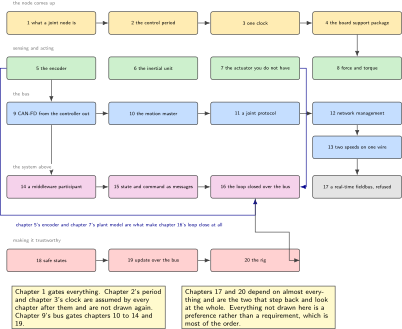

# Twenty Chapters, One Robot Joint Node

*built on the bench, measured, and honest about its gaps*

Joseph Ambrose Pagaran. Monday 21 September 2026.

## About this document

This is a build plan for one thing, taken apart into twenty chapters: a joint node for a robot arm, built on a bench that does not have a robot arm on it. A microcontroller board, a single-board computer, three sensor shields, a bus transceiver that costs less than a lunch, and no motor. By the end the node keeps a one kilohertz period and can prove it, shares one clock across its sensors and its bus, speaks a modern field bus properly enough to survive a device older than itself, joins a robot framework as a participant, closes a control loop and reports the one number a joint is judged by, stops safely and latches, can be updated over the wire it already has, and is checked every night by a rig that turns a build red.

Every chapter has the same shape: why it exists, the prior art and what is taken from it, what the node gains, the parts it uses, a system architecture figure, the peripheral configuration, the wiring, a memory and timing budget, a software design in UML, a data-flow sketch, a repository layout, numbered steps with real commands and real code, measurable acceptance criteria, the variants it touches, pitfalls, best practices, stretch goals, a sourced roadmap, the evidence to publish, and its sources. Twenty chapters, five figures each, one hundred figures in all.

The twenty were chosen so that no two teach the same thing, and so that together they cover what a robotics firmware engineer is expected to have done: a board support package handed over as data rather than as code, a control period proved without an oscilloscope, one time base shared between sensors and a bus, quadrature and inertial sensing, a motor driver written in full for a motor that is not there, a field bus from bit timing upward, network management and the failure an older device causes, a middleware port nobody has published for this part, standard message types with one field honestly left empty, a controller with real anti-windup, a costed refusal, a latched safe state, a bootloader that stays addressable, and a rig that proves all of it again tonight.

## The rule that runs through this book

> [!NOTE]
> **What is real and what is only drawn**
>
> Three things a robotics firmware role asks for cannot be demonstrated on this bench. **There is no motor and no drive stage. There is no force or torque sensor. There is no real-time Ethernet fieldbus, and there cannot be, because this part has no Ethernet controller and this silicon vendor sells no subdevice controller at all.** The book names all three in its first chapter, designs around them deliberately, and marks every figure accordingly: **a solid outline is hardware that is present, a dashed outline is a model standing in for hardware that is not, and a dotted grey block is hardware that is absent and explained rather than built.** No measurement taken through a dashed block is a measurement of anything physical, and the chapter that takes one says so in the sentence that reports it.

The rule has teeth in three places. Every budget table carries a **Measured** column, and it reads *not measured* until something has been measured; a number that came from a model is labelled modelled, and a number that came from arithmetic is labelled computed. Every chapter whose subject is partly absent ends by saying what is real here, what is modelled, and what an honest answer sounds like when somebody asks whether you have done it. And where the research behind a chapter could not confirm something, the chapter says that too, in the sentence where the claim would otherwise have gone.

That last habit produced more of this book than expected. Several of the most useful paragraphs here are of the form *this is not what everybody says*: that this part's flash word is sixteen bytes and not thirty-two, that its backup registers live in a different peripheral from its better known sibling's, that a widely repeated middleware footprint comes from a commercial blog rather than from the project, that a popular bootloader changed licence in 2025, that the collaborative robot technical specification is not withdrawn, and that a vendor's safety architecture claim is routinely quoted with its meaning reversed. None of those is clever. All of them come from opening the document.

## The bench, and what it does not have

The node is a NUCLEO-H7A3ZI-Q carrying an STM32H7A3ZIT6Q: a Cortex-M7 at 280 megahertz with two megabytes of flash and an on-board debug circuit that is a probe, a serial port and a drag-and-drop disk at once. The motion master is a Raspberry Pi 4. Between them is one twisted pair and a transceiver.

> [!NOTE]
> **This part is not the popular member of its family**
>
> This part is documented by its own reference manual, and the member of the family that most of the internet writes about is documented by a different one. The clock tree, the power configuration, the memory map and the flash geometry all differ. **The flash word here is sixteen bytes and the sector is eight kilobytes; on the popular part they are thirty-two bytes and one hundred and twenty-eight kilobytes**, and at least two defects in widely used open projects have been reported against exactly that difference. No linker script, clock configuration or memory map is inherited from a sibling in this volume without being checked against this part's own manual, and chapters that cite material written for the other part say so in the sentence that cites it.

What the bench does not have shapes this volume more than what it has. There is **no oscilloscope, no logic analyser and no external debug probe**, so every timing claim is made with the part's own cycle counter and timers, and the crash forensics of chapter 20 are built from inside the silicon. There is **no soldering iron**, which rules out three otherwise reasonable chapters and is said plainly where it does. There is **no motor, no drive stage, no brake and no torque sensor**. And there is **no Ethernet controller on this part**, which chapter 4 establishes not from a product page but from the absence of two interrupt vector slots in the vendor's own header.

Four things the bench does have are worth naming because chapters depend on them: an eight by eight multizone ranging shield, which becomes the workspace sensor of chapter 18; two inertial and environmental shields, used one at a time and never stacked; the part's second bus controller instance, which makes the gateway of chapter 13 possible without another board; and the part's own ROM bootloader, which turns out to speak the same bus the joint uses and therefore opens chapter 19 with a correction rather than a plan.

## How to read and how to work

*Figure 1. The dependencies that are real, and nothing else. Chapter 1 gates everything. Chapter 2's period and chapter 3's clock are assumed by every chapter after them. Chapter 9's bus gates chapters 10 to 14 and 19. Chapter 5's encoder and chapter 7's plant model are what make chapter 16's loop close at all. Chapters 17 and 20 depend on almost everything and are the two that step back and look at the whole. The rest of the order is a preference rather than a requirement.*

- **Order.** Chapter 1 gates everything, because a node with no identity and no bring-up is a board. After that, follow the figure above and read the rest in whatever order the next application asks for.
- **Effort.** Each chapter's key-facts box gives a difficulty from 1 to 5 and an estimate in evenings of about four hours. The total is roughly sixty evenings, and two of the twenty chapters need no hardware at all.
- **Evidence first.** Every chapter ends with the artefacts to publish: a repository whose README opens with a figure, a console log, a measurement table generated from data rather than typed, and a short note on what the measurement found. A chapter is finished when the evidence exists, not when the code runs once.
- **Licences are checked before code is written around them, not after.** Several chapters change which library they start from on the strength of a licence file, and one records a package that ships three contradictory licence statements in one archive. Where a project's permission could not be confirmed, the chapter says so and does not vendor it.
- **Nothing here is a product.** One axis, no motor, no brake, no assessment and no certificate. Chapter 18 carries a page titled what this node is not, and it is the most credible page in the repository.

## What a reader can honestly claim at the end

A volume that ends without saying this leaves its reader to guess, so it is said here. Somebody who builds all twenty chapters can say, without stretching, that they have written a bus stack from bit timing upward and proved the bit rate against the controller's own timestamps; that they have designed a joint protocol and shown the arithmetic that rejected the obvious version of it; that they have ported an embedded middleware to a part its project does not support and written a transport for it that does not exist anywhere; that they have built a controller with a filtered derivative and two anti-windup methods measured against each other, one of which has no published open implementation in this language; that they have designed a latched safe state against a published clause list and written down what the node is not; that they have written a bootloader that stays addressable on the joint's own wire; and that they have built a rig that asserts on motion quality in continuous integration, which the research for this volume could find no published example of.

They cannot say they have commissioned a robot arm, closed a current loop on a real motor, measured a real joint torque, or shipped anything with a safety integrity claim. Those sentences are not in this book, and the chapters where they would have gone say why instead.

---

[Contents](../README.md) &nbsp;&nbsp;|&nbsp;&nbsp; [Next](01-what-a-joint-node-is.md)
