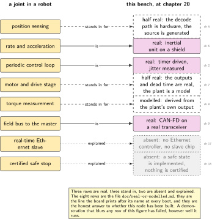
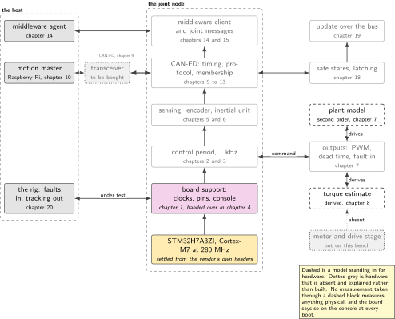
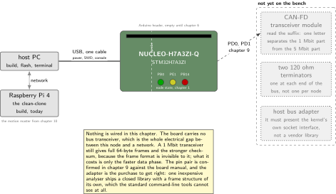
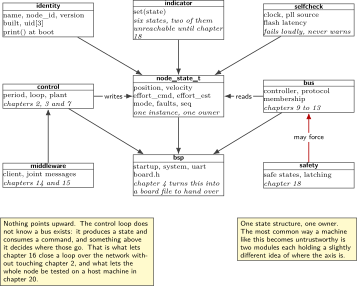
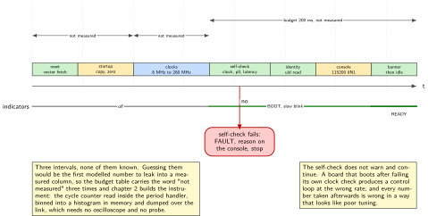

# Chapter 1. What a joint node is, and the bench that stands in for one

> **What the node gains:** An identity and a bring-up  
> **Theme:** Architecture, the stand-in bench, what is real and what is modelled

> **Key facts**
>
> - **Adds to the node:** An identity: a name, a node number, a version it can report, a state it shows, and a written boundary between what is real and what is modelled
> - **Peripherals:** RCC and PWR for the clock tree, GPIO for three indicator LEDs and the user button, USART3 for the console
> - **Depends on:** Nothing. This is the first chapter
> - **Real or modelled:** Real: the board, the clock, the console, the indicators. Modelled: nothing yet, and the point of the chapter is to say so in writing before anything is modelled
> - **Difficulty:** 2 of 5
> - **Effort:** Two evenings of about three hours
> - **Deliverable:** A repository that builds from a clean clone in two commands, a board that names itself on the console at boot, an indicator convention every later chapter reuses, and a committed table of what this bench can and cannot do

## Why this chapter

A joint node is the smallest part of a robot that has an opinion of its own. It owns one axis. It closes a loop on that axis at a fixed period. It reports where the axis is and accepts commands about where it should be, on a bus it shares with other joints and with a motion master. And it stops, on its own authority, when something is wrong. Take any one of those away and what is left is a motor driver with a connector.

This volume builds one of those, once, over twenty chapters. Chapter 20 has a node that runs a control loop at a period it can prove, carries sensors, speaks on a field bus, publishes itself to middleware, enters a safe state when the workspace is violated, can be updated without being touched, and is tested by a rig that fails the build when tracking degrades. This chapter has a board on a desk. What it contributes is the thing that makes the other nineteen honest: a written, committed statement of which parts of that node are real hardware and which are software standing in for hardware that is not on this bench.

That statement has to be first, not last. It is easy to write nineteen chapters of firmware and then discover that the demonstration rests on a number that came from a model. The discipline this volume applies is the opposite: name the boundary in chapter 1, print it on the console at every boot, and let every later chapter say which side of it the chapter's result sits on.

> [!NOTE]
> **What this node is not and why that is the interesting part**
>
> There is no motor on this bench, no drive stage, no current sensing, no torque sensor, and no real-time Ethernet slave controller. Those absences are not worked around quietly. Chapter 7 builds the whole firmware side of an actuator, timer configuration, complementary outputs, dead time and a fault input, and runs it against a plant model, so the control loop is real and the torque is not. Chapter 8 explains what a force and torque signal is for, what a real one costs, and what its stand-in gets wrong. Chapter 17 explains what a field bus slave needs in silicon and what would have to be bought. A reader who is asked in an interview whether they have done these things gets a better answer from this book than a yes.

## Prior art and what to reuse

| Source | What it gives | What it does not | Licence |
| --- | --- | --- | --- |
| The robot control framework's mock hardware component | The published precedent for a node that exists to exercise a whole framework with no hardware attached. It mirrors commands into states, integrates them so the mock moves instead of teleporting, and can inject a constant following error on purpose | It is a mock, not a plant model, and it asserts nothing about quality. The following-error parameter is a fault injector, not a metric | Apache-2.0 |
| The upstream operating system's board files for this board | The board's facts in machine-readable form, and the fastest way to settle a pin question without opening a manual | It carries one inherited artefact that claims a peripheral this part does not have. See the pitfalls | Apache-2.0 |
| The field-bus-to-framework bridge package | The closest existing prior art to this whole volume: a bus-connected joint that speaks a standard motion profile, presented to the robot framework as a hardware interface | It is the master side. This volume builds the device side of the same contract | Apache-2.0 |
| The open simulator's platform files for this silicon family | A second bench that needs no hardware at all, with the bus controller modelled at the right addresses | No platform file for this exact part, and no motion metrics of any kind | MIT |
| The silicon vendor's device headers and hardware abstraction driver | The authoritative, fetchable, redistributable statement of this part's memory map, supervision thresholds and flash geometry | No board layer and no opinion about architecture | Apache-2.0 and BSD-3-Clause |

*Table 1.1. Prior art for chapter 1. The third row is the one to read before writing anything: this volume's node is the device side of a contract somebody else already maintains the master side of, and saying so is more useful than inventing a protocol in private.*

What is left to write is the identity and the boundary. No published source tells you how to state, in a form a reader can check, which half of your demonstration is real. That is this chapter's contribution and it is deliberately small: a document, a boot banner, and a convention for the three lights on the board.

## What the node gains

Before this chapter there is a development board in a box and a claim that it could become a joint node. After it there is a node with a name, a number, a version string it can report, a state it shows without a debugger attached, and a committed table saying what it can and cannot honestly demonstrate. It cannot move anything, sense anything or talk to anything yet. It can, however, tell you what it is, which is the first thing every later chapter needs.



*Figure 1.1. The boundary this chapter draws, row by row. Three of the eight things a joint in a robot has are real on this bench, three are stood in for, and two are absent and explained. This figure is a file in the repository and a line the board prints at every boot, which is what stops it from quietly becoming untrue somewhere around chapter 12. The position row started this volume in the real column and was moved here by chapter 5, which is the file doing its job.*

## Parts from the inventory

| Part | Role | Interface |
| --- | --- | --- |
| NUCLEO-H7A3ZI-Q | The node itself, for all twenty chapters. Its on-board probe is also the programmer, the console and a drag-and-drop disk | Micro USB to the host |
| Raspberry Pi 4 | The motion master from chapter 10 onwards. In this chapter it is only the second machine the clean-clone build is proven on | Ethernet or Wi-Fi to the host network |
| A USB data cable | Power, programming and console on one lead | Micro USB |

*Table 1.2. Inventory items used in chapter 1. Nothing is wired, nothing is bought, and the two sensor shields stay in their boxes until chapter 6.*

## System architecture



*Figure 1.2. The whole system, with the chapter that builds each piece. Solid blocks exist by the end of this chapter. Everything else is named here so the reader can see the shape of the machine before it is built, and so no later chapter has to explain where it fits.*

Read that figure as a plan rather than a status report. The node is a stack: silicon at the bottom, a board support layer above it, then the periodic control loop that everything else hangs off, then sensing, then the bus, then the middleware that presents the node to a robot, and beside all of it the safety and update machinery that has to keep working when the rest does not. The motion master is a separate machine, and the line between them is a two-wire bus.

Two things on that figure are not hardware at all. The plant is a model, and the torque estimate is derived. They are drawn with a dashed outline throughout this volume, and the rule is simple: if a block is dashed, no measurement taken through it is a measurement of anything physical.

## Peripheral configuration

| Peripheral | Mode | Clock source | Pins and function | Interrupt and transfers |
| --- | --- | --- | --- | --- |
| RCC and PWR | Bypass input, then phase-locked loop | 8 MHz from the on-board probe | None | None |
| GPIOB, GPIOE | Push-pull output | Peripheral bus | PB0, PE1, PB14 as node state | None |
| GPIOC | Input with pull-up | Peripheral bus | PC13, user button | None in this chapter. It becomes the local stop input in chapter 18 |
| USART3 | Asynchronous, 115200 8N1 | Peripheral bus | Bridged to the probe's virtual serial port | Polled in this chapter |
| TIM6 | Reserved, not configured | Peripheral bus | None | Claimed here so no later chapter takes it. It becomes the control period in chapter 2 |
| FDCAN1 | Reserved, not configured | Reserved | None until a transceiver exists | Claimed here for chapter 9 |

*Table 1.3. Peripheral configuration for chapter 1. The last two rows configure nothing and exist so that the peripheral budget is a book-level decision rather than a series of local ones. A node that discovers in chapter 16 that its timer was taken in chapter 5 has to redo both.*

## Wiring



*Figure 1.3. The bench as it stands today, and the two parts that have to arrive before chapter 9 can run. The board has no bus transceiver, which is the single electrical gap between this node and a network, and it costs less than a lunch.*

Nothing is wired in this chapter. The figure is here because it is the honest picture of the bench, and because the gap it shows is the reason chapter 9 opens with a purchase rather than with code.

## Memory and timing budget

Every chapter in this volume carries this table, and the numbers accumulate. The baseline below is what chapter 1 costs, so that every later chapter can report what it added rather than what it totals.

| Quantity | Budget | Measured | Margin |
| --- | --- | --- | --- |
| Flash, this chapter | 16 kB of 2048 kB | not measured | not measured |
| Static memory, this chapter | 4 kB of 1024 kB | not measured | not measured |
| Flash, whole node at chapter 20 | 512 kB | not measured | not measured |
| Static memory, whole node at chapter 20 | 256 kB | not measured | not measured |
| Reset to boot banner | 200 ms | not measured | not measured |

*Table 1.4. The budget table. Nothing is written in the measured column until it has been measured, and the instrument that measures the last row is built in chapter 2. The two whole-node rows are the budget this volume holds itself to, stated now so that a chapter which blows it has to say so.*

The two whole-node rows deserve a sentence, because they are the reason several later decisions go the way they do. Two megabytes of flash and about 1.4 megabytes of memory is a great deal for a joint node, and the temptation is to treat neither as scarce. The budget above is set at a quarter of each so that the node would still fit on a part a manufacturer would actually put in a joint, which is usually a much smaller one. When chapter 14 reports what the middleware costs, that budget is what makes the number mean something.

## Firmware design (UML)



*Figure 1.4. The node as modules, with the chapter that introduces each one and the direction of dependency. Nothing points upward. The rule that makes the volume buildable is that a module may use what is below it and must not know what is above it, which is why the bus layer has no idea a controller exists.*

Two design decisions are made here and never revisited.

The first is that dependencies point downward only. The control loop does not know that a bus exists; it produces a state structure and consumes a command structure, and something above it decides where those come from and go. That is what makes chapter 16 possible without rewriting chapter 2, and it is what makes the whole node testable on a host machine, which chapter 20 depends on completely.

The second is that the node's state is one thing, in one place, owned by one module. Every chapter adds fields to it and no chapter adds a second copy. The single most common way a machine like this becomes untrustworthy is two modules each holding a slightly different idea of where the axis is.

## Data flow (ASCII)

```text
  chapter 1 today                          chapter 20, the same tree grown
  +--------------------------+             +--------------------------------------+
  | reset                    |             | reset                                |
  |   |                      |             |   |                                  |
  |   v                      |             |   v                                  |
  | clocks: 8 MHz -> 280 MHz |             | bootloader: checksum, stay or jump    |
  |   |                      |             |   |                                  |
  |   v                      |             |   v                                  |
  | self-check: clock, ID    |             | self-check: clock, ID, flash, memory  |
  |   |                      |             |   |                                  |
  |   v                      |             |   v                                  |
  | identity: name, node id  |             | identity + version + fleet reporting  |
  |   |                      |             |   |                                  |
  |   v                      |             |   v                                  |
  | banner on the console    |  becomes    | 1 kHz loop: sense, control, actuate   |
  |   |                      | =========>  |   |            |            |         |
  |   v                      |             |   |            v            v         |
  | indicators: boot/ready   |             |   |        state frame   safe state   |
  |   |                      |             |   |            |            |         |
  |   v                      |             |   v            v            v         |
  | idle loop, blink         |             | indicators   the bus     latched stop |
  +--------------------------+             +--------------------------------------+
```

## Repository layout

This section shows the whole tree in every chapter, with the current chapter's additions marked, so that a reader can watch the node grow. Today almost all of it is a promise.

```text
joint-node/
  CMakeLists.txt                      # + this chapter
  cmake/arm-none-eabi.cmake           # + this chapter
  ld/stm32h7a3zi.ld                   # + this chapter
  doc/
    node-identity.md                  # + this chapter: what this node is
    real-or-modelled.md               # + this chapter: the honesty table
    footprint.csv                     # + this chapter: one row per chapter
  src/
    node/
      identity.c  identity.h          # + this chapter
      state.h                         # + this chapter: the one state struct
      indicator.c indicator.h         # + this chapter
      selfcheck.c selfcheck.h         # + this chapter
    bsp/
      startup.c  system.c  uart.c     # + this chapter
      board.h                         # + this chapter, completed in chapter 4
    control/                          # chapter 2 onwards: period, loop, plant
    sense/                            # chapters 5 and 6: encoder, inertial unit
    act/                              # chapter 7: outputs, dead time, fault in
    bus/                              # chapters 9 to 13: controller, protocol
    mw/                               # chapters 14 and 15: middleware client
    safety/                           # chapter 18: safe states, latching
    update/                           # chapter 19: bootloader, versioning
  host/                               # chapter 10 onwards: the motion master
  test/                               # chapter 20: unit tests and the rig
  tools/
    footprint.py                      # + this chapter
  README.md                           # + this chapter
```

## Steps

**Step 1.** **Write down what the node is, before any code.** A joint node that cannot answer basic questions about itself is not a node. Create `doc/node-identity.md` and fill in every field. The units matter more than they look: they are the same units the standard joint state message uses, and picking them now means chapter 15 is a mapping rather than a conversion.

```text
name           joint-node-1
node id        3            (settable at runtime from chapter 12)
axis           one revolute joint, continuous rotation
position       radians, zero at the index mark, increasing anticlockwise
velocity       radians per second
effort         newton metres, positive in the direction of increasing position
control period 1 ms, from chapter 2
bus            CAN-FD, 500 kbit/s nominal, 2 Mbit/s data, from chapter 9
```

**Step 2.** **Write down what is real and what is not.** This is `doc/real-or-modelled.md`, and it is the file this volume is built around. Three columns: the quantity, its source, and one sentence on what the stand-in gets wrong. Fill in the rows you already know and leave the rest for the chapters that create them.

```text
quantity        source at chapter 20        what the stand-in gets wrong
--------------  --------------------------  ----------------------------------
clock rate      real, measured              nothing
position        HALF: real decode path,     no eccentricity, no missed edges,
                generated source            no phase error. See chapter 5
velocity        derived from position       quantisation at low speed
torque command  real PWM, no drive stage    no current, so no real torque
torque measured MODELLED from the plant     it is the model's own output
plant response  MODELLED, second order      no friction model, no backlash
bus traffic     real, on a real transceiver nothing
fieldbus slave  ABSENT, explained not built no timing claim is made at all
```

**Step 3.** **Bring the board up.** The toolchain, the hand-written startup code, the linker script and the clock tree are the subject of the first chapter of the sibling firmware volume and are not repeated here. What this volume adds is one rule: the linker script and the clock configuration are checked against this part's own reference manual, never inherited from its better-known sibling. Two commands from a clean clone, and no vendor development environment.

```bash
cmake -B build -DCMAKE_TOOLCHAIN_FILE=cmake/arm-none-eabi.cmake
cmake --build build -j && probe-rs run --chip STM32H7A3ZITx build/firmware.elf
```

**Step 4.** **Give the node an identity in firmware.** The version comes from the build, not from a constant somebody forgets to bump. The node number is a compile-time default that chapter 12 makes settable, which is why it is a variable and not a macro.

```c
/* identity.h: the node's answer to "what are you?" */
typedef struct {
    const char *name;        /* "joint-node-1" */
    const char *version;     /* from git describe, injected by the build */
    const char *built;       /* ISO date, injected by the build */
    uint8_t     node_id;     /* default here, settable from chapter 12 */
    uint32_t    uid[3];      /* the die's own unique identifier */
} node_identity_t;

const node_identity_t *node_identity(void);
void node_identity_print(void);   /* the boot banner, see step 6 */
```

The last field is worth taking now. Every part of this family carries a unique identifier in read-only memory, and a fleet of nodes that all report the same compiled-in name is a fleet you cannot tell apart. Chapter 19 uses it as the key for update reporting.

**Step 5.** **Assert the facts that later chapters depend on.** A self-check at startup that refuses to continue is worth more than a comment. The clock rate is the one that matters most, because a board running at reset speed looks like a board with a slow control loop, and that is a whole evening lost in chapter 2.

```c
/* selfcheck.c: fail loudly at boot rather than quietly at 1 kHz */
bool node_selfcheck(void)
{
    if (SystemCoreClock != 280000000u)        return fail("clock not 280 MHz");
    if (rcc_pll_source() != RCC_SRC_HSE_BYP)  return fail("not on the probe clock");
    if (flash_latency() < FLASH_LATENCY_MIN)  return fail("flash wait states too low");
    return true;
}
```

A failed check lights the fault indicator, prints the reason, and stops. It does not continue with a warning, because a node that continues after failing its own check is a node whose later numbers mean nothing.

**Step 6.** **Make the boot banner say what is modelled.** This is the small idea that keeps the whole volume honest, and it costs about ten lines. The banner prints the identity and then, on one line, every quantity that is not real on this bench. From chapter 7 onwards that line is not empty, and anyone watching a demonstration can see it.

```c
void node_identity_print(void)
{
    const node_identity_t *id = node_identity();
    printf("\r\n%s  node %u  %s  built %s\r\n", id->name, id->node_id,
           id->version, id->built);
    printf("uid %08lX%08lX%08lX\r\n", id->uid[0], id->uid[1], id->uid[2]);
    printf("modelled: %s\r\n", NODE_MODELLED_LIST);  /* "none" today */
}
```

**Step 7.** **Establish the indicator convention.** Three LEDs, used the same way for twenty chapters, so that a reader who has seen one photograph of the board can read the next. Define it now, in a header, and never open-code a pin write anywhere else.

```c
typedef enum {
    NODE_BOOT,      /* green, slow blink: running self-check                */
    NODE_READY,     /* green, on solid: self-check passed, no bus yet       */
    NODE_ACTIVE,    /* green, fast blink: control loop running (chapter 2)  */
    NODE_DEGRADED,  /* yellow: running, but something is not what it should */
    NODE_SAFE,      /* red, on solid: in the safe state (chapter 18)        */
    NODE_FAULT      /* red, fast blink: latched, needs a reset (chapter 18) */
} node_indication_t;

void indicator_set(node_indication_t s);
```

Two of those six states are unreachable until chapter 18. They are defined here anyway, because a convention added later is a convention two chapters already worked around.

**Step 8.** **Record the footprint baseline.** Every later chapter appends one row, so that the volume can show what each layer of a joint node actually costs. This is one of the few numbers in embedded work that is easy to measure, easy to compare and almost never published.

```bash
python tools/footprint.py build/firmware.elf --chapter 1 --append doc/footprint.csv
cat doc/footprint.csv
# chapter,text,rodata,data,bss,flash_total,ram_total
# 1,11284,1360,112,3184,12756,3296
```

**Step 9.** **Prove the clean clone on the second machine.** Clone into a fresh folder on the Raspberry Pi that will become the motion master, and build there. It has no vendor development environment and never will, which is exactly why it is the right machine to prove the build on.

## Build, flash and debug



*Figure 1.5. What happens between reset and the banner, and where the intervals are still unknown. The instrument that measures them is built in the next chapter, so every interval here is marked as unmeasured rather than guessed.*

Three ways to get the image onto the board, in the order to try them: the flashing tool above, the open debug server, or copying the binary onto the disk the probe presents to the host. The last needs no tools at all and is the fastest way to prove that a board is alive.

```bash
openocd -f interface/stlink.cfg -f target/stm32h7x.cfg \
  -c "program build/firmware.elf verify reset exit"
```

There is a fourth way on this part, and it matters later rather than now: the read-only-memory bootloader in the silicon itself can be reached over the bus this node will use, with no bootloader of your own. Chapter 19 opens on it.

> [!NOTE]
> **The one sentence to remember from the part trap**
>
> Most published material for this silicon family was written for its better-known sibling, whose clock tree, power configuration and memory map all differ. Inherited linker scripts and clock code do not run slowly here, they produce a board that does not boot. The exception, and it is a useful one, is the bus peripheral: a comparison of the vendor's own device headers shows it is the same licensed controller at the same addresses with the same register layout on both parts, so material written for the sibling's bus is directly reusable. Chapter 9 shows the comparison, because a reader can repeat it in ten minutes and should.

## Verification and acceptance criteria

- A clean clone builds and flashes in two commands on a machine with no vendor development environment, proven on the Raspberry Pi and not only on the authoring machine.
- The boot banner prints the node name, number, version, build date and die identifier, and a line naming every modelled quantity, which today reads `none`.
- Deliberately miscompiling the clock configuration, for instance by selecting the internal oscillator, stops the board at the self-check with a named reason on the console and the fault indicator lit. It does not boot anyway.
- The indicator convention is defined in one header, and no source file outside `indicator.c` writes to an LED pin. A search proves it.
- `doc/real-or-modelled.md` exists, is committed, and every row is either filled in or explicitly marked as belonging to a later chapter.
- `doc/footprint.csv` has its first row, and the script appends rather than overwrites.

## Variants

| Axis | Variant | What changes | Cost | Built in full in |
| --- | --- | --- | --- | --- |
| Operating system | Bare metal | The baseline here. One loop, no scheduler, nothing to configure | Nothing can run while something else waits | Here |
| Operating system | A real-time kernel | The identity, indicator and self-check modules are unchanged; they become the first task instead of the first function | A scheduler to reason about, and a stack per task | Chapter 2 |
| Operating system | The upstream open kernel | The board file replaces the board support layer entirely, and the node description becomes a device tree that another engineer can read | A second build system, and a different driver model | Chapter 4 |
| Execution model | Polled loop | The baseline here | Latency nobody has measured yet | Chapter 2 |
| Identity | Compiled-in node number | One constant, no storage, no protocol | Every board in a fleet needs its own build | Here |
| Identity | Node number from storage | A settable number that survives power loss, which is what a fleet needs | Non-volatile storage, and a protocol to set it | Chapters 12 and 19 |
| Console | Serial port over the probe | The baseline here. No extra hardware, no licence question | It needs a cable and a terminal | Here |
| Console | Diagnostics over the bus | The node reports itself to whoever is listening, with no cable at all | A bus, and a frame layout | Chapters 11 and 20 |

*Table 1.5. Variants for chapter 1. The two identity rows are the interesting pair: the difference between a demonstration and a product is very largely the difference between a number you compile in and a number the node is told.*

## Pitfalls

- Starting with the bus. It is the most interesting part and it is the fourth thing to build. A node that cannot prove its own control period has nothing worth putting on a wire.
- Inheriting a linker script or a clock configuration from the better-known member of this silicon family. The failure looks like a hardware fault.
- Reading an upstream project's description of this part as a list of its capabilities. The upstream operating system's device tree for this part leaves an Ethernet node in place, inherited from a shared family file and never deleted, although the silicon has no Ethernet controller at all. The vendor's own headers settle it: the two interrupt slots that carry Ethernet on the sibling part are simply absent here. A machine-readable file is evidence of what its author modelled, not of what the silicon does.
- Letting a modelled number drift into a measured column. It happens through a chain of reasonable steps, which is why the boot banner names the modelled quantities out loud every time the board starts.
- Writing to an LED pin from wherever it is convenient. By chapter 18 the indicators are a safety-relevant output and there must be exactly one place that sets them.
- Leaving the self-check as a warning. A check that prints and continues trains you to ignore it.

## Best practices applied

- The boundary between real and modelled is written down, committed, and printed by the device itself at every boot.
- Facts about the board carry their evidence. Anything settled from the vendor's own machine-readable sources says so; anything taken from convention is marked as unconfirmed until a manual is opened.
- The build is reproducible from a clean clone on a machine that has never had a vendor development environment installed, which is the only definition of a reproducible build that means anything to a reader.
- Resources that later chapters need are claimed in the peripheral table now, so that the allocation is a book-level decision made once.
- A measurement stays blank until it has been taken. Three of the five rows in this chapter's budget table say so.

## Stretch goals

- Bring the same identity and self-check code up under the open simulator, using one of the published platform files for a sibling part as a starting point. It costs an evening, and it gives chapter 20 a head start on a bench that needs no hardware.
- Add a second build configuration that reports the footprint of every module separately, so the footprint row for each chapter can be attributed rather than just totalled.
- Write the boot banner as a machine-readable line as well as a human one, so that the rig in chapter 20 can assert on the identity of the board it is talking to instead of trusting the serial port it opened.

## Roadmap and next steps

Chapter 2 gives the node a period, which is the thing everything else hangs off, and proves it without an oscilloscope.

The published progression beyond this chapter is clear and worth following in order. The robot control framework's own documentation for writing a hardware component defines the lifecycle a joint is expected to have, the read and write pair that runs in the real-time loop, and the interface names a joint exposes, including ones for its controller gains. That is the shape this node grows into over the next nineteen chapters, and reading it now means the reader can see where each chapter is heading. Its mock component is the thing to compare against: it is the published answer to the question this volume asks, built by people who needed it for the same reason.

For the control period specifically, the next thing to read is the lecture material on cyclic task response timing, which contains the clearest published statement of the mistake chapter 2 exists to prevent: delaying for a period is not the same as running every period.

## Portfolio evidence

- A public repository whose README opens with the architecture figure and carries the real-or-modelled table above the fold, so that a reader sees the boundary before the claims.
- A photograph or short recording of the board printing its banner at reset, including the modelled line.
- The footprint file, which after twenty chapters is a small, genuinely uncommon piece of published data: what each layer of a joint node costs in flash and memory on a real part.
- A one-paragraph answer, written down and rehearsed, to the question of whether you have built a joint node. The answer names what is real, what is modelled, and what is absent, and it is a better answer than a yes.

## Sources

Normative references:

- Reference manual RM0455, for this part. Not RM0433, which documents its better-known sibling.
- The board user manual UM2408, for the connectors, the jumpers, the indicator pins and the console wiring.
- The STM32H7A3xI datasheet, for memory sizes and the clock limits at each voltage scale. Confirm the document number before citing it: one number in circulation belongs to a different pair of parts.

Reusable implementations:

- The robot control framework, including its hardware component documentation and its mock component, Apache-2.0.  
  <https://github.com/ros-controls/ros2_control>
- The field-bus-to-framework bridge whose device-side contract this volume implements, Apache-2.0.  
  <https://github.com/ros-industrial/ros2_canopen>
- The upstream operating system's board documentation for this exact board, Apache-2.0.  
  <https://docs.zephyrproject.org/latest/boards/st/nucleo_h7a3zi_q/doc/index.html>
- The silicon vendor's device headers, Apache-2.0, which settle the memory map and the absent peripherals.  
  <https://github.com/STMicroelectronics/cmsis-device-h7>
- The open simulator, MIT, whose platform files model this silicon family including its bus controller.  
  <https://github.com/renode/renode>

---

[Previous](00-about-this-volume.md) &nbsp;&nbsp;|&nbsp;&nbsp; [Contents](../README.md) &nbsp;&nbsp;|&nbsp;&nbsp; [Next](02-the-control-period.md)
