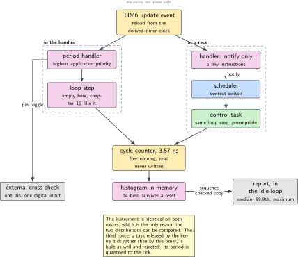
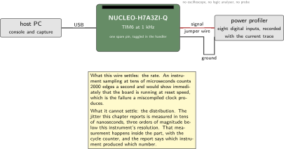
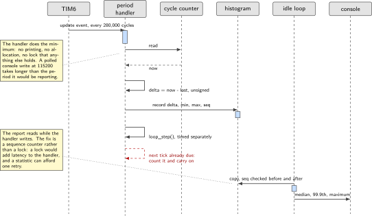
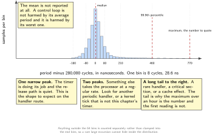
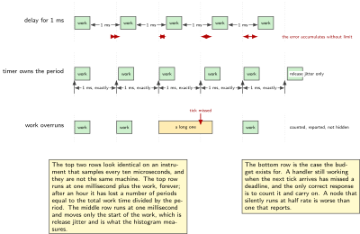

# Chapter 2. The control period: 1 kHz you can prove

> **What the node gains:** A heartbeat  
> **Theme:** Timer-driven period, jitter, measuring it without a scope

> **Key facts**
>
> - **Adds to the node:** A period. Something happens exactly 1000 times a second, and the node can show you the distribution rather than assert the rate
> - **Peripherals:** TIM6 as the period source, the cycle counter in the debug unit as the instrument, one GPIO as the external cross-check, USART3 to report
> - **Depends on:** Chapter 1 for the clock, the self-check and the console
> - **Real or modelled:** Entirely real. This is the last chapter before anything is modelled, and the measurement here is what every modelled result later is compared against
> - **Difficulty:** 3 of 5
> - **Effort:** Two evenings of about four hours, most of it on the histogram rather than the timer
> - **Deliverable:** A period handler that runs at 1 kHz, a jitter histogram built in memory with no probe attached, a printed report giving median, 99.9th percentile and maximum, and an overrun counter that is still zero after an hour

## Why this chapter

Everything above this chapter assumes a period. The controller in chapter 16 discretises its gains against one. The sensor timestamps in chapter 6 are meaningful only relative to one. The state frames in chapter 11 carry a sequence number that counts them. A joint node whose period is approximately one millisecond, most of the time, is not a joint node that can make any claim at all about following error.

The mistake this chapter exists to prevent has a name and a published statement of it. Delaying for a period is not the same as running every period. A loop that does its work and then waits a millisecond runs at one millisecond plus however long the work took, and the error accumulates for as long as the machine is switched on. The fix is to wait until an absolute time rather than for a relative one, or to let a timer decide, and it is three lines different from the mistake.

The harder half is proving it. This bench has no oscilloscope and no logic analyser, so a claim about a period is worth exactly as much as the instrument behind it. The instrument this chapter builds is inside the part: a free-running cycle counter, read in the period handler, with the difference from the previous reading binned into a histogram in memory. At 280 MHz a cycle is 3.57 ns and one period is exactly 280,000 cycles, so the histogram is the jitter distribution, in 3.57 ns bins, with nothing attached to the board.

> [!NOTE]
> **Three quantities that are all called jitter**
>
> They are different, they have different causes, and a chapter that conflates them produces a number nobody can act on. **Period jitter** is the variation in the interval between one tick and the next: it is a property of the timer and its clock, and on a timer driven from the same oscillator as the core it is very small. **Release jitter** is the variation between the tick and the moment the work actually starts: it is caused by other interrupt handlers, by critical sections that disable interrupts, and by the scheduler if there is one. **Execution time** is how long the work itself takes, and its variation on a cached core is larger than most people expect. This chapter measures all three separately, because the fix for each is different.

## Prior art and what to reuse

| Source | What it gives | What it does not | Licence |
| --- | --- | --- | --- |
| The real-time kernel's own delay-until primitive, quoted from the kernel header | The canonical statement: a delay to an absolute time rather than a relative one, for tasks that need a constant execution frequency, with the wake time held by the caller and updated inside the call. The newer form returns whether a delay actually happened, which is a free overrun detector | Nothing about measuring the result, and nothing about what happens when the work overruns more than once | MIT |
| Koopman's lecture on interrupt and cyclic task response timing, Monday 14 March 2016 | The clearest published statement of the defect this chapter prevents, in an annotated bad-code example, and the distinction between response time and execution time | Its terms of use permit download for personal and academic use with attribution and prohibit republishing, so it is cited and linked and never quoted at length | course material, all rights reserved |
| Ganssle's article on interrupt latency | The measurement method that needs no instrument: the handler reads the timer's count register, which has kept incrementing throughout the latency | It predates this core and says nothing about caches | article |
| Cervin and colleagues on analysis tools for real-time control systems, August 2002 | The sentence that connects this chapter to chapter 16: digital control theory assumes equidistant sampling and a negligible or constant delay, and this can seldom be achieved in practice | The tools are host-side and off this bench. One of the two project pages is now a dead link and is not cited | paper |
| Schwarzmann and Kaeser on the effect of sampling-time jitter, Thursday 4 September 2025 | The modern result that jitter scales the system matrices, so a varying period perturbs the plant model rather than adding noise | Not a firmware paper | preprint |
| Styger on cycle counting with the debug unit, Monday 30 January 2017, and the probe vendor's knowledge base article on the same counter | The enable sequence and the two register addresses, and two traps that cost an evening each | Neither presents the histogram construction | articles |

*Table 2.1. Prior art for chapter 2. The second row is the whole argument of the chapter, stated by somebody else in one line on one slide, and it is worth reading the original even though this book cannot reproduce it.*

What is left to write is the instrument. No published article was found that presents the in-memory histogram method for proving a control period with no probe attached, so it is presented here as this book's own construction on two borrowed ideas: reading a free-running counter inside the handler, which is Ganssle's, and the enable sequence for the counter, which is Styger's.

There is also a negative finding worth printing, because a reader will look for it. **No application note from the silicon vendor on building a fixed-period digital control loop was found.** The timer cookbook note exists and could not be fetched from this network; it is a peripheral guide and would not fill the gap in any case.

## What the node gains

Before this chapter the node can tell you what it is. After it, the node has a heartbeat: something happens 1000 times a second, and the node can print the distribution of the interval between those somethings rather than claiming a rate. It still senses nothing and commands nothing. What it has is the thing every later measurement is quoted against.

## Parts from the inventory

| Part | Role | Interface |
| --- | --- | --- |
| NUCLEO-H7A3ZI-Q | The node, and its own instrument | Micro USB to the host |
| The power profiler, as a logic recorder | The external cross-check. One of its eight digital inputs records a pin the handler toggles, time-aligned with its current trace | One jumper wire to a header pin, one to ground |
| One male-to-female jumper wire | The only wiring in this chapter | Board header to instrument input |

*Table 2.2. Inventory items used in chapter 2. The instrument here is a cross-check, not the measurement: its sampling rate is three orders of magnitude too slow to see the jitter, and the chapter says exactly what it can and cannot settle.*

## System architecture



*Figure 2.1. Two ways to own a period, both built in this chapter. On the left the timer interrupt is the period and the work happens in the handler. On the right the timer releases a task and the work happens in the task. The instrument, the histogram and the report are identical in both, which is what makes the comparison worth anything.*

The figure shows the decision this chapter makes twice on purpose. The handler route has the lowest release jitter available on this part, because nothing stands between the timer and the work except interrupt entry. The task route costs a context switch and a scheduler decision, and buys the ability to block, to be preempted by something more urgent, and to share the processor with the bus and the middleware that arrive in later chapters. Both are built, both are measured with the same instrument, and the numbers decide.

## Peripheral configuration

| Peripheral | Mode | Clock source | Pins and function | Interrupt and transfers |
| --- | --- | --- | --- | --- |
| TIM6 | Up-counting, auto-reload, update event | Peripheral bus timer clock, computed at boot | None | Update interrupt, highest priority of the application handlers |
| DWT cycle counter | Free running, 32 bit | Core clock, 280 MHz | None | None. Read, never written |
| GPIOB | Push-pull output | Peripheral bus | One spare header pin, toggled in the handler | None |
| USART3 | Asynchronous, 115200 8N1 | Peripheral bus | Console, from chapter 1 | Polled, and never called from the handler |

*Table 2.3. Peripheral configuration. The last row is a rule rather than a setting: nothing in the period handler prints, because a polled console write at 115200 takes longer than the period it would be reporting.*

## Wiring



*Figure 2.2. The only wire in this chapter, and an honest statement of what it can settle. The instrument records the toggled pin alongside its current trace, so a wrong rate is obvious. It samples far too slowly to see the jitter, which is why the real measurement is inside the part.*

Two facts about that wire. It is the only external evidence in the chapter, and it is deliberately weak evidence: an instrument sampling at tens of microseconds can confirm that the period is a millisecond and not thirty-five, which is exactly the failure a miscompiled clock produces, and it can do nothing about a distribution measured in tens of nanoseconds. Saying which instrument settles which question is the whole of measurement discipline, and it costs one paragraph.

## Memory and timing budget

| Quantity | Budget | Measured | Margin |
| --- | --- | --- | --- |
| Flash, this chapter | 6 kB | not measured | not measured |
| Static memory, this chapter | 1.5 kB, mostly the histogram | not measured | not measured |
| Period | 1000.0 us | not measured | not measured |
| Period jitter, peak to peak | under 1 us | not measured | not measured |
| Release jitter, maximum | under 5 us | not measured | not measured |
| Handler execution time, maximum | under 50 us, which is 5 per cent of the period | not measured | not measured |
| Overruns in one hour | 0 | not measured | not measured |

*Table 2.4. The budget for chapter 2. Every row is a number this chapter's own instrument produces, which is unusual: most chapters measure some rows and leave others. Nothing is written in the measured column until the histogram has run for an hour.*

The execution-time budget deserves its reasoning. A control loop that spends half its period computing has no room for the bus, the sensors or the safety checks that later chapters add, and it has no margin for the cache misses that make a Cortex-M7's worst case much worse than its typical case. Five per cent is the number this volume holds to, and chapter 16, which adds the most work to the handler of any chapter, reports against it.

## Firmware design (UML)



*Figure 2.3. One period, from the timer's update event to the histogram, and the report path that is deliberately outside the handler. The dashed return is the overrun case: the tick arrives while the previous one is still being served, and the only correct response is to count it and carry on.*

Three design decisions.

The handler does the minimum and nothing that can block. It reads the counter, computes the delta, bins it, toggles the pin, calls the loop step, and returns. It does not print, it does not allocate, and it does not take a lock that anything else holds.

The histogram lives in memory the startup code does not clear, so that a reset does not lose the evidence. That costs one linker section and it is the first appearance of a technique chapter 20 relies on completely.

The report runs in the idle loop and reads the histogram while the handler is still writing to it. That is a race, and the honest fix is not a lock, which would add latency to the handler, but a sequence counter the reader checks before and after: if it changed, read again. The report is a statistic, so one retry is enough and a stale sample is harmless.

## Data flow (ASCII)

```text
  TIM6 update every 280,000 cycles
        |
        v
  +-------------------------------------------------------------+
  | period handler, highest application priority                 |
  |   now   = DWT->CYCCNT                                        |
  |   delta = now - last          (unsigned, wraps correctly)    |
  |   last  = now                                                |
  |   bin   = clamp((delta - 280000) / 8 + 32, 0, 63)            |
  |   hist[bin]++          min/max updated          seq++        |
  |   pin toggle  --+                                            |
  |   loop_step()   |      (empty here, the controller in ch 16) |
  +-----------------|-------------------------------------------+
                    +--> one digital input on the power profiler
        |
        | never prints, never blocks, never allocates
        v
  +-------------------------------------------------------------+
  | idle loop, no deadline at all                                |
  |   s1 = seq; copy histogram; s2 = seq; if (s1 != s2) retry    |
  |   median, 99.9th percentile, maximum, overruns               |
  |   printf over USART3, or a frame on the bus from chapter 11  |
  +-------------------------------------------------------------+
```

## Repository layout

```text
joint-node/
  CMakeLists.txt
  cmake/arm-none-eabi.cmake
  ld/stm32h7a3zi.ld                   # + .noinit section for the histogram
  doc/
    node-identity.md  real-or-modelled.md  footprint.csv
    period-report.md                  # + this chapter: the measured numbers
  src/
    node/    identity.c state.h indicator.c selfcheck.c
    bsp/     startup.c system.c uart.c board.h
    control/
      period.c  period.h              # + this chapter: TIM6, the handler
      jitter.c  jitter.h              # + this chapter: the histogram
      cyclecount.h                    # + this chapter: the debug unit counter
      loop.h                          # + this chapter: the empty loop step
    sense/  act/  bus/  mw/  safety/  update/
  host/
    plot_jitter.py                    # + this chapter: the report as a figure
  test/
    test_jitter.c                     # + this chapter: binning, on the host
  tools/  footprint.py
  README.md
```

## Steps

**Step 1.** **Compute the timer clock at boot rather than assuming it.** The timer input is the peripheral bus clock, and on this family it is doubled when the bus prescaler is not one. That rule is in the reference manual for this part, and it is the kind of detail that differs between family members, so the firmware derives it from the clock registers and prints it. A comment in your own code is not evidence.

```c
/* period.c: derive, do not assume. The printed value is the one to trust. */
uint32_t timer_clock_hz(void)
{
    uint32_t pclk = rcc_pclk1_hz();          /* read back from the registers */
    return (rcc_ppre1_divider() == 1u) ? pclk : pclk * 2u;
}

void period_init(uint32_t hz)
{
    uint32_t tclk = timer_clock_hz();
    uint32_t ticks = tclk / hz;              /* exact division, or fail */
    if (tclk % hz != 0u) fail("period: timer clock does not divide cleanly");
    TIM6->PSC = 0u;                          /* no prescaler: finest resolution */
    TIM6->ARR = ticks - 1u;
    printf("period: timer clock %lu Hz, reload %lu, target %lu Hz\r\n",
           tclk, ticks - 1u, hz);
}
```

The check on the remainder matters. A period that is 1000.4 microseconds because the arithmetic did not divide cleanly is a period that accumulates four milliseconds of error every ten seconds, and it looks like a perfectly good 1 kHz loop on any instrument this bench owns.

**Step 2.** **Enable the cycle counter, and check it exists.** It is optional silicon. It is also usually enabled already when a debugger is attached, which is the trap: the code works on the bench and fails standalone, weeks later, with the histogram full of zeros.

```c
/* cyclecount.h: the whole instrument, in nine lines */
#define DWT_CTRL    (*(volatile uint32_t *) 0xE0001000u)
#define DWT_CYCCNT  (*(volatile uint32_t *) 0xE0001004u)
#define DEMCR       (*(volatile uint32_t *) 0xE000EDFCu)

static inline bool cyclecount_init(void)
{
    DEMCR |= (1u << 24);                     /* TRCENA: the debugger may have */
    DWT_CYCCNT = 0u;                         /* done this already             */
    DWT_CTRL |= 1u;                          /* CYCCNTENA                     */
    return DWT_CYCCNT != 0u;                 /* it counts, so it exists       */
}

static inline uint32_t cyclecount(void) { return DWT_CYCCNT; }
```

Wire the return value into the self-check from chapter 1. A node that cannot measure its own period should say so at boot, not produce an empty histogram an hour later.

**Step 3.** **Write the period handler, and keep it short.** Unsigned arithmetic makes the counter's wrap at about 15.3 seconds a non-event: the difference of two unsigned 32-bit values is correct across a wrap, which is worth a comment in the code because it looks like a bug to a reviewer.

```c
void TIM6_DAC_IRQHandler(void)
{
    TIM6->SR = 0u;                           /* clear first, always */

    uint32_t now   = cyclecount();
    uint32_t delta = now - g_last;           /* correct across the 32-bit wrap */
    g_last = now;

    gpio_toggle(PERIOD_PIN);                 /* the external cross-check */
    jitter_record(delta);                    /* the histogram, below */

    uint32_t t0 = cyclecount();
    loop_step();                             /* empty here, chapter 16 fills it */
    jitter_record_exec(cyclecount() - t0);

    if (TIM6->SR & TIM_SR_UIF) g_overruns++; /* a tick arrived while we worked */
}
```

**Step 4.** **Build the histogram.** Sixty-four bins of eight cycles each spans plus or minus 256 cycles, which is plus or minus 914 ns, with everything outside that counted separately. Bins are cheap and the resolution is what makes the figure worth printing.

```c
#define JIT_BINS   64u
#define JIT_SCALE   8u                       /* cycles per bin: 28.6 ns */
#define JIT_NOM    280000u                   /* 280 MHz / 1 kHz, exactly */

void jitter_record(uint32_t delta)
{
    int32_t off = (int32_t) delta - (int32_t) JIT_NOM;
    int32_t bin = (off / (int32_t) JIT_SCALE) + (int32_t) (JIT_BINS / 2u);

    if (bin < 0 || bin >= (int32_t) JIT_BINS) g_jit.outside++;
    else                                      g_jit.bin[bin]++;

    if (delta < g_jit.min) g_jit.min = delta;
    if (delta > g_jit.max) g_jit.max = delta;
    g_jit.count++;
    g_jit.seq++;                             /* the reader checks this */
}
```

**Step 5.** **Put the histogram where a reset cannot erase it.** One section in the linker script, one attribute in the source, and a magic number so the code can tell a fresh histogram from a surviving one.

```ld
  .noinit (NOLOAD) : { . = ALIGN(4); *(.noinit*) . = ALIGN(4); } > RAM
```

```c
__attribute__((section(".noinit"))) static jitter_t g_jit;
/* g_jit.magic != JIT_MAGIC means this is a cold start: zero it. Otherwise the
   histogram survived a reset, which is exactly what you want to look at. */
```

**Step 6.** **Report outside the handler.** Read the histogram with the sequence check, compute the three numbers that matter, and print them from the idle loop.

```c
jitter_t snap;
do { uint32_t s1 = g_jit.seq; snap = g_jit; if (s1 == g_jit.seq) break; }
while (1);                                   /* one retry is enough */

printf("period n=%lu  min=%ld ns  p50=%ld ns  p99.9=%ld ns  max=%ld ns  over=%lu\r\n",
       snap.count, ns(snap.min), ns(pct(&snap, 500)), ns(pct(&snap, 999)),
       ns(snap.max), snap.overruns);
```

Report the median, the 99.9th percentile and the maximum, in that order, and never the mean. A control loop is not harmed by its average period and it is harmed by its worst one, which is why published real-time benchmarks report percentiles and a maximum.

**Step 7.** **Build the same thing again as a kernel task.** The work is identical; only the release path changes. The delay-until primitive takes an absolute wake time that it updates itself, and its return value says whether the deadline had already passed, which is an overrun detector for free.

```c
static void control_task(void *arg)
{
    TickType_t wake = xTaskGetTickCount();
    for (;;) {
        BaseType_t delayed = xTaskDelayUntil(&wake, pdMS_TO_TICKS(1));
        if (delayed == pdFALSE) g_overruns++;  /* the deadline had passed */

        uint32_t now = cyclecount();
        jitter_record(now - g_last);
        g_last = now;
        loop_step();
    }
}
```

Note what this version cannot do: a kernel tick of one millisecond gives a period quantised to the tick, so the honest comparison releases the task from the timer interrupt with a notification instead, and measures that. Build both and print both.

**Step 8.** **Cross-check the rate with the external instrument.** One wire from the toggled pin to a digital input, one capture of a few seconds, and a count of edges. This settles the rate and says nothing about the distribution, and the report says so in the sentence next to the number.

```bash
python host/count_edges.py capture.csv --expect 1000 --tolerance 0.001
# edges: 20000 in 10.000 s -> 1000.0 Hz toggles, 2000.0 Hz edges: PASS
```

**Step 9.** **Run it for an hour and look at the shape.** A histogram with a single narrow peak is a timer doing its job. A second peak says something else in the system takes the processor at a regular rate. A long tail to the right says a rare handler or a cache effect, and the maximum is the number to quote.

```bash
python host/plot_jitter.py period-report.csv -o doc/fig/j02_hist.svg
```



*Figure 2.4. What the instrument produces, and how to read it. The bar heights here are the shape to expect rather than measured data, and the axis deliberately carries no counts: this figure is in the chapter to teach the reading, and the measured version belongs in the repository with its own one-hour run behind it. Three shapes, three different causes, three different fixes.*

## Build, flash and debug



*Figure 2.5. The defect this chapter prevents, drawn to scale. Above, a loop that delays for a period: the work time is added to every cycle and the error accumulates without limit. Below, a timer that owns the period: the work time moves the start of the work and does not move the next tick. The two look identical on an instrument that samples slowly, and they are not the same machine.*

```bash
cmake --build build -j && probe-rs run --chip STM32H7A3ZITx build/firmware.elf
```

> [!NOTE]
> **When the histogram is empty and everything looks right**
>
> In order of likelihood: the cycle counter was never enabled, and the debugger was enabling it for you during development; the counter is enabled but the handler is not running, because the timer interrupt was never unmasked in the interrupt controller, which is a separate step from enabling the update interrupt in the timer; the handler runs but clears the status register last, so it re-enters immediately and the delta is a few hundred cycles rather than 280,000; or the histogram is in the section that startup clears, so it is faithfully zeroed a moment before you read it.

## Verification and acceptance criteria

- The boot line prints the derived timer clock, the reload value and the target rate, and the firmware refuses to start if the division is not exact.
- The external instrument counts 2000 edges per second within one part in a thousand, over a capture of at least ten seconds.
- The histogram over one hour has a single peak, a median within 100 ns of the nominal period, and a maximum that is inside the budget above.
- The overrun counter is zero after an hour in both the handler version and the task version.
- Deliberately adding 900 microseconds of work to the loop step makes the overrun counter increase and the report say so, rather than the node quietly running at a lower rate.
- The histogram survives a reset: press the button, read the report, and the count is not one.
- The binning function has host-side unit tests, including the two cases that are easy to get wrong: a delta below the lowest bin and a delta that wraps the counter.

## Variants

| Axis | Variant | What changes | Cost | Built in full in |
| --- | --- | --- | --- | --- |
| Execution model | Timer interrupt handler | The baseline. Lowest release jitter available on this part | Nothing else can run during the work | Here |
| Execution model | Kernel task released by the timer | A notification from the handler releases a task, which does the work. Preemptible, can block, shares the processor with later chapters | A context switch, a stack, and release jitter you must measure | Here |
| Execution model | Kernel task on the tick | The simplest code of the three, and the period is quantised to the kernel tick | Resolution | Here, as the version to reject |
| Synchronisation | Direct task notification against a semaphore | Both release a task from a handler. The published claim that one is a fixed percentage faster comes from a page that states no processor, no compiler and no method, and the kernel's own book has dropped the figure | One measurement on this board settles it | Chapter 12 |
| Peripheral | A 32-bit timer instead of the basic one | Nothing at 1 kHz. It matters when a chapter wants a long free-running time base, which is chapter 3 | None here | Chapter 3 |
| Time base | The cycle counter against a timer capture | The counter is finer and wraps every 15.3 seconds; a timer capture is coarser and can be extended in software | Resolution against range | Chapter 3 |
| Operating system | The upstream open kernel | Its own timer and work-queue model, and a device tree entry instead of register writes | A second build system | Chapter 4 |
| Language | Rust on the target | The same timer and the same counter, with the handler's shared state expressed so that the race the sequence counter guards cannot be written | A second toolchain | Chapter 16 |

*Table 2.5. Variants for chapter 2. Three execution models are built here rather than one, because the comparison is the chapter: the same work, the same instrument, three release paths, three distributions.*

## Pitfalls

- Delaying for a period instead of until a time. The error accumulates for as long as the machine runs, and no instrument on this bench will show it in a short capture.
- Trusting the timer clock to be the bus clock. It is doubled under a condition that differs across this silicon family, so derive it and print it.
- A reload value that does not divide cleanly. The period is then wrong by a fraction of a per cent, forever, and it looks perfect.
- Enabling the cycle counter only when a debugger is attached. The code works for weeks and the field unit reports nothing.
- Printing from the period handler. A polled console write at 115200 takes longer than the period.
- Putting the histogram in a section the startup code clears, and then concluding the board resets more often than it does.
- Reporting the mean period. It is the one statistic that cannot show the problem.
- Measuring execution time once and calling it the worst case. On this core the cache, the branch predictor and the long pipeline spread the same code over a much wider range than on a simpler part, so the maximum over an hour is the number, not the first reading.

## Best practices applied

- The instrument is named beside every number, and the sentence next to the external measurement says what that instrument cannot settle.
- The firmware derives and prints the facts it depends on instead of carrying them in comments.
- The handler does the minimum, and the rule is written down rather than implied: nothing that blocks, nothing that allocates, nothing that prints.
- The race between the handler and the reporter is acknowledged and handled with a sequence counter rather than removed with a lock that would cost the handler latency.
- Percentiles and a maximum, never a mean, following the published practice for real-time benchmarks.
- The binning arithmetic is tested on a host machine, where a failing case can be written down and kept.

## Stretch goals

- Add a second histogram for release jitter specifically, by having the timer capture its own count at the update event and comparing it with the counter reading at the start of the handler. The difference is interrupt entry latency, measured rather than quoted.
- Run the same firmware under the open simulator and compare the shape of the histogram with the hardware's. The differences are a lesson in what a simulator does not model, and chapter 20 needs that lesson.
- Sweep the interrupt priority of the period handler against a deliberately noisy second handler, and plot the maximum release jitter against priority. That is a figure almost nobody publishes for this core.
- Repeat the whole measurement with the instruction cache disabled and put both histograms on one axis.

## Roadmap and next steps

Chapter 3 gives the node a clock as well as a period: a monotonic time base that outlives the counter's 15.3 second wrap, and a way to stamp a sample with a time another node would agree with.

The published progression from here has two branches. On the timing side, the lecture material cited above continues into scheduling and into watchdog timers, and both are the right next reading for anyone whose loop now runs but whose system does not yet have more than one deadline in it. On the control side, the two papers cited above are the bridge to chapter 16: the 2002 paper states that control theory assumes a constant period, and the 2025 preprint shows that varying it perturbs the plant model rather than adding noise, which is why this chapter's histogram is a control result and not a firmware curiosity.

## Portfolio evidence

- The jitter figure, with the instrument named in its caption and the three release paths on one axis.
- The one-hour report: count, median, 99.9th percentile, maximum, overruns, and the external edge count beside it.
- The deliberate-overrun run, showing the node reporting the overrun rather than silently slowing down. A demonstration of a failure being detected is worth more than a demonstration of a success.
- A paragraph, written down, on what the external instrument could and could not settle, which is the paragraph an interviewer follows up on.

## Sources

Normative references:

- Reference manual RM0455, for the timer clock rule, the timer registers and the interrupt controller. Confirm the peripheral bus divider here rather than assuming it.
- The Arm architecture reference for this core, for the debug unit's cycle counter and the fact that it is optional.
- The board user manual UM2408, for a free header pin to toggle.

Reusable implementations:

- The real-time kernel, MIT, whose header carries the quotable definition of the delay-until primitive and its overrun return value.  
  <https://github.com/FreeRTOS/FreeRTOS-Kernel>
- Koopman's lecture notes on interrupt and cyclic task response timing. Download for personal and academic use with attribution; republication is not permitted, so they are linked and not quoted.  
  <https://users.ece.cmu.edu/ koopman/lectures/index.html>
- Ganssle's article on interrupt latency, including the measurement that needs no instrument.  
  <https://www.ganssle.com/articles/interruptlatency.htm>
- Styger on cycle counting with the debug unit, for the enable sequence and the debugger trap.  
  <https://mcuoneclipse.com/2017/01/30/cycle-counting-on-arm-cortex-m-with-dwt/>
- Cervin, Henriksson, Lincoln and Arzen, analysis tools for real-time control systems, August 2002.  
  <https://lucris.lub.lu.se/ws/files/6359302/625680.pdf>
- Schwarzmann and Kaeser, on the effect of sampling-time jitter, Thursday 4 September 2025.  
  <https://arxiv.org/abs/2509.04199>

---

[Previous](01-what-a-joint-node-is.md) &nbsp;&nbsp;|&nbsp;&nbsp; [Contents](../README.md) &nbsp;&nbsp;|&nbsp;&nbsp; [Next](03-one-clock-for-sensors.md)
