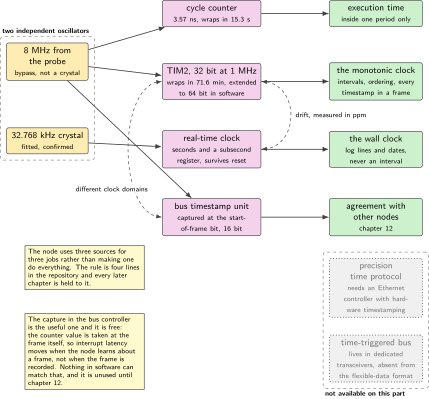
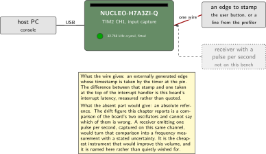
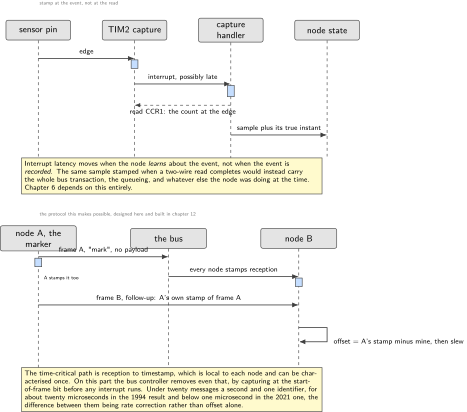
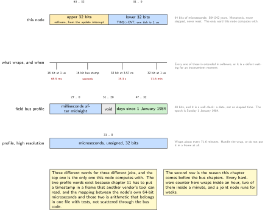
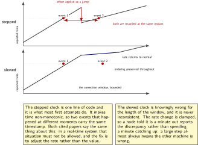

# Chapter 3. One clock for sensors, loop and bus

> **What the node gains:** A shared time base  
> **Theme:** Timestamping, a monotonic tick, what to do without precision time hardware

> **Key facts**
>
> - **Adds to the node:** A time base: a monotonic count that never steps backwards and does not wrap for centuries, a wall clock kept separately, and a rule about which one may be used for what
> - **Peripherals:** TIM2 as the 32-bit monotonic source with a software extension, the real-time clock with the fitted crystal as the wall clock, one timer input capture channel for stamping external events
> - **Depends on:** Chapter 1 for the clock tree, chapter 2 for the period and the cycle counter
> - **Real or modelled:** Entirely real. The clock comparison at the end is a measurement of two real oscillators against each other
> - **Difficulty:** 3 of 5
> - **Effort:** Two evenings of about four hours
> - **Deliverable:** A 64-bit monotonic microsecond clock with a race-free read, an input capture that stamps an event at the pin rather than at the interrupt, a measured drift figure in parts per million between the two oscillators, and a written rule for which clock every later chapter may use

## Why this chapter

Chapter 2 gave the node a period. A period tells you how often something happens; it does not tell you when anything happened. The moment the node has a sensor, it needs to be able to say that a sample belongs to a particular control cycle and was taken at a particular instant. The moment it has a bus, it needs to say that to another machine, which has its own oscillator and its own idea of now.

Three quantities get confused here and they are not the same thing. A **monotonic** clock counts forward and never steps back; it is the right thing for measuring an interval and for ordering events, and it means nothing outside the running machine. A **wall clock** says what the date and time are; it is the right thing for a log entry and the wrong thing for anything timed, because it can be set backwards while the node is running. And a **shared** time base is an agreement between machines about one of the other two, which is a protocol rather than a peripheral.

This chapter builds the first two properly and designs the third. It designs rather than builds it because the node has no bus until chapter 9, and the design decision that matters is made here: the hardware in this part captures a timestamp at the start-of-frame bit of a bus frame, in the controller, before any interrupt runs. That one property is what makes microsecond agreement possible later without any precision time hardware at all, and it is why this chapter is placed before the bus rather than after it.

> [!NOTE]
> **What this bench cannot do and why that is said first**
>
> There is no precision time protocol here, because that needs an Ethernet controller with hardware timestamping and this part has no Ethernet controller at all. There is no time-triggered bus either: that mechanism lives in dedicated transceivers, is absent from ordinary controllers, and, on the authority of a peer-reviewed paper that says so in its own related-work section, was not carried into the flexible-data successor. So the node's shared time base is software over an ordinary bus, which is the interesting case anyway: it is what most machines actually do, and there is a published protocol for it from 1994 that gets to about twenty microseconds and a paper from 2021 that gets below one.

## Prior art and what to reuse

| Source | What it gives | What it does not | Licence |
| --- | --- | --- | --- |
| The silicon vendor's own community answer on how the bus controller timestamps | The fact this chapter is built around: the counter value is captured on the start of frame reception or transmission, not at the interrupt. Two cautions with it: the counter is 16 bit and wraps within seconds, and the timer that can clock it sits in a different clock domain from the bus peripheral, with a few per cent of drift observed between them | It is a forum answer, so the register clause numbers are confirmed against the reference manual before anything is printed | forum post |
| Gergeleit and Streich, first international bus conference, Mainz, September 1994 | The protocol, and the sentence that justifies it: the bus is always much shorter than one bit time, so every node sees the level at about the same moment, which is inherent to the arbitration method and is not true of other networks. About twenty microseconds, under twenty messages a second, one identifier. And the rule that a corrected clock is slewed and never stepped | Thirty-two years old, written before the flexible-data format, and its numbers are for a slower bus | conference paper, freely downloadable |
| Einspieler and colleagues, transactions paper, 2021 | Sub-microsecond precision in software over an ordinary bus, using a high resolution timer with rate correction that many microcontrollers already carry. Its critique is the design rule for this chapter: correcting offset without correcting rate leaves time discontinuous, and two events can then carry the same timestamp although they happened at different moments | Needs the timer module it describes; whether this part has an equivalent is an open question for the bench | IEEE copyright, cite and link |
| The field bus application layer profile, version 4.2.0, Monday 21 February 2011 | The vocabulary a joint node should not invent: a synchronisation object, an optional cycle counter that says which cycle a sample belongs to, a time stamp object, and a high resolution timestamp in microseconds. It also states its own limit: the jitter of a synchronisation frame is about one message transmission time | The high resolution timestamp is 32 bits of microseconds, so it wraps about every 71.6 minutes and the node must handle that | free after registration |
| The bus association's network time management document, Friday 1 September 2023 | The document most directly on this subject, covering timestamping on transmission and reception in both frame formats | Members only, so it is cited by number and title and nothing is quoted from it | members only |
| The embedded middleware client's time synchronisation header | A working epoch synchronisation against a host agent, in four functions, with the offset applied for you | It is a round trip yielding an offset only, with no rate correction and no hardware assistance, and over a bus transport it inherits arbitration delay. Right for a log entry, wrong for aligning a control period | Apache-2.0 |

*Table 3.1. Prior art for chapter 3. The 1994 paper and the 2021 paper are the same protocol twenty-seven years apart, and reading them in order is the fastest way to understand why the second one is twenty times better.*

What is left to write is the local half: a monotonic clock with a race-free read, an event stamp taken at the pin rather than at the interrupt, and the rule about which clock may be used for what. The protocol half is designed here and built in chapter 12, when there is a bus to carry it.

## What the node gains

Before this chapter the node knows how often it runs. After it, the node knows when: it can stamp an event with a 64-bit microsecond count that never goes backwards, it can say what the date is without confusing that with elapsed time, and it can state how far its own oscillator drifts against a second one. It cannot yet agree with another machine, and the mechanism by which it will is designed and written down.

## Parts from the inventory

| Part | Role | Interface |
| --- | --- | --- |
| NUCLEO-H7A3ZI-Q | The node. Two oscillators on it are used here: the high-speed clock from the probe and the fitted 32.768 kHz crystal | Micro USB to the host |
| The fitted low-speed crystal | The wall clock's reference, and the second oscillator in the drift measurement | On the board, confirmed fitted |
| The power profiler, as a logic recorder | An external event source for the input capture: its digital line, or simply the button, gives an edge whose stamp can be checked | One jumper wire |

*Table 3.2. Inventory items used in chapter 3. Nothing is bought. The one thing this chapter would buy if the budget allowed is a receiver that outputs a pulse per second, and the chapter says exactly what that would add.*

## System architecture



*Figure 3.1. Every source of time on this part, what it is good for, and what it costs. Two of them are absent and drawn accordingly: the precision time protocol needs an Ethernet controller this part does not have, and time-triggered bus hardware lives in transceivers rather than in controllers. The one that matters most is the start-of-frame capture in the bus peripheral, which is free, already there, and unused until chapter 12.*

The figure is the chapter's argument in one picture. Four real sources, with different resolution and different range, and the node uses three of them for three different jobs rather than trying to make one of them do everything. The cycle counter from chapter 2 is the finest and wraps in 15.3 seconds. The 32-bit timer at one microsecond wraps in 71.6 minutes and becomes the monotonic clock when it is extended in software. The real-time clock keeps the date across a reset and is far too coarse to time anything. And the bus controller captures its own timestamps at the frame, which no software path can match.

## Peripheral configuration

| Peripheral | Mode | Clock source | Pins and function | Interrupt and transfers |
| --- | --- | --- | --- | --- |
| TIM2 | Free running, 32 bit, prescaled to 1 MHz | Peripheral bus timer clock, derived at boot | None | Update interrupt only, to extend the count |
| TIM2 channel 1 | Input capture, rising edge | As above | One header pin, the event input | Capture interrupt, low priority |
| RTC | Calendar with subsecond register | The fitted 32.768 kHz crystal | None | None. Read, never used for timing |
| DWT cycle counter | Free running, from chapter 2 | Core clock | None | None |
| FDCAN1 timestamp unit | Configured but unused | Reserved | None until chapter 9 | Named here so chapter 9 does not have to rediscover it |

*Table 3.3. Peripheral configuration for chapter 3. The prescaler that makes the timer tick at exactly one microsecond is derived from the measured timer clock, not written as a constant, for the same reason the reload value was in chapter 2.*

## Wiring



*Figure 3.2. One wire for the event input, and the thing this bench does not have drawn beside it. A receiver that emits one pulse per second would turn the drift figure at the end of this chapter into an absolute frequency measurement, and it is the single cheapest instrument that would improve this volume.*

## Memory and timing budget

| Quantity | Budget | Measured | Margin |
| --- | --- | --- | --- |
| Flash, this chapter | 4 kB | not measured | not measured |
| Static memory, this chapter | 128 bytes | not measured | not measured |
| Monotonic clock resolution | 1 us | computed, exact by construction | n/a |
| Monotonic clock range | over 500,000 years | computed | n/a |
| Cost of one timestamp read | under 100 cycles | not measured | not measured |
| Drift, high-speed against low-speed | report in ppm | not measured | not measured |
| Backwards steps in one hour | 0 | not measured | not measured |

*Table 3.4. The budget for chapter 3. Two rows say computed rather than measured, because they follow from the arithmetic of a 64-bit microsecond count rather than from an observation, and this volume labels those differently on purpose.*

## Firmware design (UML)



*Figure 3.3. Above, how a sensor event gets an honest timestamp: the edge is captured in hardware and the interrupt only reads the captured value, so interrupt latency moves when the node learns about the event and not when the event is recorded. Below, the protocol this design makes possible, from the 1994 paper: one frame to mark an instant, then a second frame carrying the marker's own timestamp. Nothing in the lower half is built until chapter 12.*

The upper half is a rule worth stating plainly: **stamp at the event, not at the read**. An inertial unit that signals a new sample on a pin, whose edge is captured by a timer channel, gives a timestamp that is correct even if the firmware is busy for two hundred microseconds. The same sample read over a two-wire bus and stamped when the read completes carries the latency of the bus transaction, the queueing, and whatever else the node was doing. Chapter 6 depends on this entirely.

The lower half is the reason the upper half is built the way it is. In the published protocol, any node broadcasts an indication frame; every participant, including the sender, records when it saw that frame; then the sender transmits a second frame carrying its own record. Each receiver now has two numbers for the same instant and can compute its offset. The time-critical path is reception to timestamp, which is local to each node and can be characterised once, and on this part the controller removes even that by capturing at the frame itself.



*Figure 3.4. The three time words this node deals in, drawn to the same scale. The top one is the only one it computes with. The middle row is the reason this chapter comes before the bus chapters: every hardware counter on this part wraps inside an hour and two of them inside a minute, while a joint node runs for weeks. The bottom two are the field bus profile's own layouts, which chapter 11 has to map onto.*

## Data flow (ASCII)

```text
  hardware                        software                     what it is for
  ------------------------------  ---------------------------  -----------------
  TIM2, 32 bit at 1 MHz    -----> lower 32 bits  --+
  TIM2 update interrupt    -----> upper 32 bits  --+--> uint64 us   intervals,
                                  read with retry                   ordering,
                                                                    deadlines
  TIM2 CH1 capture on edge -----> event stamp, same base ---------> sensor and
                                  (latency moves the read, not      bus events
                                   the recorded instant)

  RTC + 32.768 kHz crystal -----> date and time of day -----------> log entries
                                  subsecond register                 only

  DWT cycle counter        -----> 3.57 ns, wraps in 15.3 s -------> execution
                                                                    time only

  FDCAN timestamp (ch 9)   -----> captured at start of frame -----> agreement
                                  16 bit, extended in software      with other
                                                                    nodes
```

## Repository layout

```text
joint-node/
  ld/stm32h7a3zi.ld
  doc/
    node-identity.md  real-or-modelled.md  footprint.csv  period-report.md
    time-rules.md                       # + this chapter: which clock for what
  src/
    node/    identity.c state.h indicator.c selfcheck.c
    bsp/     startup.c system.c uart.c board.h
    control/ period.c jitter.c cyclecount.h loop.h
    time/
      mono.c  mono.h                    # + this chapter: 64-bit microseconds
      capture.c capture.h               # + this chapter: stamp at the pin
      wall.c  wall.h                    # + this chapter: the calendar
      skew.c  skew.h                    # + this chapter: slew, never step
    sense/  act/  bus/  mw/  safety/  update/
  host/  plot_jitter.py  count_edges.py
  test/
    test_jitter.c
    test_mono.c                         # + this chapter: the wrap and the race
    test_skew.c                         # + this chapter: monotonicity
  tools/ footprint.py
  README.md
```

## Steps

**Step 1.** **Write the rule down before the code.** One short file, `doc/time-rules.md`, that every later chapter is held to. It is four lines and it prevents a class of defect that is very hard to find later.

```text
monotonic (mono_us)   intervals, deadlines, ordering, every timestamp in a
                      frame or a message. Never reset, never stepped.
wall clock (wall_now)  log lines and the date in a report. Never used to
                      compute an interval, ever.
cycle counter          execution time of a short section, inside one period.
                       Wraps in 15.3 s, so never used across periods.
bus timestamp          agreement with other nodes, from chapter 12.
```

**Step 2.** **Make the timer tick at exactly one microsecond.** The prescaler comes from the derived timer clock, as in chapter 2, and the division has to be exact or the node refuses to start. A clock that ticks every 1.0004 microseconds is a clock that is wrong by a third of a second every ten minutes.

```c
void mono_init(void)
{
    uint32_t tclk = timer_clock_hz();            /* from chapter 2 */
    if (tclk % 1000000u != 0u) fail("mono: timer clock is not a whole MHz");
    TIM2->PSC = (tclk / 1000000u) - 1u;          /* one tick = 1 us */
    TIM2->ARR = 0xFFFFFFFFu;                     /* free running, 32 bit */
    TIM2->DIER |= TIM_DIER_UIE;                  /* update: extend the count */
    TIM2->CR1 |= TIM_CR1_CEN;
    printf("mono: %lu Hz timer, prescaler %lu, 1 us per tick\r\n",
           tclk, TIM2->PSC + 1u);
}
```

**Step 3.** **Extend 32 bits to 64, and read it without a race.** This is the part that looks trivial and is not. The counter and the overflow count are two separate pieces of state that change at different moments, so a naive read can catch the low word after the wrap and the high word before it, and produce a timestamp that is 71.6 minutes in the past.

```c
static volatile uint32_t g_high;                 /* incremented in the ISR */

void TIM2_IRQHandler(void)
{
    if (TIM2->SR & TIM_SR_UIF) { TIM2->SR = ~TIM_SR_UIF; g_high++; }
}

uint64_t mono_us(void)
{
    uint32_t hi1, lo, hi2;
    do {
        hi1 = g_high;
        lo  = TIM2->CNT;
        hi2 = g_high;                            /* did it wrap while we read? */
    } while (hi1 != hi2);
    return ((uint64_t) hi2 << 32) | lo;
}
```

The retry loop terminates because the wrap happens once every 71.6 minutes and the loop body takes tens of nanoseconds. The alternative, disabling interrupts around the read, costs the period handler latency for no benefit, which is the same trade chapter 2 made with the sequence counter.

**Step 4.** **Prove the wrap on a host machine rather than by waiting.** Seventy-one minutes is too long to test by hand, and the interesting cases are exactly at the boundary. Factor the arithmetic so it can be called with artificial values.

```c
/* test_mono.c, built and run on the host: no board involved */
assert(mono_compose(0u, 0xFFFFFFFFu) == 0xFFFFFFFFull);
assert(mono_compose(1u, 0x00000000u) == 0x100000000ull);
assert(mono_compose(1u, 0x00000000u) > mono_compose(0u, 0xFFFFFFFFu));
/* and the race the retry loop exists to prevent, written as a fact: */
assert(mono_compose(0u, 0x00000001u) < mono_compose(1u, 0x00000000u));
```

**Step 5.** **Stamp an event at the pin.** Configure one timer channel as an input capture. The capture register holds the counter value at the edge, so the interrupt can be late without making the timestamp late.

```c
uint64_t capture_stamp(void)                     /* called from the capture ISR */
{
    uint32_t lo = TIM2->CCR1;                    /* the counter at the edge */
    uint64_t now = mono_us();                    /* the counter now */

    /* The capture happened at or before now. If the low word has wrapped
       since, the high word must be one less than the current one. */
    uint32_t hi = (uint32_t) (now >> 32);
    if (lo > (uint32_t) now) hi--;
    return ((uint64_t) hi << 32) | lo;
}
```

Print the difference between the captured stamp and a stamp taken at the top of the interrupt handler. That difference is interrupt latency, measured on this board, for free, and it is a number worth putting in the report.

**Step 6.** **Keep the wall clock separate, and make it obvious.** The calendar comes from the real-time clock on the fitted crystal, and the type system is the cheapest place to stop somebody subtracting two of them.

```c
typedef struct { uint64_t us; }        mono_t;   /* intervals: subtract these */
typedef struct { uint32_t s; uint32_t frac; } wall_t;  /* dates: never subtract */

static inline uint64_t mono_diff(mono_t a, mono_t b) { return a.us - b.us; }
/* There is deliberately no wall_diff(). If you need an elapsed time, you
   wanted the monotonic clock. */
```

**Step 7.** **Measure the two oscillators against each other.** The node now has two independent time sources. Count monotonic microseconds between two real-time-clock second boundaries, over an hour, and report the difference in parts per million. This is the first genuinely physical measurement in the volume and it costs nothing.

```bash
# after one hour, on the console
drift: mono 3600004120 us over 3600 RTC seconds -> +1.14 ppm (mono fast)
```

Two honest readings of that number. It is the difference between two oscillators, and it does not say which one is wrong. And with no absolute reference on this bench it cannot be turned into an accuracy figure, which is what a receiver emitting one pulse per second would add for about the price of a meal.

**Step 8.** **Implement slew, and refuse to step.** Chapter 12 will have an offset to apply. Applying it as a jump is the mistake both cited papers warn about, because time then goes backwards and two different events can carry the same timestamp. Write the correction now, with the interface the bus chapter will call, and assert monotonicity in the code.

```c
/* skew.c: absorb an offset by adjusting the rate, never by jumping. */
void skew_apply(int64_t offset_us)
{
    /* Spread the correction over the next window rather than applying it now.
       A positive offset means this node is behind: run slightly fast. */
    g_skew.residual_us = offset_us;
    g_skew.ppm = clamp(offset_us * 1000000 / SKEW_WINDOW_US, -200, +200);
}

uint64_t mono_us_corrected(void)
{
    uint64_t raw = mono_us();
    uint64_t out = raw + skew_correction(raw);
    if (out < g_last_out) { g_backwards++; out = g_last_out; }  /* never */
    g_last_out = out;
    return out;
}
```

The clamp is the design decision: a node that is told it is a minute out does not spend a minute catching up at full speed, it reports the discrepancy and corrects slowly, because a large step usually means the other machine is wrong.

**Step 9.** **Design the protocol, and write it down for chapter 12.** Two frames, one identifier each, at a low rate. The first marks an instant and carries nothing. The second carries the sender's own timestamp for the first. Each receiver subtracts its own record of the first frame from the number in the second, and hands the difference to the slew function above. The 1994 paper puts this at about twenty microseconds on a slower bus, with fewer than twenty messages a second.

```text
frame A  "mark"      no payload. Every node records mono_us() at reception.
frame B  "follow-up" 8 bytes: the sender's mono_us() for frame A.
         offset = sender_stamp - my_stamp_of_A  ->  skew_apply(offset)
```

## Build, flash and debug



*Figure 3.5. Why a corrected clock is slewed and never stepped. Above, an offset applied as a jump: time goes backwards, and two events that happened at different moments are recorded at the same instant, which a real-time system must not allow. Below, the same offset absorbed by running slightly fast for a bounded window: the clock stays monotonic and the ordering of events is preserved throughout.*

```bash
cmake --build build -j && probe-rs run --chip STM32H7A3ZITx build/firmware.elf
ctest --test-dir build-host           # the wrap and monotonicity tests
```

> [!NOTE]
> **When a timestamp is 71.6 minutes in the past**
>
> That number is the signature of the race in step 3: the low word was read after a wrap and the high word before it. If the stamps are wrong by exactly 4294.97 seconds, the retry loop is missing or the compiler has hoisted the read of the overflow counter out of it, which is what the volatile qualifier is there to prevent. A second signature, an offset of exactly one microsecond appearing and disappearing, is the capture correction in step 5 applied in the wrong direction.

## Verification and acceptance criteria

- The boot line prints the derived timer clock, the prescaler and the resulting tick, and the firmware refuses to start if the division is not exact.
- The monotonic clock never goes backwards: a check in the corrected read counts violations, and the count is zero after an hour with the slew function being exercised by injected offsets.
- The wrap arithmetic has host tests covering the boundary, including the case that motivates the retry loop.
- An externally generated edge is stamped, and the difference between the captured stamp and a stamp taken at the top of the handler is reported. That difference is interrupt latency and it is a plausible number rather than zero.
- The drift between the two oscillators is reported in parts per million over at least an hour, with a sentence saying it does not identify which oscillator is at fault.
- Nothing in the tree computes an interval from the wall clock. There is no function that would let it, and a search proves the absence.
- Injecting a large offset makes the node report the discrepancy and correct slowly rather than stepping.

## Variants

| Axis | Variant | What changes | Cost | Built in full in |
| --- | --- | --- | --- | --- |
| Time source | 32-bit timer extended in software | The baseline: one microsecond, effectively unbounded range | One interrupt every 71.6 minutes | Here |
| Time source | The cycle counter alone | Finest resolution available, 3.57 ns, and no extra peripheral | Wraps in 15.3 seconds, so it cannot time anything longer | Chapter 2, for execution time only |
| Time source | The real-time clock's subsecond register | Survives a reset and runs from a separate crystal | Coarse, and it is a calendar rather than a stopwatch | Here, as the wall clock |
| Time source | The bus controller's own capture | Captured at the frame, before any interrupt. Nothing in software can match it | Sixteen bits, wrapping in seconds, and it lives in a different clock domain from the timer that can drive it | Chapter 12 |
| Correction | Step the clock | One line, and it is what most first attempts do | Time goes backwards and ordering is lost | Nowhere. Shown as the defect |
| Correction | Slew at a bounded rate | Monotonic throughout, bounded catch-up time | The node is knowingly wrong for the length of the window | Here |
| Correction | Offset from a host round trip | The middleware client does it in four function calls | An offset only, with no rate correction, and it inherits the transport's asymmetry | Chapter 14 |
| Agreement | Precision time protocol | The standard answer everywhere else | Needs an Ethernet controller with hardware timestamping, which this part does not have | Nowhere. Named and explained |
| Agreement | Time-triggered bus | Timestamping in hardware at the protocol level | Lives in dedicated transceivers, absent from ordinary controllers and from the flexible-data format | Nowhere. Named and explained |

*Table 3.5. Variants for chapter 3. Two rows are built nowhere on purpose: naming the mechanism a reader will find everywhere else, and saying precisely why this bench cannot run it, is more useful than silence.*

## Pitfalls

- Reading a 32-bit counter and its overflow count without a retry. The failure is rare, it is exactly 71.6 minutes wide, and the sensor will be suspected long before the clock is.
- Leaving the overflow counter without the volatile qualifier, so that the compiler reads it once and the retry loop cannot terminate correctly.
- Computing an interval from the wall clock. It is right until the moment somebody sets the clock, and then it is spectacularly wrong.
- Stamping a sensor sample when the read completes rather than when the event happened. The error is the whole bus transaction and it varies with load.
- Stepping a corrected clock. Two events then share a timestamp, and every piece of ordering logic above is quietly wrong.
- Assuming the timestamp counter in the bus controller runs from the same clock as the timer that can drive it. They are in different domains and drift against each other, which is documented in the vendor's own community answer and is the kind of detail that costs a week.
- Treating the drift figure as an accuracy figure. With no absolute reference on the bench it is a comparison of two oscillators and nothing more.

## Best practices applied

- Two clocks with two purposes and two types, and no function exists that would let one be used for the other's job.
- The rule is a file in the repository, not a convention in somebody's head.
- The arithmetic that cannot be tested by waiting is factored so it can be tested on a host machine in microseconds.
- Corrections are slewed and bounded, following the published practice in both cited papers, and monotonicity is asserted in the code rather than assumed.
- The measurement that this bench genuinely cannot make is named, along with the inexpensive instrument that would make it possible.
- Peripheral facts taken from a forum answer are confirmed against the reference manual before they are printed, and the chapter says which is which.

## Stretch goals

- Add a receiver that emits one pulse per second, capture it on the same timer channel, and turn the drift comparison into an absolute frequency measurement with a stated uncertainty.
- Discipline the monotonic clock to that pulse with the slew function already written, and plot the residual over a day.
- Implement the cycle counter and the microsecond timer as two implementations of one interface, and measure the cost of a timestamp read in each.
- Run the same firmware in the open simulator and compare the behaviour of the wrap. A simulator that does not model the wrap correctly is a useful thing to discover before chapter 20 depends on it.

## Roadmap and next steps

Chapter 4 turns everything built so far into a board support package somebody else can read, and hands it over as a file rather than as a folder of habits.

The published progression on time is short and worth following exactly. Read the 1994 conference paper first, because it is eight pages and contains the whole idea. Then read the 2021 transactions paper, whose related-work section is a complete survey of what has been tried over this bus and whose central result, sub-microsecond agreement in software with rate correction, is the target this volume's chapter 12 aims at. The bus association's own network time management document is the current normative statement and is the thing to buy if this work goes anywhere commercial. For the object dictionary vocabulary, the application layer profile is free after registration and its synchronisation and time clauses are four pages.

## Portfolio evidence

- The drift measurement, with its honest caveat, which is a real physical result produced with no instrument at all.
- The interrupt latency figure, derived from the difference between a captured stamp and a handler stamp.
- The host test suite for the wrap, including the boundary case, which is the kind of test that convinces a reviewer that the author has met this bug before.
- The time rules file, which is four lines and is the thing most projects do not have.

## Sources

Normative references:

- Reference manual RM0455, for the timer registers, the input capture path, the real-time clock and the bus controller's timestamp registers. The register names for the last of these come from a community answer and are confirmed here before use.
- The application layer profile of the bus association, version 4.2.0, Monday 21 February 2011, clauses 7.2.5, 7.2.6 and 7.1.6.5, and objects 1005h, 1006h, 1007h, 1012h, 1013h and 1019h.
- The bus association's network time management document, version 1.1.0, Friday 1 September 2023, cited by number and title only.
- IEEE 1588-2019 and the current edition of the local network timing standard, named as the mechanisms this bench cannot run.

Reusable implementations:

- Gergeleit and Streich, on a distributed high-resolution real-time clock over this bus, first international conference, September 1994.  
  <https://can-cia.org/fileadmin/cia/documents/proceedings/1994_gergeleit.pdf>
- Einspieler, Rathakrishnan, Prabhakara, Steinwender and Elmenreich, on high-accuracy software-based clock synchronisation over this bus, 2021.  
  <https://mobile.aau.at/publications/einspieler-2021_High_Accuracy_SW-Based_Clock_Synchronization_Over_CAN.pdf>
- The embedded middleware client's time synchronisation header, Apache-2.0, for the epoch synchronisation used in chapter 14.  
  <https://github.com/micro-ROS/rmw_microxrcedds>
- The reference implementation of the object dictionary, Apache-2.0, whose source settles the object numbers used above.  
  <https://github.com/CANopenNode/CANopenNode>

---

[Previous](02-the-control-period.md) &nbsp;&nbsp;|&nbsp;&nbsp; [Contents](../README.md) &nbsp;&nbsp;|&nbsp;&nbsp; [Next](04-the-board-support-package.md)
