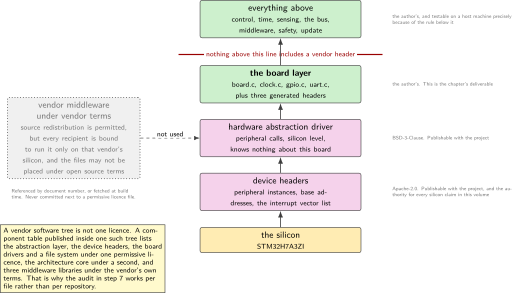
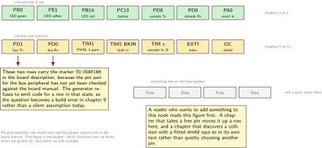
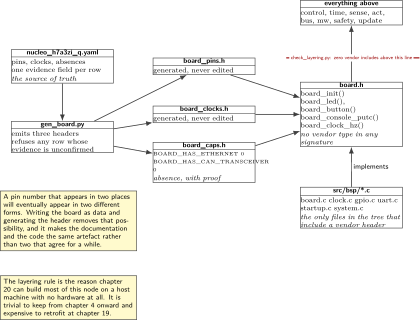
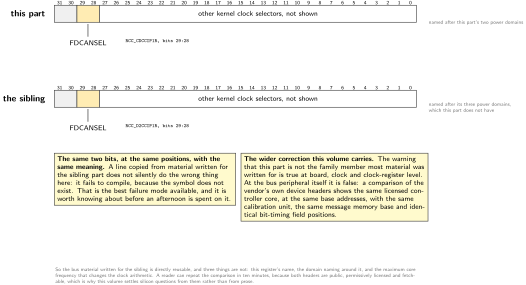
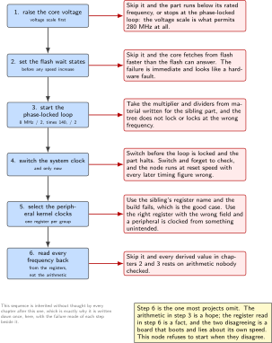

# Chapter 4. The board support package, and a board file you can hand over

> **What the node gains:** A documented hardware interface  
> **Theme:** Pin map, clock config, peripheral table, a board file another engineer can read

> **Key facts**
>
> - **Adds to the node:** A hardware interface somebody else can take: one file that says what this board is, one that says what it is not, and a rule that keeps vendor types out of everything above
> - **Peripherals:** All of them, described rather than configured. The pin budget for the whole volume is allocated here
> - **Depends on:** Chapters 1, 2 and 3, whose accumulated hardware knowledge this chapter turns from habits into a deliverable
> - **Real or modelled:** Entirely real, and deliberately so: a board file that describes hardware the bench does not have would be the worst possible place to blur that line
> - **Difficulty:** 2 of 5, and the hour of licence reading is the part people skip
> - **Effort:** Two evenings of about three hours
> - **Deliverable:** A machine-readable board description with an evidence column, a generated header, a list of what this board does not have, a licence audit that fails the build on an unknown file, and a handover test that passes on a machine that has never seen the project

## Why this chapter

Three chapters in, the node knows a great deal about its own hardware, and all of it is scattered: a pin number in a source file, a clock rule in a comment, a peripheral choice recorded only in the fact that nothing else uses that timer. That is a working board and an untransferable one. Every later chapter adds another such fact, and by chapter 12 nobody can answer a simple question like which pins are still free without reading the whole tree.

A board support package is the answer, and it is worth being precise about what it is. It is not a hardware abstraction layer: the vendor supplies one of those and it is used underneath. It is not a driver collection: drivers belong to the peripherals they drive. It is the layer that says *this board*, as opposed to this silicon: which pin carries which function, which clock arrives at what frequency, which peripherals are claimed and by what, and which capabilities this board simply does not have.

The last of those is the part that most board files omit and the part that matters most here. This board has no bus transceiver and this part has no Ethernet controller at all. A board file that is silent about absences invites the reader to assume presence, and the evidence for these two particular absences is good enough to publish, which is what this chapter does.

> [!NOTE]
> **What a handover actually tests**
>
> The test at the end of this chapter is not a build. It is: a second machine that has never had a vendor development environment installed, a fresh clone, a person who has read only the board file, and thirty minutes. If that person can name every claimed pin, state the clock at three points in the tree, and get a light blinking, the package is real. If they have to ask which timer is free, it is not. This is also the most accurate rehearsal available for the question an interviewer asks about board bring-up.

## Prior art and what to reuse

| Source | What it gives | What it does not | Licence |
| --- | --- | --- | --- |
| The silicon vendor's device headers for this family | The authoritative, fetchable, machine-readable statement of what is in this part: peripheral instances, base addresses, register layouts, and the interrupt vector list. Every silicon claim in this volume is settled from here rather than from prose | No board layer at all, and no opinion about which pin does what on a particular board | Apache-2.0, safe to vendor |
| The same vendor's hardware abstraction driver | A peripheral layer that is already written, already tested by a great many people, and permissively licensed | It is silicon-level, so it knows nothing about this board, and its call surface leaks into anything that includes it, which is the problem this chapter solves | BSD-3-Clause, safe to vendor |
| The upstream operating system's board files for this board | The best published example of the idea this chapter is about: a board described as data rather than as code, in a format another tool can read | It carries one inherited artefact, discussed below, that claims a peripheral this part does not have. Treat a board file as evidence of what its author modelled | Apache-2.0 |
| The component licence table published inside one of that vendor's own family trees | The evidence for the rule in step 6: one vendor tree carries at least four different licences, two of them permissive and two of them vendor terms that survive redistribution | It covers a different family, so it is used as proof that per-file checking is needed rather than as a licence list for this one | the file itself is permissively licensed |
| The sibling firmware volume, chapter 1 | The startup code, the linker script and the clock bring-up, in full, for this exact part | It stops at one board and one blinking light, which is where this chapter starts | this series |

*Table 4.1. Prior art for chapter 4. The third row is the one to read in full: it is a working board file for this exact board, written by people who had to make it work for everyone, and the hour spent reading it is repaid in the pin map alone.*

What is left to write is the description itself and the discipline around it: an evidence column on every row, a generated header so that the code cannot drift from the description, an explicit list of absences, and a check that stops vendor types from leaking upward.

## What the node gains

Before this chapter the node works and only its author can extend it. After it, the node has a hardware interface that is a file rather than a memory: a description with evidence, a generated header, a stated list of what the board cannot do, and a licence audit that says exactly which third-party files may be published with the project and which may only be referenced. Nothing the node does changes. Everything about who else can work on it does.

## Parts from the inventory

| Part | Role | Interface |
| --- | --- | --- |
| NUCLEO-H7A3ZI-Q | The board being described | Micro USB to the host |
| The board user manual | The authority for every pin claim in the description. Each row of the board file names the page it came from | A PDF, opened by hand |
| The reference manual for this part | The authority for every clock and peripheral claim, and specifically not the manual for the better-known sibling part | A PDF, opened by hand |
| Raspberry Pi 4 | The handover machine: it has never had a vendor development environment and never will | Network |

*Table 4.2. Inventory items used in chapter 4. Two of the four are documents, which is unusual for a chapter in this volume and is the point of this one.*

## System architecture



*Figure 4.1. The layers, with the licence of each. Two of them are the author's, two are permissively licensed and may be published with the project, and one category may not be vendored at all. The single rule that makes the whole stack portable is drawn as a line: nothing above the board layer includes a vendor header.*

The figure is also a warning about a common assumption. A vendor software tree is not one licence. A component table published inside one such tree lists the hardware abstraction layer, the device headers, the board support drivers and a file system under one permissive licence; the architecture core under a second; and three middleware libraries under the vendor's own terms, which permit source redistribution but bind every downstream user to run the software only on that vendor's silicon and forbid the files from being placed under open source terms. A public repository with one permissive licence file at the top that appears to cover the whole tree would not comply. Hence step 6.

## Peripheral configuration

This table is the peripheral budget for the entire volume, allocated once, here. Later chapters fill in the rows marked reserved and may not take a row that is already claimed without saying so in their own text.

| Peripheral | Claimed by | Clock source | Pins and function | Status |
| --- | --- | --- | --- | --- |
| RCC, PWR, FLASH | Chapter 1 | 8 MHz bypass to 280 MHz | None | Done |
| GPIOB, GPIOE | Chapter 1 | Peripheral bus | PB0, PE1, PB14, node state | Done |
| GPIOC | Chapters 1 and 18 | Peripheral bus | PC13, button, later the local stop | Done, extended later |
| USART3 | Chapter 1 | Peripheral bus | Console through the probe | Done |
| TIM6 | Chapter 2 | Timer clock, derived | None | Done |
| TIM2 | Chapter 3 | Timer clock, derived | CH1 input capture, event stamp | Done |
| RTC and LSE | Chapter 3 | 32.768 kHz crystal | None | Done |
| FDCAN1 | Chapters 9 to 13 | Kernel clock selector, see the data figure | Two pins on port D, confirmed against the board manual | Reserved |
| TIM1 or TIM8 | Chapter 7 | Timer clock | Complementary outputs, dead time, fault input | Reserved |
| A timer in encoder mode | Chapter 5 | Timer clock | Two channels, plus one interrupt pin for the index | Reserved |
| I2C on the shield header | Chapter 6 | Peripheral bus | Inertial unit, and its data-ready pin to a capture channel | Reserved |
| IWDG and WWDG | Chapter 18 | Low-speed internal, and the peripheral bus | None | Reserved |

*Table 4.3. The peripheral budget, allocated once. Two watchdogs are confirmed present on this part, an independent one and a window one, and chapter 18 explains why a joint node wants the window variant and why neither is independent enough for a safety argument on its own.*

## Wiring



*Figure 4.2. The pin budget, drawn on the two headers. Green is claimed and in use, amber is claimed and reserved for a later chapter, grey is free. A reader who wants to add something to this node looks at this figure first, and a chapter that takes a grey pin turns it amber here.*

## Memory and timing budget

| Quantity | Budget | Measured | Margin |
| --- | --- | --- | --- |
| Flash, this chapter | 2 kB, almost all of it tables | not measured | not measured |
| Static memory, this chapter | 0 | computed | n/a |
| Generated header, lines | under 300 | not measured | not measured |
| Handover: first light on a new machine | 30 minutes | not measured | not measured |
| Handover: questions the reader had to ask | 0 | not measured | not measured |

*Table 4.4. The budget for chapter 4. The last two rows are the only ones in this volume measured in minutes and questions rather than in bytes, and they are the ones that decide whether this chapter succeeded.*

## Firmware design (UML)



*Figure 4.3. The board layer as a contract. Everything above it uses named functions and named pins; only the four files inside it include a vendor header, and a check in the build proves that. The generated header is produced from the description and never edited, which is why it is drawn with its generator attached.*

Two rules, and the second one is the one that pays.

**The description is the source of truth and the header is generated from it.** A pin number that appears in two places will eventually appear in two different forms. Writing the description as data and generating the header removes that possibility, and it makes the documentation and the code the same artefact rather than two artefacts that agree for a while.

**Nothing above the board layer includes a vendor header.** The moment a control loop includes a peripheral header, the control loop is tied to one silicon vendor and cannot be tested on a host machine. Chapter 20 needs to build most of this node on a host with no hardware at all, and that is possible only if this rule was kept from chapter 4 onward rather than retrofitted at the end.

## Data flow (ASCII)

```text
  authority                board description         generated            used by
  ---------------------    ---------------------     ---------------      -----------
  board manual UM2408 ---> board.yaml                                      nothing
    page and table no.        pins:                                        above the
                               led_green: PB0   ---> board_pins.h  ------> board layer
  reference manual RM0455 -->  console: USART3       (never edited)        includes
    clause number             clocks:                                      a vendor
                               sysclk: 280 MHz  ---> board_clocks.h -----> header
  vendor device headers  -->  absent:                                      |
    proof by absence           ethernet: false ----> board_caps.h  ------> |
                               transceiver: false     BOARD_HAS_* = 0      v
                                                                        a build
  measured on the bench  -->  drift: +1.14 ppm  ---> doc only            error if
    chapter 3                  (never a constant)                        anything
                                                                        else does
```

## Repository layout

```text
joint-node/
  board/
    nucleo_h7a3zi_q.yaml              # + this chapter: the description
    evidence.md                       # + this chapter: where each row came from
    LICENSES.md                       # + this chapter: the audit result
  src/
    bsp/
      board.h                         # + this chapter: the contract
      board_pins.h                    # + generated, never edited
      board_clocks.h                  # + generated, never edited
      board_caps.h                    # + generated: what this board is not
      board.c  clock.c  gpio.c  uart.c   # the only files that include vendor
      startup.c  system.c                 headers, from chapters 1 to 3
    node/  control/  time/
    sense/  act/  bus/  mw/  safety/  update/
  tools/
    gen_board.py                      # + this chapter: description to headers
    check_layering.py                 # + this chapter: no vendor types above bsp
    check_licences.py                 # + this chapter: every file has an SPDX tag
    footprint.py
  host/  test/  doc/
  README.md
```

## Steps

**Step 1.** **Write the description, with an evidence column.** One file, in a format a script can read, where every row carries where it came from. Three kinds of evidence are allowed and they are not equal: a document with a clause or page number, a machine-readable vendor file, or a measurement taken on this bench. Anything else is a question, not a row.

```text
board: NUCLEO-H7A3ZI-Q
part:  STM32H7A3ZI
pins:
  led_green:   { pin: PB0,  evidence: "UM2408 table of LEDs" }
  led_yellow:  { pin: PE1,  evidence: "UM2408 table of LEDs" }
  led_red:     { pin: PB14, evidence: "UM2408 table of LEDs" }
  button:      { pin: PC13, evidence: "UM2408, user button" }
  console_tx:  { pin: PD8,  evidence: "UM2408, virtual COM port" }
  console_rx:  { pin: PD9,  evidence: "UM2408, virtual COM port" }
  event_in:    { pin: PA0,  evidence: "RM0455, TIM2_CH1 alternate function" }
  fdcan_tx:    { pin: PD1,  evidence: "TO CONFIRM against UM2408 before ch 9" }
  fdcan_rx:    { pin: PD0,  evidence: "TO CONFIRM against UM2408 before ch 9" }
clocks:
  hse:    { hz: 8000000,   source: "probe, bypass", evidence: "UM2408" }
  sysclk: { hz: 280000000, evidence: "RM0455 clock tree, computed at boot" }
  lse:    { hz: 32768,     fitted: true, evidence: "inspected on the board" }
```

The two rows marked to confirm are the honest state of this bench today. They are in the description because leaving them out would hide the question, and they carry a marker the generator refuses to emit code for.

**Step 2.** **Generate the header, and never edit it.** About sixty lines of script. The generated file carries a banner saying it is generated, the name of the description it came from, and nothing else.

```bash
python tools/gen_board.py board/nucleo_h7a3zi_q.yaml --out src/bsp/
# wrote board_pins.h (41 lines), board_clocks.h (12), board_caps.h (9)
# refused: fdcan_tx, fdcan_rx  (evidence marked TO CONFIRM)
```

A generator that refuses to emit an unconfirmed row is worth the extra ten lines. It turns a documentation gap into a build error at the moment somebody tries to depend on it, which is exactly when it should surface.

**Step 3.** **Write the contract.** The header everything above uses. Named pins, named clocks, typed handles, and not one vendor type in the signatures.

```c
/* board.h: this board, as opposed to this silicon. */
#include "board_pins.h"     /* generated */
#include "board_clocks.h"   /* generated */
#include "board_caps.h"     /* generated */

typedef enum { BOARD_LED_GREEN, BOARD_LED_YELLOW, BOARD_LED_RED } board_led_t;

void     board_init(void);            /* clocks, power, flash latency, pins */
void     board_led(board_led_t l, bool on);
bool     board_button(void);
void     board_console_putc(char c);
uint32_t board_clock_hz(board_clock_t which);   /* read back, never assumed */
```

**Step 4.** **State what the board is not, and prove it.** This is the part other board files leave out. Two absences on this bench have evidence strong enough to publish, and both are generated into a header so that any code assuming otherwise fails at compile time rather than at bring-up.

```c
/* board_caps.h, generated. Absence is a fact about the board, not an omission. */
#define BOARD_HAS_ETHERNET       0   /* proof: the vector table, see below */
#define BOARD_HAS_CAN_TRANSCEIVER 0  /* proof: the board schematic, UM2408 */
#define BOARD_HAS_MOTOR          0
#define BOARD_HAS_TORQUE_SENSOR  0
#define BOARD_HAS_FIELDBUS_SLAVE 0
```

The Ethernet proof is worth writing out, because it is the cleanest example in this volume of settling a question from a machine-readable source. In the vendor's own device header for this part, the interrupt list runs from stream four of the second transfer engine straight to the bus calibration entry: the two vector slots that carry Ethernet on the better-known sibling are simply absent. In the sibling's header, those same two slots are the Ethernet interrupt and its wake-up interrupt, and the peripheral type is defined. Absence in a generated vector list is not silence; it is a statement.

**Step 5.** **Bring the clocks up in the one order that works, and read them back.** Raise the core voltage, then set the flash wait states, then start the phase-locked loop, then switch, then configure the peripheral clocks. Doing it in any other order produces a board that runs at reset speed or does not run. Then read every frequency back from the registers rather than trusting the arithmetic.

```c
void board_init(void)
{
    pwr_set_voltage_scale(PWR_SCALE_0);       /* 1. voltage first          */
    flash_set_latency(FLASH_LATENCY_280MHZ);  /* 2. wait states before speed */
    rcc_pll_start(8, 140, 2, 2);              /* 3. 8 MHz / 2 * 140 / 2     */
    rcc_switch_sysclk(RCC_SRC_PLL1);          /* 4. and only now switch     */
    rcc_kernel_clocks();                      /* 5. per peripheral, see below */

    if (board_clock_hz(BOARD_CLK_SYS) != 280000000u)
        fail("board: system clock is not what the description says");
}
```

**Step 6.** **Handle the one register whose name differs from the sibling part.** This is the part trap made concrete, and it is a single line. The selector for the bus peripheral's kernel clock sits at the same two bit positions on both parts, in a register whose name reflects each part's power domain naming. Everything else about that peripheral is identical, which is the correction this volume carries.

```c
/* Correct for this part. The better-known sibling names this register after
   its three-domain layout; this part has two domains and names it after them.
   Same bits, same meaning, different symbol: a copied line will not compile,
   which is the best possible failure. */
static void rcc_kernel_clocks(void)
{
    MODIFY_REG(RCC->CDCCIP1R, RCC_CDCCIP1R_FDCANSEL, RCC_CDCCIP1R_FDCANSEL_0);
}
```



*Figure 4.4. The part trap in one register. The selector for the bus peripheral's kernel clock sits at the same two bit positions on both parts, in a register named after each part's power domains. A line copied from the sibling does not quietly misbehave here: it fails to compile, which is the best failure available. Everything else about that peripheral is identical, and that is the correction this volume carries.*

**Step 7.** **Audit the licences, and make the build fail on an unknown file.** Every third-party file carries a machine-readable licence identifier, or it does not go in the tree. The script prints a table and returns a non-zero status on anything it cannot place.

```bash
python tools/check_licences.py --tree . --out board/LICENSES.md
# Apache-2.0     18 files   vendor device headers            publishable
# BSD-3-Clause   36 files   vendor hardware abstraction      publishable
# MIT             4 files   the real-time kernel             publishable
# (none)          0 files
# vendor terms    0 files   nothing under vendor licences is vendored here
# RESULT: clean
```

The fifth row is the one to watch as the volume grows. Two of this vendor's own licences permit source redistribution while binding every recipient to run the software only on that vendor's silicon and forbidding the files from being placed under open source terms. Referencing such a file is fine; fetching it at build time is fine; committing it next to a permissive licence file is not.

**Step 8.** **Enforce the layering, in about twenty lines.** A check that no file outside the board layer includes a vendor header. It runs in the build, it is trivial to write, and it is the single reason chapter 20 can test most of this node on a host machine.

```bash
python tools/check_layering.py
# scanned 34 files outside src/bsp/
# vendor includes found: 0
# RESULT: clean
```

**Step 9.** **Run the handover.** Fresh clone on the Raspberry Pi, the board file open, a timer running, and a written note of every question the reader had to ask. Questions are the output of this test. A question means a row is missing from the description, and the fix is a row rather than an explanation.

## Build, flash and debug



*Figure 4.5. The bring-up order, and what each wrong order produces. This is the sequence that every chapter after this one inherits without thinking about it, which is exactly why it is written down once, here, with the failure mode of each step beside it.*

```bash
python tools/gen_board.py board/nucleo_h7a3zi_q.yaml --out src/bsp/
cmake -B build -DCMAKE_TOOLCHAIN_FILE=cmake/arm-none-eabi.cmake
cmake --build build -j && probe-rs run --chip STM32H7A3ZITx build/firmware.elf
```

> [!NOTE]
> **When a board file describes a peripheral the silicon does not have**
>
> It happens in published board files, including good ones, and this part has a documented example. The upstream operating system's device tree for this part inherits a shared family file and deletes the entries that do not apply, and one Ethernet entry survives that deletion, so the file appears to configure a controller that is not in the silicon. It is a modelling artefact rather than a claim, and it is harmless upstream because nothing enables it. It is not harmless to a reader who greps for what the part has. The rule this volume takes from it: a board file is evidence of what its author modelled, and a device header generated from the silicon description is evidence of what the silicon contains. When the two disagree, the header wins.

## Verification and acceptance criteria

- The generated headers are reproducible: regenerating them from the description produces no difference, and the build fails if they are edited by hand.
- The generator refuses to emit any row whose evidence is marked as unconfirmed, and the two bus pins are currently in that state.
- No file outside the board layer includes a vendor header, proven by the check rather than by inspection.
- Every third-party file carries a licence identifier, and the audit places all of them in a publishable category.
- The system clock, the timer clock and the peripheral bus clock are read back from the registers at boot and compared with the description, and a mismatch stops the node.
- The capability header states at least the five absences above, and a file that assumes one of them fails to compile with a readable message.
- The handover completes on a machine with no vendor development environment, within the budget, and the questions asked are recorded and turned into rows.

## Variants

| Axis | Variant | What changes | Cost | Built in full in |
| --- | --- | --- | --- | --- |
| Board description | Data, with a generator | The baseline. One source of truth, and documentation and code cannot drift apart | A script to maintain | Here |
| Board description | A hand-written header | Nothing to generate, and the pin map lives in two places within a month | Drift | Nowhere. It is the thing this chapter replaces |
| Board description | The upstream device tree | A published, widely understood format, with tooling and an ecosystem, and the board becomes data that other software can consume | A second build system and a different driver model, and the artefact discussed above | Here, as the comparison |
| Board description | The vendor's configurator | Generates a working project quickly, and the generated output is several thousand lines pinned to one tool version | The output is not reviewed source, which this volume does not present as such | Nowhere. Named and explained |
| Language | C with a generated header | The baseline | None | Here |
| Language | C++ with constant expressions | The pin table becomes a compile-time structure, so an invalid pin is a compile error rather than a runtime one | A C++ toolchain in the build | Chapter 16 |
| Language | Rust with typed pins | The type system can make a pin's alternate function part of its type, so a misconfiguration cannot be expressed | A second toolchain, and this part is supported by the hardware crate rather than by an example | Chapter 16 |
| Layering | Vendor types in signatures | The quick way, and it ties every layer above to one silicon vendor | Host testing becomes impossible | Nowhere. The check exists to prevent it |

*Table 4.5. Variants for chapter 4. Three of the eight rows are built nowhere, which is unusual and deliberate: naming the common approaches and saying precisely what each costs is more useful to a reader choosing an approach than a single recommendation would be.*

## Pitfalls

- Inheriting a clock configuration or a linker script from the better-known member of this silicon family. The failure is a board that does not boot, and it looks like a hardware fault.
- Assuming a vendor software tree carries one licence. A component table inside one such tree lists four, two of which survive redistribution and bind the recipient.
- Letting a vendor type into a signature above the board layer. It is one line, it is convenient, and it is the reason host testing gets abandoned.
- Putting the pin map in comments. Comments are not checked by anything.
- Treating a published board file as a list of the silicon's capabilities. The example in the note above is real and current.
- Configuring peripheral clocks before switching the system clock, or raising the frequency before the voltage scale and the wait states.
- Reading the frequency from a constant in your own code rather than from the registers. The constant is a hope; the register is a fact.

## Best practices applied

- One source of truth for every board fact, with the evidence recorded beside it and three grades of evidence distinguished.
- Generated code is marked as generated and is never edited, so the documentation and the implementation cannot disagree.
- Absences are stated as explicitly as presences, with proof, because a silent board file invites assumptions.
- The layering rule is checked by a script rather than trusted, because it is the rule most likely to be broken accidentally and it is the one everything in chapter 20 depends on.
- Licences are audited per file, and the categories are the ones from this volume's source pool rather than a general impression.
- An unconfirmed fact is visible in the description and produces a build error at the point of use, rather than being quietly omitted.

## Stretch goals

- Generate an upstream device tree overlay from the same description, so that the board can be described once and consumed by both build systems. That is a genuinely useful small tool and no published one does exactly this for this board.
- Generate the pin budget figure in this chapter from the description too, so that a chapter which claims a pin updates the figure by editing one line.
- Add a check that every peripheral claimed in the description is either used or explicitly reserved, so that an abandoned reservation is noticed.
- Publish the board file on its own, with the evidence column intact, as a small standalone contribution. It is the kind of artefact other people search for.

## Roadmap and next steps

Chapter 5 gives the node a position: a quadrature decoder in hardware, and a generator to test it with, since there is no encoder on this bench.

The published progression from here is the upstream project's own porting guide, which is written for exactly this task and is worth reading even if this node never runs that operating system: it separates the board from the silicon in a way that clarifies what a board file should and should not contain. The vendor's own documentation set is the other half, and the order to read it in is the board user manual first, for the pins, then the reference manual's clock tree chapter, and only then the peripheral chapters, because the clock tree is what the rest depends on and it is the part that differs most from the sibling part most material was written for.

## Portfolio evidence

- The board file itself, with its evidence column, published on its own.
- The licence audit output, which is a short table that demonstrates a habit most projects do not have.
- The handover recording: a fresh clone on a machine with no vendor tooling, a light blinking, and the list of questions the reader had to ask, including the ones that became rows.
- The layering check passing over a tree that includes a control loop, a time base and a bus stack, which is the evidence that the rule was kept rather than declared.

## Sources

Normative references:

- The board user manual UM2408, for every pin claim, the connectors, the jumpers and the virtual serial port.
- Reference manual RM0455, for the clock tree, the kernel clock selectors and the peripheral register maps. Not the manual for the sibling part.
- The datasheet for this part, for the memory sizes and the clock limits at each voltage scale.

Reusable implementations:

- The vendor's device headers for this family, Apache-2.0, which settle what this part contains and, by absence, what it does not.  
  <https://github.com/STMicroelectronics/cmsis-device-h7>
- The vendor's hardware abstraction driver for this family, BSD-3-Clause.  
  <https://github.com/STMicroelectronics/stm32h7xx-hal-driver>
- The upstream operating system's board documentation for this exact board, Apache-2.0, which is the model for a board described as data.  
  <https://docs.zephyrproject.org/latest/boards/st/nucleo_h7a3zi_q/doc/index.html>
- A component licence table published inside one of the vendor's own family trees, which is the evidence that per-file checking is required.  
  <https://github.com/STMicroelectronics/STM32CubeWB>

---

[Previous](03-one-clock-for-sensors.md) &nbsp;&nbsp;|&nbsp;&nbsp; [Contents](../README.md) &nbsp;&nbsp;|&nbsp;&nbsp; [Next](05-the-encoder.md)
