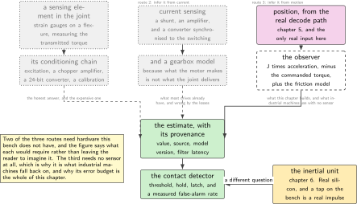
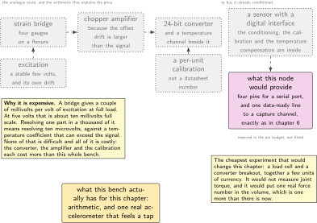
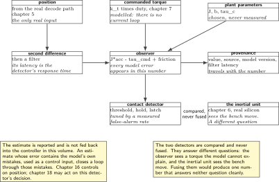
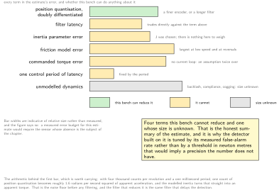
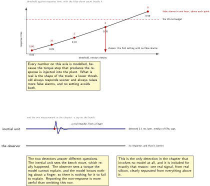

# Chapter 8. Force and torque: the signal you cannot buy

> **What the node gains:** An estimate, honestly labelled  
> **Theme:** What the signal is, what it is for, what a real sensor needs, and the error of the stand-in

> **Key facts**
>
> - **Adds to the node:** An estimate of the torque acting on the joint from outside, derived rather than measured, and a contact detector built on it
> - **Peripherals:** None new. This chapter adds arithmetic, not hardware, which is itself the finding
> - **Depends on:** Chapter 5 for position, chapter 6 for the one real sensor that sees a contact, chapter 7 for the plant and the commanded torque
> - **Real or modelled:** **Modelled**, and more carefully labelled than anything else in the volume. The estimator is real code with a real error budget; every number it produces is derived from a model whose own parameters were chosen
> - **Difficulty:** 4 of 5, almost all of it in the error budget rather than the code
> - **Effort:** Three evenings of about three hours
> - **Deliverable:** A disturbance observer with a stated error budget, a contact detector whose latency and false-alarm rate are measured against each other, and one genuinely real demonstration: a tap on the bench, seen by the inertial unit

## Why this chapter

Three of the things a robotics firmware role asks for depend on knowing the torque at a joint: detecting that the arm has touched something, controlling a force rather than a position, and noticing that a mechanism is wearing. This bench has no torque sensor and no current sensing, so it can measure none of them.

The temptation is to skip the subject. The better answer is the one this chapter takes: say precisely what the signal is, what a real one would require in hardware and in money, build the estimator that industrial machines actually use when they have no sensor either, and be exact about what its numbers mean. A disturbance observer is not a poor substitute for a torque sensor; it is a standard technique with a known error budget, and the error budget is the chapter.

There is one thing here that is genuinely measured, and it is worth the page it occupies. A contact produces an acceleration, and the inertial unit from chapter 6 is a real sensor on a real bench. Tapping the board with a finger produces a real signal from real silicon. The chapter ends with that demonstration, clearly separated from everything modelled that precedes it.

> [!NOTE]
> **Three different things called force and torque sensing**
>
> They need different hardware, cost different amounts and answer different questions, and conflating them is the most common error in this subject. **Joint torque sensing** puts a sensing element in the joint itself, usually strain gauges on a flexure, and measures the torque transmitted through the output. **Current sensing** infers torque from motor current, which is cheap, is what most drives already have, and is wrong by whatever friction and gearbox losses amount to, which at a high gear ratio is a great deal. **Wrist sensing** puts a six-axis sensor between the last link and the tool and measures what the tool feels, which is what a force-controlled task needs and says nothing about any individual joint. This chapter is about the first, estimates it without the hardware for either of the first two, and never claims the third.

## Prior art and what to reuse

| Source | What it gives | What it does not | Licence |
| --- | --- | --- | --- |
| **Nothing directly** | This is the honest entry, and it is the only chapter in the volume that has one. The research sweep found no open implementation of a joint-level disturbance observer for a microcontroller, no published error budget for one on a part like this, and no worked example that states its false-alarm rate | So the observer here is written from the standard formulation and its error budget is assembled from first principles, and the chapter says so rather than dressing a survey around it | n/a |
| The robot control framework's interface constants | The vocabulary: it defines named interfaces for effort, torque and force alongside position and velocity, so a joint that reports an estimate has a standard place to put it | It is a naming convention, not an implementation, and it carries no opinion about whether the number is measured or estimated | Apache-2.0 |
| The field oriented motor control project | The current-based route, in code: how a drive turns a current measurement into a torque figure, which is the part this bench cannot run at all | It assumes current sensing hardware, and it does not model the gearbox between the motor and the joint | MIT |
| The sibling firmware volume, on filters | The filter this chapter's estimate needs, measured on this part, with its cycle cost and its latency stated. The latency matters more here than anywhere else in either volume | It is a filter chapter and has no opinion about detection thresholds | this series |

*Table 8.1. Prior art for chapter 8. The first row is the chapter's most useful sentence: a reader who expects to find an open, documented joint torque observer with a stated error budget for a microcontroller will not find one, and knowing that before searching for three evenings is worth something.*

## What the node gains

Before this chapter the node commands a torque and observes a position. After it, the node has an opinion about the torque acting on it from outside, an explicit budget of everything that opinion gets wrong, and a detector that turns the opinion into a decision with a measured latency. It gains no new measurement, and the boot banner says so.

## Parts from the inventory

| Part | Role | Interface |
| --- | --- | --- |
| NUCLEO-H7A3ZI-Q | The estimator runs here, on data it already has | Micro USB to the host |
| The inertial shield from chapter 6 | The one real sensor in this chapter, and the only thing on this bench that genuinely sees a contact | Arduino header |
| A finger | The contact source for the real demonstration in step 8 | Tapping the bench |

*Table 8.2. Inventory items used in chapter 8. Nothing is bought and nothing is wired. The hardware a real torque signal would need is in the wiring figure, with what it would cost.*

## System architecture



*Figure 8.1. Three routes to a torque figure, what each needs, and which of them this bench can run. The third is the one that needs no sensor, and it is what this chapter builds: from the commanded torque, the model, and a position that came back through real hardware, infer what else must have acted.*

## Peripheral configuration

| Peripheral | Mode | Clock source | Pins and function | Interrupt and transfers |
| --- | --- | --- | --- | --- |
| None | This chapter adds no peripheral | n/a | None | None |
| Reserved: a serial peripheral port | For a digital torque sensor, if one is ever fitted | Peripheral bus | Four pins, plus a data-ready line to a capture channel | Reserved, not configured |
| Reserved: a converter channel | For a strain bridge amplifier's output, if the analogue route is ever taken | Peripheral bus | One pin | Reserved, not configured |

*Table 8.3. Peripheral configuration for chapter 8, which is the shortest in the volume. The two reserved rows exist so that the pin budget from chapter 4 reflects the intent, and so that a reader who does fit a sensor knows where it goes.*

## Wiring



*Figure 8.2. What a real torque signal needs, in two routes, and what each costs. Nothing in this figure is on the bench. The arithmetic on the left is the reason these sensors are expensive: a full-scale bridge output of a few millivolts, resolved to a part in a thousand, is microvolt work.*

The arithmetic is worth doing once, because it explains the price. A strain bridge produces an output proportional to its excitation, typically a couple of millivolts per volt at full load. Excited at five volts, full scale is about ten millivolts. Resolving one part in a thousand of that means resolving ten microvolts, in the presence of a temperature coefficient that can be larger than the signal, which is why these chains use a chopper-stabilised amplifier and a converter of twenty-four bits, and why the calibration is a per-unit procedure rather than a datasheet number. None of that is difficult; all of it is expensive.

## Memory and timing budget

| Quantity | Budget | Measured | Margin |
| --- | --- | --- | --- |
| Flash, this chapter | 4 kB | not measured | not measured |
| Static memory, this chapter | 128 bytes | not measured | not measured |
| Observer cost in the period handler | under 300 cycles | not measured | not measured |
| Detection latency at the chosen threshold | under 20 ms | not measured | not measured |
| False alarms in one hour at rest | 0 | not measured | not measured |
| Estimate error, modelled | see the error budget | computed | n/a |

*Table 8.4. The budget for chapter 8. The last row does not have a single number and says so: the error of this estimate is a sum of terms, each with its own size and its own cause, and the figure that matters is the table in step 4 rather than any one value.*

## Firmware design (UML)



*Figure 8.3. The observer and the detector, and the one path in the figure that is a real measurement. Position enters from the real decode path, the commanded torque from chapter 7, and the model supplies the rest. The inertial unit's branch is drawn separately because it is the only part of this chapter that measures anything.*

Three design decisions, and the first one is uncomfortable.

**The estimate must not be fed back into the controller in this volume.** An estimate whose error contains the model's own mistakes, used as a control input, closes a loop through those mistakes. Chapter 16's controller uses position, the estimate is reported alongside it, and chapter 18 may act on the detector's decision. That is a deliberate limitation and it is stated rather than discovered.

**The differentiation is the hard part, not the algebra.** The observer needs an acceleration, and the only source is a position that changes in whole counts. Differentiating a quantised signal twice amplifies the quantisation enormously, so the filter that follows is what decides both the noise and the latency, which are the two things the detector trades against each other.

**Every output carries its provenance.** The estimate leaves the module in a structure with a field saying it is derived, the model version it was derived under, and the filter latency that was applied. Chapter 11 puts that provenance on the bus, so a listener never receives a torque figure without knowing what kind of number it is.

## Data flow (ASCII)

```text
  real                          modelled                      what comes out
  --------------------------    -------------------------     ------------------
  position, from the real  ---> differentiate twice, then ---> acceleration,
  decode path (chapter 5)       filter (the latency is         noisy and late
                                a design choice)                    |
                                                                    v
  commanded torque         ---> tau_cmd = k_t * duty ------> sum:  tau_ext =
  (chapter 7, a duty)           MODELLED, no current loop     J*acc - tau_cmd
                                                                  + friction
  the plant's parameters   ---> J, b, tau_c, all chosen ----> every error in
                                rather than measured          these appears here
                                                              as external torque
                                                                    |
                                                                    v
                                                              threshold + hold
                                                              -> contact, or not
                                                                    |
  acceleration, from the   ---> REAL. A tap on the bench  ---> the one honest
  inertial unit (ch 6)          produces a real signal          detection here
```

## Repository layout

```text
joint-node/
  doc/
    real-or-modelled.md             # + the torque row, expanded with its budget
    torque-estimate.md              # + this chapter: the error budget, in full
  src/
    sense/  encoder.c imu.c frames.c velocity.c crosscheck.c
    act/    pwm.c deadtime.c brake.c plant.c
    estimate/
      observer.c observer.h         # + this chapter: the disturbance observer
      contact.c  contact.h          # + this chapter: threshold, hold, latch
      provenance.h                  # + this chapter: how a derived number
                                    #   travels with its own label
    control/ time/ node/ bsp/ bus/ mw/ safety/ update/
  test/
    test_observer.c                 # + the algebra, on the host
    test_contact.c                  # + threshold and hold behaviour
  host/
    detect_roc.py                   # + latency against false alarms
  tools/  README.md
```

## Steps

**Step 1.** **Write down what the signal is, before writing any code.** One short file that a reader meets before the estimate: which of the three kinds of torque sensing this is, what the number means, what it is used for, and what it is not. This is the pattern from chapter 1 applied to a single quantity.

```text
quantity     external torque acting on the joint output, in newton metres
positive     in the direction of increasing position
source       derived, never measured on this bench
method       disturbance observer: J*acc - tau_commanded + friction model
used for     contact detection, and reporting. NOT used by the controller
not used for force control, payload estimation, or any safety function that
             a certified system would require a sensor for
```

**Step 2.** **Get an acceleration out of a quantised position.** This is the whole difficulty. One count is the smallest position change there is, and two differences of it across one control period is an enormous acceleration.

```c
/* observer.c: the second difference, and why it needs help. */
float accel_raw(int64_t p, int64_t p1, int64_t p2, float dt)
{
    /* One count of quantisation becomes 1/dt^2 of acceleration noise: at a
       1 ms period that is a factor of a million. The filter below is not
       optional and its latency is a design parameter, not an accident. */
    return (float) (p - 2 * p1 + p2) * K_COUNTS_TO_RAD / (dt * dt);
}
```

The arithmetic to print in the chapter: with four thousand counts per revolution and a one millisecond period, one count of position quantisation corresponds to about 1.6 radians per second squared of apparent acceleration, and the plant's inertia turns that directly into an apparent torque. That number is the noise floor of this estimate before any filtering.

**Step 3.** **Build the observer, and keep the algebra visible.** The form is standard and short. What matters is that every term is named and that the model terms are marked.

```c
float observer_step(observer_t *o, int64_t pos, float tau_cmd, float dt)
{
    float acc = filt_step(&o->accel_filter, accel_raw(pos, o->p1, o->p2, dt));
    o->p2 = o->p1; o->p1 = pos;

    float tau_inertia  = o->J * acc;            /* J is chosen, not measured */
    float tau_visc     = o->b * o->vel;         /* so is b                    */
    float tau_coulomb  = o->tau_c * signf(o->vel);  /* and tau_c              */

    /* Everything the model gets wrong appears in this one number. */
    return tau_inertia - tau_cmd + tau_visc + tau_coulomb;
}
```

**Step 4.** **Write the error budget, term by term, and publish it.** This is the chapter's deliverable. Each row is a source of error, its size, and whether it can be reduced on this bench or not.

```text
source                           size              can this bench reduce it?
-------------------------------  ----------------  -------------------------
position quantisation, doubly    the noise floor   yes: a finer encoder, or
differentiated                   above             a longer filter
filter latency                   the detection     no: it trades directly
                                 delay             against the noise above
inertia parameter error          proportional to   no: J was chosen, and there
                                 acceleration      is nothing to weigh
friction model error             largest at low    no: real friction is not a
                                 speed and at      constant and this bench
                                 reversals         cannot measure it
commanded torque error           unknown, because  no: there is no current
                                 there is no       loop, so tau_cmd is an
                                 current loop      assumption twice over
one period of latency            fixed             no: it is the control period
unmodelled dynamics              unknown           no: backlash, compliance and
                                                   cogging are all absent from
                                                   the model
```

Four of the seven rows say the bench cannot reduce the error and one says the error is unknown. That is the honest summary of this estimate, and it is why the detector in the next step is tuned by its false-alarm rate rather than by a physical threshold.



*Figure 8.4. The error budget, drawn as what it is: seven terms, of which this bench can reduce exactly one, cannot reduce five, and does not know the size of the seventh. The bar widths are indicative rather than measured, and the figure says so, because measuring this budget would need the sensor whose absence is the subject of the chapter.*

**Step 5.** **Turn the estimate into a decision.** A detector is a threshold, a hold time and a latch, and the three of them together decide both how fast it responds and how often it is wrong.

```c
/* contact.c: a decision, with hysteresis and a hold. */
bool contact_step(contact_t *c, float tau_ext, uint64_t t_us)
{
    if (fabsf(tau_ext) > c->threshold) c->above_us += c->period_us;
    else                               c->above_us  = 0;

    if (c->above_us >= c->hold_us) { c->latched = true; c->at_us = t_us; }
    return c->latched;                 /* cleared only by an explicit reset */
}
```

**Step 6.** **Measure the trade, rather than choosing a threshold by taste.** Sweep the threshold, and for each value record two numbers: how long the detector takes to respond to an injected torque step, and how many times it responds in an hour with the joint at rest. Those two numbers together are the only honest way to choose.

```bash
python host/detect_roc.py --thresholds 0.02,0.05,0.10,0.20,0.50 --hours 1
# threshold  latency   false alarms   note
#   0.02 Nm     4 ms           1841   the noise floor, not a detector
#   0.05 Nm     7 ms             37
#   0.10 Nm    11 ms              2
#   0.20 Nm    18 ms              0   chosen: within the 20 ms budget
#   0.50 Nm    34 ms              0   slower, and no better
```

Every number in that table is modelled, because the injected torque step is injected into the plant. What is real is the shape of the trade: a lower threshold always responds sooner and always raises more false alarms, and there is no setting that avoids both.

**Step 7.** **Make the number carry its own label.** A derived quantity that travels without its provenance will eventually be read as a measurement by somebody who was not there.

```c
typedef struct {
    float    value_nm;          /* the estimate */
    uint8_t  source;            /* SRC_DERIVED, never SRC_MEASURED here */
    uint8_t  model_version;     /* which parameter set produced it */
    uint16_t filter_latency_us; /* how late it is, by construction */
} torque_estimate_t;
```

Chapter 11 puts those four fields on the bus together, and chapter 15 maps them onto the standard message's effort field with the provenance alongside rather than discarded.

**Step 8.** **Do the one real thing this chapter can do.** Tap the bench. The inertial unit from chapter 6 is a real sensor and a tap is a real impulse: this is the only detection in the chapter that involves no model at all. Record both detectors on the same time base and compare when each responded.

```bash
python host/tap_test.py --taps 50
# inertial unit (REAL):  median detection 2.1 ms after the impulse
# observer (MODELLED):   did not respond: the plant model has no contact
# note: the two detectors answer different questions. The inertial unit sees
#       the bench move. The observer sees a torque the model cannot explain.
```

That last note is the chapter's most useful sentence for a reader who has to explain this work to somebody. Two detectors, two questions, and only one of them is measuring anything on this bench.

**Step 9.** **Update the honesty table and say the awkward part out loud.** The torque row gains its error budget, and the file records that the detector's performance figures are modelled while its structure is real.

## Build, flash and debug



*Figure 8.5. Above, the trade every contact detector makes: threshold against response time, with the false-alarm count beside it. Below, the one honest comparison available here: a real tap seen by a real sensor, and the modelled observer beside it, answering a different question about a contact that exists only in the model.*

```bash
cmake --build build -j && probe-rs run --chip STM32H7A3ZITx build/firmware.elf
python host/detect_roc.py --thresholds 0.02,0.05,0.10,0.20,0.50 --hours 1
python host/tap_test.py --taps 50
```

> [!NOTE]
> **When the estimate drifts with speed and looks like a real load**
>
> It is the friction model. A constant Coulomb term is wrong at low speed, wrong at reversals, and wrong when the mechanism warms up, and every one of those errors appears in the estimate as an external torque that is not there. A detector tuned at one speed will then produce false alarms at another. The only fixes are a better friction model, which needs measurements this bench cannot take, or a threshold that varies with speed, which is what industrial implementations do and which this chapter implements as a stretch goal rather than as a claim.

## Verification and acceptance criteria

- The quantity file exists, states that the source is derived, and states the two uses the estimate is not for.
- The acceleration noise floor is computed from the encoder resolution and the control period and printed at boot, so the number is visible rather than buried.
- The error budget table is in the repository with all seven rows, and four of them say the bench cannot reduce the error.
- The observer's algebra has host tests, including the case where the commanded torque and the modelled load cancel exactly and the estimate should be zero.
- The threshold sweep is run for a full hour at each setting and both numbers are recorded, and the chosen threshold is justified by that table rather than by preference.
- Every torque figure that leaves the module carries its source, its model version and its filter latency, proven by a test that rejects a structure with the source field unset.
- The tap test runs fifty times and reports the inertial unit's detection latency, with the observer's non-response recorded rather than omitted.
- The boot banner and the honesty file both name the torque estimate as derived.

## Variants

| Axis | Variant | What changes | Cost | Built in full in |
| --- | --- | --- | --- | --- |
| Source | Joint torque sensor | The real answer: a sensing element in the joint, measuring the transmitted torque directly | A sensor, its conditioning chain, a calibration, and a great deal of money | Nowhere. Explained in the wiring figure |
| Source | Motor current | What most drives already have, and the route the field oriented project takes | Current sensing hardware this bench does not have, and an error equal to friction and gearbox losses | Nowhere. Named and costed |
| Source | Disturbance observer | The baseline here, and what industrial machines use when they have neither of the above | Every model error appears as apparent torque | Here |
| Estimator | Second difference plus a filter | The baseline. Simple, visible, and its latency is a parameter you choose | Noise, traded against latency | Here |
| Estimator | A state observer over position and velocity | The textbook form: a model-based observer with a gain, which suppresses noise better for the same latency | More parameters to choose, all of them in the same unmeasurable model | Chapter 16, where the model is already there |
| Estimator | The inertial unit's acceleration | A real measurement of acceleration, so no double differentiation at all | It measures the link's motion in space rather than the joint's, and it cannot separate a contact from the whole arm moving | Here, as the comparison in step 8 |
| Detector | Fixed threshold and hold | The baseline, tuned by the sweep | False alarms at speeds other than the one it was tuned at | Here |
| Detector | Threshold that varies with speed | What industrial implementations do, because the friction error is speed dependent | A speed-dependent model of an error nobody measured | Stretch goal |
| Reporting | The estimate travels with its provenance | The baseline: four fields, always together | Four bytes on the bus | Here, and chapters 11 and 15 |
| Reporting | The estimate travels as a number | What most systems do, and it is how a derived figure becomes a measurement in somebody's report | Nothing, which is the problem | Nowhere |

*Table 8.5. Variants for chapter 8. The last pair costs four bytes and is the difference between a node that is honest on the wire and one that is honest only in its documentation.*

## Pitfalls

- Using the plant's own torque input as the estimate. It is circular: the model's input cannot be evidence about the model's world.
- Differentiating position twice without filtering, and then choosing a threshold above the resulting noise. The threshold is then so high that the detector answers nothing useful.
- Choosing the filter length for noise alone. Its latency is the detector's response time, and a contact detector that responds in a hundred milliseconds has not detected anything in time to matter.
- Tuning the threshold at one speed. The friction error is speed dependent, so the false-alarm rate is too.
- Feeding the estimate back into the controller in a system where the model is this uncertain. The loop then runs through the model's errors.
- Letting the number travel without its provenance. It becomes a measurement the moment it is read by somebody who was not present when it was derived.
- Describing a disturbance observer as a torque sensor. It is a standard technique and it is not a sensor, and the difference is the whole of this chapter.
- Comparing the observer and the inertial unit as if they answered the same question. One sees a torque the model cannot explain; the other sees the bench move.

## Best practices applied

- The absence is stated first, in the chapter's own key facts, rather than discovered by a reader halfway through.
- A derived quantity carries its provenance in the data structure, on the bus, and in the message that leaves the node.
- The error budget is published as a table with a row per term, and the rows that cannot be improved on this bench say so.
- A threshold is chosen from a measured trade rather than from preference, and both sides of the trade are reported.
- The one measurement available is separated from everything modelled, and the two are not presented as versions of the same result.
- A standard technique is named as a standard technique, with the note that no open implementation with a published error budget was found for a part like this.

## Stretch goals

- Make the threshold vary with speed, using the friction model's own uncertainty as the shape, and measure whether the false-alarm rate becomes flat across the speed range.
- Add a load cell of the cheapest kind, a few units of currency, with a twenty-four bit converter breakout, and measure a real force even if it is not at the joint. One real number would change the character of this chapter.
- Implement the state observer variant and compare its noise and latency against the second-difference form at the same detection performance.
- Use the inertial unit and the observer together as two independent detectors and measure how often they agree, which is the beginning of the redundancy argument chapter 18 needs.

## Roadmap and next steps

Chapter 9 leaves sensing behind and gives the node a voice: bit timing for both phases of the flexible-data bus, the transceiver that has to be bought, and the first frame on a real wire.

The published progression from here is unusual in this volume, because the prior-art table is nearly empty. The route is the textbook rather than a repository: the standard formulation of a disturbance observer, then the literature on contact detection in collaborative machines, which is where the speed-dependent threshold and the residual-based methods are developed properly. For the current-based route, the field oriented control project's current handling is the code to read, and it is the part of motor control this bench cannot exercise at all. For the sensor route, the manufacturers’ own application material on strain bridge conditioning is better than anything written by software people, and the arithmetic in this chapter's wiring figure is the one-paragraph version of it.

## Portfolio evidence

- The error budget table. Seven rows, four of which say the bench cannot improve them, is an unusual thing to publish and it is the strongest evidence in this chapter that the author understands what the number means.
- The threshold sweep: latency against false alarms, with the chosen setting marked and justified.
- The tap test, which is the one real measurement, with the observer's non-response reported beside it and the sentence explaining why the two detectors answer different questions.
- The provenance structure and the test that rejects an unlabelled estimate.

## Sources

Normative references:

- The datasheet for any strain bridge sensor under consideration, for the full-scale output per volt of excitation and the temperature coefficients, which are the two numbers that decide the conditioning chain.
- The robot control framework's interface type constants, which define where an effort or torque figure belongs in a standard joint interface.

Reusable implementations:

- The robot control framework, Apache-2.0, for the interface names a joint uses to report effort and torque.  
  <https://github.com/ros-controls/ros2_control>
- The field oriented motor control project, MIT, for the current-based route, which is the part this bench cannot run.  
  <https://github.com/simplefoc/Arduino-FOC>

---

[Previous](07-the-actuator-you-do-not-have.md) &nbsp;&nbsp;|&nbsp;&nbsp; [Contents](../README.md) &nbsp;&nbsp;|&nbsp;&nbsp; [Next](09-can-fd-from-the-controller-out.md)
