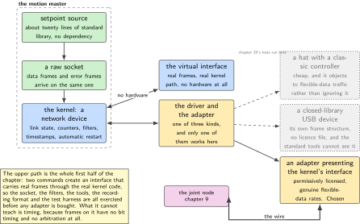
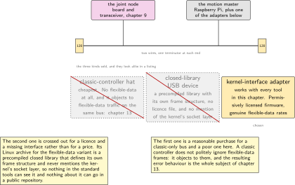
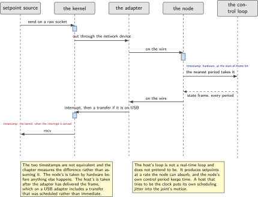
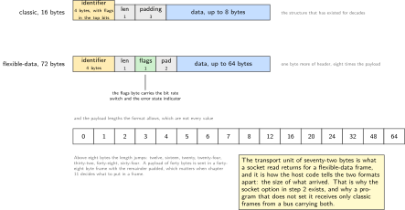
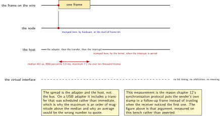

# Chapter 10. The motion master: the bus on Linux

> **What the node gains:** A listener and a commander  
> **Theme:** Socket layer on the host, the command line tools, a Python setpoint source

> **Key facts**
>
> - **Adds to the node:** Somebody to talk to. The bus gains a second participant, and this volume gains a host side that can listen, command, record and replay
> - **Peripherals:** None on the node. On the host: one network interface, which is what a bus interface is on this operating system
> - **Depends on:** Chapter 9 for the frame and the bit timing, chapter 3 for the node's own timestamps
> - **Real or modelled:** **Real**, and one part of it is real without any hardware at all: the virtual interface carries real frames through the real kernel path
> - **Difficulty:** 3 of 5
> - **Effort:** Two evenings, one of them before any adapter arrives
> - **Deliverable:** A host that brings the link up with both bit rates, a setpoint source in twenty lines of standard library, a recording that can be replayed onto a virtual interface, and a written adapter decision with its evidence

## Why this chapter

A bus with one node on it is a node talking to itself, which chapter 9 ended by doing deliberately. This chapter builds the second participant: a Raspberry Pi running mainline Linux, where a bus interface is not a serial port but a network interface, brought up with the same tool that brings up Ethernet and read through a socket.

That framing is the whole chapter. Once the interface is a network device, the operating system supplies things that would otherwise be written by hand: the link state, the error counters, the automatic restart after the controller takes itself off the bus, filtering in the kernel, timestamps, and a set of command line tools that have existed for twenty years. None of it has to be invented, and most of it can be exercised before any adapter is bought, because the kernel provides a virtual interface that carries real frames through the real code path.

The one decision in this chapter that is easy to get wrong, and expensive to get wrong late, is which adapter to buy. Three kinds are sold, they look similar in a listing, and only one of them works with everything above.

> [!NOTE]
> **The adapter decision and why it comes before the shopping**
>
> **A hat with a classic controller** is cheap and cannot do the flexible-data format at all. Worse for this volume, a classic controller does not merely ignore flexible-data traffic: it objects to it, and chapter 13 is about exactly that. **An inexpensive USB analyser** may ship, for its flexible-data variant, a Linux archive that is a precompiled closed library with a frame structure of its own and no licence file at all, which never mentions the kernel's socket layer. Nothing in the standard tools will see it, and it cannot go in a public repository. **An adapter that presents the kernel's own interface** works with every tool in this chapter, and the one this volume uses is permissively licensed and does genuine flexible-data rates. Buy the third.

## Prior art and what to reuse

| Source | What it gives | What it does not | Licence |
| --- | --- | --- | --- |
| The kernel's own socket layer documentation | The whole host side in one free document: the virtual interface that carries frames with no controller hardware, error frames delivered through the ordinary filter mechanism, the five controller states named, the counters exposed, the flexible-data frame structure and its transport unit of seventy-two bytes, separate arbitration and data rates, and the automatic restart knob quoted verbatim in step 6 | Nothing about which adapter to buy, which is the one decision it cannot make for you | GPL-2.0 documentation, quoted briefly |
| The command line tools | Twenty years of tooling: dump, send, generate, replay and load measurement, with flexible-data support and interface remapping. This chapter uses four of them and chapter 20 uses two more | **Per-file licensing.** The top level reports none and the licences directory holds the kernel's dual arrangement. Invoking the binaries is unaffected; check the per-file marker before copying any source | dual, per file |
| An adapter with permissively licensed firmware | An adapter that presents both the kernel interface and a serial port, at genuine flexible-data rates, from a robotics vendor | It has to be bought | Apache-2.0 |
| The Python bus library | A mature library with flexible-data support and the virtual interface documented | **Weak copyleft.** Fine as a host-side dependency installed from a package index, and this chapter shows the twenty-line standard library alternative so that the repository does not need it at all | LGPL-3.0 |
| The database library | Encoding and decoding driven by a description file, which is how chapter 11's protocol becomes readable rather than a column of hexadecimal | Not needed until there is a protocol to describe | MIT |

*Table 10.1. Prior art for chapter 10. The second row is the licence subtlety worth knowing: a tool whose top-level licence reports as nothing is not unlicensed, it is per-file, and the distinction matters only if you copy source rather than invoke binaries.*

## What the node gains

Before this chapter the node has a voice and no audience. After it there is a second machine on the bus that can listen, command, record and replay, and a written record of why its adapter was chosen. The node itself gains nothing new in firmware, which is why this is the shortest step in the bus sequence.

## Parts from the inventory

| Part | Role | Interface |
| --- | --- | --- |
| Raspberry Pi 4 | The motion master. It has run mainline Linux since chapter 1 and has never had a vendor development environment | Network, and USB for the adapter |
| **To be bought:** a bus adapter that presents the kernel's interface | The host's connection to the bus. See the note above | USB to the Pi, bus pair to the wire |
| The node from chapter 9 | The other participant | Its transceiver, and the bus pair |
| Nothing at all, for the first half of the chapter | The virtual interface carries real frames through the real kernel path | None |

*Table 10.2. Inventory items used in chapter 10. The last row is the point of the chapter's ordering: the socket code, the tools, the recording and the replay can all be built and tested before an adapter exists.*

## System architecture



*Figure 10.1. The host stack, and the two paths through it. With an adapter fitted, frames reach the wire; with the virtual interface, the same application code runs against the same kernel path and the frames go nowhere, which is exactly what chapter 20's tests need. The three adapter kinds are drawn with what each one costs.*

## Peripheral configuration

| Interface | Mode | Rates | Pins and function | Notes |
| --- | --- | --- | --- | --- |
| The virtual interface | Loopback within the kernel | None: frames have no timing at all | None | Created with two commands, needs no hardware |
| The real interface | Flexible-data enabled | 500 kbit/s arbitration, 2 Mbit/s data, matching chapter 9 | Through the adapter | Automatic restart after bus-off, set explicitly |
| The socket | Raw, with the error filter enabled | n/a | n/a | Error frames arrive on the same socket as data frames |

*Table 10.3. Interface configuration for chapter 10. The third row is the one that surprises people arriving from a serial-port background: controller state changes are delivered as frames, on the same socket, and are read by the same loop.*

## Wiring



*Figure 10.2. The bus with both participants, and the three adapter kinds drawn with what each one costs. The recommendation is the third, and the reason the second is crossed out is a licence and a missing kernel interface rather than a price.*

## Memory and timing budget

| Quantity | Budget | Measured | Margin |
| --- | --- | --- | --- |
| Host code, the setpoint source | under 60 lines | not measured | not measured |
| Dependencies beyond the standard library | 0 | by construction | n/a |
| Setpoint jitter, host side | under 2 ms | not measured | not measured |
| Round trip, host to node to host | under 3 ms | not measured | not measured |
| Host timestamp quality | stated, not budgeted | see step 7 | n/a |

*Table 10.4. The budget for chapter 10. The second row is a deliberate choice: the host side of this volume runs on the standard library alone, so that the repository can be cloned and run without installing a weak-copyleft dependency, and the library that would have been used is named instead.*

## Firmware design (UML)



*Figure 10.3. One setpoint, from the host's loop to the node and back, with the two timestamps marked. The node's timestamp is taken by hardware at the start-of-frame bit. The host's is taken by the kernel when the adapter's interrupt is served, which is later and more variable, and the chapter says so rather than treating the two as equivalent.*

Two decisions shape the host side.

**The host's loop is not a real-time loop and does not pretend to be.** It produces setpoints at a rate the node can absorb, and the node's own control period is what keeps time. A host that tries to be the clock puts scheduling jitter into the joint's motion, and the whole point of chapter 2 was that the node keeps its own time.

**The host side uses the standard library.** A raw socket on this operating system is about twenty lines of Python, so the repository has no dependency to install, no licence to explain and nothing to vendor. The mature library is named in the prior art table, and the reason it is not used is stated rather than implied.

## Data flow (ASCII)

```text
  host, a Raspberry Pi running mainline Linux
  +-------------------------------------------------------------------+
  | setpoint source, ~20 lines of standard library                     |
  |   socket(AF_CAN, SOCK_RAW, CAN_RAW), bind to "can0" or "vcan0"     |
  |        |                                                          |
  |        v                                                          |
  | kernel: the interface is a network device                         |
  |   ip link set can0 up type can bitrate 500000 dbitrate 2000000    |
  |        |          fd on, sample points set, restart-ms set        |
  |        |                                                          |
  |        +--> error frames arrive on the SAME socket as data        |
  |        |                                                          |
  |        v                                                          |
  | the adapter  ---------------------------------------------------- |
  +-------------------------------------------------------------------+
           |                                    ^
           | the wire                           | and back
           v                                    |
  +-------------------------------------------------------------------+
  | the node: timestamp captured at the start-of-frame bit, in hardware|
  +-------------------------------------------------------------------+

  and with no hardware at all:
      ip link add dev vcan0 type vcan ; ip link set up vcan0
      the same application code, the same kernel path, no wire
```

## Repository layout

```text
joint-node/
  host/
    setpoints.py                    # + this chapter: ~20 lines, no dependencies
    listen.py                       # + this chapter: dump with decoding
    link_up.sh                      # + this chapter: both rates, one place
    adapter-decision.md             # + this chapter: three kinds, and why
    recordings/
      idle.log  step.log            # + this chapter: for replay and for ch 20
  src/
    bus/ fdcan.c bittiming.c msgram.c loopback.c
    sense/ act/ estimate/ control/ time/ node/ bsp/
    mw/  safety/  update/
  test/
    test_host_roundtrip.py          # + this chapter: runs on the virtual
                                    #   interface, so it needs no hardware
  tools/  doc/  README.md
```

## Steps

**Step 1.** **Do the whole first half with no hardware.** The kernel provides a virtual interface that, in its own documentation's words, offers a virtual local interface and allows transmission and reception without real controller hardware. Two commands, and every tool and every line of host code in this chapter works.

```bash
sudo modprobe vcan
sudo ip link add dev vcan0 type vcan
sudo ip link set up vcan0
candump vcan0 &
cansend vcan0 123##1.11.22.33.44.55.66.77.88
```

Two honest notes. Frames on the virtual interface have no bit timing, no arbitration and no errors, so nothing about timing or bus behaviour can be learned here. What can be learned is everything above that: the socket, the filters, the frame structure, the tools, the recording format and the test harness. Chapter 20's tests run here precisely because there is no hardware in a continuous integration runner.

**Step 2.** **Write the setpoint source, in the standard library.** A raw socket is a socket. This is the whole of the host's command path.

```python
import socket, struct, time, math

CANFD_BRS = 0x01                      # bit rate switch, in the flags byte
FMT = "<IBB2x64s"                     # id, len, flags, pad, data

s = socket.socket(socket.PF_CAN, socket.SOCK_RAW, socket.CAN_RAW)
s.setsockopt(socket.SOL_CAN_RAW, socket.CAN_RAW_FD_FRAMES, 1)
s.bind(("vcan0",))                    # or "can0" once an adapter exists

t0 = time.monotonic()
while True:                           # 100 Hz: the node keeps its own time
    t = time.monotonic() - t0
    target = 0.5 * math.sin(2 * math.pi * 0.2 * t)     # radians
    payload = struct.pack("<f", target).ljust(8, b"\\0")
    s.send(struct.pack(FMT, 0x200, 8, CANFD_BRS, payload))
    time.sleep(0.01)
```

That is the dependency decision from the budget table, made concrete: no installation, no licence to explain, nothing to vendor. The mature library would be better for anything complicated, and chapter 20 says when it becomes worth the dependency.

**Step 3.** **Listen, and understand what arrives.** The dump tool shows data frames and error frames together once the error filter is enabled, which is the behaviour that makes chapter 12 straightforward.

```bash
candump -ta -x -e vcan0,0:0,#FFFFFFFF
# the last filter term enables error frames; they arrive on the same socket
```



*Figure 10.4. The two structures a socket read returns, and the payload lengths the flexible-data format allows. Above eight bytes the length jumps in steps, so a forty-byte payload travels in a forty-eight byte frame with the remainder padded. Chapter 11 designs its frame layout against that set rather than against the numbers it would have preferred.*

**Step 4.** **Bring up a real interface, with both rates.** One command, and it carries every number chapter 9 computed. Put it in a file rather than in somebody's shell history.

```bash
sudo ip link set can0 up type can \
     bitrate 500000 sample-point 0.8 \
     dbitrate 2000000 dsample-point 0.75 fd on \
     restart-ms 100
ip -details -statistics link show can0
```

The second command is the one to learn. It prints the controller's state, the two bit timings the driver actually programmed, the error counters and the restart count, and reading it is faster than any amount of guessing.

**Step 5.** **Record and replay.** The replay tool can remap interfaces, which is the mechanism that turns a capture from a real bus into a test that runs on the virtual one.

```bash
candump -l can0                       # writes candump-<date>.log
canplayer -I candump-2026-09-21.log vcan0=can0
# reads frames recorded on can0 and plays them onto vcan0
```

That remapping is worth the sentence it takes. A recording from the real bench becomes a regression test that runs anywhere, including in a continuous integration runner with no hardware, which is chapter 20's whole approach.

**Step 6.** **Set the restart behaviour deliberately.** When a controller takes itself off the bus it stays off until something brings it back. The kernel documentation states the rule plainly: a non-zero value triggers an automatic restart after the specified delay in milliseconds following a bus-off condition.

```bash
ip -details link show can0 | grep -o 'restart-ms [0-9]*'
# restart-ms 100
```

Choosing it deliberately rather than leaving it at zero is the difference between a host that recovers from a cable being reseated and one that requires a person. Chapter 12 does the same thing on the node side and measures both.

**Step 7.** **Compare the two timestamps, and say which is better.** The node stamps a frame in hardware at its start-of-frame bit. The host stamps it in the kernel when the adapter's interrupt is served, which is later by the adapter's own latency, by the USB transfer if the adapter is on USB, and by whatever the kernel was doing. Measure the difference rather than assuming it.

```bash
python host/timestamp_compare.py --frames 10000
# node SOF stamp to host kernel stamp: median 412 us, p99 1.8 ms, max 7.1 ms
# and the spread is the adapter and the host, not the bus
```

This is why chapter 12's synchronisation protocol puts the master's own stamp in a follow-up frame rather than trusting the host's reception time: the number above is the reason, measured on this bench.

**Step 8.** **Write the adapter decision down.** One file, three options, and the evidence for each. This is a purchasing decision a reader will have to make, and the reasoning is more useful than the conclusion.

```text
option 1  a hat with a classic controller
          cheap. Cannot do the flexible-data format, and does not merely
          ignore it: see chapter 13. Fine for a classic-only bus.
option 2  an inexpensive USB analyser
          its Linux archive for the flexible-data variant is a precompiled
          closed library with its own frame structure and no licence file,
          and it never mentions the kernel's socket layer. The standard
          tools cannot see it. Not usable here, and not publishable.
option 3  an adapter presenting the kernel's own interface
          works with every tool in this chapter. The one used here has
          permissively licensed firmware and does genuine flexible-data
          rates. CHOSEN.
```

## Build, flash and debug



*Figure 10.5. Where each timestamp comes from, and why they are not equivalent. The node's is taken by hardware before anything else happens. The host's is taken by the kernel after the adapter has delivered the frame, which on a USB adapter includes a transfer that was scheduled rather than immediate. The virtual interface has no timing meaning at all, which is stated so that nobody reads a figure from it.*

```bash
sudo ip link set can0 up type can bitrate 500000 dbitrate 2000000 fd on
candump -ta -x -e can0
python host/setpoints.py
```

> [!NOTE]
> **When the interface will not come up**
>
> In order of likelihood: the flexible-data flag was omitted, so the second bit rate was rejected and the link stayed down; the adapter does not support the requested data rate and said so in the kernel log rather than on the terminal; the interface is already up and refuses to be reconfigured, which needs a down first; or the adapter presents a serial port rather than a network interface, in which case it is option two from step 8 and no amount of configuration will help. Read the kernel log before changing anything: the driver almost always says exactly what it rejected.

## Verification and acceptance criteria

- Every tool and every line of host code in this chapter runs against the virtual interface with no adapter present.
- The setpoint source runs with no installed dependency beyond the standard library, proven on a clean machine.
- Bringing up the real interface prints both programmed bit timings, and they match the values chapter 9 computed on the node.
- A recording made on the real bus replays onto the virtual interface and produces the same decoded output, which is the property chapter 20 depends on.
- Error frames arrive on the same socket as data frames, demonstrated by provoking one deliberately.
- The automatic restart is set explicitly, and reseating the cable recovers the link without a person intervening.
- The timestamp comparison is run over at least ten thousand frames and reports a median, a high percentile and a maximum, and the text says which side of the link each number describes.
- The adapter decision file exists with all three options and their evidence.

## Variants

| Axis | Variant | What changes | Cost | Built in full in |
| --- | --- | --- | --- | --- |
| Interface | The virtual one | No hardware, real kernel path, real frames | No timing meaning at all | Here, and chapter 20 |
| Interface | A real adapter | The wire, the timing and the errors | A purchase | Here |
| Adapter | Classic-only hat | Cheap and permanently classic | It objects to flexible-data traffic rather than ignoring it | Chapter 13 |
| Adapter | Closed-library USB device | Works with the vendor's own software | Invisible to every tool here, and not publishable | Nowhere. Named and explained |
| Adapter | Kernel-interface adapter | Everything in this chapter | A purchase | Here |
| Host code | Standard library sockets | No dependency, no licence question, about twenty lines | Nothing complicated is easy | Here |
| Host code | The mature Python library | Everything is easy, including things this chapter does not need | A weak-copyleft dependency, installed rather than vendored | Chapter 20, where it earns its place |
| Host code | The database library | Frames become named signals rather than hexadecimal | One more dependency, permissively licensed | Chapter 11 |
| Timing | Host as the clock | The obvious first design, and it puts the host's scheduling jitter into the joint | Motion quality | Nowhere. The reason is in the design notes |
| Timing | Node keeps its own time | The baseline, established in chapter 2 | The host must tolerate its own jitter | Here |

*Table 10.5. Variants for chapter 10. The two host-code rows are a small licence lesson: the dependency is avoided while it is easy to avoid, and adopted in chapter 20 where the work it saves is worth the explanation.*

## Pitfalls

- Treating a bus interface as a serial port. It is a network device, and half the facilities in this chapter follow from that.
- Reading timing figures from the virtual interface. It has no bit timing and no arbitration, so any number taken from it is a number about the host's scheduler.
- Leaving the automatic restart at zero and then wondering why a reseated cable needs a reboot.
- Omitting the flexible-data flag and concluding that the adapter cannot do it.
- Assuming the host's timestamp is comparable with the node's. It is later and more variable, and on a USB adapter it includes a scheduled transfer.
- Buying the inexpensive analyser because the listing says it supports Linux. For the flexible-data variant that may mean a closed library with its own frame structure, which the standard tools cannot see.
- Copying source out of the command line tools without checking the per-file licence marker. Invoking the binaries is unaffected; copying is not.
- Letting the host drive the control rate. The node keeps its own time, and chapter 2 exists because of it.

## Best practices applied

- The half of the chapter that needs no hardware comes first, and the tests that will run in continuous integration are written against that path from the start.
- A dependency is avoided while avoiding it is cheap, the alternative is named, and the point at which it becomes worth adopting is stated.
- A purchasing decision is written down with its evidence rather than carried in somebody's memory.
- Two timestamps from two different mechanisms are measured against each other rather than assumed equivalent, and the result is used to justify a protocol decision two chapters later.
- A recovery behaviour is configured deliberately and tested by provoking the fault, rather than left at its default.
- Quotations from a copyleft-licensed document are brief and attributed.

## Stretch goals

- Measure the round trip properly: a frame from the host, a reply from the node, timestamped on both sides, over a long run, and plot the distribution rather than quoting a mean.
- Compare two adapters on the same bus and the same traffic, and publish the difference in host-side timestamp quality. That comparison does not appear to be published anywhere for flexible-data adapters.
- Put the host side in a real-time scheduling class and measure how much of the timestamp spread is scheduling rather than the adapter.
- Write the recording format documentation for this volume's own captures, so that chapter 20's regression tests are readable by somebody who did not make them.

## Roadmap and next steps

Chapter 11 gives the two participants something to say: a frame layout for joint state and joint command, identifier allocation, and the question of what belongs in sixty-four bytes.

The published progression from here is the kernel documentation itself, which is short, free and better than most books on the subject, followed by the tools’ own manual pages, which document flags this chapter does not use. For the protocol layer above, the bus association's application layer profile is the vocabulary chapter 11 borrows from, and it is free after registration.

## Portfolio evidence

- The timestamp comparison, which is a real measurement of two mechanisms on two machines and is the evidence behind a protocol decision in chapter 12.
- The adapter decision file, which demonstrates a purchasing judgement made on licence and interface grounds rather than on price.
- A recording from the real bus replayed onto the virtual interface, with identical decoded output, which is the basis of every hardware-free test in chapter 20.
- The setpoint source, which is short enough to read in a minute and has no dependencies at all.

## Sources

Normative references:

- The kernel's socket layer documentation, for the virtual interface, the error frames, the controller states, the frame structures and the automatic restart. Quoted briefly and attributed.
- ISO 11898-1:2024, for the frame format the structures represent.
- The adapter's own documentation, for the rates it supports and for whether it presents a network interface at all.

Reusable implementations:

- The command line tools for this bus, dual licensed per file.  
  <https://github.com/linux-can/can-utils>
- An adapter with permissively licensed firmware that presents the kernel's interface, Apache-2.0.  
  <https://github.com/mjbots/fdcanusb>
- The Python bus library, LGPL-3.0, named here and adopted in chapter 20.  
  <https://github.com/hardbyte/python-can>
- The database library, MIT, used from chapter 11 onwards.  
  <https://github.com/cantools/cantools>

---

[Previous](09-can-fd-from-the-controller-out.md) &nbsp;&nbsp;|&nbsp;&nbsp; [Contents](../README.md) &nbsp;&nbsp;|&nbsp;&nbsp; [Next](11-a-joint-protocol.md)
