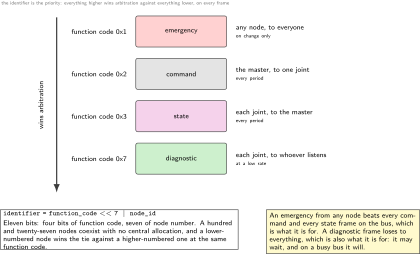
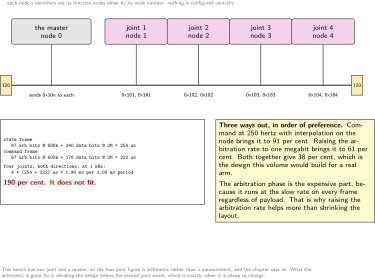
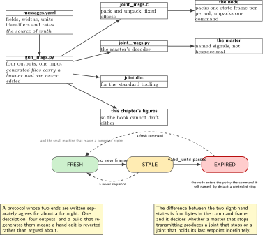
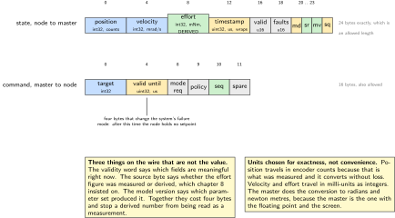
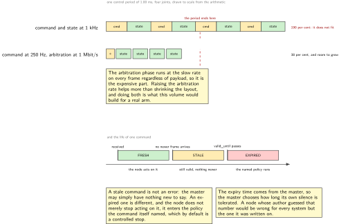

# Chapter 11. A joint protocol: state and command in sixty-four bytes

> **What the node gains:** A vocabulary  
> **Theme:** Frame layout, identifier allocation and priority, what belongs in a state frame

> **Key facts**
>
> - **Adds to the node:** A vocabulary: four message types, an identifier allocation that scales to a bus full of joints, and a layout generated from one description
> - **Peripherals:** None new. This chapter is design, arithmetic and generated code
> - **Depends on:** Chapter 9 for the frame, chapter 10 for the host that decodes it, chapters 5 to 8 for the quantities it carries
> - **Real or modelled:** **Real**, including the bus load arithmetic. The quantities inside the frames carry their own labels, which is why chapter 8 built the provenance structure
> - **Difficulty:** 3 of 5
> - **Effort:** Three evenings, one of them spent deciding what to leave out
> - **Deliverable:** A message description that generates both the node's pack and unpack code and the host's decoder, a bus load calculation for a full arm, and a command that expires rather than going stale

## Why this chapter

Two machines can now exchange frames and have nothing to say. This chapter decides what a joint node says, how often, in what order of priority, and in what layout, and the decisions are more constrained than they look.

The identifier is the priority. On this bus the lowest identifier wins arbitration, so allocating identifiers is allocating precedence, and it has to be done once for the whole system rather than per node. The payload is constrained too: the format allows only certain lengths above eight bytes, so a layout of forty bytes travels in a forty-eight byte frame with the remainder padded, and the arithmetic of what fits is worth doing before the layout is written rather than after.

The decision this chapter is proudest of is the smallest one. A command carries the time at which it stops being valid. A node that loses its master then stops on its own, rather than holding the last setpoint it heard until somebody notices. That is four bytes, it costs nothing, and it turns a silent failure into a defined one.

> [!NOTE]
> **Never put a structure on a wire**
>
> The temptation is to define a structure, copy it into the payload and copy it out at the other end. It works until the compiler on one side inserts padding the other does not, or the two sides disagree about byte order, or somebody adds a field in the middle. This chapter writes explicit pack and unpack functions against fixed byte offsets, generated from one description, with compile-time assertions on the total size. It is twenty more lines than the shortcut and it removes an entire class of defect that is very hard to find from a bus trace.

## Prior art and what to reuse

| Source | What it gives | What it does not | Licence |
| --- | --- | --- | --- |
| The bus association's application layer profile | The identifier allocation convention this chapter borrows: a function code in the high bits and a node number in the low seven, so a hundred and twenty-seven nodes coexist without a central database, with the priority ordering falling out of the arithmetic | It is a full application layer with much more in it than a joint node needs, and this chapter takes the addressing idea and not the rest | free after registration |
| The reference implementation of that profile | Working code for the object dictionary and the communication objects, which is where the identifier arithmetic can be checked against somebody else's | Adopting it wholesale would bring an application layer this volume does not need until chapter 12 | Apache-2.0 |
| The transport standard, 2016 edition | The machinery for payloads larger than one frame, and specifically its clauses on the transmit data length and how a receiver determines it. Chapter 19 needs all of it; this chapter needs to know it exists so the layout stays inside one frame | Paywalled, and larger than this chapter's problem | ISO copyright |
| The database library | A description format the host side already understands, so the master decodes named signals rather than hexadecimal | Its format is built around the classic eight-byte frame, so the larger layouts here need care | MIT |
| The sibling firmware volume | Framing, checksums and the hardware checksum unit, built and measured on this part. This chapter does not repeat them because the bus controller does that work in hardware | It is about a byte stream, and this is a frame bus | this series |

*Table 11.1. Prior art for chapter 11. The first row is the one to read: the identifier allocation problem was solved well thirty years ago, and reinventing it produces a system that cannot talk to anything else.*

## What the node gains

Before this chapter the node can send bytes. After it, it says something: a state frame every control period carrying position, velocity, an effort estimate with its provenance, a mode, a fault word, a sequence number and a timestamp; and it accepts a command that expires. The host decodes named signals rather than hexadecimal, and the whole layout comes from one description that generates both sides.

## Parts from the inventory

| Part | Role | Interface |
| --- | --- | --- |
| NUCLEO-H7A3ZI-Q | The node, packing and unpacking | The bus |
| Raspberry Pi 4 | The master, decoding named signals | The bus |
| Nothing else | This chapter adds no hardware at all | n/a |

*Table 11.2. Inventory items used in chapter 11. The bus load arithmetic in step 7 is for a bus with four joints on it, which this bench does not have, and the arithmetic is stated as arithmetic rather than as a measurement.*

## System architecture



*Figure 11.1. The four message types, who sends each one, how often, and where each sits in the priority order. The identifier is the priority on this bus, so this figure is also the arbitration order: everything above a line wins against everything below it, every time, on every frame.*

## Peripheral configuration

| Peripheral | Mode | Clock source | Pins and function | Interrupt and transfers |
| --- | --- | --- | --- | --- |
| Bus controller | Unchanged from chapter 9 | Unchanged | Unchanged | Filters configured here: this node accepts three identifiers and ignores the rest in hardware |
| Its filters | Two for commands, one for broadcast | n/a | None | A frame that does not match is never seen by software |

*Table 11.3. Peripheral configuration for chapter 11. Hardware filtering is the part people leave until later and should not: on a bus carrying four joints at 1 kHz, a node that accepts everything spends most of its processor discarding other joints’ state frames.*

## Wiring



*Figure 11.2. The same protocol on a bus with four joints, and the load arithmetic that decides whether it fits. Each node's identifiers are its function codes offset by its node number, so nothing has to be configured centrally and the priority order is the same on every bus.*

## Memory and timing budget

| Quantity | Budget | Measured | Margin |
| --- | --- | --- | --- |
| Flash, this chapter | 5 kB, mostly generated | not measured | not measured |
| State frame payload | 24 bytes | computed from the layout | n/a |
| Command frame payload | 16 bytes | computed | n/a |
| Pack and unpack cost | under 150 cycles each | not measured | not measured |
| Bus load, one joint at 1 kHz | computed in step 7 | computed | n/a |
| Bus load, four joints at 1 kHz | under 40 per cent | computed | n/a |

*Table 11.4. The budget for chapter 11. The two load rows are the ones that decide the design: if four joints at the full control rate do not fit comfortably, the state rate comes down or the layout gets smaller, and it is better to know that before writing the packer.*

## Firmware design (UML)



*Figure 11.3. One description, two generated sides, and the small state machine that makes a command expire. The description is the source of truth in exactly the sense chapter 4 established, and the same rule applies: the generated files are never edited.*

Three rules.

**One description, both sides.** The node's packer and the host's decoder are generated from the same file. A protocol whose two ends are written separately agrees for about a fortnight.

**Every field carries its validity.** A state frame has a flags word in which each quantity says whether it is currently meaningful. An effort estimate that is derived, as chapter 8 insisted, says so on the wire rather than in the documentation, and a position that has not yet seen its index says that too.

**A command has a deadline.** The command carries the node's own time at which it stops being valid. When that time passes the node holds no setpoint: it enters the mode the command's own expiry policy specifies, which by default is a controlled stop. Chapter 18 gives that behaviour its safety meaning; here it is just four bytes and a comparison.

## Data flow (ASCII)

```text
  one description                     generated                     used by
  ---------------------------------   -------------------------     ------------
  messages.yaml                  ---> joint_msgs.h / .c         ---> the node
    state:                              pack_state()                 packs once
      position  int32  counts           unpack_command()             per period
      velocity  int32  mrad/s
      effort    int32  mNm          ---> joint_msgs.py            ---> the host
      flags     uint16 validity           decode_state()               decodes
      mode      uint8                     encode_command()             named
      seq       uint8                                                  signals
      stamp     uint32 us
    command:                       ---> the database file        ---> any tool
      target    int32                     for the standard              that reads
      mode_req  uint8                     tooling                       that format
      valid_until uint32 us
                                   ---> this chapter's figures   ---> the book
                                         are generated from it         cannot drift

  identifier = function_code << 7 | node_id     priority falls out of this
```

## Repository layout

```text
joint-node/
  proto/
    messages.yaml                   # + this chapter: the source of truth
    joint.dbc                       # + generated: for the standard tooling
  src/
    bus/
      fdcan.c bittiming.c msgram.c loopback.c
      joint_msgs.h  joint_msgs.c    # + generated, never edited
      command.c     command.h       # + this chapter: validity and expiry
      filters.c     filters.h       # + this chapter: accept three, ignore rest
    sense/ act/ estimate/ control/ time/ node/ bsp/
    mw/  safety/  update/
  host/
    joint_msgs.py                   # + generated from the same description
    listen.py                       # now decodes named signals
  tools/
    gen_msgs.py                     # + this chapter: description to four outputs
  test/
    test_msgs.c                     # + round trip, on the host
    test_expiry.c                   # + the command state machine
  doc/  README.md
```

## Steps

**Step 1.** **Decide what a joint has to say, and what it must not.** Write the list before the layout. The test for inclusion is whether a master needs it every period; anything else belongs in a diagnostic frame at a low rate.

```text
every period, from the node:  position, velocity, effort estimate, mode,
                              fault word, validity flags, sequence, timestamp
every period, to the node:    target, mode request, and when it expires
on change only:               emergency: the node has entered a safe state
at a low rate:                diagnostics: counters, temperatures, versions,
                              the model version behind the effort estimate
never on the bus:             anything a master cannot act on, and anything
                              that belongs in a log
```

**Step 2.** **Allocate the identifiers, and get the priority right by construction.** The convention is a function code in the upper bits and a node number in the lower seven, which is the field bus profile's arrangement and means a hundred and twenty-seven nodes coexist with no central allocation. Lower identifier wins, so the function code ordering is the priority ordering.

```c
/* joint_msgs.h, generated. The ordering here IS the arbitration order. */
#define FC_EMERGENCY   0x1     /* a node has entered a safe state    */
#define FC_COMMAND     0x2     /* master to node, every period       */
#define FC_STATE       0x3     /* node to master, every period       */
#define FC_DIAGNOSTIC  0x7     /* low rate, and it may wait          */

#define MSG_ID(fc, node)  (((fc) << 7) | ((node) & 0x7F))
```

Two consequences worth stating. An emergency from any node beats every command and every state frame on the bus, which is what it is for. And a lower-numbered node wins against a higher-numbered one at the same function code, which means node numbering is a tie-break in the arbitration and should be allocated with that in mind.

**Step 3.** **Choose the identifier width, with the arithmetic.** The short identifier gives eleven bits, which is four function codes of a hundred and twenty-seven nodes with room left. The long one gives twenty-nine and costs about twenty extra bits in every frame. Those bits are in the arbitration phase, which runs at the slow rate, so they cost about four times what the same bits cost in the payload.

```text
short identifier   11 bits   enough for this system, and cheapest
long identifier    29 bits   about 20 extra bits per frame, all of them at
                             the arbitration rate rather than the data rate
at 500 kbit/s      20 bits is 40 microseconds per frame, on every frame
CHOSEN             short, and the reason is in this table
```

**Step 4.** **Write the layout against the lengths the format allows.** Above eight bytes the payload length jumps, so a layout is designed to land on one of the allowed values rather than to be as small as possible.

```c
/* The state frame: 24 bytes exactly, which is an allowed length. */
/*  0 */ int32_t  position_counts;    /* exact, and the encoder's own unit */
/*  4 */ int32_t  velocity_mrad_s;    /* milli-radians per second          */
/*  8 */ int32_t  effort_mnm;         /* milli-newton-metres, and DERIVED  */
/* 12 */ uint32_t stamp_us;           /* the node's own clock, chapter 3   */
/* 16 */ uint16_t valid_flags;        /* one bit per field above           */
/* 18 */ uint16_t fault_flags;        /* chapter 18 assigns the meanings   */
/* 20 */ uint8_t  mode;               /* chapter 12's node state           */
/* 21 */ uint8_t  effort_source;      /* DERIVED or MEASURED, chapter 8    */
/* 22 */ uint8_t  model_version;      /* which parameter set produced it   */
/* 23 */ uint8_t  seq;                /* wraps, and the master notices gaps */
_Static_assert(sizeof(state_wire_t) == 24, "state frame must stay 24 bytes");
```



*Figure 11.4. The two layouts, byte by byte. Both land on lengths the format allows, which is a design constraint rather than a coincidence. Four of the twenty-four bytes in the state frame are not values at all: they say which fields are meaningful, whether the effort figure was measured or derived, and which parameter set produced it.*

**Step 5.** **Pack explicitly, and never copy a structure onto the wire.** The generated packer writes fixed offsets in a fixed byte order. It is dull code, and it is the reason a frame recorded today will still decode in two years.

```c
/* joint_msgs.c, generated. Little-endian, fixed offsets, no structure copy. */
void pack_state(uint8_t *p, const state_t *s)
{
    put_i32(p +  0, s->position_counts);
    put_i32(p +  4, s->velocity_mrad_s);
    put_i32(p +  8, s->effort_mnm);
    put_u32(p + 12, (uint32_t) (s->stamp_us & 0xFFFFFFFFu));
    put_u16(p + 16, s->valid_flags);
    put_u16(p + 18, s->fault_flags);
    p[20] = s->mode;  p[21] = s->effort_source;
    p[22] = s->model_version;  p[23] = s->seq;
}
```

Note the timestamp: the node's clock is sixty-four bits and the frame carries the low thirty-two, which wrap about every seventy-one minutes. That is the same wrap chapter 3 met, and the master handles it the same way, which is why both sides are generated from one description.

**Step 6.** **Give the command an expiry, and a policy for it.** This is the small idea that changes the failure mode of the whole system.

```c
/* command.c: a command is valid until a time, not forever. */
cmd_state_t command_check(const command_t *c, uint64_t now_us)
{
    if (c->seq == g_last_seq)            return CMD_STALE;   /* nothing new  */
    if (now_us > c->valid_until_us)      return CMD_EXPIRED; /* too old      */
    if (now_us + CMD_MAX_HORIZON_US < c->valid_until_us)
                                         return CMD_REJECTED;/* too far out  */
    return CMD_FRESH;
}
```

An expired command is not an error to be logged and ignored. It moves the node into the policy the command itself named, which by default is a controlled stop. A master that stops transmitting therefore produces a joint that stops, and it does so in a time the master chose rather than a time the node's author guessed.

**Step 7.** **Do the bus load arithmetic before believing the design.** A frame is not just its payload: there is arbitration at the slow rate, a checksum, acknowledgement and the gap between frames. The arithmetic is approximate and it is the right kind of approximate.

```bash
python tools/busload.py --joints 4 --rate 1000 --nominal 500000 --data 2000000
# per joint per period: state 24 B, command 16 B
# state frame:   67 arbitration bits @ 500k + 240 data bits @ 2M -> 254 us
# command frame: 67 arbitration bits @ 500k + 176 data bits @ 2M -> 222 us
# four joints, both directions, 1000 Hz: 1.90 ms of every 1.00 ms  -> 190%
# DOES NOT FIT. Options, in order of preference:
#   state at 1 kHz, command at 250 Hz with interpolation on the node -> 91%
#   raise the arbitration rate to 1 Mbit/s                            -> 61%
#   both                                                              -> 38%
```

That result is the most useful thing in this chapter. The obvious design, every joint reporting and being commanded at the full control rate, does not fit on one bus at these rates, and finding that out in an afternoon with arithmetic is better than finding it out on a robot. The arbitration phase is the expensive part, which is why raising the arbitration rate helps more than shrinking the payload.

**Step 8.** **Filter in hardware, not in software.** The controller can accept only the identifiers this node cares about. On a four-joint bus that is the difference between waking for every frame and waking for three.

```c
filters_accept(MSG_ID(FC_COMMAND, MY_NODE_ID));   /* my command        */
filters_accept(MSG_ID(FC_COMMAND, 0));            /* broadcast command */
filters_accept(MSG_ID(FC_EMERGENCY, ANY_NODE));   /* anyone's emergency */
/* everything else is discarded by the controller and never seen. */
```

**Step 9.** **Generate the host side and the tooling description from the same file.** The master decodes named signals, and any standard tool can read the generated description without this volume's code.

```bash
python tools/gen_msgs.py proto/messages.yaml \
       --c src/bus --py host --dbc proto/joint.dbc
candump -ta can0 | python host/listen.py
# 12.481  joint 3  pos 4812 cnt  vel 118 mrad/s  eff 42 mNm (DERIVED, model 2)
#                  mode OPERATIONAL  faults none  seq 214  age 0.9 ms
```

## Build, flash and debug



*Figure 11.5. Above, what happens on the bus in one control period with four joints, drawn to scale from the arithmetic in step 7: the design that does not fit, and the one that does. Below, the life of a command: fresh, stale, expired, and what the node does at each transition.*

```bash
python tools/gen_msgs.py proto/messages.yaml --c src/bus --py host --dbc proto/joint.dbc
cmake --build build -j && probe-rs run --chip STM32H7A3ZITx build/firmware.elf
candump -ta can0 | python host/listen.py
```

> [!NOTE]
> **When the master decodes one field wrongly and the rest correctly**
>
> It is almost always an offset, and almost always because one side was edited by hand. The generated files carry a banner saying they are generated and the build regenerates them, so a hand edit is reverted rather than argued about. The second most likely cause is a field whose width changed on one side only, which the compile-time assertion on the total size catches on the node and the round trip test catches on the host. If the total size is right and one field is wrong, look for two fields that were swapped, because the assertion cannot see that and the round trip test can.

## Verification and acceptance criteria

- The node's packer and the host's decoder are both generated, and editing a generated file is reverted by the build.
- A round trip test packs a state structure, unpacks it and compares every field, including the boundary values of each type.
- The compile-time assertion on the frame size fails if a field is added or widened.
- The state frame's length is one the format allows, proven by a test that rejects any other total.
- The bus load calculation is in the repository and is run as part of the build, so a layout change that breaks the budget fails rather than surprising somebody later.
- A command whose validity has passed moves the node into the named policy within one control period, demonstrated by stopping the master.
- A command from the future beyond the horizon is rejected rather than accepted, which is the case that catches a master with a wrong clock.
- The node's filters accept exactly three identifiers, proven by sending a fourth and confirming the receive interrupt does not fire.
- The sequence number gap detection reports loss, demonstrated by dropping frames deliberately with the replay tool from chapter 10.

## Variants

| Axis | Variant | What changes | Cost | Built in full in |
| --- | --- | --- | --- | --- |
| Identifier | Short, 11 bits | The baseline: four function codes, 127 nodes | None here | Here |
| Identifier | Long, 29 bits | Room for a large addressing scheme | About twenty extra bits per frame, all at the arbitration rate | Here, as the arithmetic |
| Layout | Fixed offsets, generated | The baseline. Dull, explicit, and it still decodes in two years | A generator to maintain | Here |
| Layout | A structure copied onto the wire | Shortest code | Padding, byte order and silent breakage on a compiler change | Nowhere. The note says why |
| Layout | A self-describing encoding | Fields can be added without breaking anything | Bytes, and parsing in the period handler | Chapter 14, where the middleware brings its own |
| Units | Counts and milli-units | Exact, compact, and the encoder's own unit needs no conversion | The master converts, which it is better able to do | Here |
| Units | Floating point on the wire | No scaling decisions at all, and both ends have hardware for it | Four bytes per field and a loss of exactness in position | Here, as the comparison |
| Command | Valid until a time | The baseline, and it changes the system's failure mode | Four bytes | Here |
| Command | Valid until replaced | What most first designs do, and a lost master leaves the joint holding its last setpoint | A silent failure instead of a defined one | Nowhere |
| Filtering | In the controller | The baseline: a frame for another joint never reaches software | Filter configuration | Here |
| Filtering | In software | Simpler to write and it wakes the processor for every frame on the bus | Processor time, growing with the number of joints | Nowhere |

*Table 11.5. Variants for chapter 11. The two command rows are the pair that matters: the difference between them is four bytes, and it decides whether a master that stops produces a joint that stops or a joint that keeps going.*

## Pitfalls

- Copying a structure onto the wire. Padding and byte order differ, and the failure appears on somebody else's compiler.
- Allocating identifiers without noticing that the identifier is the priority. A diagnostic frame with a low number will delay a command on a busy bus.
- Designing a payload without checking the allowed lengths. Forty bytes travels in forty-eight, so the last eight are free and should be used or the layout reduced.
- Assuming the payload dominates the frame time. At these rates the arbitration phase, which runs at the slow rate, is a large part of every frame, which is why raising the arbitration rate helps more than shrinking the payload.
- Sending a derived quantity without its provenance. Chapter 8 built the structure; this chapter has to actually put it in the frame.
- Letting a command remain valid until replaced. A master that stops then leaves the joint holding its last setpoint indefinitely.
- Accepting a command whose validity is far in the future. That is a master with a wrong clock, and accepting it hands the joint to it.
- Filtering in software on a bus with several joints. The processor then spends its time discarding other people's state frames.

## Best practices applied

- One description generates both ends and the tooling file, so the two sides cannot drift apart and the figures in this chapter cannot either.
- The load arithmetic is done before the design is believed, and it changed the design.
- Every quantity on the wire carries its validity, and a derived quantity carries the fact that it is derived.
- A failure mode is designed rather than inherited: a command that expires turns a lost master into a defined stop.
- Filtering is done where it is free, in the controller, rather than where it is expensive.
- An established addressing convention is borrowed rather than reinvented, and the part of it that is not needed is left out explicitly.

## Stretch goals

- Add a second bus and split the traffic, which is what a real arm does, and redo the load arithmetic for the split.
- Generate the figures in this chapter from the description too, so that a layout change updates the book.
- Measure the actual frame times on the bus and compare them with the calculation in step 7. The arithmetic is approximate and the difference is worth knowing.
- Implement the interpolation on the node that makes a 250 hertz command rate acceptable, and measure the tracking difference against 1 kHz commands. That is chapter 16's experiment, set up here.

## Roadmap and next steps

Chapter 12 turns a pair of talkers into a network: heartbeat, node state, error counters, bus-off and recovery, and the synchronisation protocol designed in chapter 3.

The published progression from here is the bus association's application layer profile, read for its addressing and its object dictionary rather than adopted whole, followed by the reference implementation, which is the fastest way to see how those ideas look in C. For the larger payload problem, the transport standard's 2016 edition is the normative document and chapter 19 needs it.

## Portfolio evidence

- The bus load calculation, with the design that does not fit and the two ways out. An honest negative result from an afternoon of arithmetic is persuasive evidence of judgement.
- The message description and its four generated outputs, which demonstrate the one-source-of-truth discipline on a protocol rather than on a board file.
- A recorded trace decoded into named signals, with a derived effort value visibly labelled as derived on the wire.
- The expiry demonstration: the master is stopped and the joint stops by itself, in a time the master chose.

## Sources

Normative references:

- The bus association's application layer profile, version 4.2.0, Monday 21 February 2011, for the identifier allocation convention and its pre-defined connection set.
- ISO 11898-1:2024, for the frame format and the allowed payload lengths.
- ISO 15765-2:2016, for the transmit data length and how a receiver determines it, which is what a payload larger than one frame needs.

Reusable implementations:

- The reference implementation of the application layer profile, Apache-2.0.  
  <https://github.com/CANopenNode/CANopenNode>
- The database library, MIT, which gives the host side named signals.  
  <https://github.com/cantools/cantools>

---

[Previous](10-the-motion-master.md) &nbsp;&nbsp;|&nbsp;&nbsp; [Contents](../README.md) &nbsp;&nbsp;|&nbsp;&nbsp; [Next](12-network-management.md)
