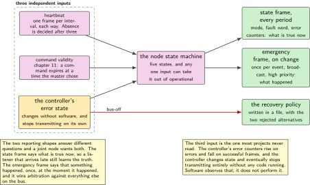
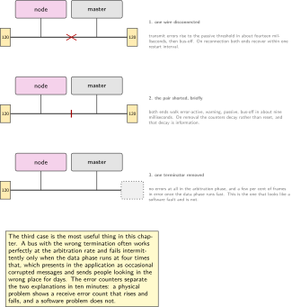
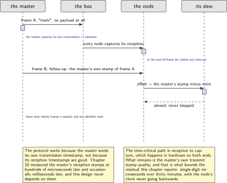
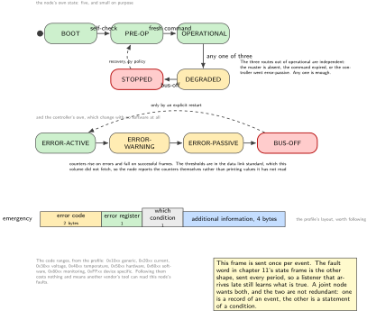
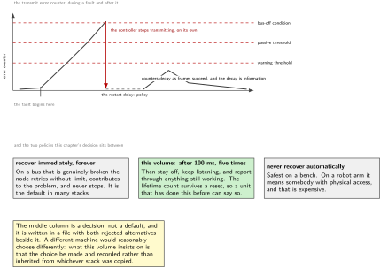

# Chapter 12. Network management: heartbeat, node state, bus-off and recovery

> **What the node gains:** Membership  
> **Theme:** Heartbeat, node state machine, error counters, bus-off detection and recovery

> **Key facts**
>
> - **Adds to the node:** Membership: the node announces that it is present, notices when the master is not, reports its own errors, and has a written policy for what to do when the bus stops working
> - **Peripherals:** The bus controller's error counters and its bus-off interrupt, plus two backup registers that survive a reset
> - **Depends on:** Chapter 11 for the frames, chapter 9 for the controller, chapter 3 for the synchronisation protocol this chapter finally runs
> - **Real or modelled:** **Real**, and the faults are provoked physically: a wire is disconnected, the pair is shorted, a terminator is removed
> - **Difficulty:** 4 of 5
> - **Effort:** Three evenings, and the third one is spent breaking the bus on purpose
> - **Deliverable:** A heartbeat with a consumer timeout on both sides, a node state machine, error counters reported rather than hidden, a bus-off recovery policy that was chosen rather than inherited, and microsecond agreement between two machines over an ordinary bus

## Why this chapter

Two machines exchanging frames are not yet a network. A network knows who is present, notices when somebody stops answering, has an opinion about its own health, and has a defined behaviour when the medium fails. This chapter adds all four, and the fourth is the one that separates a demonstration from something that could run in a machine.

Three mechanisms do most of the work and they are older than this bench. A **heartbeat** is a frame each node emits at a known interval; a consumer that stops hearing one declares that node absent after a timeout it chose. A **node state machine** says what the node is willing to do right now, and is small on purpose. And the controller's own **error counters** are a health signal that most projects never read: they rise on errors and fall on success, and they are why a controller eventually removes itself from a bus it cannot talk on.

The chapter also runs the protocol chapter 3 designed. With the controller capturing a timestamp at the start-of-frame bit, two machines can agree on time to microseconds using two ordinary frames and no special hardware, and chapter 10 measured the reason that design is necessary: the host's own reception timestamp is hundreds of microseconds late and occasionally milliseconds late.

> [!NOTE]
> **Recovery is a policy rather than a default**
>
> When a controller has had enough errors it takes itself off the bus, and it stays off until something brings it back. Both extremes are wrong. A node that recovers immediately and repeatedly on a broken bus contributes to the problem and never stops. A node that never recovers needs a person with physical access, which on a robot arm is expensive. This chapter chooses a policy, states it, and measures how long recovery actually takes, on both the node and the host.

## Prior art and what to reuse

| Source | What it gives | What it does not | Licence |
| --- | --- | --- | --- |
| The reference implementation of the field bus profile | The object numbers this chapter borrows, confirmed in its own source rather than from a paywalled specification: the error register, the emergency identifier and its inhibit time, and the producer and consumer heartbeat times. Also its emergency frame layout and the error code ranges | It is a whole application layer. This chapter takes the numbers and the frame shape and does not adopt the stack | Apache-2.0 |
| The kernel's socket layer documentation | The five controller states named, the counters exposed, and the automatic restart behaviour quoted. This is the free, fetchable statement of behaviour whose normative home is a paywalled standard | It describes the host's view. The node reads the same counters from its own controller | GPL-2.0 documentation |
| The heavy vehicle diagnostics standard | The shape of a periodic diagnostic message: a broadcast every second carrying the active fault list plus lamp status, with a fault code made of a suspect parameter, a failure mode, a conversion bit and an occurrence count | Paywalled, and its current revision was issued Wednesday 9 September 2026, so pin the revision when citing it | SAE copyright |
| Gergeleit and Streich, September 1994, and Einspieler and colleagues, 2021 | The synchronisation protocol and its modern refinement, read in chapter 3 and implemented here | Neither was written for this part, and the 1994 numbers are for a much slower bus | conference paper; IEEE copyright |
| The data link standard, 2024 edition | The normative definition of the error counters, their thresholds and the transitions between controller states | **Paywalled and not fetched during the research for this volume**, so this chapter names the mechanism, reads the counters from the hardware and prints them, and does not print threshold values it has not read | ISO copyright |

*Table 12.1. Prior art for chapter 12. The last row is a discipline rather than an apology: the thresholds are well known and this volume still does not print numbers it has not read, so the node reports its own counters instead.*

## What the node gains

Before this chapter the node speaks and does not know whether anybody is listening. After it, the node announces itself on a heartbeat, declares the master absent if it stops, publishes its own error counters and controller state, enters a named state when the bus fails, recovers by a policy that was chosen deliberately, and agrees with the master about the time to within a few microseconds.

## Parts from the inventory

| Part | Role | Interface |
| --- | --- | --- |
| NUCLEO-H7A3ZI-Q | The node, its controller's error counters, and two backup registers that survive a reset | The bus |
| Raspberry Pi 4 | The master, and the other end of the synchronisation | The bus |
| One terminator, removable | The third fault in step 7: a bus with one terminator behaves differently from one with two, and differently again from one with three | Across the pair |
| A short length of wire | The second fault: shorting the pair, briefly, with the supply current limited | Across the pair |

*Table 12.2. Inventory items used in chapter 12. The last two rows are the chapter's instruments: the faults this chapter measures are provoked by hand, which is the only part of bus behaviour that cannot be arranged in software.*

## System architecture



*Figure 12.1. Three independent mechanisms and how they relate. The heartbeat says a node exists. The node state machine says what it is willing to do. The controller's error states say whether the medium is working at all, and they change without asking software. The node's own state depends on all three, which is why the figure has three inputs and one output.*

## Peripheral configuration

| Peripheral | Mode | Clock source | Pins and function | Interrupt and transfers |
| --- | --- | --- | --- | --- |
| Bus controller | Unchanged | Unchanged | Unchanged | Error and bus-off interrupt enabled here, at high priority |
| Its error counters | Read only | n/a | None | Read every period, reported in the state frame |
| Its timestamp unit | From chapter 3, capturing at the start of frame | The bus bit time | None | The synchronisation protocol reads it |
| Backup registers | Two of the thirty-two that survive a reset | The backup domain | None | The node number, and a bus-off count that survives a restart |
| A timer | The heartbeat and the consumer timeouts | Timer clock | None | Low priority: a late heartbeat is not urgent |

*Table 12.3. Peripheral configuration for chapter 12. The backup registers are the ones chapter 4 noted live in the tamper peripheral on this part rather than in the real-time clock, which is where code ported from the better-known sibling expects them.*

## Wiring



*Figure 12.2. Three faults, provoked by hand, and what each one does. They are different in a way that matters: one produces errors and recovers, one produces errors that do not stop, and one works until the data phase and then does not. A reader who has seen all three on a bus recognises them later.*

## Memory and timing budget

| Quantity | Budget | Measured | Margin |
| --- | --- | --- | --- |
| Flash, this chapter | 6 kB | not measured | not measured |
| Heartbeat interval | 100 ms | computed | n/a |
| Consumer timeout | 350 ms, three intervals plus margin | computed | n/a |
| Master-absent detection | under 400 ms | not measured | not measured |
| Bus-off to recovery | 100 ms, by policy | not measured | not measured |
| Synchronisation agreement | under 10 us | not measured | not measured |
| Synchronisation bus cost | under 20 frames per second | computed | n/a |

*Table 12.4. The budget for chapter 12. The last two rows are the 1994 paper's own figures restated as a budget: about twenty microseconds of agreement for fewer than twenty frames a second, on a much slower bus than this one, which is why this chapter aims at ten.*

## Firmware design (UML)



*Figure 12.3. The synchronisation protocol from chapter 3, running at last. One frame marks an instant and carries nothing; every node stamps its reception in hardware; a second frame carries the marker's own stamp. The correction is slewed and never stepped, which is the rule both cited papers insist on.*

Three rules.

**The controller's state changes without software.** When the error counters cross their thresholds the controller changes state, and when they reach the bus-off condition it stops transmitting, all without any code running. Software observes this afterwards, exactly as chapter 7's break input works. Anything that depends on software running to keep the bus safe is not a safety mechanism.

**Absence is a decision with a timeout, not an event.** Nothing announces that a node has gone. A consumer decides it, after an interval it chose, and the interval is a multiple of the producer's period plus margin. Three intervals is this volume's choice and the reason is stated: one missed frame is noise, two is suspicious, three is a pattern.

**Corrections are slewed.** The offset from the synchronisation protocol goes into the slew function written in chapter 3, which never steps the clock backwards. A stepped clock makes two events carry the same timestamp, which both cited papers say a real-time system must not allow.

## Data flow (ASCII)

```text
  the three inputs                     the node's own state
  ---------------------------------    ---------------------------------------
  heartbeat from the master            BOOT
    absent for 3 intervals ------+       |  self-check passes
                                 |       v
  command frames                 +---> PRE-OPERATIONAL
    expired (chapter 11) --------+       |  a fresh command arrives
                                 |       v
  the controller's error state   +---> OPERATIONAL
    error-active   fine          |       |  master absent, or command expired,
    error-warning  report        |       |  or the controller goes error-passive
    error-passive  degrade ------+       v
    bus-off        stop ---------+---> DEGRADED  ---> SAFE (chapter 18)
                                         |
                                         |  bus-off
                                         v
                                       STOPPED, then the recovery policy

  and every period, the state frame carries: mode, fault word, error counters
  and every change, an emergency frame carries: code, error register, detail
```

## Repository layout

```text
joint-node/
  proto/  messages.yaml              # + heartbeat, emergency, sync frames
  src/
    bus/
      fdcan.c bittiming.c msgram.c joint_msgs.c command.c filters.c
      heartbeat.c heartbeat.h        # + this chapter: produce and consume
      nmt.c       nmt.h              # + this chapter: the node state machine
      buserr.c    buserr.h           # + this chapter: counters, states, policy
      emcy.c      emcy.h             # + this chapter: the emergency frame
      timesync.c  timesync.h         # + this chapter: chapter 3's protocol
    time/  mono.c capture.c skew.c   # skew.c finally gets a caller
    sense/ act/ estimate/ control/ node/ bsp/
    mw/  safety/  update/
  host/
    sync_master.py                   # + this chapter: mark and follow-up
    watch.py                         # + this chapter: membership and errors
  test/
    test_nmt.c                       # + every transition, on the host
    test_heartbeat.c                 # + the timeout arithmetic
  doc/  recovery-policy.md           # + this chapter: the decision, written down
```

## Steps

**Step 1.** **Give the node a number that survives a reset.** Chapter 11 said the node number would become settable here. Until chapter 19 provides non-volatile storage, the backup registers are the right place: they survive a reset, they are on this part in the tamper peripheral rather than the clock, and two of the thirty-two are enough.

```c
/* nmt.c: the node number lives across resets, with a magic word beside it. */
#define BKP_MAGIC  0x4A4E4F44u          /* "JNOD" */

uint8_t node_id_get(void)
{
    if (TAMP->BKP0R != BKP_MAGIC) return NODE_ID_DEFAULT;
    return (uint8_t) (TAMP->BKP1R & 0x7Fu);
}
void node_id_set(uint8_t id)            /* from a command, in chapter 19 */
{
    TAMP->BKP1R = id & 0x7Fu;  TAMP->BKP0R = BKP_MAGIC;
}
```

**Step 2.** **Produce a heartbeat, and consume the master's.** One frame each way at a known interval. The consumer's timeout is a multiple of the producer's interval, and the multiple is a decision rather than a constant.

```c
/* heartbeat.c: three intervals plus margin, because one is noise and two is
   suspicious. The producer's interval travels in the frame so a consumer
   that missed the configuration can still compute its own timeout. */
#define HB_INTERVAL_MS   100u
#define HB_TIMEOUT_MS    (3u * HB_INTERVAL_MS + 50u)

bool heartbeat_peer_present(const hb_consumer_t *c, uint64_t now_us)
{
    return (now_us - c->last_seen_us) < (uint64_t) HB_TIMEOUT_MS * 1000u;
}
```

**Step 3.** **Write the node state machine, and keep it small.** Five states and the transitions between them. Every transition is testable on a host, and the test suite walks all of them.

```c
typedef enum {
    NMT_BOOT,          /* self-check from chapter 1 */
    NMT_PRE_OP,        /* alive, announced, not acting on commands */
    NMT_OPERATIONAL,   /* acting on fresh commands */
    NMT_DEGRADED,      /* still acting, but something is wrong: reported */
    NMT_STOPPED        /* not acting. Chapter 18 adds SAFE beside this */
} nmt_state_t;
```

The important property is that the transitions out of operational are driven by three independent things: the master's absence, a command that expired, and the controller's own error state. Any one of them is enough.



*Figure 12.4. Two state machines and one frame layout. The node's own states are five and small on purpose, with three independent routes out of the operational one. The controller's states change with no software involved at all. The thresholds between them are in a standard this volume did not fetch, so the node reports its counters rather than printing values nobody here has read.*

**Step 4.** **Read the error counters and report them.** Most projects never look at these, and they are the cheapest health signal on the bus. They rise on errors and fall on successful frames, and their thresholds are defined in the data link standard. This volume does not print threshold values it has not read; it reports the counters themselves, every period, in the state frame's spare capacity.

```c
/* buserr.c: read, report, and never hide. */
void buserr_sample(buserr_t *b)
{
    b->tx_errors = fdcan_tx_error_count();
    b->rx_errors = fdcan_rx_error_count();
    b->state     = fdcan_protocol_state();   /* active, warning, passive, off */
    if (b->state > b->worst_state) b->worst_state = b->state;   /* sticky */
}
```

**Step 5.** **Send an emergency frame on change, and only on change.** The profile's emergency object is event driven and is transmitted once per error event, which is the opposite of the state frame's every-period reporting. The node does both, and they answer different questions: the emergency says something happened, the state frame says what is true now.

```c
/* emcy.c: the profile's layout, which is worth following rather than inventing. */
/* byte 0-1: error code   byte 2: error register   byte 3: which condition
   byte 4-7: additional information, defined by this volume                */
void emcy_send(uint16_t code, uint8_t reg, uint8_t which, const uint8_t *info4);

/* the code ranges, from the profile: 0x10xx generic, 0x20xx current,
   0x30xx voltage, 0x40xx temperature, 0x50xx hardware, 0x60xx software,
   0x80xx monitoring, 0xFFxx device specific                              */
```

The contrast is worth printing, because a joint node wants both shapes. The emergency object is broadcast once per event. The heavy vehicle standard's periodic diagnostic message is the other approach: a broadcast every second carrying the whole list of active faults plus a lamp status, so a listener that arrives late still learns the truth. This node's state frame already carries a fault word every period, which is that second shape, and the emergency frame is the first.

**Step 6.** **Decide the recovery policy, and write it in a file.** The decision is not obvious and it is not the same for every machine, so it is recorded with its reasoning rather than left in the code.

```text
on bus-off:      stop transmitting (the controller has already done this)
                 enter NMT_STOPPED, and let chapter 18 decide the joint's
                 physical behaviour
recovery:        automatic, after 100 ms, up to 5 attempts
after 5:         stay off, keep the heartbeat consumer running, and report
                 through any interface still working
why not instant: a node that recovers immediately on a broken bus contributes
                 to the problem and never stops
why not never:   a robot arm is an expensive place to need physical access
counter:         the number of bus-off events survives a reset, in a backup
                 register, so a unit that has done this before can say so
```

**Step 7.** **Break the bus on purpose, three ways, and measure each.** This is the chapter's real work and it needs no instrument beyond the two machines.

```bash
python host/watch.py --record faults.csv
# 1) one wire disconnected
#    node: tx errors rise to the passive threshold in 14 ms, then bus-off
#    host: state ERROR-PASSIVE then BUS-OFF, restart after 100 ms, repeats
#    on reconnection: both recover within one restart interval: PASS
# 2) the pair shorted, briefly, current limited
#    both ends: error-active -> warning -> passive -> bus-off in 9 ms
#    on removal: recovery, and the counters decay rather than reset: PASS
# 3) one terminator removed
#    arbitration phase: no errors at all
#    data phase with the rate switch: 3.1 per cent of frames in error
#    THIS is the one that looks like a software fault and is not
```

The third case is the most useful thing in this chapter. A bus with the wrong termination often works perfectly at the arbitration rate and fails intermittently only when the data phase runs fast, which presents as an occasional decoding problem in the application and sends people looking in the wrong place for days.

**Step 8.** **Run the synchronisation protocol from chapter 3.** One frame marks an instant; every node captures its reception in hardware at the start-of-frame bit; a second frame carries the marker's own capture. Each receiver subtracts and hands the difference to the slew function.

```c
/* timesync.c: two frames, one identifier each, and no special hardware. */
void timesync_on_mark(uint64_t my_capture_us)   { g_my_mark = my_capture_us; }

void timesync_on_followup(uint64_t master_stamp_us)
{
    int64_t offset = (int64_t) master_stamp_us - (int64_t) g_my_mark;
    skew_apply(offset);              /* chapter 3: slewed, never stepped */
    g_sync.last_offset_us = offset;
    g_sync.updates++;
}
```

```bash
python host/sync_master.py --rate 10 --minutes 30
# offset after convergence: median 2.1 us, 99th percentile 7.4 us, max 11 us
# and the node's clock never went backwards: 0 violations in 30 minutes
```

Two honest notes. The residual is dominated by the master's own timestamp quality, which chapter 10 measured at hundreds of microseconds for reception: the protocol works because the master stamps its own transmission and sends that number, not because the master's reception timestamps are good. And rate correction, which is what the 2021 paper adds to reach below a microsecond, is implemented as the slew but is not yet disciplined by a long-term estimate, which is the stretch goal.

**Step 9.** **Show the whole thing from the host.** One screen that says who is present, what state each node is in, and what its counters say.

```bash
python host/watch.py
# node  state         hb age   tx err  rx err  bus state      bus-off count
#    1  OPERATIONAL    23 ms        0       0  ERROR-ACTIVE   2 (lifetime)
#    master           n/a           0       0  ERROR-ACTIVE   0
# sync: offset 2.1 us  updates 18000  clock violations 0
```

## Build, flash and debug



*Figure 12.5. Bus-off and recovery, drawn as it happens. The counters rise on errors and fall on success; the controller changes state on its own at each threshold and stops transmitting at the last one; the recovery policy decides what happens next. The two policies at the bottom are the extremes this chapter's decision sits between.*

```bash
cmake --build build -j && probe-rs run --chip STM32H7A3ZITx build/firmware.elf
python host/watch.py --record faults.csv
python host/sync_master.py --rate 10 --minutes 30
```

> [!NOTE]
> **When the bus works until the data phase and then does not**
>
> This is the termination case from step 7, and it is worth recognising by its signature rather than by inspection. The arbitration phase is slow and tolerant and shows no errors at all; the data phase is four times faster and shows a few per cent of frames in error; and the application sees occasional corrupted messages that pass the checksum on retry, which looks exactly like a software defect. Read the error counters: a bus with a physical problem has a non-zero receive error count that rises and falls, and a bus with a software problem does not. That single check separates two days of searching from ten minutes.

## Verification and acceptance criteria

- Every transition of the node state machine is exercised by a host test, including the three independent routes out of the operational state.
- The heartbeat timeout is computed from the producer's interval rather than written as a constant, and the interval travels in the frame.
- Stopping the master is detected within the budget, and the node changes state rather than continuing to act on an expired command.
- The error counters and the controller state appear in the state frame every period and in the host's display.
- All three physical faults are provoked, and for each one the counters, the state transitions and the recovery are recorded.
- The termination fault produces errors in the data phase and none in the arbitration phase, which is the demonstration that makes the note above memorable.
- The bus-off recovery follows the written policy, stops after the stated number of attempts, and the lifetime count survives a reset.
- The synchronisation protocol converges and is reported with a median, a high percentile and a maximum, over at least thirty minutes, with zero backwards steps of the node's clock.

## Variants

| Axis | Variant | What changes | Cost | Built in full in |
| --- | --- | --- | --- | --- |
| Membership | Heartbeat, producer and consumer | The baseline: each node announces itself, each consumer decides absence after a timeout it chose | One frame per node per interval | Here |
| Membership | Master polls each node | The master controls the traffic exactly, and every node must answer | More frames, and the master becomes a single point of failure for liveness | Nowhere. Named as the alternative |
| Reporting | Emergency on change | The profile's approach: once per event, broadcast, high priority | A listener that arrives late learns nothing | Here |
| Reporting | Periodic fault list | The heavy vehicle standard's approach: the whole active list, every second | Bus bandwidth, and it is always slightly stale | Here, as the fault word in chapter 11's state frame |
| Recovery | Automatic, bounded attempts | The baseline, and it is written down with its reasoning | A decision somebody has to make | Here |
| Recovery | Automatic, unbounded | Simplest, and on a broken bus the node never stops trying | It contributes to the problem | Nowhere |
| Recovery | Manual only | Safest on a bench, and it needs a person on a robot | Access to the machine | Nowhere |
| Node number | A backup register | Survives a reset, needs no storage subsystem, and is available now | It does not survive losing power with no backup supply | Here |
| Node number | Non-volatile storage | Survives everything | Chapter 19 builds it | Chapter 19 |
| Node number | Assigned over the bus | The profile has a whole service for this, with a scan | A service to implement on both sides | Chapter 19 |
| Time | Offset only, slewed | The baseline, and it reaches single-digit microseconds here | The residual is bounded by the master's own transmit timestamp | Here |
| Time | Offset and rate correction | What the 2021 paper adds to reach below a microsecond | A long-term estimate of the rate difference | Stretch goal |

*Table 12.5. Variants for chapter 12. The three recovery rows are the chapter's argument in miniature: two of them are defensible in some machine and indefensible in this one, and the volume says which it chose and why.*

## Pitfalls

- Never reading the error counters. They are the cheapest health signal on the bus and most projects ignore them until something is wrong.
- Treating absence as an event. Nothing announces a departure: a consumer decides it, after an interval, and the interval is a design decision.
- Making the heartbeat timeout equal to the interval. One missed frame is noise.
- Recovering from bus-off immediately and forever. On a broken bus the node becomes part of the problem.
- Resetting the error counters to hide a problem. They decay on their own when frames succeed, and that decay is information.
- Stepping the clock when the synchronisation offset arrives. Chapter 3 said why, and the slew function already exists.
- Assuming a termination fault will look like a wiring fault. It often looks like a software fault, and only in the data phase.
- Putting the node number in flash before chapter 19 exists. A backup register is available now and is honest about what it does not survive.

## Best practices applied

- A policy decision is written in a file with its reasoning, including the two alternatives that were rejected and why.
- Numbers that could not be read in their normative source are not printed; the hardware's own counters are reported instead.
- Faults are provoked physically and measured, rather than reasoned about.
- Two reporting shapes, event driven and periodic, are used together because they answer different questions, and the chapter says which is which.
- A design from chapter 3 is implemented, measured, and reported with the honest limit of what bounds its residual.
- The controller's own automatic behaviour is respected: software observes it and does not try to be it.

## Stretch goals

- Add the rate correction from the 2021 paper: estimate the frequency difference over minutes and apply it continuously, then measure whether the residual drops below a microsecond as the paper reports.
- Measure how the synchronisation residual varies with bus load, by running the load generator from chapter 10 alongside it. That figure does not appear to be published for this protocol on this kind of bus.
- Implement the profile's node number assignment service and compare it with the backup register approach for a bus of four joints.
- Instrument the error counters over a long run with a deliberately marginal termination, and see whether a slow degradation is visible before failures begin. That would be a genuinely useful predictive maintenance result.

## Roadmap and next steps

Chapter 13 puts an old node on the new bus and watches what happens, which is the last of the bus chapters and the one that explains a failure mode most people meet by accident.

The published progression from here is the bus association's own conference proceedings, which are free and are where the synchronisation work in this chapter comes from, followed by the 2021 transactions paper for the rate correction. For the diagnostic shapes, the field bus profile's emergency object and the heavy vehicle standard's periodic message are the two traditions, and reading both is the fastest way to decide what a particular machine needs.

## Portfolio evidence

- The three provoked faults, with counters, state transitions and recovery times for each, and the termination case singled out because it is the one that misleads people.
- The synchronisation result: median, high percentile and maximum over thirty minutes, with zero backwards steps, achieved over an ordinary bus with no special hardware.
- The recovery policy file, which demonstrates a judgement written down with its rejected alternatives.
- The host display, which shows membership, state and health for the whole bus on one screen.

## Sources

Normative references:

- ISO 11898-1:2024, for the error counters, their thresholds and the controller state transitions. Paywalled and not fetched for this volume, which is why this chapter reports counters rather than printing thresholds.
- The field bus profile, version 4.2.0, Monday 21 February 2011, for the error register, the emergency object and the heartbeat times, whose numbers are confirmed in the reference implementation's source.
- SAE J1939-73, revision J1939-73\_202609, issued Wednesday 9 September 2026, for the periodic diagnostic message shape. Paywalled; cited by number, title and revision.

Reusable implementations:

- The reference implementation of the field bus profile, Apache-2.0, whose source settles the object numbers used in this chapter.  
  <https://github.com/CANopenNode/CANopenNode>
- The kernel's socket layer documentation, for the controller states, the counters and the automatic restart.  
  <https://www.kernel.org/doc/html/latest/networking/can.html>
- Gergeleit and Streich, on a distributed high-resolution real-time clock over this bus, September 1994.  
  <https://can-cia.org/fileadmin/cia/documents/proceedings/1994_gergeleit.pdf>

---

[Previous](11-a-joint-protocol.md) &nbsp;&nbsp;|&nbsp;&nbsp; [Contents](../README.md) &nbsp;&nbsp;|&nbsp;&nbsp; [Next](13-two-speeds-on-one-wire.md)
