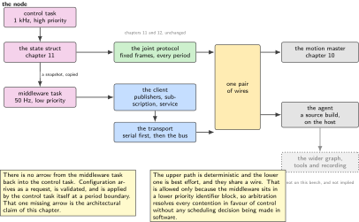
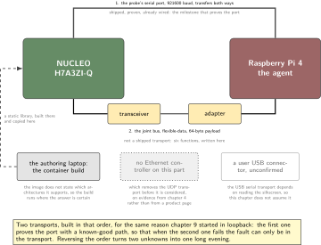
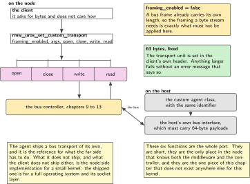
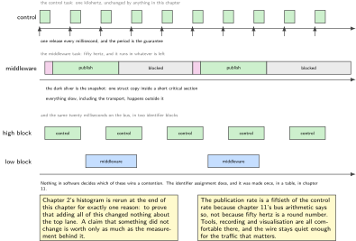
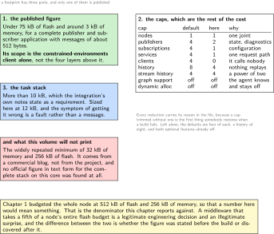

# Chapter 14. The node as a middleware participant, and the agent that hosts it

> **What the node gains:** A place in the robot  
> **Theme:** The embedded middleware client, the agent on the host, transport and footprint

> **Key facts**
>
> - **Adds to the node:** A place in the robot. The node stops being a device on a bus and becomes a participant a robot framework can discover, subscribe to and record, without giving up the deterministic path built in chapters 11 and 12
> - **Peripherals:** A serial port with transfers for the first working transport, then the bus controller for the one this chapter writes
> - **Depends on:** Chapter 4 for what this part does and does not have, chapter 11 for the state and command shapes, chapter 13 for what mixed traffic costs
> - **Real or modelled:** **Real software, absent robot.** The client, the transport and the agent all run. The wider graph they would join is not on this bench and is drawn as absent rather than implied
> - **Difficulty:** 5 of 5
> - **Effort:** Four evenings, and the first of them is spent reading a support list rather than writing code
> - **Deliverable:** A static library built for this part, one publisher reaching an agent on the host, a footprint measured against chapter 1's budget, a control period proven unchanged, and a transport nobody has published

## Why this chapter

Everything so far has been a device on a wire. A robot framework does not think in frames; it thinks in participants that publish and subscribe, that can be discovered, recorded and replayed, and that a tool can inspect without knowing what bus is underneath. Joining that world is what turns a joint node into part of a machine rather than a good piece of electronics.

There is an embedded client for exactly this, with an agent on a Linux host that bridges the constrained side to the full graph. It is the right thing to use and this chapter uses it. It also opens with a fact that should be established before any code is written.

> [!NOTE]
> **This board is in neither support tier**
>
> The project publishes two tiers. Officially supported, with long term support guaranteed, is a short list of five boards. Community supported adds three more, and one of those is the NUCLEO-H743ZI. **The NUCLEO-H7A3ZI-Q is in neither tier.** The nearest entry is a different part with a different reference manual, which is the trap this whole volume is built around. So this chapter is a porting job, it says so in its first paragraph, and the acceptance criteria are written for a port rather than for a configuration. That is not a reason to avoid the work. It is the reason the work is worth putting in a portfolio.

## Prior art and what to reuse

| Source | What it gives | What it does not | Licence |
| --- | --- | --- | --- |
| The integration utilities for this silicon vendor's configurator, 275 stars, last pushed Monday 15 September 2025 | The board agnostic route, and the one this chapter takes: a container image builds a **static library** that drops into a generated project. Sample mains, a build configuration file, and shims for time, allocation and transport | **A container runtime is mandatory.** The shipped transports are serial with transfers, serial with interrupts, USB serial and UDP. **The bus is not among them.** It carries the project's own notice that it is not ready for production use | Apache-2.0 |
| The agent | The bus transport is first class on the host side, with the stated constraint that the interface must support flexible-data frames with a sixty-four byte payload. Eight transports in total | There is no packaged binary worth using: the index carries a 2019 version and no build for any current distribution. A source build is the live route | Apache-2.0 |
| The client's bus transport | A header that fixes the transport unit at sixty-three bytes and an initialisation call taking a device and an identifier | **The implementation is for a full operating system only**: the directory holds the generic file and a POSIX one and nothing else. On a small kernel this is a custom transport job | Apache-2.0 |
| The custom transport interface | Six functions and a matching host-side class. Framing can be turned off, which gives packet oriented mode, and **that is exactly what a bus frame wants** | Nothing about how to drive a bus controller from inside it | Apache-2.0 |
| One engineer's write-up of a port to a custom board | **The closest published precedent**: the same core family, covering toolchain, static library build, project integration and writing the transport functions | No flash, memory or latency figures at all | article |
| An example project for a different part, 129 stars | A working serial transport with transfers, and a companion video | A different part and a different peripheral set | MIT |

*Table 14.1. Prior art for chapter 14. The third and fourth rows are the whole chapter in two lines: the bus transport exists for a host and not for this node, and the interface to write it yourself is documented and stable. Nobody has published that transport for a small kernel, which is why it is here.*

Three pieces of this chapter are genuinely the author's. The bus transport for a small kernel, for which no reference implementation exists. The memory protection and cache configuration for this family, which the integration's own notes flag and do not solve. And the placement of buffers that both the middleware and a transfer engine touch, which is the sibling volume's subject and is cited rather than repeated.

## What the node gains

Before this chapter the node is reachable by anything that speaks its protocol and by nothing else. After it, a tool can list the node, subscribe to what it publishes, record a session and replay it, with no knowledge of the bus at all. What the node does **not** gain is a new control path, and the chapter is firm about that: the deterministic loop still runs on the protocol from chapter 11, and the middleware is a reporting and configuration path beside it.

## Parts from the inventory

| Part | Role | Interface |
| --- | --- | --- |
| NUCLEO-H7A3ZI-Q | The client. The port is to this part, not to its better known sibling | Serial first, then the bus |
| Raspberry Pi 4 | The agent, and the far side of both transports | Its serial port and its bus adapter |
| The debug probe's serial port | The first transport, because it is shipped, proven and already wired | USB to the host |
| The authoring laptop | Where the container builds the library, because support for the host's own architecture is not stated anywhere | None, it hands over a file |

*Table 14.2. Inventory items used in chapter 14. The fourth row is a real constraint rather than a preference: the published container image does not state which architectures it supports, so the build runs where the architecture is certain and the artefact is copied.*

## System architecture



*Figure 14.1. Two paths on one node. The lower path is chapters 11 and 12, unchanged: fixed frames, one kilohertz, and every guarantee this volume has built. The upper path is this chapter, running at a fiftieth of that rate, for tools rather than for control. The graph on the right is drawn as absent because no robot framework is running on this bench, and the agent is the only part of that world this volume proves.*

## Peripheral configuration

| Peripheral | Mode | Clock source | Pins and function | Interrupt and transfers |
| --- | --- | --- | --- | --- |
| Serial port on the probe | 921600 baud, 8N1 | Unchanged | The two pins the probe already uses | Transfers both ways, idle line on receive |
| Bus controller | Unchanged from chapter 9 | Unchanged | Unchanged | A second receive queue and one more identifier range |
| Ethernet | **Absent on this part** | n/a | n/a | Which removes the UDP transport from the list before it is considered |
| USB device | **To be confirmed on the silkscreen** | n/a | n/a | The USB serial transport depends on this answer, and the chapter does not assume it |

*Table 14.3. Peripheral configuration for chapter 14. The last two rows are the useful ones. Chapter 4 established that this part has no Ethernet controller by the absence of its interrupt slots, which quietly eliminates one of the four shipped transports before a line of code is written.*

## Wiring



*Figure 14.2. The bench for this chapter, and the two transports in the order they are built. The serial path is shipped, proven and already wired, so it is first. The bus path is the one that matters for a joint node and the one nobody has published, so it is second and it gets its own figure.*

## Memory and timing budget

| Quantity | Budget | Measured | Margin |
| --- | --- | --- | --- |
| Flash, this chapter | 110 kB of the 512 kB whole-node budget | not measured | not measured |
| Static memory, this chapter | 18 kB of 256 kB | not measured | not measured |
| Middleware task stack | 12 kB, because the notes require more than 10 kB | not measured | not measured |
| Publication period | 20 ms, which is one publication per twenty control periods | not measured | not measured |
| Control period, unchanged | the same distribution as chapter 2 | not measured | not measured |
| Bus load added | under 8 per cent | computed in step 8 | n/a |

*Table 14.4. The budget for chapter 14. The first row is the largest single claim any chapter in this volume makes on the node's flash, and it is deliberately stated before the build rather than after it. If the port lands outside this budget, the chapter says so and the variants table says what to drop.*

> [!NOTE]
> **One published number and one that should not be repeated**
>
> The only footprint figure with a primary source behind it covers the middleware core alone: under 75 kB of flash and around 3 kB of memory for a complete publisher and subscriber application with messages on the order of 512 bytes. That is the constrained-environments client, **not** the full stack of abstraction, convenience, interface and type-support layers that sits on top of it. The widely repeated minimum of 32 kB of memory and 256 kB of flash comes from a commercial blog rather than from the project, and this volume does not print it as a project figure. What can be stated precisely is the shape of the cost, and that is the subject of this chapter's data figure.

## Firmware design (UML)



*Figure 14.3. The custom transport, which is six functions on the node and one class on the host. Turning framing off is the decision that makes this work: a bus frame is already a packet with a length, so the byte-stream framing the serial transport needs is exactly what must not be applied here.*

Two rules, and the first is the architectural claim of the chapter.

**The middleware never runs in the control path.** Its task has a priority below the control task, it publishes from a snapshot taken under a short critical section rather than reading live state, and it is allowed to miss a publication without anything else noticing. Chapter 2's histogram is rerun at the end of this chapter for exactly one reason: to prove that adding it changed nothing.

**Every compile-time cap is set deliberately, before the first build.** The implementation is built to rely on static allocation, and what it costs is set by a table of caps: how many nodes, publishers, subscriptions, services and clients, how deep the histories are, how long a name may be. Left at their defaults they are four of each, a history of eight and a stream history of four, with graph support and dynamic allocation both off. Those defaults are reasonable and this node does not need all of them, so they are written down and trimmed rather than inherited.

## Data flow (ASCII)

```text
  the control task, 1 kHz, priority high
        |
        +--> the state struct, chapter 11                 (nothing new here)
        |          |
        |          +--> the bus, every period, fixed frames, deterministic
        |          |
        |          +--> a snapshot, taken under a short critical section
        |                     |
        v                     v
  never blocked        the middleware task, 50 Hz, priority low
                              |
                              +--> the client: publisher, subscription
                                        |
                                        +--> the transport
                                                 |
                              first: serial with transfers -----> the agent
                                                 |
                              then: a custom bus transport -----> the agent
                                                 |
                                                 v
                                        the wider graph, absent here

  the arrow that does not exist: nothing from the middleware task back into
  the control task. Configuration arrives as a request, is validated, and is
  applied at a period boundary by the control task itself
```

## Repository layout

```text
joint-node/
  src/
    mw/
      mw_task.c mw_task.h        # + the task, its priority and its snapshot
      mw_topics.c                # + what this node publishes and subscribes to
      mw_transport_can.c         # + this chapter: the transport nobody publishes
      mw_alloc.c mw_time.c       # + the shims the integration expects
    bus/ sense/ act/ estimate/ control/ time/ node/ bsp/
    safety/  update/
  third_party/
    microros/                    # + the built static library and its headers
      colcon.meta                # + the caps, set deliberately and reviewed
      LICENCE-NOTICES.md         # + what was pulled in and under what terms
  host/
    agent_run.sh                 # + the agent, both transports, one script
  doc/
    port-status.md               # + this board's tier, and what that means
    footprint.md                 # + the caps, and what each one cost
  test/  tools/  proto/  README.md
```

## Steps

**Step 1.** **Write down where this board sits before touching a toolchain.** Two tiers, eight boards, and this one in neither. The nearest community-supported entry is a different part whose reference manual this volume has spent thirteen chapters warning about.

```text
doc/port-status.md

  tier                 neither officially nor community supported
  nearest entry        a different part, different reference manual
  what that means      no guarantee, no example, no published footprint,
                       and every clock, memory and cache assumption checked
                       against this part's own manual rather than inherited
  what still holds     the architecture is the same core family, the small
                       kernel is on the supported list, and the transport
                       interface is documented and stable
```

This file is short and it is the most valuable page in the chapter, because it is the difference between a port and a surprise.

**Step 2.** **Eliminate the transports that cannot work here, on evidence.** Four are shipped. One of them needs hardware this part does not have, which chapter 4 established from the absence of the interrupt slots rather than from a product page.

```text
serial with transfers     works, already wired through the probe      -> first
serial with interrupts    works, and is the fallback if transfers fight
                          with the cache, which is the sibling volume's
                          subject
USB serial                depends on a connector this bench has not yet
                          confirmed on the silkscreen                 -> open
UDP                       needs an Ethernet controller this part does not
                          have                                        -> out
the bus                   not shipped at all                          -> step 8
```

**Step 3.** **Set the caps before the first build, not after the first overflow.** The build configuration file is where the footprint is decided, and leaving it at defaults is a decision too.

```text
default                         this node                    why
nodes            1              1                            one joint
publishers       4              2                            state, diagnostics
subscriptions    4              1                            configuration
services         4              1                            one request path
clients          4              0                            it calls nobody
history          8              4                            nothing replays
stream history   4              4                            a power of two
graph support    off            off                          the agent knows
dynamic alloc    off            off                          and stays off
```

Every reduction is written in the file with its reason, because a cap trimmed without a reason is the first thing somebody restores when a build fails.

**Step 4.** **Build the static library in the container, on a machine whose architecture is certainly supported.** The image's page does not state its architecture support, and the host on this bench is not the obvious one, so the build runs on the laptop and hands over a file.

```bash
docker run --rm -v $(pwd):/project -w /project microros/micro_ros_static_library_builder:jazzy
# out: libmicroros/libmicroros.a and libmicroros/include/
arm-none-eabi-size libmicroros/libmicroros.a | tail -1
```

The library is committed with a notice file listing what it contains and under what terms, because a portfolio repository that ships a binary blob with no provenance is worse than one that ships none.

**Step 5.** **Get one publisher through on the shipped transport.** This is the milestone that proves the port, and it is worth reaching before anything clever is attempted.

```bash
# on the host
MicroXRCEAgent serial --dev /dev/ttyACM0 -b 921600 -v 6
# expected: session established, participant created, topic created
ros2 topic echo /joint/state        # if a full installation is present
```

If this does not work, nothing later will, and the fault is in the port rather than in the transport.

**Step 6.** **Measure the footprint and report it against chapter 1's budget.** This is one of the few numbers in this volume that a reader cannot find published anywhere, which makes it worth measuring carefully.

```bash
arm-none-eabi-size -A build/firmware.elf | sort -k2 -nr | head -12
python tools/mapdiff.py build/before.map build/after.map --top 20
```

Report it as this chapter added so much to a node that is budgeted at 512 kB, not as an absolute number with no denominator. A middleware that takes a fifth of a node's entire flash budget is a legitimate engineering decision and an illegitimate surprise.

**Step 7.** **Prove the control period did not change.** Rerun chapter 2's histogram with the middleware task running and compare the two distributions: median, 99.9th percentile and maximum, never the mean.

```c
/* mw_task.c: the whole interaction with the control loop is this. */
static joint_state_t snap;
taskENTER_CRITICAL();                 /* tens of cycles, not hundreds */
snap = g_state;                       /* one struct copy, no formatting */
taskEXIT_CRITICAL();
mw_publish_state(&snap);              /* everything slow happens out here */
```

If the 99.9th percentile moved, the critical section is doing too much or the priorities are wrong, and both are visible in the histogram rather than in a guess.

**Step 8.** **Write the bus transport, which is the part nobody has published.** Six functions, framing turned off, and a transport unit of sixty-three bytes fixed by the client's own header.

```c
/* mw_transport_can.c: packet oriented, because a frame is already a packet. */
rmw_uros_set_custom_transport(
    false,                            /* framing off: a frame has its own length */
    (void *) &g_mw_can,               /* controller, identifier pair, queue */
    mw_can_open, mw_can_close,
    mw_can_write, mw_can_read);       /* 63 bytes maximum, per the header */
```

On the host the matching class is instantiated with the same identifier, and the agent's own bus transport is the reference for what the far side must do. The constraint the agent states plainly is that the interface must carry flexible-data frames with a sixty-four byte payload, which is exactly the bus chapters 9 to 13 built.

**Step 9.** **Redo the bus load arithmetic with the middleware traffic on it.** Chapter 11 showed that the obvious design needed 190 per cent of the bus. That lesson applies again here and it is the reason the publication rate is a fiftieth of the control rate rather than equal to it.

```text
control traffic, chapter 11          measured there, unchanged here
middleware, 2 publishers at 50 Hz    100 packets per second, up to 63 bytes
                                     each, which is several frames per packet
                                     once the session overhead is counted
identifier range                     a separate, lower priority block, so
                                     middleware traffic can never delay a
                                     command frame
result                               under 8 per cent added, and the figure
                                     goes in the budget table above
```

The identifier assignment is the important half. Middleware traffic sits in a lower priority block by construction, so the arbitration that chapters 9 and 11 relied on does the right thing without anybody having to remember to be careful.



*Figure 14.4. One second of the node, at two scales. Above, the control task at one kilohertz, untouched. Below, the middleware task at fifty hertz, taking a snapshot and then doing everything slow outside the critical section. The two bars at the bottom are the same twenty milliseconds on the bus, with the middleware traffic in its own lower priority identifier block, where arbitration keeps it out of the way without anybody having to be careful.*

## Build, flash and debug



*Figure 14.5. What the middleware actually costs, drawn as the table it is. The left column is the published figure and its exact scope, the middle is what this node's caps add to it, and the right is what this volume refuses to print and why. A footprint with no denominator and no source is not a measurement.*

```bash
docker run --rm -v $(pwd):/project -w /project \
  microros/micro_ros_static_library_builder:jazzy
cmake --build build -j && probe-rs run --chip STM32H7A3ZITx build/firmware.elf
bash host/agent_run.sh serial      # then: bash host/agent_run.sh canfd
```

> [!NOTE]
> **When the session never establishes**
>
> Three causes account for most of it. The framing setting is wrong for the transport: a byte stream needs framing on and a packet transport needs it off, and getting this backwards produces a silent failure rather than an error. The transport unit is larger than the transport can carry, which on the bus means anything above sixty-three bytes. Or the middleware task has too little stack, for which the published requirement is more than 10 kB and the symptom is a fault rather than a message. Check all three before suspecting the port.

## Verification and acceptance criteria

- The port status file exists and states this board's tier honestly, before any build.
- The caps file lists every cap with its value and the reason it was chosen.
- The library builds reproducibly in the container, and the notice file records what it contains and under what terms.
- One publisher reaches the agent over the shipped serial transport, and the session survives a node reset from either end.
- The footprint is measured and reported as a fraction of chapter 1's whole-node budget, not as a bare number.
- Chapter 2's control period distribution is unchanged with the middleware task running, judged on the 99.9th percentile and the maximum.
- The custom bus transport carries a session, with framing off and a sixty-three byte unit.
- The added bus load is computed from the same arithmetic chapter 11 used and is under the budgeted figure.
- Middleware identifiers sit in a lower priority block than every control identifier, proven by reading the assignment table rather than by assertion.
- Removing the middleware task entirely still leaves a working joint node, which is the test that the architecture claim in this chapter is true.

## Variants

| Axis | Variant | What changes | Cost | Built in full in |
| --- | --- | --- | --- | --- |
| Transport | Serial with transfers | Shipped, proven, and already wired on this bench | A port the joint bus does not use | Here, first |
| Transport | Serial with interrupts | The fallback when transfers and the cache disagree | Processor time per byte | Here, named |
| Transport | USB serial | One cable instead of two, if the connector is there | An unconfirmed board question | Nowhere, until the silkscreen is read |
| Transport | UDP | The obvious choice on a part with Ethernet | **Impossible here**: no controller on this part | Nowhere, and the reason is evidence |
| Transport | The bus, custom | The joint's own wire carries the middleware too | Writing six functions nobody has published for this kernel | Here, step 8 |
| Placement | Middleware in the control task | Simpler, one less task | The control period becomes hostage to a transport | Nowhere |
| Placement | Below the control task | The loop is untouchable by construction | One snapshot copy per publication | Here |
| Rate | Equal to the control rate | Every period visible to tools | The bus arithmetic from chapter 11 says no | Nowhere |
| Rate | A fiftieth of it | Tools see enough, the bus stays quiet | Tools see 50 Hz, not 1 kHz | Here |
| Host | Packaged agent binary | Nothing to build | **Stale**: the index has a 2019 version and no current build | Nowhere |
| Host | Source build | The live route, and the one the project maintains | Build time on the host | Here |
| Host | Container image | Quick, if the architecture fits | **Architecture support is not stated**, so it is verified or avoided | Here, with the caveat |

*Table 14.5. Variants for chapter 14. Four rows are refusals, and three of those four are refused on evidence about this specific part or this specific package rather than on taste. A variant table that contains no impossibilities has not been checked.*

## Pitfalls

- Assuming this board is supported because a similarly named one is. The nearest entry is a different part with a different reference manual.
- Putting the middleware in the control path. It is a reporting and configuration path, and the moment a control period depends on it the guarantees of chapters 2 and 11 are gone.
- Leaving the caps at their defaults and then being surprised by the footprint. The caps are the footprint.
- Printing the widely repeated memory and flash minimum as a project figure. It is a commercial blog's number, and the project's own published figure has a much narrower scope.
- Getting the framing setting backwards. A byte stream needs it on, a packet transport needs it off, and the wrong choice fails silently.
- Sending more than sixty-three bytes through the bus transport, which the client's own header fixes and which no error message will explain.
- Giving the middleware task a stack sized like the others. The published requirement is more than 10 kB and the failure is a fault, not a warning.
- Putting middleware identifiers in the same priority block as control traffic, where arbitration will eventually do exactly what it was designed to do at the worst moment.
- Following documentation links from before the host moved. The old documentation host redirects and its deep links return not-found, so citations need the current host or the sources in the repository.

## Best practices applied

- A support tier is read and written down before a toolchain is installed.
- Transports are eliminated on evidence about this part, including evidence gathered from the absence of interrupt vector slots rather than from a product page.
- Static configuration caps are chosen deliberately and each one carries its reason.
- A vendored binary artefact ships with a notice recording its contents and terms.
- A footprint is reported against a budget rather than in isolation.
- A claim that something did not change is proven by rerunning the original measurement, not by inspection.
- A number that circulates widely without a primary source is named and refused rather than quietly repeated.

## Stretch goals

- Publish the bus transport. There is no reference implementation for this kernel, the interface is stable and documented, and a working one with a measurement beside it is a genuine contribution rather than another walkthrough.
- Measure the round trip from a request on the host to a change applied at a period boundary on the node, over both transports, and report the difference.
- Run the port on the nearest community-supported board and compare the footprints, which is the cheapest way to find out what this part's own configuration cost.
- Fill in the missing footprint figure for the complete client stack on this core. The project publishes graphs without tables and targets a smaller core, so a clean number here is citable.

## Roadmap and next steps

Chapter 15 gives the messages their standard shapes. Publishing a private structure over a standard middleware wastes most of what the middleware is for, so the next chapter maps the state and command of chapter 11 onto the message types a robot framework already understands, with the units and sign conventions those types require.

The published progression from here is the constrained-environments specification itself, which is free and settles the vocabulary, followed by the agent's transport documentation for anyone writing a second transport. For the port specifically, the one published write-up of a port to a custom board in this core family is the closest thing to a guide that exists, and this chapter is partly an attempt to leave behind something better for the next person.

## Portfolio evidence

- The port status file, which demonstrates the habit of establishing support before committing to an approach.
- The caps file with a reason against every value.
- The footprint reported as a fraction of a stated budget, with the refused figure named and explained.
- The two control period distributions, before and after, showing no change.
- The bus transport, which does not exist anywhere else for this kernel.

## Sources

Normative references:

- Object Management Group, "DDS For Extremely Resource Constrained Environments", version 1.0, document formal/20-02-01, February 2020, status Formal. It supersedes the two beta versions of May 2018 and March 2019, and no version beyond 1.0 is listed.
- The reference manual for this part, for every clock, memory and cache decision the integration's notes leave to the porter.

Reusable implementations:

- The integration utilities for the configurator, Apache-2.0, which is the route this chapter takes.  
  <https://github.com/micro-ROS/micro_ros_stm32cubemx_utils>
- The client, Apache-2.0, whose bus transport header fixes the transport unit and whose implementation is for a full operating system only.  
  <https://github.com/eProsima/Micro-XRCE-DDS-Client>
- The agent, Apache-2.0, whose bus transport is first class on the host side.  
  <https://github.com/eProsima/Micro-XRCE-DDS-Agent>
- The setup tooling, Apache-2.0, 509 stars, last pushed Friday 18 September 2026, which is the live route to an agent on the host.  
  <https://github.com/micro-ROS/micro_ros_setup>

One link-hygiene note for anyone following citations from older material: the project's original documentation host now redirects, and deep links into its documentation return not-found. Cite the current host or the sources in the repositories above.

---

[Previous](13-two-speeds-on-one-wire.md) &nbsp;&nbsp;|&nbsp;&nbsp; [Contents](../README.md) &nbsp;&nbsp;|&nbsp;&nbsp; [Next](15-joint-state-and-joint-command-as-messages.md)
