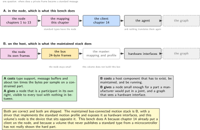
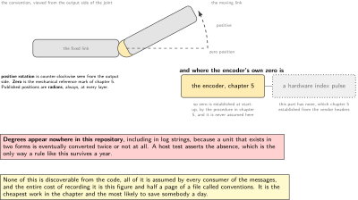
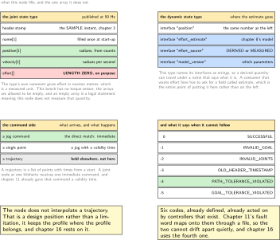
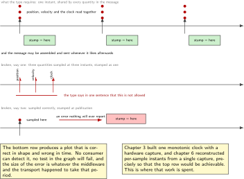
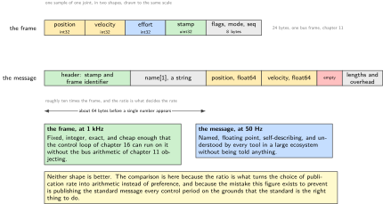

# Chapter 15. Joint state and joint command as messages

> **What the node gains:** A standard shape  
> **Theme:** The standard message types, units and conventions, mapping frames to messages

> **Key facts**
>
> - **Adds to the node:** A standard shape. What the node publishes stops being a private structure and becomes a type with published semantics, published units and no room for an alternative reading
> - **Peripherals:** None. This chapter is entirely about meaning, and its only hardware question is which way is positive
> - **Depends on:** Chapter 3 for the timestamp the message contract demands, chapter 5 for counts, chapter 8 for what effort here really is, chapter 11 for the frame being mapped, chapter 14 for the path it travels
> - **Real or modelled:** **Real, and one field is deliberately left empty** because this bench has no torque sensor and the standard type's unit is a measured one
> - **Difficulty:** 3 of 5
> - **Effort:** Two evenings, one of which is spent reading message definitions rather than writing code
> - **Deliverable:** Standard state and command messages with correct units, a written sign convention, one field honestly empty, a size comparison that explains a design decision, and a fault vocabulary borrowed rather than invented

## Why this chapter

Chapter 14 gave the node a way into a robot framework. This chapter decides what it says once it is there, and the temptation at this point is obvious: the node already has a 24-byte state structure that works, so wrap it and publish it.

That wastes almost everything the previous chapter paid for. The argument for standard types is short and it is worth stating in the words a firmware engineer would use: a strongly typed topic carries semantics and units with it, and **permits no alternative interpretations**. A private structure on a standard transport is a private structure. Any tool that wants to plot it, record it, compare it with another joint or feed it to a controller has to be told what it means, and being told is exactly the step that goes wrong six months later.

There is a second reason, and it is the better one. The standard types have already answered questions this volume has been circling for fourteen chapters: what unit a position is in, what a timestamp on a multi-field sample means, and what a joint should say when it cannot follow a command. Borrowing those answers is cheaper and more honest than inventing them.

> [!NOTE]
> **One rule in the standard type is chapter 3 restated**
>
> The state type's own comments say that the header specifies the time at which the joint states were recorded, and that all the joint states in one message have to be recorded at the same time. That is not documentation, it is a contract, and it is exactly the problem chapter 3 solved with one monotonic clock and a hardware capture. A node that stamps its messages at publication time rather than at sample time satisfies the type's shape and violates its meaning, and no consumer will ever tell it so.

## Prior art and what to reuse

| Source | What it gives | What it does not | Licence |
| --- | --- | --- | --- |
| The common interface definitions | The state type: a header, then names, positions, velocities and efforts. Its comments settle the units as radians or metres, radians or metres per second, and newton metres or newtons, and its two rules are quoted in this chapter | Nothing about how to fill it from a fixed-point frame, and nothing about what to do when one of the three quantities is an estimate | Apache-2.0 |
| The trajectory definitions | The command side: names, and an array of points each carrying positions, velocities, accelerations, effort and a time from the start of the trajectory | No notion of a single immediate setpoint, which is what a joint node at one kilohertz actually receives | Apache-2.0 |
| The control message package | The members a joint node genuinely needs: a jog type for real-time commands, a dynamic state type that **names its interfaces as strings**, and a controller state type. Its trajectory-following action carries path, goal and goal-time tolerances, and **five error codes that are a ready-made vocabulary** for a joint that cannot follow | It is written for a controller on a host, not for a device, so nothing in it is sized for a constrained node | BSD-3-Clause |
| The bus-connected motion stack, 289 stars, its core released Sunday 24 May 2026 | **The closest published prior art to this whole volume's architecture**: a driver hierarchy ending in a motion-profile driver that implements the standard profile state machine with position, velocity and torque modes, exposed as hardware interfaces. It is the maintained answer to how a bus-connected joint appears to a robot framework | It is the **master** side of that contract. This volume builds the device side, and says so rather than implying it builds both | Apache-2.0 |
| The raw frame wrapper, 194 stars, its message package released Monday 7 September 2026 | A thin, well released wrapper at the frame level, whose message package defines a flexible-data frame type, so the newer format is covered | No semantics at all above the frame, which is the whole subject of this chapter | Apache-2.0 |

*Table 15.1. Prior art for chapter 15. The fourth row deserves attention from anyone reading this volume as a portfolio: somebody has already built the master side of this contract, it is maintained, and this volume's node is the device that sits opposite it. Knowing that is worth more than not having heard of it.*

## What the node gains

Before this chapter the node speaks a protocol one repository understands. After it, the node speaks types that any tool in a large ecosystem understands, with units that cannot be misread, a timestamp whose meaning is defined, and an error vocabulary that a controller already knows how to act on. It also gains a written sign convention, which is the cheapest thing in this chapter and the one most likely to save a day.

## Parts from the inventory

| Part | Role | Interface |
| --- | --- | --- |
| NUCLEO-H7A3ZI-Q | Fills the messages and publishes them | Chapter 14's transport |
| Raspberry Pi 4 | Reads them, and is where a bridge would live if the mapping were placed there instead | The same |
| The encoder from chapter 5 | The only real source of a position, and the reason the conversion constant has exactly one home | Already wired |

*Table 15.2. Inventory items used in chapter 15. Nothing new is bought and nothing new is wired. The work is a decision about meaning, which is the kind of chapter that is easy to skip and expensive to skip.*

## System architecture



*Figure 15.1. Where the mapping happens, and the two defensible answers. In the node, which is what this bench does because chapter 14 already put a client there. On the host, which is what the maintained bus-connected motion stack does, and which this volume does not build. The figure names the second one rather than pretending the first is the only choice.*

## Peripheral configuration

| Peripheral | Mode | Clock source | Pins and function | Interrupt and transfers |
| --- | --- | --- | --- | --- |
| None | This chapter configures no peripheral at all | n/a | n/a | n/a |
| The clock from chapter 3 | Read, not configured. It supplies the sample instant the message contract requires | Unchanged | None | The capture is already in place |
| The encoder from chapter 5 | Read, not configured. Its counts become radians through one constant with one sign | Unchanged | Unchanged | Unchanged |

*Table 15.3. Peripheral configuration for chapter 15. A table of nothing is worth printing once: this chapter changes no hardware, and every quantity it publishes was already being measured. What changes is what those quantities are called and what they are guaranteed to mean.*

## Wiring



*Figure 15.2. The sign convention, drawn once so that it can be pointed at. Positive rotation, the zero position, and where the encoder's own zero sits relative to it. None of this is discoverable from code, all of it is assumed by every consumer of the messages, and the cost of writing it down is one figure.*

Nothing is wired in this chapter. The figure is here because a sign convention is the closest thing this chapter has to hardware, and because it is the piece most often left in somebody's head.

## Memory and timing budget

| Quantity | Budget | Measured | Margin |
| --- | --- | --- | --- |
| Flash, this chapter | 6 kB, mostly type support | not measured | not measured |
| Static memory, this chapter | 3 kB, the message buffers | not measured | not measured |
| State message on the wire | about ten times the 24-byte frame | computed in step 5 | n/a |
| Conversion cost per period | under 2 microseconds | not measured | not measured |
| Publication rate | 50 Hz, unchanged from chapter 14 | n/a | n/a |

*Table 15.4. The budget for chapter 15. The third row is the one that justifies a decision rather than reporting a cost: knowing the ratio is what makes the choice between publishing at one kilohertz and publishing at fifty hertz an arithmetic question instead of a preference.*

## Firmware design (UML)



*Figure 15.3. The three types this node touches, what it fills in each, and what it deliberately leaves empty. The empty array is the interesting part: the standard type's unit for effort is a measured one, this bench has no torque sensor, and chapter 8 was clear about the difference. So the estimate travels in the type that lets an interface be named, where it can be called an estimate without anybody having to read a comment.*

Three rules.

**One conversion constant, one sign, one file.** Counts to radians is a single constant and a single sign, and every place that needs it calls the same function. A second copy of that constant anywhere in the repository is a defect whether or not it currently agrees.

**The stamp is the sample instant.** Not the publication instant, not the time the message was assembled. Chapter 3 built a clock precisely so that this could be true, and chapter 6 reconstructed per-sample instants for the same reason.

**An estimate never travels in a measured field.** The state type's effort array is left empty on this bench. The estimate is published, clearly, in a place that can say what it is.

## Data flow (ASCII)

```text
  chapter 11's 24-byte state frame
        |
        +-- position_counts  (int32, exact)
        |        |
        |        +--> counts_to_rad()  one constant, one sign, one file
        |                    |
        |                    v
        |              position[0], float64, RADIANS
        |
        +-- velocity_mrad_s  (int32) --> /1000 --> velocity[0], rad/s
        |
        +-- effort_mnm       (int32, DERIVED)
        |        |
        |        +--> NOT into effort[], which the standard says is measured
        |        |
        |        +--> into the dynamic state type, interface named
        |             "effort_estimate", beside "effort_source"
        |
        +-- stamp_us         --> header.stamp, the SAMPLE instant, chapter 3
        |
        +-- fault_flags      --> the five standard error codes, chapter 16 uses
                                 PATH_TOLERANCE_VIOLATED for following error

  name[] is filled once at start-up and never rebuilt, because it is constant
  and rebuilding a string array every period is the most expensive way to say
  nothing new
```

## Repository layout

```text
joint-node/
  src/
    mw/
      mw_task.c mw_topics.c mw_transport_can.c
      msg_state.c  msg_state.h     # + this chapter: frame to standard type
      msg_cmd.c    msg_cmd.h       # + this chapter: standard type to frame
      units.c      units.h         # + counts to radians, once, with its sign
    bus/ sense/ act/ estimate/ control/ time/ node/ bsp/
    safety/  update/
  doc/
    conventions.md                 # + sign, zero, units, and one figure
    message-map.md                 # + every field, its source, its unit
  test/
    test_units.c                   # + round trip, and the sign, on the host
    test_msg_state.c               # + against recorded frames
  host/  third_party/  tools/  proto/  README.md
```

## Steps

**Step 1.** **Read the message definitions before writing anything.** They are short, they are the normative answer to questions this volume has been answering ad hoc, and they are free.

```text
the state type      header, then name[], position[], velocity[], effort[]
units, from its own comments
  position          radians for a revolute joint, metres for a prismatic one
  velocity          radians or metres per second
  effort            newton metres or newtons
two rules, quoted
  1. the header specifies the time at which the joint states were RECORDED
  2. all the joint states in one message have to be recorded at the SAME time
  and the arrays are optional, but must be the same size or empty
```

The second rule and the permission to leave an array empty are the two facts this chapter leans on hardest.

**Step 2.** **Write the sign convention down, with a figure, before any conversion.** Which way is positive, where zero is, and where the encoder's own zero sits relative to it.

```text
doc/conventions.md

  positive rotation   counter-clockwise viewed from the output side
  zero position       the mechanical reference mark, chapter 5
  encoder zero        its index would be here, but THIS PART HAS NO INDEX,
                      so zero is established at start-up and the procedure
                      is in chapter 5, not assumed here
  units published     radians, always, never degrees, anywhere
```

Degrees do not appear in this repository at any layer, including in log messages, because a unit that appears in two forms will eventually be converted twice or not at all.

**Step 3.** **Put the conversion in one file and test it on the host.** The test that matters is the round trip and the sign, and both are cheap.

```c
/* units.h: the only place counts and radians know about each other. */
#define JOINT_COUNTS_PER_REV   (4 * 2048)      /* quadrature, chapter 5 */
#define JOINT_SIGN             (+1)            /* see doc/conventions.md */

static inline double counts_to_rad(int32_t c)
{
    return JOINT_SIGN * (double) c * (2.0 * M_PI / JOINT_COUNTS_PER_REV);
}
```

**Step 4.** **Fill the state message, and leave effort empty.** This is the chapter's honesty decision and it costs one line plus one paragraph of documentation.

```c
/* msg_state.c: three arrays of one, and one of them stays at length zero. */
m->name.size     = 1;                       /* filled once at start-up */
m->position.data[0] = counts_to_rad(s->position_counts);
m->velocity.data[0] = s->velocity_mrad_s / 1000.0;
m->effort.size   = 0;                       /* no torque sensor on this bench */
m->header.stamp  = us_to_ros_time(s->stamp_us);   /* the SAMPLE instant */
```

The arrays are allowed to be empty and are required to be the same size when they are not, so a length of zero is a legal statement meaning this node does not measure that quantity. Filling it with an estimate would also be legal and would be a lie in a defined unit, which is worse than saying nothing.

**Step 5.** **Publish the estimate where it can be labelled.** The dynamic state type carries interface names as strings, which is exactly the mechanism needed.

```text
interface_name        value        where it came from
  effort_estimate     0.214        chapter 8's model, in newton metres
  effort_source       1            DERIVED, straight from the frame
  model_version       3            which parameter set produced the estimate
  position            0.7854       the same number as the state message
```

A consumer that wants effort now has to ask for a field called estimate, which is the entire point. Chapter 8 spent a chapter establishing that this quantity is derived, and this is where that work stops being a footnote.

**Step 6.** **Measure what the standard shape costs on the wire, and decide from the number.** A private frame is 24 bytes; the standard message is not, and the difference explains the publication rate chosen in chapter 14.

```text
chapter 11's frame     24 bytes, fixed, one bus frame
the state message      header with a stamp and a frame identifier string
                       name[]      one string, and strings are not free
                       position[]  one float64        8 bytes
                       velocity[]  one float64        8 bytes
                       effort[]    empty              0 bytes
                       plus array lengths and the serialisation's own overhead
result                 roughly ten times the frame, which is why this travels
                       at 50 Hz and the frame travels at 1 kHz
```

Both are correct designs. The mistake would be to publish the standard message every period because the standard is the right thing, and then wonder where the bus went.

**Step 7.** **Map the command side, and accept that the standard trajectory type is not a setpoint.** A trajectory is a list of points with times from a start; a joint node at one kilohertz receives one immediate command.

```text
what arrives                    what this node does with it
a jog command                   the direct match: a real-time immediate command
a trajectory                    accepted, held, and interpolated by whoever
                                owns the trajectory. THIS NODE DOES NOT
                                INTERPOLATE, and chapter 16 says why
a single point                  treated as a jog with a validity time,
                                which is chapter 11's valid_until field
```

The node refusing to interpolate a trajectory is a design position, not a limitation, and it is stated here so that chapter 16 can rest on it.

**Step 8.** **Borrow the error vocabulary instead of inventing one.** The trajectory-following action already defines what a joint says when it cannot follow, and those codes are better than anything this volume would have made up.

```text
 0  SUCCESSFUL
-1  INVALID_GOAL              the command is outside the declared limits
-2  INVALID_JOINTS            the names do not match this node
-3  OLD_HEADER_TIMESTAMP      chapter 11's valid_until has passed
-4  PATH_TOLERANCE_VIOLATED   following error, which is chapter 16's subject
-5  GOAL_TOLERANCE_VIOLATED   it arrived, but not close enough
```

Chapter 11's fault word maps onto these, and the map lives in a file rather than in a switch statement, so that the two cannot drift apart quietly.

**Step 9.** **Write the field map down, every field, with its source and its unit.** This is the document a second engineer reads instead of asking, and it is the deliverable most likely to be read by somebody other than its author.

```text
doc/message-map.md
  message field      source field          unit       notes
  position[0]        position_counts       rad        counts_to_rad, sign in
                                                      doc/conventions.md
  velocity[0]        velocity_mrad_s       rad/s      divided by 1000
  effort[]           (none)                N m        EMPTY: no torque sensor
  header.stamp       stamp_us              s, ns      the SAMPLE instant
  effort_estimate    effort_mnm            N m        dynamic state type only
```



*Figure 15.4. The timestamp contract, and the two ways to break it. The top row is what the type requires: one instant, shared by every quantity in the message, taken when the quantities were recorded. The middle row is a node that samples its three quantities at three different times and stamps them as one, which the type forbids in a sentence. The bottom row is a node that stamps at publication, which is the common failure and the invisible one.*

## Build, flash and debug



*Figure 15.5. The same instant of the same joint, twice. On the left, chapter 11's frame: twenty-four bytes, fixed, integers, one bus frame. On the right, the standard message: floating point, named, self-describing, and roughly ten times the size. Neither is better. The comparison is here because the ratio is what decides the rate, and a rate chosen without it is a guess.*

```bash
cmake --build build -j && ctest --test-dir build/host
probe-rs run --chip STM32H7A3ZITx build/firmware.elf
ros2 topic echo /joint/state --once        # if a full installation is present
python host/check_units.py --degrees-are-a-bug
```

> [!NOTE]
> **When a plot looks right but reads wrong**
>
> Three causes, in the order they occur. The sign convention was never written down, so one consumer assumes the opposite one and everything is mirrored. Degrees appeared somewhere, usually in a log line that was later parsed. Or the stamp is the publication instant rather than the sample instant, which produces a plot that is correct in shape and wrong in time, and which nothing will ever complain about. The first two are caught by a host test. The third is caught only by having decided, in chapter 3, that it mattered.

## Verification and acceptance criteria

- The conversion from counts to radians exists once, and a host test proves the round trip and the sign.
- The word degrees appears nowhere in the repository, including in log strings, and a test asserts it.
- The state message carries position and velocity in the units the type's own comments specify.
- The effort array is empty, and the reason is in the field map.
- The estimate is published only in the type that names its interfaces, and its name says it is an estimate.
- The header stamp equals the sample instant from chapter 3, proven by comparing a published message against the frame it came from.
- Every array in one message has the same length or is empty, which the type requires.
- The field map file lists every published field with its source and unit.
- The fault word maps onto the five standard error codes through a file, not a switch statement.
- The size ratio between the frame and the message is measured and appears in the budget table.

## Variants

| Axis | Variant | What changes | Cost | Built in full in |
| --- | --- | --- | --- | --- |
| Mapping | In the node | The node publishes standard types itself | Type support and message buffers on a constrained part | Here |
| Mapping | On the host, in a bridge | The node stays small and the graph sees the bridge | A host component, and the node is no longer the publisher | Nowhere, and it is what the maintained stack does |
| Effort | Left empty | Honest, and the type explicitly allows it | A consumer gets nothing | Here |
| Effort | Filled with the estimate | Convenient, and wrong in a defined unit | Credibility, the moment somebody checks | Nowhere |
| Effort | In the dynamic type, named | Honest and useful at once | One more message type | Here |
| Command | Jog | The direct match for an immediate setpoint | None | Here |
| Command | Trajectory, interpolated on the node | The node owns the profile | Trajectory memory and a profile generator on a constrained part | Nowhere, and chapter 16 says why |
| Command | Trajectory, held elsewhere | The node stays a device | The master must exist | Here, by declaration |
| Frame level | Raw frame messages | Every frame visible to the graph | Semantics stay at zero, which is the thing this chapter is for | Nowhere, and it is named |

*Table 15.5. Variants for chapter 15. The three effort rows are one argument made three ways, and the middle one is the variant this volume exists to argue against. A field with a defined unit is a promise, and filling it with something else is the cheapest way to lose a reader's trust.*

## Pitfalls

- Publishing a private structure over a standard transport and believing the node now speaks the standard.
- Stamping at publication time. The type's own comment says recorded, and a consumer cannot detect the difference.
- Putting a derived quantity into a field whose unit implies measurement.
- Letting degrees into any layer, including log messages.
- Rebuilding the name array every period, which is the most expensive way to transmit a constant.
- Publishing arrays of different lengths, which the type forbids and which some consumers will accept silently.
- Keeping the conversion constant in two places. They will agree until one is changed.
- Publishing the standard message every control period because the standard is the right thing, without doing the size arithmetic first.
- Inventing an error vocabulary when a published one exists that controllers already act on.

## Best practices applied

- Normative definitions are read before code is written, and their comments are treated as contracts.
- A convention that lives only in somebody's head is drawn and written down.
- A single constant has a single home, enforced by a test rather than by discipline.
- A quantity that is estimated is published where it can be labelled as an estimate.
- An empty array is used as the meaningful statement the type intends it to be.
- A vocabulary is borrowed from a maintained standard rather than invented.
- A design decision about rate rests on measured sizes rather than on preference.
- Prior art that solves the other half of the same problem is named clearly, including the part this volume does not build.

## Stretch goals

- Write the host-side bridge as well, and compare the two placements on node footprint, host complexity and what the graph sees. Nobody has published that comparison for a constrained node.
- Implement the trajectory-following action's tolerance fields as the node sees them, which is most of chapter 16 arriving early.
- Map this node onto the standard motion profile the maintained stack implements, and find out how much of that profile a bench node can honestly claim.
- Publish a recording of one minute of state messages alongside the raw frames that produced them, which makes the whole mapping auditable by anybody.

## Roadmap and next steps

Chapter 16 closes the loop. The messages of this chapter go out and come back, a setpoint arrives, and the figure of merit becomes following error, which is the quantity the standard error codes already have a name for.

The published progression from here is the message definitions themselves, which are short and worth reading in full, then the control message package for the members a joint node needs, then the maintained bus-connected motion stack as the worked example of the other side of this contract. The concept documentation for nodes, topics and typing is in the documentation repository rather than on the documentation site, because the site refuses automated fetching and the repository does not.

## Portfolio evidence

- The field map, which is short, complete, and the kind of document that gets copied into other projects.
- The sign convention figure, for the same reason.
- The empty effort array with its written justification, which demonstrates a habit that is difficult to teach.
- The error-code map, showing a vocabulary borrowed rather than invented.
- The size comparison, which turns a rate decision into arithmetic.

## Sources

Normative references:

- The joint state message definition, for the field list, the units in its own comments, and the two rules quoted in this chapter.
- The joint trajectory message definition, for the command side and its time from start.
- The control message package, BSD-3-Clause, for the jog type, the dynamic state type with named interfaces, and the trajectory-following action with its tolerances and its five error codes.

Reusable implementations:

- The common interface definitions, Apache-2.0.  
  <https://github.com/ros2/common_interfaces>
- The bus-connected motion stack, Apache-2.0, 289 stars, the maintained master side of this contract.  
  <https://github.com/ros-industrial/ros2_canopen>
- The raw frame wrapper, Apache-2.0, 194 stars, whose message package defines a flexible-data frame type.  
  <https://github.com/autowarefoundation/ros2_socketcan>
- The concept documentation, in repository form because the documentation site refuses automated fetching.  
  <https://github.com/ros2/ros2_documentation>

---

[Previous](14-the-node-as-a-middleware-participant.md) &nbsp;&nbsp;|&nbsp;&nbsp; [Contents](../README.md) &nbsp;&nbsp;|&nbsp;&nbsp; [Next](16-the-loop-closed-over-the-bus.md)
