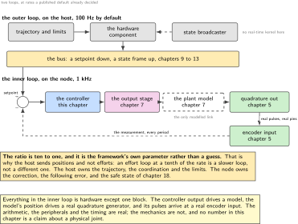
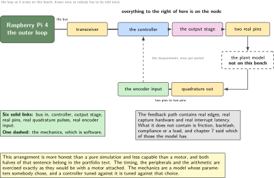
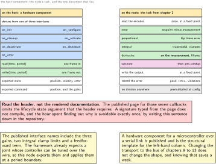
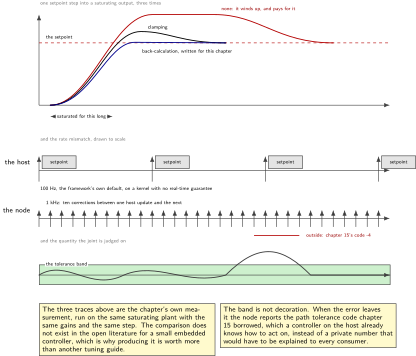
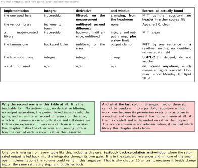

# Chapter 16. The loop closed over the bus: setpoint in, state out, following error

> **What the node gains:** A closed loop  
> **Theme:** Setpoint injection, the controller, following error as the figure of merit

> **Key facts**
>
> - **Adds to the node:** A closed loop, and the one number a joint is judged by. The node stops reporting and starts controlling, and it reports how well it is controlling in a quantity that has a published name
> - **Peripherals:** Nothing new. The timer from chapter 2, the encoder input from chapter 5, the outputs from chapter 7 and the bus from chapter 9
> - **Depends on:** Chapter 2 for the period, chapter 5 for feedback, chapter 7 for the plant that is not here, chapter 11 for the command, chapter 15 for the name of the failure
> - **Real or modelled:** **Real controller, modelled plant.** The loop closes through a dashed block, and every following error in this chapter is real arithmetic performed on a model. The chapter says so on every figure
> - **Difficulty:** 5 of 5
> - **Effort:** Four evenings, and the last one is spent on the controller nobody has published rather than on the one everybody has
> - **Deliverable:** A controller with filtered derivative and real anti-windup, a written division of labour between node and host, following error measured at the node's own rate, and a licence audit that changes which library is used

## Why this chapter

Fifteen chapters have built a joint node that measures, times, reports and joins. It has never corrected anything. This chapter closes the loop, and the first question is not which controller to write but **where the loop lives**, because there are two candidates and a published default settles it.

The host framework's manager has a parameter for the frequency of its real-time update loop, the loop that reads states from hardware, updates controllers and writes commands back. **Its default is one hundred hertz.** This node runs at one thousand. That single arithmetic fact decides the architecture: the fast loop closes on the node, where the feedback already is, and the host closes a slower outer loop around it. Nothing about that is a compromise. It is the standard arrangement in motion control and the numbers say so out loud.

The second question is the figure of merit. A joint that is asked to be at a position and is not at it has a following error, and a controller is judged on the shape of that quantity rather than on whether it eventually arrives. Chapter 15 already borrowed the name for what happens when it grows too large.

> [!NOTE]
> **The loop closes through a model and the chapter never forgets it**
>
> There is no motor on this bench. The controller output drives chapter 7's plant model, whose position drives chapter 5's quadrature generator, whose pulses come back through the real encoder input on real hardware. So the arithmetic is real, the peripherals are real, the timing is real, and the mechanics are a model. Every figure in this chapter draws that block dashed, and no number here is a claim about a physical joint. What it is a claim about is the firmware, which is what this volume is for.

## Prior art and what to reuse

| Source | What it gives | What it does not | Licence |
| --- | --- | --- | --- |
| The host control framework, about 1000 stars, last commit Thursday 17 September 2026 | The contract this node sits behind: a manager whose real-time loop reads, updates and writes, hardware components with lifecycle callbacks and a read and write pair, and **a published list of interface names that already includes the three controller gains, two integral clamp limits and a feedforward term** | Nothing that runs on a microcontroller. **Its rendered documentation omits the lifecycle state argument** from the callback signatures, so the header is the source of truth | Apache-2.0 |
| A hardware component for a microcontroller over a serial link, 139 stars | The structural template for the host side of this exact arrangement. **Change the transport and the shape is the same** | A different transport, and a different class of joint | BSD-3-Clause |
| The best-fitting small controller, 935 stars, last pushed Monday 24 July 2023 | About 150 lines and finished: trapezoidal integral, a **band-limited derivative taken on the measurement** so a setpoint step produces no kick, and clamping anti-windup with a separate integrator limit computed from the headroom the proportional term leaves | **The licence is at repository level only: neither source file carries a header.** If it is vendored, a header is added and the provenance recorded | MIT, at the repository |
| The vendor signal-processing controller | The incremental form in three numeric types, well tested and everywhere | **The teachable foil for this chapter**: no anti-windup, no derivative filtering, no output saturation, the period baked invisibly into the gains, and an unfiltered second difference on the error | Apache-2.0 |
| A motor-control library's controller | Trapezoidal integral, integral clamp, output clamp, and **an output slew rate limit the others lack and a joint wants**. It measures elapsed time rather than assuming a period | No derivative filter, and a plain backward difference on the error | MIT |
| The real-time helper library | A buffer and a publisher safe to touch from a real-time thread, priority helpers, and an asynchronous function handler | Host side only | BSD-3-Clause |

*Table 16.1. Prior art for chapter 16. The third and fourth rows are why this chapter builds both: one is the right implementation and carries a licence defect worth teaching, and the other is the wrong implementation and is the clearest way to show what each missing feature costs.*

One thing in this chapter is genuinely the author's. **No verified open embedded controller in this language implements textbook back-calculation anti-windup.** Clamping is everywhere and conditional integration is common; back-calculation, where the saturated output is fed back into the integrator through its own gain, is described in the standard references and implemented in none of the small libraries this volume could check. The chapter implements it, measures it against clamping on the same step, and publishes both.

## What the node gains

Before this chapter the node is an instrument. After it, it is a joint: it receives a setpoint, corrects toward it, reports how far off it is, and says so in the vocabulary chapter 15 borrowed. It also gains its gains as interfaces, so that tuning becomes a message rather than a rebuild.

## Parts from the inventory

| Part | Role | Interface |
| --- | --- | --- |
| NUCLEO-H7A3ZI-Q | The fast loop, at the rate chapter 2 proved | Timer, encoder input, outputs, bus |
| Raspberry Pi 4 | The slow outer loop and the setpoint source | The bus |
| The quadrature generator, chapter 5 | Turns the plant model's position back into pulses, so feedback arrives through real hardware | Two pins to two pins |
| The plant model, chapter 7 | **The only part of this loop that is not real**, and it is drawn dashed everywhere | None: it is software |

*Table 16.2. Inventory items used in chapter 16. The loop is a real loop through real peripherals with one modelled link in it, which is a more honest arrangement than a simulation and a less capable one than a motor. Both halves of that sentence belong in the portfolio text.*

## System architecture



*Figure 16.1. Two loops, and the published default that separates them. The inner loop closes on the node at one kilohertz, where the feedback already is. The outer loop closes on the host at the framework's default of one hundred hertz, one tenth the rate, which is why it sends setpoints rather than efforts. The dashed block is the plant, and it is the only part of the inner loop that is not hardware.*

## Peripheral configuration

| Peripheral | Mode | Clock source | Pins and function | Interrupt and transfers |
| --- | --- | --- | --- | --- |
| Control timer | Unchanged from chapter 2 | Unchanged | None | The period this chapter runs in |
| Encoder input | Unchanged from chapter 5 | Unchanged | Unchanged | Read once per period, never polled |
| Output stage | Unchanged from chapter 7 | Unchanged | Unchanged | Updated once per period, at a defined point |
| Bus controller | Unchanged from chapter 9 | Unchanged | Unchanged | Command in, state out |

*Table 16.3. Peripheral configuration for chapter 16. Every row says unchanged, which is the point: fifteen chapters of configuration were done so that this one could be about control rather than about registers. A chapter that had to configure something here would be a chapter whose predecessors left work undone.*

## Wiring



*Figure 16.2. The loop as it physically exists on this bench, drawn once so that nobody has to be told twice which link is a model. Setpoint over the bus, controller on the node, output through the real output stage, into the plant model, out through the real quadrature generator, back through the real encoder input. One dashed block, six solid ones.*

## Memory and timing budget

| Quantity | Budget | Measured | Margin |
| --- | --- | --- | --- |
| Flash, this chapter | 5 kB | not measured | not measured |
| Static memory, this chapter | 1 kB | not measured | not measured |
| Controller execution, per period | under 8 microseconds of 1000 | not measured | not measured |
| Divisions in the handler | **zero**, by premultiplying at configuration | n/a | n/a |
| Following error, steady state | under 1 milliradian on the model | not measured | not measured |
| Host loop rate | 100 Hz, the framework default | not measured | not measured |
| Host loop jitter | **not bounded**: this Pi runs no real-time kernel | to be measured | n/a |

*Table 16.4. The budget for chapter 16. The last row is the honest one. The framework asks for a real-time scheduling policy at a stated priority, with the user in a real-time group and limits configured, and recommends a real-time kernel. This bench has none of that, so the outer loop's jitter is measured and reported rather than assumed away.*

## Firmware design (UML)



*Figure 16.3. The two sides of the contract. On the host, a hardware component with its lifecycle callbacks and its real-time read and write pair. On the node, the control task that already exists. The caution in the middle is real: the rendered documentation for those callbacks omits an argument the header requires, so the header is what gets read before a signature is typed.*

Three rules.

**No division in the handler.** The gains are premultiplied by the period when they are configured, so the periodic path does adds, multiplies and comparisons and nothing else. This is the single cheapest piece of published advice in the whole subject.

**The derivative is taken on the measurement, filtered.** A derivative on the error produces a kick every time the setpoint moves, and an unfiltered one amplifies exactly the noise the encoder has most of. Taking it on the measurement is equivalent while the setpoint is constant and much better when it is not.

**Saturation is not a detail.** The output is bounded, and the integrator must be told. This chapter implements two answers and measures both, because one of them is not published anywhere in this language.

## Data flow (ASCII)

```text
  the host, 100 Hz, no real-time kernel on this bench
        |
        +--> setpoint, with a validity time (chapter 11)
                 |
                 v
  ----------- the node, 1 kHz, every period, in this order -----------
        |
        read the encoder (chapter 5)      exactly once, at a fixed point
        |
        v
      error = setpoint - measurement
        |
        +--> proportional:  Kp * error
        |
        +--> integral:      trapezoidal, and clamped to the headroom the
        |                   proportional term leaves
        |
        +--> derivative:    on the MEASUREMENT, band limited, sign inverted
        |                          (no kick when the setpoint steps)
        v
      sum, then saturate to the output range
        |
        +--> if it saturated: ANTI-WINDUP
        |        clamping        the integrator is held           (published)
        |        back-calculation the excess is fed back through its own
        |                        gain                  (the author's, here)
        v
      write the output stage (chapter 7), at a fixed point in the period
        |
        v
      [ the plant model ]  <-- DASHED: the only modelled link in this loop
        |
        v
      the quadrature generator (chapter 5) --> real pulses --> real encoder
        |
        v
      following error is recorded every period, and published at 50 Hz
```

## Repository layout

```text
joint-node/
  src/
    control/
      pid.c pid.h              # + this chapter: filtered D, two anti-windups
      pid_config.c             # + premultiply by the period, once
      setpoint.c               # + command in, validity checked
      follow.c follow.h        # + following error, and its statistics
    estimate/ sense/ act/ bus/ mw/ time/ node/ bsp/ safety/ update/
  host/
    hw_component/              # + the host side: read, write, lifecycle
    tune.py                    # + gains over the wire, no rebuild
  doc/
    loop-division.md           # + which loop owns what, and the arithmetic
    antiwindup.md              # + both methods, both measured
  test/
    test_pid.c                 # + step, saturation, and windup, on the host
    test_follow.c              # + the statistics, against recorded runs
  third_party/  proto/  tools/  README.md
```

## Steps

**Step 1.** **Write the division of labour down before writing a controller.** The arithmetic is published and it settles the argument in four lines.

```text
doc/loop-division.md

  the node's loop     1000 Hz, proven in chapter 2, feedback is local,
                      one period of latency end to end
  the host's loop     100 Hz by default, and that default is the framework's
                      own parameter, not a guess
  ratio               10 to 1, which is why the host sends POSITION setpoints
                      and not efforts: an effort loop at a tenth of the rate
                      is a slower loop, not a different one
  what the host owns  trajectory, coordination between joints, limits,
                      and the profile
  what the node owns  the correction, the following error, and the safe
                      state of chapter 18
```

**Step 2.** **Configure the gains once, and premultiply.** Everything the periodic path needs is computed here, so that the handler contains no division and no branch that depends on a parameter.

```c
/* pid_config.c: all the arithmetic that only needs doing when a gain changes */
void pid_configure(pid_t *c, const pid_gains_t *g, float period_s)
{
    c->kp     = g->kp;
    c->ki_t   = g->ki * period_s * 0.5f;      /* trapezoidal, folded in */
    c->kd_ot  = g->kd / period_s;             /* the only division, here */
    c->alpha  = period_s / (period_s + g->tau);   /* the derivative filter */
    c->out_lo = g->out_lo;  c->out_hi = g->out_hi;
}
```

**Step 3.** **Write the periodic path, and take the derivative on the measurement.** This is about twenty lines and every line of it is a decision that some published implementation gets wrong.

```c
/* pid.c: no division, no kick, and the integrator knows about saturation. */
float pid_step(pid_t *c, float setpoint, float meas)
{
    float err = setpoint - meas;
    c->integ += c->ki_t * (err + c->prev_err);        /* trapezoidal */
    c->dfilt  = c->dfilt + c->alpha * (meas - c->prev_meas - c->dfilt);
    float raw = c->kp * err + c->integ - c->kd_ot * c->dfilt;  /* D on meas */
    float out = clampf(raw, c->out_lo, c->out_hi);
    pid_antiwindup(c, raw, out);                      /* step 5 decides how */
    c->prev_err = err;  c->prev_meas = meas;
    return out;
}
```

The sign on the derivative term is inverted because it is taken on the measurement rather than on the error, and that inversion is the whole derivative-kick fix. Getting it backwards produces a controller that is stable, plausible and wrong, which is the worst kind.

**Step 4.** **Bound the integrator by the headroom the proportional term leaves.** A single integrator limit chosen by taste is the usual approach and it is worse than the arithmetic, which is short.

```c
/* the integrator may only use what the proportional term is not using */
float p_term = c->kp * err;
float i_hi   = (c->out_hi > p_term) ? (c->out_hi - p_term) : 0.0f;
float i_lo   = (c->out_lo < p_term) ? (c->out_lo - p_term) : 0.0f;
c->integ     = clampf(c->integ, i_lo, i_hi);
```

**Step 5.** **Implement both anti-windup methods and measure them on the same step.** Clamping is published everywhere. Back-calculation is in the standard references and **in none of the small open implementations this volume could verify**, so it is written here.

```c
/* antiwindup.md: two methods, one switch, both measured on the same input. */
static void pid_antiwindup(pid_t *c, float raw, float out)
{
    if (c->mode == AW_CLAMP) {
        if (raw != out) c->integ -= c->ki_t * (c->err + c->prev_err);
    } else {                                   /* AW_BACK_CALCULATION */
        c->integ += c->kb * (out - raw);       /* the excess, through its gain */
    }
}
```

Report both on one figure: the same setpoint step into the same saturating plant, with recovery time and overshoot for each. That comparison does not exist in the open literature for a small embedded controller, and producing it is worth more than a third tuning guide.

**Step 6.** **Prove the handler's cost with chapter 2's instrument.** Cycle counts, not opinions, and the same statistics the whole volume uses.

```bash
python host/loop_stats.py --field ctrl_cycles --runs 1000000
# median, 99.9th percentile and maximum. Never the mean.
```

**Step 7.** **Measure following error, and publish it at the node's own rate into the statistics rather than as a stream.** The quantity is defined per period; what travels is its distribution.

```c
/* follow.c: the figure of merit, recorded every period, summarised at 50 Hz */
f->err = setpoint - meas;
if (fabsf(f->err) > f->peak) f->peak = fabsf(f->err);
f->sum_sq += f->err * f->err;                /* root mean square, per window */
if (fabsf(f->err) > f->tolerance) f->violations++;   /* chapter 15's code -4 */
```

The violation counter is the bridge to chapter 15: when it is non-zero the node reports the path tolerance code that a controller already knows how to act on, rather than a private number nobody can interpret.

**Step 8.** **Expose the gains as interfaces, because the framework already expects it.** Its published interface names include the three gains, two integral clamp limits and a feedforward term, which is a strong hint that a joint node is expected to be tunable over the wire.

```text
command interfaces this node exports
  position            the setpoint, which is the normal path
  proportional        )
  integral            )  tuning without a rebuild, and without a debugger
  derivative          )
  integral_clamp_max  )  the two limits the framework names
  integral_clamp_min  )
  feedforward         the term a trajectory controller can supply
applied                at a period boundary, by the control task itself,
                       never from the middleware task (chapter 14's rule)
```

**Step 9.** **Write the host side against the header, not against the rendered documentation.** The component derives from one of three interfaces, carries seven lifecycle callbacks, exports its state and command interfaces, and implements a real-time read and write pair.

```text
on_init  on_configure  on_cleanup  on_activate  on_deactivate  on_shutdown
on_error
export_state_interfaces()      position, velocity, following_error
export_command_interfaces()    position, and the gains from step 8
read(time, period)             one bus frame in
write(time, period)            one bus frame out
CAUTION: the rendered documentation omits the lifecycle state argument from
these signatures. The header has it. Read the header.
```

A published hardware component for a microcontroller over a serial link is the structural template. Changing the transport to the bus of chapters 9 to 13 does not change the shape, and saying so saves a week.

**Step 10.** **Tune, and record what tuning meant.** The point of exposing gains over the wire is that the record of what was tried can be a file rather than a memory.

```bash
python host/tune.py --kp 4.0 --ki 12.0 --kd 0.05 --tau 0.004 --log tune.csv
python host/plot_step.py tune.csv --with clamp --with backcalc
```



*Figure 16.4. The two things this chapter is judged on. Above, one setpoint step into a saturating output, three times: no anti-windup, clamping, and back-calculation, with the overshoot each one costs. Below, the rate mismatch drawn to scale, with the node correcting ten times between one host update and the next. The band on the lower trace is the tolerance whose violation raises chapter 15's path code.*

## Build, flash and debug



*Figure 16.5. Five small controllers, read rather than described. The columns are the four things that decide whether a controller is usable in a joint, and the last column is why two of these five cannot be vendored into a portfolio repository without work. The one this chapter starts from is the third row, and its defect is a missing file header rather than anything in its arithmetic.*

```bash
cmake --build build -j && ctest --test-dir build/host
probe-rs run --chip STM32H7A3ZITx build/firmware.elf
python host/tune.py --step 0.5 --log step.csv && python host/plot_step.py step.csv
```

> [!NOTE]
> **When the controller is stable and the plot is still wrong**
>
> Four causes, in the order they are worth checking. The derivative sign was not inverted when it moved onto the measurement, which gives a stable controller with the wrong dynamics. The gains were not premultiplied and the period changed, so the tuning silently moved. The integrator has a limit chosen by taste rather than from the proportional term's headroom, so it winds up inside its own limit. Or the setpoint's validity time expired and the node is holding, correctly, at a position the host thinks it has already left behind.

## Verification and acceptance criteria

- The division of labour between the two loops is written down with the published default that justifies it.
- The periodic path contains no division, proven by reading the compiler's output once.
- The derivative is taken on the measurement and filtered, and a setpoint step produces no kick, shown on a plot.
- The integrator limit is computed from the proportional term's headroom rather than chosen.
- Both anti-windup methods run, and the same saturating step is recorded for each with overshoot and recovery time.
- Controller execution time is reported as median, 99.9th percentile and maximum over a million periods.
- Following error is recorded every period, and its peak, root mean square and tolerance violations are published.
- A tolerance violation raises the standard path tolerance code from chapter 15, not a private number.
- The gains are settable over the wire and are applied at a period boundary by the control task.
- The host component compiles against the header's signatures, and the documentation discrepancy is noted in the repository so the next person does not lose an hour.
- Every figure showing this loop draws the plant dashed.

## Variants

| Axis | Variant | What changes | Cost | Built in full in |
| --- | --- | --- | --- | --- |
| Loop placement | Fast loop on the node | Feedback is local and the rate is the node's | The node must be trusted with the correction | Here |
| Loop placement | Loop on the host | One place to look, and one place to change | **A tenth of the rate, by the framework's own default**, plus bus latency inside the loop | Nowhere |
| Derivative | On the error, unfiltered | Simplest, and what the foil implementation does | A kick on every setpoint change and maximum noise gain | Nowhere |
| Derivative | On the measurement, filtered | No kick, and the noise is bounded | One state and one coefficient | Here |
| Anti-windup | None | The foil again | Overshoot proportional to how long it saturated | Nowhere |
| Anti-windup | Clamping | Published everywhere, cheap, effective | A discontinuity when it engages | Here |
| Anti-windup | Back-calculation | Smooth, and tunable through its own gain | **Nobody has published it in this language for a small target**, so it is written here | Here |
| Output | Saturated only | The minimum | A step in the command becomes a step in the output | Here |
| Output | Saturated and slew limited | Kinder to a real mechanism, and one library does it | One more state and one more limit | Here, as an option |
| Numeric type | Single precision | Natural on this core, which has the hardware for it | Care with the integrator's range | Here |
| Numeric type | Fixed point | Deterministic, and what a smaller part would need | Scaling work, and a library under a stronger licence | Nowhere, and the licence is why |

*Table 16.5. Variants for chapter 16. Four of these rows are built and five are refused, and two refusals are for reasons that have nothing to do with control theory: one is a rate that a published default fixes, and one is a licence that would follow the portfolio repository around.*

## Pitfalls

- Closing the fast loop on the host because that is where the framework is. The framework's own default rate is a tenth of the node's.
- Taking the derivative on the error, which produces a kick on every setpoint change.
- Taking the derivative unfiltered, which amplifies exactly the noise an encoder has most of.
- Inverting the derivative sign incorrectly when moving it onto the measurement. The result is stable, plausible and wrong.
- Dividing in the handler. Premultiplying the gains at configuration time is free and published.
- Baking the period invisibly into the gains, so that changing the rate retunes the controller without anybody noticing.
- Choosing the integrator limit by taste rather than from the proportional term's headroom.
- Reporting a private error number when a standard code exists that controllers already act on.
- Vendoring a controller whose licence is a sentence in a readme, or a repository-level statement with no header in either source file. Both were found during this chapter's research.
- Reporting a mean. The whole volume reports median, 99.9th percentile and maximum, and this chapter is not the place to start averaging.
- Claiming a contouring error. That quantity is defined for coordinated axes, this bench has one, and the distinction has had a published name since 1980.

## Best practices applied

- An architectural decision is settled by a published default rather than by preference.
- All configuration arithmetic happens once, so the periodic path is adds and multiplies.
- A known failure mode is fixed by construction rather than by tuning around it.
- Two solutions to the same problem are implemented and measured on the same input, and the results of both are published.
- A gap in the open literature is identified, filled, and named as a contribution rather than presented as ordinary work.
- Licences are checked at file level, not repository level, before anything is vendored.
- A documentation error is recorded in the repository so that the next person loses no time to it.
- A quantity is reported in the vocabulary a consumer already understands.
- A modelled link is drawn as modelled, in every figure, without exception.

## Stretch goals

- Publish the back-calculation implementation with its measurement beside it. It is a small, complete, genuinely missing piece of open embedded code.
- Add a feedforward term from the trajectory's own velocity and measure how much following error it removes, which is the cheapest large improvement in motion control and is almost never shown with numbers.
- Measure the host loop's actual jitter on a stock kernel, then again with the scheduling policy and limits the framework asks for, and report the difference. Most published advice on this subject has no measurement behind it.
- Run the same controller against the plant model at several periods and show that premultiplied gains keep the tuning while baked-in gains do not.
- Implement the framework's asynchronous component mechanism for the bus read and find out whether it matters at this rate.

## Roadmap and next steps

Chapter 17 asks what a deterministic fieldbus would change about all of this, and answers honestly that it is not on this bench and why that is a defensible place to stop.

The published progression from here has three parts. For the control theory, the free and complete treatment of discretisation, filtered derivatives and the derivative-kick argument is the right first read, and the standard textbook chapter on integrator windup is the right second one. For the host side, the control framework's own documentation on hardware components and its list of interface names. For the argument this volume has been building toward, the single-threaded executor with logical execution time semantics, whose own bibliography is a ready-made reading list on response-time analysis and on scheduling for this class of system.

## Portfolio evidence

- The two anti-windup methods on one plot, which is a measurement that does not exist in the open literature for a small embedded controller.
- The controller comparison table, which demonstrates reading source rather than reading readmes.
- The licence findings, including one library whose permission is a sentence in a readme and one whose source files carry no header at all.
- The loop division document, which shows an architectural decision made from a published number.
- The following error statistics reported the way the whole volume reports timing.

## Sources

Normative references:

- Astrom and Murray, *Feedback Systems*, chapter 10, section 10.4, "Integrator Windup". The book is the citation; the hosting site serves a broken certificate chain, so no link is given.
- Astrom and Hagglund, *PID Controllers: Theory, Design and Tuning*, second edition, ISA, which is the standard source for back-calculation. No fetchable copy was found during this volume's research.
- Koren, "Cross-Coupled Biaxial Computer Control for Manufacturing Systems", Journal of Dynamic Systems, Measurement, and Control, volume 102, pages 265 to 272, 1980, which is the origin of contouring error as a quantity distinct from axis following error. This bench has one axis and therefore has the second and not the first.
- Pas, "PID Controllers", free and complete on discretisation, the causal backward-difference derivative, the filtered derivative as finite differences plus an exponential moving average, and the derivative-kick argument. It does not treat windup systematically and does not argue for a constant period, so it is not cited for either.

Reusable implementations:

- The host control framework, Apache-2.0.  
  <https://github.com/ros-controls/ros2_control>
- The real-time helper library, BSD-3-Clause.  
  <https://github.com/ros-controls/realtime_tools>
- The best-fitting small controller, MIT at repository level and with no header in either source file.  
  <https://github.com/pms67/PID>
- A hardware component for a microcontroller over a serial link, BSD-3-Clause, the structural template for the host side.  
  <https://github.com/joshnewans/diffdrive_arduino>
- The single-threaded executor with logical execution time semantics, Apache-2.0, whose published bibliography is the reading list for chapter 20.  
  <https://github.com/ros2/rclc>

Two negative findings from this chapter's research are worth recording, because a reader will otherwise find both libraries before finding this page. One widely used small controller carries its permission only as a sentence in a readme file, with no licence file, no identifier line and no field in its metadata, so an automated check reports none. Another has no licence anywhere at all, which means all rights reserved, and has been dormant since Monday 10 April 2017. Neither is vendored here.

---

[Previous](15-joint-state-and-joint-command-as-messages.md) &nbsp;&nbsp;|&nbsp;&nbsp; [Contents](../README.md) &nbsp;&nbsp;|&nbsp;&nbsp; [Next](17-what-a-real-time-fieldbus-would-change.md)
