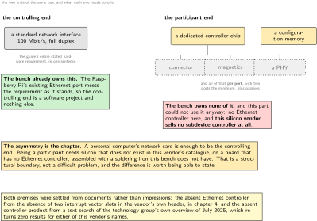
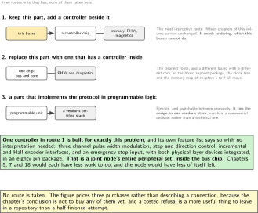
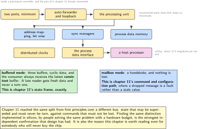
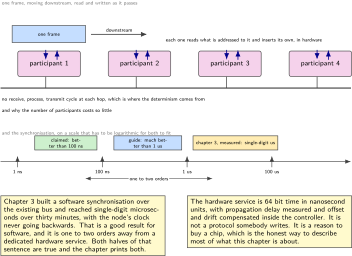
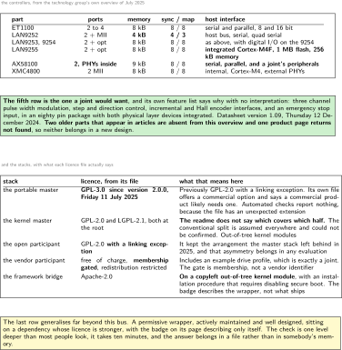

# Chapter 17. What a real-time fieldbus would change, and why it is not on this bench

> **What the node gains:** An honest boundary  
> **Theme:** Slave hardware, cycle time, the open master stack, what would have to be bought

> **Key facts**
>
> - **Adds to the node:** An honest boundary. The node gains a costed, sourced account of the one thing it cannot become, and the reader gains the ability to tell a structural limit from a lack of effort
> - **Peripherals:** None on this part, and that is the finding. The peripherals this chapter is about live on a chip nobody here owns
> - **Depends on:** Chapter 4 for what this part does not have, chapter 3 for the synchronisation this would replace, chapter 11 for the two message shapes it maps onto
> - **Real or modelled:** **Neither.** Nothing is built. Everything here is read, quoted, priced and decided, and the chapter says which of its claims come from documents it opened and which it could not confirm
> - **Difficulty:** 2 of 5 to read, 5 of 5 to build, and the gap between those two numbers is the chapter
> - **Effort:** Two evenings of reading. The published estimate for building it is **six to eight weeks**, and that estimate comes from the technology group itself
> - **Deliverable:** A decision document: what it would cost in parts, weeks and licence obligations, what it would buy in cycle time and synchronisation, and why this volume stops here

## Why this chapter

Sixteen chapters have built a joint node on a bus that is good enough for a joint and is not what a modern robot arm uses between its controller and its axes. The serious machines use a deterministic fieldbus on Ethernet wiring, and a volume that never mentioned that would be leaving out the thing a reader is most likely to be asked about.

So this chapter does the reading, and it reaches a conclusion that is stronger than difficult.

> [!NOTE]
> **The boundary is structural and it is settled twice over**
>
> This part has no Ethernet controller, which chapter 4 established from the absence of its interrupt vector slots rather than from a product page. And the silicon vendor whose part this is **sells no subdevice controller at all**: a text search of the technology group's own controller overview, dated July 2025, for either of that vendor's names returns zero results. So this is not a matter of effort or of skill. There is no combination of firmware and patience that turns this board into a participant on that bus, and knowing the difference between that and a hard problem is worth a chapter.

The asymmetry is the whole subject. The implementation guide states the requirement for the controlling end in one sentence: the only hardware requirement for a main device is a standard network interface controller at 100 megabit per second, full duplex. A personal computer's network card is enough. The other end needs a dedicated controller chip, a configuration memory, and per port a connector, magnetics, a physical layer device and passives. **The Raspberry Pi on this bench could be the master this afternoon. The node cannot be a participant at any price short of different hardware.**

## Prior art and what to reuse

| Source | What it gives | What it does not | Licence |
| --- | --- | --- | --- |
| The implementation guide, V3.2.0, Wednesday 7 August 2024 | The normative shape of both ends, the one-sentence requirement for the controlling end, the subdevice's internal blocks, and **an effort estimate from the technology group itself**: about six to eight weeks to reach a working subdevice operated by a standard main device | Nothing that helps a part with no Ethernet controller | technology group |
| The controller overview, July 2025 | **The chip list, extracted in full**, with ports, memory, sync managers and address-mapping units per part, and the host interfaces each offers | It is a list of parts to buy, which is the point | technology group |
| The open master stack, 2085 stars, last pushed Tuesday 8 September 2026 | A complete master in portable C, and since its 2.0.0 release of Friday 11 July 2025 a parser that turns a network description into compilable C | **Its licence file states GPLv3**, with a commercial option and a sentence saying a commercial product likely needs one. **The previous arrangement was GPLv2 with a linking exception, and that changed in 2025** | GPL-3.0 |
| The kernel-space master, default branch stable-1.6, active Saturday 19 September 2026 | The other serious open master: kernel modules, a userspace library and a command line tool | **Out-of-tree kernel modules.** Its root carries both a GPLv2 and an LGPLv2.1 file and **the readme does not state which applies to which half**, so the conventional split could not be confirmed | GPL-2.0 and LGPL-2.1 |
| The open subdevice stack, 847 stars, last pushed Tuesday 8 April 2025 | The other end in portable C: mailbox handling, an object dictionary, service data, process data mapping, file transfer, and an address-offset layer so it can reach a controller over any interface. **It kept the licensing arrangement the master stack left behind** | No controller, no description file, no vendor identifier and no conformance. Those are the four things that are not code | GPL-2.0 with a linking exception |
| The vendor subdevice stack | Portable C covering the state machine, several mailbox protocols, synchronisation and **an example drive profile**, which is exactly a joint | **Free of charge but gated behind membership, with redistribution restricted.** The gate is membership, not a vendor identifier | restricted |
| The robot framework bridge, Apache-2.0, 335 stars, last pushed Monday 31 August 2026 | A hardware interface in which devices are described in parameter files rather than in C++ per device, which is the right idea | **Its installation builds on the kernel-space master and requires disabling secure boot to load unsigned kernel modules.** A permissive wrapper does not remove the copyleft from the stack that actually gets deployed | Apache-2.0, on a GPL stack |

*Table 17.1. Prior art for chapter 17. The last row is the sentence most worth carrying away: the licence on the wrapper is not the licence on the deployed system, and a reader choosing a stack on the strength of a badge will be surprised later rather than sooner.*

## What the node gains

Nothing it can run. What it gains is a boundary that can be defended in a conversation: what the other bus does that this one does not, what it would cost in parts and weeks, which of that cost is money and which is obligation, and the specific reason this board is excluded. A portfolio that contains one clear statement of what was deliberately not built is more credible than one that contains none.

## Parts from the inventory

| Part | Role | Interface |
| --- | --- | --- |
| Raspberry Pi 4 | **Could be the controlling end today.** Its network interface already meets the only stated hardware requirement | Its existing Ethernet port |
| NUCLEO-H7A3ZI-Q | **Cannot be the other end, structurally.** No Ethernet controller, and no subdevice controller exists from this silicon vendor | n/a |
| A subdevice controller | **Not owned.** Would be bought, and then would need soldering, which this bench cannot do | Serial or parallel, to the node |
| Two physical layer devices, magnetics, two connectors and passives | **Not owned**, and required per port, with two ports the minimum | n/a |
| A configuration memory | **Not owned.** It holds the device's identity and its binary description | Two wires to the controller |

*Table 17.2. Inventory items for chapter 17. Four of five rows say not owned, and one of those says it would also need soldering, which the bench notes have recorded as impossible since chapter 1. That is the honest bill of materials for this chapter and it is why nothing here is built.*

## System architecture



*Figure 17.1. The asymmetry, drawn. On the left, the controlling end: one standard network interface, which is the guide's entire stated hardware requirement. On the right, the other end: a dedicated controller, a configuration memory, and per port a connector, magnetics, a physical layer device and passives. The bench owns everything on the left and nothing on the right, and no amount of firmware changes which side of that line this board is on.*

## Peripheral configuration

| Peripheral | Mode | Clock source | Pins and function | Interrupt and transfers |
| --- | --- | --- | --- | --- |
| Ethernet controller | **Absent on this part** | n/a | n/a | Established in chapter 4 from the absence of its vector slots |
| Subdevice controller | **Absent from this vendor's catalogue entirely** | n/a | n/a | Confirmed against the technology group's own overview of July 2025 |
| The process data interface | What the node **would** attach through, if the chip existed here | From the controller | Serial, or an 8 or 16 bit parallel bus | **Ceiling: about 12.5 megabytes per second** on that internal interface |
| Distributed clocks | What would replace chapter 3's software synchronisation | The bus itself | n/a | 64 bit, 1 nanosecond units, and the compensation happens in hardware |

*Table 17.3. Peripheral configuration for chapter 17. Two rows are absences and two are descriptions of hardware that is not here. The throughput ceiling in the third row is worth remembering: it is a published number, it is generous for a joint, and it is the kind of figure people assume is unlimited.*

## Wiring



*Figure 17.2. The three routes onto that bus, and what each one costs. Keep this part and add a controller beside it. Replace this part with one that has a controller inside. Or use a part that implements the protocol in programmable logic against a vendor stack. The first is the most instructive and needs soldering; the second is the cleanest and means a different board; the third is flexible and ties the design to one vendor's stack.*

Nothing is wired in this chapter. The figure prices three purchases rather than describing a connection, which is the right shape for a chapter whose conclusion is not to buy any of them yet.

## Memory and timing budget

This chapter's budget is not in bytes.

| Quantity | Budget | Published figure | Note |
| --- | --- | --- | --- |
| Synchronisation, this volume | single-digit microseconds | chapter 3, measured | software, over the existing bus |
| Synchronisation, that bus | **one to two orders better** | the guide claims much better than 1 microsecond; one controller vendor claims better than 100 nanoseconds | in hardware, with propagation delay measured and drift compensated |
| Process data interface ceiling | n/a | about 12.5 megabytes per second | published, and generous for a joint |
| Development effort | n/a | **six to eight weeks** | the technology group's own estimate, for a working subdevice |
| Parts, one node | n/a | controller, memory, two physical layer devices, magnetics, connectors, passives | plus assembly this bench cannot do |
| Vendor identifier | n/a | **free of charge**, and not required at all for a machine builder integrating devices | a corrected assumption |
| Conformance test tool | n/a | **a paid annual subscription**, and its in-house use is **mandatory when selling the device** | this is the real cost, and it is recurring |

*Table 17.4. The budget for chapter 17, in weeks, parts and obligations rather than bytes. The last two rows correct the assumption most people arrive with: the identifier everybody worries about is free, and the cost that actually bites is a recurring subscription to a test tool that the implementation guide makes mandatory before a device can be sold.*

## Firmware design (UML)



*Figure 17.3. Inside a subdevice controller, and the one part of it this volume has already built twice in software. The two arbitration modes map cleanly onto chapter 11's two message shapes: the buffered mode is the state frame, where a late reader wants the newest consistent value, and the mailbox mode is the command and configuration path, where nothing may be lost. Finding that the same distinction was made in silicon is a good sign about chapter 11.*

Three things are worth understanding even by somebody who will never build one.

**The processing is in hardware and happens while the frame moves.** Each participant reads the data addressed to it as the frame passes and inserts its own into the same frame on the way through. There is no receive, process, transmit cycle at each hop, which is where the determinism comes from and why the number of participants costs so little.

**Addressing is a hardware mapping.** Address-mapping units convert logical addresses to physical ones bit by bit, configured through registers, so a master can address a bit in the middle of one device's memory without that device's firmware being involved at all.

**Synchronisation is a hardware service, not a protocol you write.** The clock unit provides 64 bit system time in nanosecond units, with propagation delay measured and offset and drift compensated in the controller. Chapter 3 built a software equivalent over the existing bus and reached single-digit microseconds. That is a good result for software and it is one to two orders away from what dedicated hardware delivers, and saying both halves of that sentence is the honest comparison.

## Data flow (ASCII)

```text
  the controlling end                    the participants
  ------------------                     ----------------
  a standard network interface,          a dedicated controller chip,
  100 Mbit/s full duplex                 a configuration memory,
        |                                and PER PORT: a connector,
        |                                magnetics, a physical layer
        |                                device and passives
        |                                        |
        |   one frame, going downstream          |
        +--------------------------------------->+  reads what is addressed
        |                                        |  to it AS THE FRAME MOVES
        |                                        |  and inserts its own data
        |                                        |  into the same frame
        |                                        v
        |                                    next participant
        |                                        |
        +<---------------------------------------+  the frame returns

  what the bench has:   the left column, already, on the Pi
  what the bench has:   nothing at all in the right column
  what this part has:   no Ethernet controller (chapter 4), and its vendor
                        sells no subdevice controller (the July 2025 overview)

  the gap is a purchase and a soldering iron, not a firmware problem
```

## Repository layout

```text
joint-node/
  doc/
    fieldbus-decision.md      # + this chapter, and it is the whole deliverable
      what it would buy         cycle time, hardware synchronisation, the
                                profile a robot framework already speaks
      what it would cost        parts, six to eight weeks, a recurring
                                subscription before the device may be sold
      why not here              this part has no Ethernet controller and this
                                vendor sells no subdevice controller
      the three routes          add a chip, change the part, or use a soft
                                implementation tied to one vendor's stack
      licence findings          which stack changed licence and when, and
                                what the wrapper's badge does not cover
  src/  host/  test/  tools/  proto/  README.md      # all unchanged
```

## Steps

**Step 1.** **Settle the premise from documents rather than from impressions.** Two checks, both quick, and together they turn an opinion into a finding.

```text
check 1   does this part have an Ethernet controller?
          chapter 4 answered it from the ABSENCE of two interrupt vector
          slots in the vendor's own header, which is stronger evidence
          than a product page
check 2   does this vendor sell a subdevice controller at all?
          search the technology group's own controller overview, dated
          July 2025, for both of this vendor's names
          result: zero hits
conclusion  structural, not difficult
```

**Step 2.** **Read the one sentence that explains the whole asymmetry.** It is in the implementation guide and it is worth quoting exactly, because it is the reason a hobbyist can write a master in an evening and not a participant.

```text
the controlling end   "The only hardware requirement for an EtherCAT
                      MainDevice is a standard Network Interface Controller
                      (NIC, 100 Mbit/s full duplex)."
the other end         a dedicated controller chip, a configuration memory,
                      and per port a connector, magnetics, a physical layer
                      device and passives. Two ports minimum, with loops
                      closed automatically on unconnected ones.
```

**Step 3.** **Extract the chip list and choose the one a joint would actually want.** The overview is a table; reading it takes twenty minutes and it settles the hardware question for years.

```text
part       ports  memory  sync  mapping  host interface
ET1100     2 to 4   8 kB     8      8    serial and parallel, 8 and 16 bit
LAN9252    2 + MII  4 kB     4      3    host bus, serial, quad serial
LAN9253/4  2 + opt  8 kB     8      8    as above, with I/O on the 9254
LAN9255    2 + opt  8 kB     8      8    INTEGRATED Cortex-M4F core,
                                         1 MB flash, 256 kB memory
AX58100    2, PHYs  9 kB     8      8    serial, parallel
XMC4800    2 MII    8 kB     8      8    internal, Cortex-M4 core
```

**One part is obviously built for this problem**, and its own feature list says why without any interpretation: three channel pulse width modulation, step and direction control, incremental and Hall encoder interfaces, and an emergency stop input, with both physical layer devices integrated. That is a joint node's entire peripheral set, inside the bus controller, in an eighty pin package, with a datasheet at version 1.09 of Thursday 12 December 2024.

**Step 4.** **Record what is legacy, so nobody designs a new board around it.** Two parts that appear in older articles are not in the current overview and one product page returns not found. Write that down once.

**Step 5.** **Understand the two arbitration modes, because the distinction is already in this node.** They are worth knowing even if the chip never arrives.

```text
buffered mode   three buffers, cyclic process data, and the consumer always
                receives the latest CONSISTENT buffer. A late reader gets
                fresh data and never a torn one.
                  -> this is chapter 11's state frame, exactly
mailbox mode    a handshake, and no data is lost
                  -> this is chapter 11's command and configuration path
```

Chapter 11 reached the same split from first principles over a different bus. Finding it made in silicon is the strongest independent confirmation that chapter's design has had.

**Step 6.** **Get the description files straight, because the names are confusing and the direction of flow is not obvious.**

```text
the device file   vendor supplied XML against the group's schema: identity
                  (vendor, product code, revision), object dictionary,
                  process data mapping, sync manager configuration, and
                  which mailbox protocols the device supports
the network file  produced by a configuration tool that reads ALL the device
                  files on a network: topology, per device initialisation
                  commands, and the cyclic command list
who executes what THE MASTER EXECUTES THE NETWORK FILE. The device files are
                  inputs to a tool, not something the master reads at run time
the same, binary  lives in the device's own configuration memory
```

**Step 7.** **Price it honestly, and correct the two assumptions everybody arrives with.** This is the step that changes decisions.

```text
membership          free of charge
the vendor id       FREE OF CHARGE, and a machine builder integrating
                    devices is explicitly NOT required to obtain one
the conformance     A PAID ANNUAL SUBSCRIPTION, and the implementation guide
test tool           says its in-house use "is mandatory when selling the
                    device to the market"
so the real cost    is recurring, is attached to selling rather than to
                    building, and is not the thing people worry about
```

**Step 8.** **Read the licence files, not the badges, and write down what changed and when.** This chapter's licence findings are more useful than its technical ones, because they are the part that will have moved since anybody last looked.

```text
the open master     GPLv3 since version 2.0.0 on Friday 11 July 2025, with a
                    commercial option and a sentence saying a commercial
                    product likely needs one. It was GPLv2 with a linking
                    exception before that. Automated checks report nothing
                    only because the file is named LICENSE.md
the kernel master   a GPLv2 file and an LGPLv2.1 file at the root, and the
                    readme does NOT say which covers which half. The
                    conventional split is assumed and COULD NOT BE CONFIRMED
the open subdevice  GPLv2 WITH A LINKING EXCEPTION, which is the arrangement
                    the master stack left behind. The asymmetry is worth a
                    sentence in any evaluation
the vendor stack    free of charge, gated behind membership, redistribution
                    restricted. The gate is membership, not an identifier
```

**Step 9.** **Follow the robot framework bridge one level down before believing its badge.** This is the trap of the chapter and it generalises far beyond this bus.

```text
the wrapper        permissively licensed, actively maintained, and it lets
                   devices be described in parameter files instead of in
                   C++ per device, which is genuinely good design
what it sits on    the kernel-space master, which is out-of-tree kernel
                   modules under copyleft, and whose installation procedure
                   requires DISABLING SECURE BOOT to load unsigned modules
the conclusion     THE PERMISSIVE LICENCE ON THE WRAPPER DOES NOT REMOVE THE
                   COPYLEFT FROM THE STACK THAT GETS DEPLOYED, and the
                   secure boot requirement is a deployment decision somebody
                   senior should make rather than discover
```

**Step 10.** **Write the decision file and stop.** Four headings, two pages, and it is the chapter's only deliverable.

```text
doc/fieldbus-decision.md
  what it would buy    cycle times a joint would notice, hardware
                       synchronisation one to two orders better than
                       chapter 3's, and a drive profile a robot framework
                       already speaks
  what it would cost   parts this bench cannot solder, six to eight weeks by
                       the group's own estimate, and a recurring
                       subscription before the device may be sold
  why not here         this part has no Ethernet controller and this vendor
                       sells no subdevice controller: structural
  what would change it a different part, and the chapter names three
```



*Figure 17.4. What the money buys, drawn to scale. Above, one frame moving downstream while every participant reads and writes into it as it passes, which is where the determinism comes from and why participants cost so little. Below, the synchronisation comparison: chapter 3's software result over the existing bus against the published hardware figures, on a scale that has to be logarithmic for both to fit on one page.*

## Build, flash and debug



*Figure 17.5. The two tables this chapter exists to produce. Above, the controllers, with the one that carries a joint's entire peripheral set inside the bus chip marked. Below, the stacks, with what each licence actually says rather than what its badge reports, and the date the most important one changed.*

Nothing is built, so there is nothing to flash. The commands that belong to this chapter are the two searches that settled its premise, and they are worth being able to repeat.

```bash
# the two checks that turned an impression into a finding
grep -c 'ETH_IRQn\|ETH_WKUP_IRQn' vendor/Include/stm32h7a3xx.h   # expect 0
python tools/check_esc_overview.py --pdf esc_overview_2025-07.pdf --grep st
```

> [!NOTE]
> **When a permissive badge is on top of a copyleft stack**
>
> The pattern is common and this chapter's example is only one instance. A permissively licensed wrapper, actively maintained and well designed, sits on a dependency whose licence is stronger, and the badge shown on the wrapper's page describes the wrapper alone. What ships is the whole stack. The check is one level of dependency deeper than most people look, it takes ten minutes, and the answer belongs in a file rather than in somebody's memory.

## Verification and acceptance criteria

- The premise is settled from two documents, not from impressions, and both checks are repeatable from the repository.
- The asymmetry between the two ends is quoted from the implementation guide rather than paraphrased.
- The controller list is extracted with ports, memory, sync managers, mapping units and host interface per part.
- The part whose feature list already covers a joint's peripherals is identified, with its datasheet version and date.
- Legacy parts are recorded as legacy so that nobody designs a new board around them.
- The two arbitration modes are mapped onto chapter 11's two message shapes.
- The description file names and the direction of flow are stated correctly: the master executes the network file.
- The cost is stated with the two common assumptions corrected: the identifier is free, and the recurring test tool subscription is the real cost.
- Every stack's licence is read from its file, with the date of the most recent change recorded.
- The wrapper's dependency is followed one level down, and the conclusion is written in the repository.
- Claims that could not be confirmed are marked as such, including one standard this volume declines to cite at all.

## Variants

| Axis | Variant | What changes | Cost | Built in full in |
| --- | --- | --- | --- | --- |
| Route | Keep this part, add a controller | The most instructive: the node stays and the bus arrives beside it | A chip, a memory, two physical layer devices, magnetics, connectors, and soldering this bench cannot do | Nowhere |
| Route | A controller with a core inside | The cleanest: one chip is both the participant and the processor | A different board and a different core, so fifteen chapters of this volume move | Nowhere |
| Route | Soft, on programmable logic | Flexible and protocol switchable | Tied to one vendor's certified stack, and a different class of part | Nowhere |
| Master | The portable open stack | Runs anywhere, and since 2025 generates compilable C from a network description | **Copyleft since Friday 11 July 2025, and a commercial product likely needs a licence** | Nowhere |
| Master | The kernel-space stack | The other serious option, with a command line tool | Out-of-tree kernel modules, and an unconfirmed licence split | Nowhere |
| Master | The framework bridge | Devices described in parameter files rather than in C++ | **A permissive wrapper on a copyleft stack, plus disabling secure boot** | Nowhere |
| Participant stack | The open one | Portable C with an interface layer that reaches a controller over anything | Copyleft with a linking exception, and it supplies none of the four non-code things a device needs | Nowhere |
| Participant stack | The vendor one | Includes an example drive profile, which is exactly a joint | Membership gated, redistribution restricted | Nowhere |

*Table 17.5. Variants for chapter 17, and every row says nowhere. That is the point of the chapter. A variants table whose entire right-hand column is a refusal is more useful than a table that quietly implies everything was tried, provided the refusals are costed, and these are.*

## Pitfalls

- Treating this as a hard problem rather than a structural one. No firmware turns a part with no Ethernet controller into a participant on this bus.
- Assuming the two ends are symmetric. One needs a network card; the other needs a chip, a memory and a physical layer per port.
- Assuming the vendor identifier is the expensive part. It is free, and a machine builder integrating devices does not need one at all.
- Missing the cost that is real: a recurring subscription to a test tool whose in-house use the implementation guide makes mandatory before selling.
- Reading a licence badge instead of a licence file. One major stack here changed licence in 2025 and automated checks still report nothing, because the file has a different extension than the checker expects.
- Trusting a permissive wrapper's licence to describe the stack it deploys.
- Designing a new board around a controller that is no longer in the current overview.
- Confusing the two description files, or believing the master reads the device files at run time. It executes the network file a tool produced.
- Citing a standard that the documents do not mention. One commonly repeated reference could not be found anywhere in the material this volume read, and is therefore not cited here.
- Assuming the internal interface is fast enough for anything. It has a published ceiling of about 12.5 megabytes per second, which is generous for a joint and finite for other things.

## Best practices applied

- A limit is proven from primary documents rather than asserted, and the proof is repeatable.
- A decision not to build is written down, costed, and given the same care as a decision to build.
- Every licence is read from its own file, and the date of the most recent change is recorded.
- A dependency is followed one level deeper than its badge.
- An independent design's agreement with an earlier chapter is noticed and reported as evidence rather than as coincidence.
- Claims that could not be confirmed are marked, including a standard this volume declines to cite.
- A published effort estimate is used instead of an invented one, and its source is named.

## Stretch goals

- Run the controlling end on the Pi against a simulated participant, which costs nothing but time and would make the asymmetry concrete rather than quoted.
- Buy the joint-friendly controller and an evaluation board for it, and find out whether its integrated pulse width modulation, step and direction, encoder interface and emergency stop input really do replace chapters 5, 7 and 18's hardware.
- Write a device description file for this node's existing object model, as a paper exercise, and see how much of chapter 15's mapping survives the translation.
- Measure the kernel-space master's cycle jitter on a stock kernel and on a real-time one, which is the same measurement chapter 16 wanted and nobody publishes.

## Roadmap and next steps

Chapter 18 returns to hardware that is on the bench, and to the one question a joint must answer before it is allowed near anybody: how it stops.

The published progression from here is the implementation guide, which is readable and free and settles most of what a newcomer wants to know, followed by the controller overview for the hardware question and the device information specification for the description files. For the drive profile a joint would implement, the directive is the right entry point, and it is a directive rather than the profile itself, which is a distinction worth keeping straight.

## Portfolio evidence

- The decision file, which is two pages and demonstrates costing an option out rather than avoiding it.
- The licence findings, including one stack that changed licence in 2025, one whose split could not be confirmed, and one permissive wrapper on a copyleft dependency.
- The corrected cost picture, which contradicts the common assumption in both directions.
- The observation that chapter 11's two message shapes match the two arbitration modes implemented in silicon.

## Sources

Normative references:

- ETG.2200, "EtherCAT Implementation Guide", V3.2.0, Wednesday 7 August 2024, from which the hardware requirement for the controlling end, the six to eight week effort estimate, the process data interface ceiling and the conformance test tool obligation are all quoted.
- ETG, "EtherCAT SubDevice Controller (ESC) Overview", July 2025, from which the controller table is extracted, and against which this chapter's second premise check was run.
- ETG.2000, "EtherCAT SubDevice Information (ESI) Specification", V1.21, Monday 26 May 2025. Note that the current title says SubDevice, not Slave.
- ETG.2010 for the configuration memory interface, ETG.2100 for the network information, ETG.5001 for the modular device profile, ETG.6010 for the drive profile implementation directive, and ETG.5100 for safety.
- ETG.1000 represents IEC 61158 Type 12. Both the bus and its safety layer are IEC standards, IEC 61158 and IEC 61784, and the drive profile a joint would implement, CiA 402, is IEC 61800-7-201. **The individual titles of the ETG.1000 parts could not be confirmed and are not printed here. A further standard that is frequently cited alongside these appears nowhere in the material read for this volume and is therefore not cited at all.**

Reusable implementations:

- The portable open master, GPL-3.0 since version 2.0.0 of Friday 11 July 2025, previously GPL-2.0 with a linking exception.  
  <https://github.com/OpenEtherCATsociety/SOEM>
- The portable open participant stack, GPL-2.0 with a linking exception.  
  <https://github.com/OpenEtherCATsociety/SOES>
- The kernel-space master, GPL-2.0 and LGPL-2.1 at the root with the split unstated.  
  <https://gitlab.com/etherlab.org/ethercat>
- The robot framework bridge, Apache-2.0, which deploys on the kernel-space master.  
  <https://github.com/ICube-Robotics/ethercat_driver_ros2>

---

[Previous](16-the-loop-closed-over-the-bus.md) &nbsp;&nbsp;|&nbsp;&nbsp; [Contents](../README.md) &nbsp;&nbsp;|&nbsp;&nbsp; [Next](18-safe-states.md)
