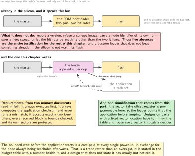
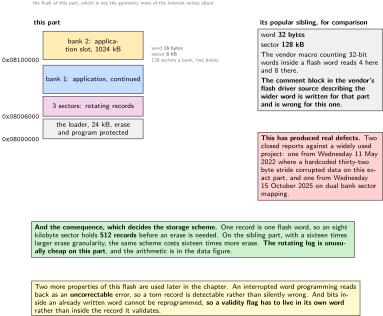
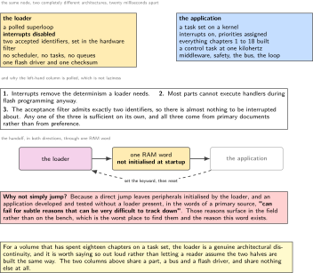
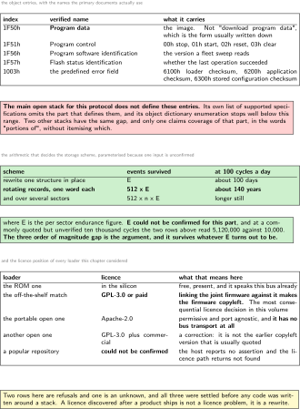
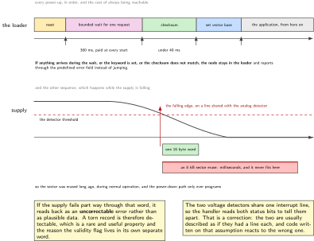

# Chapter 19. Update over the bus: a node you can reach but not touch

> **What the node gains:** Maintainability  
> **Theme:** Transport for update, a bootloader that stays addressable, versioning across a fleet

> **Key facts**
>
> - **Adds to the node:** Maintainability. A joint inside a machine cannot be unplugged, so the only way to change its firmware is the wire it already has, and the only way to know what is running on it is to ask
> - **Peripherals:** The bus controller, the flash interface with its error correction, the voltage detector, and one RAM location the startup code must leave alone
> - **Depends on:** Chapter 4 for the flash geometry, chapter 9 for the bus, chapter 11 for the object model, chapter 18 for what must be safe before an update begins
> - **Real or modelled:** **Real, and it starts with a correction:** the ROM bootloader in this part already speaks the bus, so the chapter opens by finding half the job done and asking what the other half is worth
> - **Difficulty:** 5 of 5
> - **Effort:** Four evenings, and the licence decision in the third one is the most consequential in the volume
> - **Deliverable:** A bootloader that is always reachable and never runs a bad image, a power-down path that survives the supply falling mid-write, a fleet sweep that reports what every node is running, and a licence decision written down before any code was built around it

## Why this chapter

Eighteen chapters have built a node that would be bolted inside a machine. At that point the debug probe is on the wrong side of a housing, and everything this volume has built is only as maintainable as its worst update path.

The chapter opens with a correction, because the research turned up something better than expected.

> [!NOTE]
> **The bootloader in the silicon already speaks this bus**
>
> The part's own ROM bootloader exposes, besides the usual serial and USB routes, **the flexible-data bus on two specific pins, at 250 kbit/s nominal and 1000 kbit/s data, with bit rate switching, and its clock fixed at 20 MHz**. The vendor's application note gives it in a table, and its detection chain figure shows **the bus is polled first**. So this board can be reflashed over the same wire the joint uses, today, with no bootloader of anybody's writing. That is the chapter's opening and it is also the baseline: a custom bootloader has to be worth more than something that is already in the silicon and costs nothing. One caution: the note's revision matters, a newer revision is indexed but was not read, and pin numbers are exactly the kind of thing that moves between revisions.

What the ROM bootloader does not do is report a version, refuse a corrupt image, survive a supply falling mid-write, or tell a fleet master what twelve joints are running. That is what the rest of the chapter is for.

## Prior art and what to reuse

| Source | What it gives | What it does not | Licence |
| --- | --- | --- | --- |
| The vendor's system bootloader note, revision 61, January 2024 | **The correction that opens this chapter**: the peripheral list for this exact part, the two pins, both bit rates, and the detection order. Also that the independent watchdog is refreshed for you in system memory boot mode | Version reporting, image validation, and any behaviour a fleet needs. **A newer revision exists and was not read** | vendor |
| An integrator's bootloader note, read in full | The object indices for program data, program control, software identification and flash state, and a captured trace of a real session. Plus a list of requirements this chapter follows rather than invents | Its own loader implements no address-assignment server, so addressing is a design choice rather than something inherited | vendor |
| A conference paper on bootloader security, read in full | The requirement list again, from a second independent pen, plus the handoff-keyword argument and the reasoning for polling rather than interrupts | **It disagrees with the note above about block transfer**, and the chapter shows both rather than picking quietly | proceedings |
| The portable open bootloader, Apache-2.0, 2122 stars, last pushed Friday 18 September 2026 | **Port agnostic by its own porting guide**: a port supplies a flash map, an area interface and a configuration header. Primary and secondary slots, three upgrade strategies, a 32 byte header and a trailer whose magic encodes the write alignment | **It has no bus transport, and neither does its management protocol**, whose transports are Bluetooth, console-framed serial and raw serial only. **The bus half is the gap this chapter fills** | Apache-2.0 |
| The closest off-the-shelf match, 973 stars | Exactly this problem solved: serial, the bus in both frame formats, network, USB and more, on this family | **It is copyleft or paid commercial, so linking the joint firmware against it makes the whole firmware copyleft.** This is the most consequential licence decision in the volume and it is stated here rather than discovered later | GPL-3.0 |
| The kernel's own segmented transport | **Better than every open implementation for the host side**, and it states plainly that it works on both frame formats. Its third socket option group is what lets a master drive a sixty-four byte link | Nothing on the node. **The claim about which kernel version introduced it could not be confirmed**, so no version is printed | GPL-2.0 |
| Two update architecture documents from the standards body, April 2021 and January 2022 | An architecture and a manifest information model, **both Informational and both free to redistribute, which makes them the safest normative references in this entire volume** | Neither is specific to a bus or to a part | free |

*Table 19.1. Prior art for chapter 19. The fifth row is why this table exists: an excellent, maintained project solves this exact problem and its licence would follow the joint node's firmware wherever it went. Knowing that before writing code around it is worth more than any amount of cleverness afterwards.*

## What the node gains

A node that can be reached but not touched. Specifically: a loader that always executes first and is always addressable, an image that is never executed without its checksum matching, a configuration store that survives the supply falling in the middle of a write, and a fleet sweep that answers what is running where without anybody opening a cabinet.

## Parts from the inventory

| Part | Role | Interface |
| --- | --- | --- |
| NUCLEO-H7A3ZI-Q | The node being updated, and the part whose flash geometry is **not its better known sibling's** | The bus |
| Raspberry Pi 4 | The update master and the fleet sweep, using the kernel's own segmented transport | The bus |
| The ROM bootloader | **Already present, already speaking this bus**, and the baseline the custom loader is measured against | Two specific pins |
| The flash error correction | **Works in this chapter's favour**: an interrupted word programming reads back as an uncorrectable error, so a torn record is detectable rather than silently wrong | On-die |
| The voltage detector | Seven thresholds plus an external-input selection, and the edge that starts the power-down write | Shares one interrupt line with the analog supply detector |

*Table 19.2. Inventory items used in chapter 19. Nothing new is bought. The third row is the chapter's opening correction and the fourth is the finding that makes a torn write detectable, which is the single most useful property this part has for the job.*

## System architecture



*Figure 19.1. Two update paths and what each one is worth. The upper path is already in the silicon and costs nothing to use. The lower path is the chapter, and it exists for the four things the upper one does not do: report a version, refuse a corrupt image, stay addressable on the node's own identifier, and answer a fleet sweep. The requirements beside it come from two primary documents read in full, not from this volume's preferences.*

## Peripheral configuration

| Peripheral | Mode | Clock source | Pins and function | Interrupt and transfers |
| --- | --- | --- | --- | --- |
| Bus controller, in the loader | **Polled, never interrupt driven** | Fixed bit rate, or a small tested set | Unchanged | **Hardware filtering admits two identifiers**: the request and the network management one |
| Flash interface | Word programming only in the power-down path | Unchanged | None | Error correction callbacks enabled |
| Voltage detector | Threshold set **below nominal and above the flash programming minimum** | Unchanged | Optionally an external analog input | Falling edge, and **it shares one interrupt line with the analog detector** |
| The vector table offset | **Programmable on this part**, so the loader points it at the application before jumping | n/a | n/a | Which removes the need for vector mirroring entirely |
| One RAM word | **Excluded from startup initialisation** | n/a | n/a | The handoff keyword, in both directions |

*Table 19.3. Peripheral configuration for chapter 19. The fourth row is a real simplification that comes from this part rather than from cleverness: designs on parts with a fixed vector location have to mirror the table and route every vector through a decider, and this part's programmable offset register makes all of that unnecessary.*

## Wiring



*Figure 19.2. The flash, drawn to its real geometry, which is not the geometry of the part most of the internet writes about. A sixteen byte word and an eight kilobyte sector, against that part's thirty-two byte word and one hundred and twenty-eight kilobyte sector. The consequence is at the bottom: an eight kilobyte sector holds five hundred and twelve records of one word each, and that number is the whole argument for a rotating log.*

Nothing is wired in this chapter. The figure is a memory map because the memory map is the thing this chapter is about, and because the difference between this part's geometry and its sibling's has already produced at least two reported defects in other people's code.

## Memory and timing budget

| Quantity | Budget | Measured | Margin |
| --- | --- | --- | --- |
| Flash, the loader | 24 kB, and it sits in its own protected sectors | not measured | not measured |
| Static memory, the loader | 4 kB, and it is a superloop rather than a task set | not measured | not measured |
| Application slot | 1024 kB, one whole bank | n/a | n/a |
| Configuration sectors | 3 sectors of 8 kB, rotating | n/a | n/a |
| Bounded wait before starting the application | 300 ms | not measured | not measured |
| Checksum over the application | under 40 ms | not measured | not measured |
| Power-down write | **one 16 byte word, and never an erase** | not measured | not measured |
| Records per sector before an erase | **512** | arithmetic | n/a |

*Table 19.4. The budget for chapter 19. The fifth row is a cost paid at every single power-up in exchange for always being reachable, and it is stated as a trade rather than hidden. The last two rows are the chapter's most important arithmetic and they are done in full in the data figure.*

## Firmware design (UML)



*Figure 19.3. The architectural break, which is the part of this chapter most likely to surprise somebody. The application is a task set on a kernel. The loader is a polled superloop with interrupts off, and that is not laziness: it is required by three separate constraints, all named in the figure. Below it, the handoff in both directions through one RAM word that the startup code must not initialise, and why a direct jump without that word is the source of defects that appear only in the field.*

Four rules, all of them taken from primary documents rather than invented.

**The loader always executes first and always checks.** The reset vector points at it at all times, and it computes the application's checksum on every start and never executes on a mismatch.

**No interrupts. Poll.** Three reasons and any one of them is enough: interrupts remove the determinism a loader needs, most parts cannot execute handlers during flash programming anyway, and the hardware acceptance filter is set to admit exactly two identifiers so there is nothing to be interrupted about.

**Every received block is bounds checked against the application flash boundaries**, out of range writes are rejected with an abort, and the loader's own sectors are erase and program protected where the hardware allows.

**The handoff travels in one RAM word that the startup code does not initialise.** A direct jump leaves peripherals configured by the loader, and an application developed and tested without a loader present can fail for subtle reasons that are very difficult to track down, often surfacing only in the field. That sentence is from a primary source and it is the reason the keyword exists.

## Data flow (ASCII)

```text
  reset
    |
    v
  the loader, ALWAYS, with interrupts off and two identifiers accepted
    |
    +-- is the handoff keyword set in the uninitialised RAM word?
    |        yes --> stay in the loader, clear the keyword
    |
    +-- wait a BOUNDED period for one specific request on the bus
    |        something arrived --> stay in the loader
    |
    +-- compute the application checksum
    |        mismatch --> stay in the loader, report through the error object
    |
    v
  set the application's vector base (this part has a programmable offset
  register, so no vector mirroring is needed)
    |
    v
  the application: a task set, interrupts on, everything chapters 1 to 18 built
    |
    +-- a request to update arrives --> set the keyword --> reset
    |
    +-- the supply sags
             |
             v
       the detector's falling edge, one interrupt line shared with the
       analog detector, so read both status bits to tell them apart
             |
             v
       program ONE 16 BYTE WORD into a pre-erased sector
       AN ERASE NEVER FITS IN THIS WINDOW: an 8 kB sector erase runs into
       milliseconds, and the window does not
             |
             v
       if the supply fails mid-word, that word reads back as an
       UNCORRECTABLE ERROR, which is how a torn record is detected rather
       than silently believed
```

## Repository layout

```text
joint-node/
  boot/                            # + this chapter: a separate build entirely
    main.c                         # + a superloop, not a task set
    bus_poll.c                     # + two identifiers, no interrupts
    flash16.c                      # + 16 byte words, 8 kB sectors, THIS part
    image.c                        # + checksum, bounds, and the refusal
    handoff.h                      # + the RAM word, in its own linker section
    boot.ld                        # + its own sectors, protected
  src/
    update/
      update_server.c              # + the object entries the master writes to
      version.c                    # + what a fleet sweep reads back
    store/
      record.c                     # + one 16 byte record, rotating
      powerfail.c                  # + the detector edge, and one word
    safety/ control/ bus/ mw/ ...
  host/
    flash_node.py                  # + segmented transfer over the kernel socket
    fleet_sweep.py                 # + every identifier, what each is running
  doc/
    bootloader-licence.md          # + the decision, and why, dated
    flash-geometry.md              # + this part, not its sibling
  test/  tools/  proto/  README.md
```

## Steps

**Step 1.** **Use the ROM bootloader first, and write down what it does not do.** An hour spent here produces the baseline the rest of the chapter is judged against.

```bash
# boot the part from system memory, then talk to it over the bus
python host/rom_flash.py --node can0 --bitrate 250000 --data-bitrate 1000000 \
       --image build/firmware.bin
# it works. Now write down what it did not do:
#   no version reported, no image validation, no node identifier of its own,
#   no answer to a fleet sweep, and its bit rates are fixed
```

**Step 2.** **Get this part's flash geometry right, from its own headers.** This is where ported code fails, and the failure is silent data corruption rather than a compile error.

```text
this part            word 128 bits = 16 bytes, sector 8 kB,
                     128 sectors a bank, two banks
its popular sibling  word 256 bits = 32 bytes, sector 128 kB
the vendor macro     counts 32-bit words in a flash word: 4 here, 8 there
CAUTION              the comment block in the vendor's flash driver source
                     describing the wider word IS WRITTEN FOR THE SIBLING
                     and is wrong for this part. Do not quote it.
evidence             two closed defect reports against a widely used project:
                     one from Wednesday 11 May 2022 where a hardcoded 32 byte
                     stride corrupted data on this exact part, and one from
                     Wednesday 15 October 2025 on dual bank sector mapping
```

**Step 3.** **Let the error correction do the hard part.** Each bank reports single and double errors with a failing address, and the design consequence is better than anything software could arrange.

```c
/* record.c: a torn write is DETECTABLE, which is rare and worth using. */
/* An interrupted flash word reads back as an uncorrectable double error.   */
/* Corollary: bits inside an already written word cannot be reprogrammed,   */
/* SO THE VALIDITY FLAG MUST LIVE IN ITS OWN WORD, not inside the record.   */
typedef struct { uint8_t payload[16]; } rec_t;       /* one word exactly */
typedef struct { uint32_t valid_magic; uint8_t pad[12]; } rec_flag_t;
```

**Step 4.** **Do the endurance arithmetic before choosing a storage scheme, because it decides the answer by three orders of magnitude.** The endurance figure itself could not be confirmed, so the arithmetic is parameterised and the conclusion does not depend on the number.

```text
one record            one 16 byte flash word
one 8 kB sector       512 records before an erase is needed
rotating log          survives 512 x (the per sector endurance figure)
read, erase, rewrite  survives (the per sector endurance figure) alone

at a commonly quoted but UNVERIFIED 10,000 cycles:
  rotating log        5,120,000 events
  rewrite in place       10,000 events
at 100 power cycles a day that is roughly 140 years against 100 days.

AND: on this part the rotating scheme is unusually cheap, because the erase
granularity is SIXTEEN TIMES SMALLER than on the sibling part.
```

**Step 5.** **Build the power-down path around one word, and never an erase.** The window is what it is, and the design has to fit inside it rather than hope.

```c
/* powerfail.c: the two detectors share one interrupt line. Read both bits. */
void EXTI_VoltageDetectors_Handler(void)
{
    bool core_low  = pwr_status_core_below_threshold();
    bool analog_low = pwr_status_analog_below_threshold();
    if (core_low) {
        store_program_one_word(&g_pending);   /* 16 bytes, pre-erased sector */
    }                                         /* NEVER an erase: it is ms   */
    (void) analog_low;                        /* logged, not acted on here  */
}
```

The sector is pre-erased during normal operation and a clean one is kept ready, so the power-down path only ever programs. An eight kilobyte erase runs into milliseconds and the holdup window does not, and that is not a tuning problem.

**Step 6.** **Make the loader a polled superloop, and explain the break.** This is an architectural discontinuity in a volume that has spent eighteen chapters on a task set, and it deserves a paragraph rather than a shrug.

```c
/* boot/main.c: no scheduler, no interrupts, two identifiers, one loop. */
for (;;) {
    if (bus_poll_frame(&f)) handle_request(&f);   /* SDO request, or NMT */
    if (timeout_expired() && image_checksum_ok()) jump_to_application();
}
```

**Step 7.** **Implement the object entries the update protocol defines, with their verified names.** Four entries, and one of them is commonly written down with a longer name that the primary documents do not use.

```text
1F50h   Program data                    (not "download program data")
1F51h   Program control  00h stop, 01h start, 02h reset, 03h clear
1F56h   Program software identification
1F57h   Flash status identification

and for the fleet sweep, from a captured trace in a primary document:
1000h   device type
1008h   manufacturer device name        value "Boot" identifies loader mode
1018h   sub 1 to 4: vendor, product code, revision, serial number
```

A caution that belongs beside this table: **the main open stack for this protocol does not define these entries**. Its own list of supported specifications omits the part that defines them, and its object dictionary enumeration stops well below this range. Two other stacks have the same gap and only one claims coverage of that part, in the words "portions of", without itemising.

**Step 8.** **Choose between segmented and block transfer, and show the reader that the sources disagree.** This is the most interesting single page in the chapter, because both sides are credible.

```text
the integrator's note  moves the image by BLOCK download, and its captured
                       trace shows forty-five blocks
the conference paper   argues AGAINST block transfer in a loader: it needs
                       back to back frame buffering in a polled driver, adds
                       RAM and significant code space, and segmented access
                       has to be implemented anyway, so segmented transfer
                       "should be the preferred choice"
this volume            follows the paper, because the loader is polled and
                       the argument turns on exactly that. The note is not
                       wrong; it is written for a different set of
                       constraints, and saying so is more useful than
                       picking one quietly
```

**Step 9.** **Carry the handoff in a RAM word the startup code leaves alone, in both directions.** The reason is a sentence from a primary source and it is worth quoting in the repository.

```c
/* handoff.h: its own linker section, excluded from startup initialisation. */
#define HANDOFF_STAY_IN_LOADER   0xB007C0DEu
extern volatile uint32_t g_handoff __attribute__((section(".noinit")));
/* Why not just jump? Because a direct jump leaves peripherals initialised  */
/* by the loader, and an application developed and tested WITHOUT a loader  */
/* present "can fail for subtle reasons that can be very difficult to track */
/* down", usually in the field rather than on the bench.                    */
```

**Step 10.** **Decide where forced entry lives, and follow the published caution.** Writing to the program control entry is the standard way in, and the primary source warns about implementing that entry in the application.

```text
the standard way in    the master writes 00h to program control, sub 1
the published caution  implementing that entry INSIDE THE APPLICATION would
                       let any tool on the bus stop the application, and the
                       source says plainly it is not recommended for
                       security reasons
the recommendation     a physical input pin, for the case that matters: an
                       application whose checksum passes but which does not
                       communicate
this volume            implements the entry in the LOADER only, and uses a
                       pin for the stuck-but-valid case
```

**Step 11.** **Report errors through the predefined error object rather than inventing a channel.** A code in the low sixteen bits and free information in the upper sixteen, with the assignment a primary source suggests.

```text
6100h   loader checksum wrong
6200h   application checksum wrong
6300h   stored configuration checksum wrong
```

**Step 12.** **Write the fleet sweep, which is the half of this chapter that justifies the other half.** Twelve joints, one command, and an answer that fits on a screen.

```bash
python host/fleet_sweep.py --iface can0
# node  vendor   product  rev   serial     version        mode
#    1  0x0247   0x0001   3     00A31C07   1.4.2          application
#    2  0x0247   0x0001   3     00A31C11   1.4.2          application
#    7  0x0247   0x0001   3     00A31C2B   1.3.9          application  <- old
#   11  0x0247   0x0001   3     00A31C44   -              Boot         <- stuck
```

The last two lines are the reason this exists. Nobody opens a cabinet to find out which joint is behind, and nobody guesses which one failed an update.

**Step 13.** **Version it properly, and cite documents a reader may actually redistribute.** The versioning specification is freely quotable, and the two architecture documents from the standards body are Informational and free to redistribute, which makes them the safest normative references anywhere in this volume.



*Figure 19.4. The object entries with their verified names, the endurance arithmetic that decides the storage scheme by three orders of magnitude, and the licence position of every loader this chapter considered. The middle block is the one to read twice: its input could not be confirmed, so it is parameterised, and the conclusion survives whatever the real figure turns out to be.*

## Build, flash and debug



*Figure 19.5. Two sequences that decide whether this node is maintainable. Above, every power-up: the loader runs, waits a bounded period, checks, points the vector base at the application and jumps. That bounded wait is paid at every start in exchange for always being reachable. Below, the power-down path: one detector edge, one sixteen byte word programmed into a sector that was erased long ago, and the reason an erase can never appear on that line.*

```bash
cmake --build build -j --target bootloader firmware
python host/flash_node.py --iface can0 --node 7 --image build/firmware.bin
python host/fleet_sweep.py --iface can0
python host/provoke.py --brownout-during-write --runs 500 --expect-detected
```

> [!NOTE]
> **One package with three different licence statements**
>
> This chapter's research found a vendor package whose release notes name a permissive three clause licence and point at a vendor licence page, whose individual source files carry headers pointing at the canonical permissive text, **and whose archive also ships a licence agreement document stating that the licensee may not sell, assign, sublicense, lease, rent or otherwise distribute the software commercially**. Three statements, one archive. Nothing from it is used here. The general lesson is worth more than the specific case: a licence is what the files and the archive say together, not what the prettiest of those statements says.

## Verification and acceptance criteria

- The ROM bootloader route is exercised once and what it does not do is written down.
- The flash driver uses this part's word and sector sizes, taken from its own headers, and a host test rejects the sibling's values.
- An interrupted word programming is detected as an uncorrectable error rather than read back as data, proven over five hundred provoked brown-outs.
- The validity flag lives in a separate flash word from the record it validates.
- The endurance arithmetic is in the repository, parameterised, with the unverified figure marked as unverified.
- The power-down path programs exactly one word and never attempts an erase.
- The loader runs with interrupts disabled and an acceptance filter admitting two identifiers.
- The loader computes the application checksum on every start and refuses to jump on a mismatch, proven by corrupting one byte.
- Every received block is bounds checked, and an out of range write produces an abort rather than a write.
- The handoff keyword survives a reset, is cleared by the loader, and lives in a section the startup code does not initialise.
- The vector base is set before the jump, proven by taking an interrupt in the application immediately afterwards.
- The program control entry exists in the loader and **not** in the application.
- A fleet sweep over twelve identifiers reports vendor, product, revision, serial, version and mode for each, and identifies a node stuck in loader mode.
- The bootloader licence decision is in a dated file, written before any code was built around a stack.

## Variants

| Axis | Variant | What changes | Cost | Built in full in |
| --- | --- | --- | --- | --- |
| Loader | The ROM one, already present | Free, in the silicon, and it speaks this bus | No version, no validation, no identifier, fixed bit rates | Here, as the baseline |
| Loader | The off-the-shelf match | Solves this exact problem, on this family, in both frame formats | **Copyleft or paid: linking makes the joint firmware copyleft** | Nowhere, and the reason is printed |
| Loader | The portable open one | Permissive, port agnostic, slots, upgrade strategies, a defined header | **No bus transport at all**, so the transport is the author's | Nowhere, and the gap is the chapter |
| Loader | Written here | Exactly the requirements two primary documents state | Four evenings, and it must beat something that is free | Here |
| Transfer | Block download | What a vendor note's captured trace does | Back to back buffering in a polled driver, plus RAM and code space | Nowhere, and the disagreement is shown |
| Transfer | Segmented | What a conference paper recommends for a polled loader | More frames for the same image | Here |
| Transfer | The automotive service set | A different vocabulary for the same job, with a published programming process clause | A different stack on both ends | Nowhere, and named |
| Storage | Rewrite one structure | Simplest | **Three orders of magnitude fewer cycles** | Nowhere |
| Storage | Rotating records | 512 per sector on this part, which is the argument | Slightly more code to find the newest | Here |
| Storage | A log structured library | Wear levelling and garbage collection, already written | Footprint, and most have no published figures | Nowhere, and the table names which one does |
| Addressing | Fixed node identifier | Simplest, and what a bench needs | Two identical nodes cannot share a bus | Here |
| Addressing | Layer setting services | The standard route for an unconfigured node | A second protocol in the loader | Nowhere, and it is named as a design choice rather than a given |

*Table 19.5. Variants for chapter 19. The second row is the most consequential refusal in the volume. An excellent maintained project solves this problem completely, and its licence would travel with the joint node's firmware into every product that used it.*

## Pitfalls

- Writing a bootloader without first finding out that the part already has one that speaks this bus.
- Using the sibling part's flash word or sector size. The consequence is silent data corruption, and it has already been reported twice against a widely used project.
- Quoting the comment block in the vendor's flash driver about the flash word width. It is written for the sibling part.
- Putting a validity flag inside the record it validates. Bits in an already written word cannot be reprogrammed.
- Attempting an erase in the power-down path. A sector erase runs into milliseconds and the window does not.
- Assuming the two voltage detectors have separate interrupt lines. They share one, and the handler disambiguates by reading the status bits.
- Rewriting one structure in place, and discovering the endurance figure three orders of magnitude later than you wanted to.
- Running the loader with interrupts enabled.
- Jumping to an application without setting the vector base first.
- Jumping without a handoff keyword and then spending a season on defects that appear only in the field.
- Implementing the program control entry in the application, which lets any tool on the bus stop it.
- Assuming the main open stack for this protocol implements the update entries. It does not, its own specification list omits the relevant part, and two other stacks have the same gap.
- Linking against a copyleft loader and discovering the obligation after the product ships.
- Citing the older title of the vendor's emulation note. It was renamed, and the renaming is recorded in its own revision history.
- Assuming the vendor's emulation package covers this family. It does not, and the string identifying this family does not appear anywhere in the current revision of its note.

## Best practices applied

- The existing capability is found and used before anything is written.
- Geometry is taken from the part's own headers, and a comment written for a different part is identified as such.
- A hardware property is used rather than worked around: error correction makes a torn write detectable.
- An arithmetic argument decides a design, and it is parameterised because one of its inputs could not be confirmed.
- Two credible sources that disagree are both presented, with a reason for the choice made.
- Requirements come from primary documents read in full, and are marked as such rather than presented as this volume's preferences.
- The most consequential licence decision is made and dated before code is built around it.
- A package with three conflicting licence statements is named as a lesson rather than quietly avoided.
- References are chosen partly for whether a reader may redistribute them.

## Stretch goals

- Port the permissive open bootloader to this part and write the bus transport it lacks. That transport does not exist, the interface it needs is documented, and the result would be genuinely useful to other people.
- Measure the actual holdup window on this board and find out how many sixteen byte words really fit, rather than designing for one and hoping.
- Implement the address assignment services so that two identical joints can share a bus out of the box.
- Sign the image and verify the signature in the loader, which is the half the free bootloader article explicitly does not cover.
- Run the same update over the automotive service set as well, and compare the two vocabularies on frame count, code size and how much of each is already implemented by something on the host.

## Roadmap and next steps

Chapter 20 is the last one and it is the one that makes the other nineteen believable: a rig that injects faults, measures tracking error and turns a build red when something regresses, with nobody at the bench.

The published progression from here is the two architecture documents from the standards body, because they are free, redistributable and short; then the configuration and program download specification for the object entries, noting that it is a members-only document while the base specification is not; and then the automotive application layer standard's programming process clause, which is the model a fleet master follows whatever protocol it speaks underneath.

## Portfolio evidence

- The opening correction: finding that the part already does half the job, and saying so instead of building it again.
- The flash geometry document, which is short and prevents a defect that has already occurred twice in public.
- The endurance arithmetic, parameterised, with its unverified input marked.
- The two-sources-disagree page, which demonstrates reading rather than searching.
- The licence decision file, dated, with the alternative named and costed.
- The fleet sweep output, which is the kind of thing a maintenance engineer recognises immediately.

## Sources

Normative references:

- The vendor's system bootloader application note, revision 61, January 2024, section and table read at a fetchable mirror, for this part's peripheral list, both bit rates, the two pins and the detection order. **A revision 70 dated February 2026 is indexed only and was not read: check the revision before relying on pin numbers.**
- The configuration and program download specification, and the base application layer specification version 4.2.0, for the object entries. **Licence position: the base specification is freely available after registration, and the part that defines the update entries is a members-only document.**
- ISO 14229-1:2020, third edition, February 2020, "Road vehicles, Unified diagnostic services (UDS), Part 1: Application layer". Clause headings confirmed verbatim, including clause 15 "Upload download functional unit" and **clause 17 "Non-volatile server memory programming process"**, which is the model a fleet master follows.
- The vendor's emulation note, **current title "How to use EEPROM emulation on STM32 MCUs", revision 11, Tuesday 18 March 2025**, renamed from an earlier title that is still widely cited. **This part's family does not appear in it.**

Free and redistributable references, which are the safest in this volume:

- RFC 9019, "A Firmware Update Architecture for Internet of Things", Informational, April 2021.  
  <https://www.rfc-editor.org/rfc/rfc9019>
- RFC 9124, "A Manifest Information Model for Firmware Updates in Internet of Things (IoT) Devices", Informational, January 2022.  
  <https://www.rfc-editor.org/rfc/rfc9124>
- Semantic Versioning 2.0.0, CC BY 3.0 and freely quotable.  
  <https://semver.org>

Reusable implementations:

- The portable open bootloader, Apache-2.0, port agnostic by its own porting guide. **Its current source asserts a write alignment range that includes this part's sixteen byte word, which contradicts an older claim that it cannot run on this family. No published footprint figures were found, so none are quoted.**  
  <https://github.com/mcu-tools/mcuboot>
- The closest off-the-shelf match, **GPL-3.0 or paid commercial**, which supports this family and both frame formats. Named, costed, and not used.  
  <https://github.com/feaser/openblt>
- A power-loss-resilient filesystem, BSD-3-Clause, and a key-value store, Apache-2.0, which is the only entry in this chapter's comparison with published per-object footprints.  
  <https://github.com/littlefs-project/littlefs>
- A vendor emulation utility, BSD-3-Clause end to end, created Friday 23 January 2026, whose release notes list a different series. It is family agnostic by design, so the flash driver for this part is the author's work, which is a chapter rather than an obstacle.  
  <https://github.com/STMicroelectronics/stm32-util-eeprom-emulation>

One certification note is worth recording because it is the kind of thing nobody writes down. The author of the conference paper cited above certified bootloader code to a sector scheme requiring conformance with a coding standard, and records that the 1998 rules against casting to and from pointers, and against two common loop control statements, made generic table driven object dictionary implementations impractical and forced a fresh coding effort. A coding standard is not a formatting preference, and it can change what a design is allowed to be.

---

[Previous](18-safe-states.md) &nbsp;&nbsp;|&nbsp;&nbsp; [Contents](../README.md) &nbsp;&nbsp;|&nbsp;&nbsp; [Next](20-the-rig.md)
