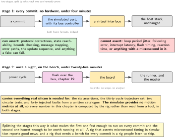
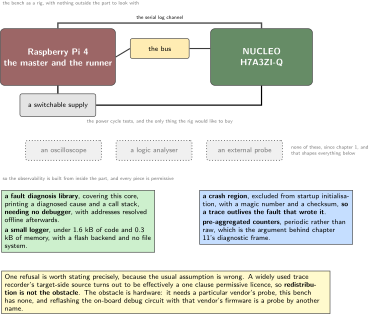
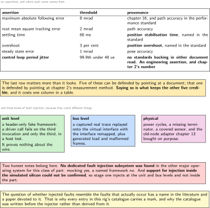
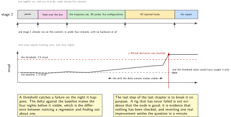
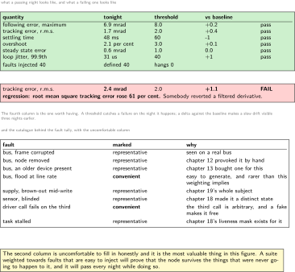

# Chapter 20. The rig: injected faults, tracking error, and a build that fails

> **What the node gains:** Proof  
> **Theme:** Fault injection, tracking regression, a report that turns a build red

> **Key facts**
>
> - **Adds to the node:** Proof. Nineteen chapters made claims; this one builds the thing that checks them every night and turns a build red when one stops being true, with nobody at the bench
> - **Peripherals:** None new. The rig uses what is already there, and the observability it needs is built from inside the part because there is no probe
> - **Depends on:** Chapter 2 for the period, chapter 16 for following error, chapter 18 for provoked faults, chapter 19 for flashing without hands
> - **Real or modelled:** **Both, deliberately.** Half the rig runs in a simulator on every commit with no hardware at all, and half runs on the bench once a night. The chapter says which assertions each half can honestly support
> - **Difficulty:** 5 of 5
> - **Effort:** Five evenings, and the first one is spent finding out that a simulator for this family already exists
> - **Deliverable:** A two-stage rig, an assertion set whose names are sourced, a fault catalogue, a report a stranger can read, and a deliberate regression that turns the build red

## Why this chapter

Every chapter in this volume has ended with acceptance criteria. Criteria that are checked once are a memory; criteria that are checked every night are a property. This chapter builds the thing that does the checking, and it exists because a portfolio whose claims were true in September is worth less than one whose claims are true tonight.

It opens with the most useful single finding of the volume's research.

> [!NOTE]
> **A simulator for this family exists and it carries the bus**
>
> An open simulator models this microcontroller family **including the bus controller**, and its host integration provides a bridge that carries both frame formats between the simulation and a host virtual interface. Its test runner starts it headless, speaks a test language natively, emits reports in two formats, runs jobs in parallel and snapshots failures. **So the whole bus half of this volume can be exercised on a build machine with no hardware attached at all.** Two honest limits: the bridge is available on one host operating system only, and the simulator provides **no motion metrics of any kind**, so everything this chapter asserts about tracking is computed by the rig rather than read from a tool.

The obvious alternative is the wrong tool and the chapter says so plainly. The other well known emulator's own target page lists the cores and boards it supports for this architecture, **none of them from this family**, and does not mention the bus at all.

## Prior art and what to reuse

| Source | What it gives | What it does not | Licence |
| --- | --- | --- | --- |
| The open simulator | **This family modelled including the bus controller**, a bridge to a host virtual interface carrying both frame formats, a headless test runner with parallel jobs and failure snapshots | **No motion metrics at all**, and its documentation index has no fault injection section. The bridge is for one host operating system only | permissive |
| The test language it speaks natively | Structure, reporting and a server the simulator already talks to | **Structure and reporting, not measurement.** Every number this chapter asserts on is computed elsewhere | Apache-2.0 |
| The bench control layer, 528 stars, last pushed Friday 11 September 2026 | The right layer for the hardware half: serial and remote drivers, power switch and reset drivers, bootstrap, and a remote abstraction | **Nothing at all about trajectories.** It gets a board powered, flashed and talking | LGPL-2.1 |
| A test runner with a bus library and a serial library | **The honest recommendation**, and more defensible than an alternative whose value is concentrated in another vendor's silicon and most of which would be reimplemented here | The bus library is copyleft, so it is depended on rather than vendored | mixed |
| A unit test build system with its assertion and mock libraries | The unit half: the interpolator, the controller step, the frame packer, all on the host | It does not touch hardware, which is the point | MIT |
| A header-only fake framework, 938 stars | **Unit level fault injection**: a return sequence or a custom fake makes a driver call fail on the third invocation and only the third | Nothing at system level | MIT |
| The mock hardware component in the host control framework | **The closest published analogue to this whole rig**, and the reason the architecture below is not unusual | It is a host-side stand-in, not a rig | Apache-2.0 |

*Table 20.1. Prior art for chapter 20. The first row is the finding that shapes the chapter: the expensive half of a rig, a target that behaves like the real part on the real bus, already exists and is permissively licensed. What does not exist anywhere is the motion measurement, and that is what this chapter writes.*

## What the node gains

Nothing it runs. What the **volume** gains is the difference between a claim and a property. Every acceptance criterion from chapters 2 to 19 becomes an assertion that is checked without anybody remembering to check it, and a regression in the quality of the node's motion becomes a red build rather than a discovery.

## Parts from the inventory

| Part | Role | Interface |
| --- | --- | --- |
| A build machine | The simulated half: every commit, no hardware, both frame formats over a virtual interface | None |
| Raspberry Pi 4 | **Two roles at once**: the motion master of chapter 10 and the runner for the hardware half | The bus, and the node's serial port |
| NUCLEO-H7A3ZI-Q | The node under test, flashed by chapter 19's path rather than by hand | The bus |
| A switchable supply | For the power cycle tests, and the only piece the rig would like to buy | Mains, and one control line |
| **Absent:** an oscilloscope, a logic analyser, an external debug probe | **None of these are on this bench**, which is why the observability in this chapter is built from inside the part | n/a |

*Table 20.2. Inventory items used in chapter 20. The last row has been true since chapter 1 and it shapes this chapter more than any other: with no instrument outside the part, everything the rig knows about a failure has to be something the part itself recorded and sent.*

## System architecture



*Figure 20.1. Two stages, and what each one can honestly prove. The upper stage runs on every commit with no hardware: the simulated part, the virtual bus, the host stack, and every assertion that does not depend on real timing. The lower stage runs once a night on the bench and carries the assertions that only real silicon can support. Splitting them is what makes the first stage fast enough to run on every commit and the second one honest enough to be worth running at all.*

## Peripheral configuration

| Peripheral | Mode | Clock source | Pins and function | Interrupt and transfers |
| --- | --- | --- | --- | --- |
| Everything | **Unchanged**. This chapter configures nothing | n/a | n/a | The rig observes; it does not modify the node under test |
| The serial port | The log channel, because there is no probe | Unchanged | Already wired | The rig reads it and archives it per run |
| A region of memory excluded from startup initialisation | The crash trace, with a magic number and a checksum | n/a | n/a | **It is the only thing that survives a fault and a reset** |

*Table 20.3. Peripheral configuration for chapter 20. A rig that modifies the thing it is testing is measuring something else, so the only entries here are channels the node already had. The third row is the one that makes a crash investigable at all on a bench with no probe.*

## Wiring



*Figure 20.2. The bench as a rig, and the observability stack that exists because there is nothing outside the part to look with. No oscilloscope, no logic analyser, no external probe. What replaces them is a fault diagnosis library that needs no debugger, a small logger with a flash backend, a crash region that survives a reset, and pre-aggregated counters in a periodic frame. Every one of those is permissively licensed, which is not an accident.*

## Memory and timing budget

| Quantity | Budget | Measured | Margin |
| --- | --- | --- | --- |
| Flash, the observability stack | 9 kB | not measured | not measured |
| Static memory, the crash region | 1 kB, plus a magic number and a checksum | n/a | n/a |
| Simulated stage, wall clock | under 4 minutes, on every commit | not measured | not measured |
| Hardware stage, wall clock | under 25 minutes, once a night | not measured | not measured |
| Injected faults per nightly run | 40, from a written catalogue | n/a | n/a |
| Tracking regression that fails the build | **5 per cent** on root mean square error | n/a | n/a |

*Table 20.4. The budget for chapter 20, which is mostly wall clock rather than bytes. The two stage times are the reason the rig is split: a four minute stage can run on every commit and a twenty-five minute one cannot, and pretending otherwise produces a rig that people learn to skip.*

## Firmware design (UML)



*Figure 20.3. The assertion set with its provenance marked, because three of these six have published names and one has none at all. A published performance standard for manipulators names stabilisation time, overshoot and path accuracy, and this chapter uses its words. **Loop period jitter has no standards backing in either document this chapter read**, so it is presented as an engineering assertion, which is exactly what it is.*

Three rules.

**Every assertion has a provenance.** A name taken from a published standard is marked as such; a name that is this volume's own is marked as that. The distinction costs one column in a table and it is the difference between a rig and a set of opinions.

**The fault catalogue is written before the injector.** What is injected is decided from the failures that actually occur, not from the failures that are easy to inject. That question has a name in the literature and a paper devoted to it, and this chapter's catalogue is honest about which of its entries are representative and which are convenient.

**Nothing in the rig modifies the node under test.** No test hooks, no special build, no instrumentation that ships only during testing. The rig observes the channels the node already has, because a node that behaves differently under test has not been tested.

## Data flow (ASCII)

```text
  a commit
     |
     v
  STAGE 1, every commit, no hardware, under 4 minutes
     |
     +-- host unit tests: interpolator, controller step, frame packer
     |       with fakes that fail on the third call and only the third
     |
     +-- the simulated part, with its bus controller, bridged to a
     |       virtual interface on the build machine
     |
     +-- the host stack, unchanged, talking to it as if it were a board
     |
     +-- assertions: protocol, state machines, bounds, safe states,
     |       and the update path of chapter 19
     |
     v
  STAGE 2, once a night, on the bench, under 25 minutes
     |
     +-- power cycle, flash over the bus (chapter 19), wait for boot
     |
     +-- run the trajectory set, 30 cycles, five configurations
     |
     +-- inject 40 faults from the written catalogue
     |
     +-- collect: the node's own counters, its log, and its crash
     |       region if anything faulted
     |
     v
  THE REPORT
     |
     +-- six numbers against six thresholds, with the delta from the
     |   baseline beside each
     |
     +-- and if root mean square tracking error rose by more than five
         per cent:  THE BUILD IS RED, with nobody at the bench
```

## Repository layout

```text
joint-node/
  rig/
    stage1/
      sim.resc  sim.robot      # + the simulated part, and its assertions
      vcan.sh                  # + the virtual interface the bridge attaches to
    stage2/
      conftest.py              # + power, flash, boot, and teardown
      test_tracking.py         # + the six assertions, with provenance
      test_faults.py           # + the catalogue, one test per entry
      faults.yaml              # + WRITTEN FIRST, and marked representative
                               #   or convenient, one or the other
    report/
      render.py                # + the report a stranger can read
      baseline.json            # + what tonight is compared against
  src/
    diag/
      backtrace.c              # + fault cause and call stack, no debugger
      logger.c                 # + small, flash backed, no file system
      crashregion.c            # + noinit, magic number, checksum
      metrics.c                # + counters, timed counters, gauges
  .github/  doc/  test/  host/  tools/  proto/  README.md
```

## Steps

**Step 1.** **Build stage one first, because it needs no hardware and it is the one that will run thousands of times.** The simulated part, the bridge, and the host stack from chapter 10, unchanged.

```bash
sudo ip link add dev vcan0 type vcan && sudo ip link set up vcan0
renode-test rig/stage1/sim.robot -j 4
# the simulated part boots, its bus controller bridges to vcan0, and the
# host stack talks to it exactly as it talks to the board
```

Everything in this volume that is about protocol rather than about physics belongs here: the frame layouts of chapter 11, the state machines of chapter 12, the mixed traffic of chapter 13, the message mapping of chapter 15, the safe state transitions of chapter 18 and the update path of chapter 19.

**Step 2.** **Say clearly what stage one cannot prove.** A simulated part does not have real interrupt latency, real flash timing or a real clock, and a rig that quietly asserts those things in simulation is a rig that reports good news.

```text
stage 1 CAN assert    protocol correctness, state reachability, bounds
                      checking, message mapping, error handling paths,
                      the update sequence, and anything a fake can fail
stage 1 CANNOT assert loop period jitter, following error, interrupt
                      latency, flash programming time, the reaction time
                      of chapter 18, or anything with a microsecond in it
and the simulator      provides NO MOTION METRICS AT ALL, so even in stage 2
itself                 every number in this chapter is computed by the rig
```

**Step 3.** **Take the assertion names from a published standard where one exists.** The performance standard for manipulators, second edition, published Thursday 23 April 1998, already names most of what this rig measures.

```text
from the standard   pose accuracy and repeatability
                    POSITION STABILISATION TIME
                    POSITION OVERSHOOT
                    PATH ACCURACY and PATH REPEATABILITY
                    cornering deviations, path velocity characteristics,
                    and drift of pose characteristics
its own method      a test cube, the largest fitting the workspace, with
                    measurements at five configurations over 30 CYCLES
its own caveat      five configurations is thin, and manufacturers commonly
                    use a hundred or more
NOT printed here    the metric symbols, which could not be confirmed from a
                    fetchable page and are therefore not presented as
                    verified
```

**Step 4.** **Fix the six assertions, and mark which one has no standard behind it.** This is the table the whole rig is built around.

```text
assertion                          threshold        name from
max absolute following error       < 8 mrad         chapter 16, and path
                                                    accuracy in the standard
root mean square tracking error    < 2 mrad         path accuracy
settling time                      < 60 ms          POSITION STABILISATION
                                                    TIME, in the standard
overshoot                          < 3 per cent     POSITION OVERSHOOT
steady state error                 < 1 mrad         pose accuracy
control loop period jitter         99.9th < 40 us   NO STANDARDS BACKING.
                                                    An engineering assertion,
                                                    and chapter 2's number
```

The last row matters more than it looks. Everything else here can be defended by pointing at a document; that one is defended by pointing at chapter 2's measurement method, and saying so is what keeps the other five credible.

**Step 5.** **Use circles as well as steps, and use two radii.** The machine tool test code for circular tests, published Tuesday 22 February 2022, and its free companion give the reason.

```text
large radius circles   expose geometry errors
small radius circles   are more sensitive to SERVO MISMATCH OR LAG
                       which is exactly what chapter 16's controller is
so the rig runs both   and reports circular deviation as a single overall
                       indicator for each
```

**Step 6.** **Write the fault catalogue before writing the injector.** The question of whether injected faults resemble real ones has a name in the literature and a paper devoted to it, and pretending otherwise is the easiest way to build a rig that passes.

```text
rig/stage2/faults.yaml   (40 entries, each marked)

  bus, frame corrupted        representative  (seen on a real bus)
  bus, node removed           representative  (chapter 12 provoked it)
  bus, old node present       representative  (chapter 13, on purpose)
  bus, flood at line rate     convenient      (easy, and rarer than this
                                               weighting implies)
  supply, brown-out mid-write representative  (chapter 19's whole point)
  sensor, blinded             representative  (chapter 18 covered it)
  sensor, stuck value         representative
  driver call fails 3rd time  convenient      (a unit level fake, and the
                                               third call is arbitrary)
  task stalled                representative  (chapter 18's liveness mask)
```

Weighting a suite towards faults that are easy to inject is how a rig ends up proving that the node survives the things that were never going to happen.

**Step 7.** **Inject at three levels, because they catch different things.**

```text
unit level     a header-only fake framework: make a driver call fail on the
               third invocation and only the third, in a host test
bus level      replay a captured real trace onto the virtual interface with
               the interface remapped, and generate load and malformed
               frames with the command line tools
physical level on the bench: power cycles, a disconnected terminator, a
               covered sensor, and the old-node adapter of chapter 13
```

Two honest notes belong here. **No dedicated fault injection subsystem was found in the other major operating system** for this class of part: mocking yes, a named framework no. And **fault injection support in the simulator could not be confirmed**, so stage one injects at the unit and bus levels and not inside the simulated silicon.

**Step 8.** **Build the observability stack from inside the part, because there is nothing outside it.** Four pieces, all permissively licensed, and the licence position is the reason each one was chosen.

```text
fault diagnosis  a library covering this core, printing a diagnosed cause
                 and a call stack, NEEDING NO DEBUGGER, with addresses
                 resolved offline afterwards. MIT
logging          a small logger, ROM under 1.6 kB and RAM under 0.3 kB,
                 with a flash backend and no file system. MIT
crash survival   a region excluded from startup initialisation, with a
                 magic number and a checksum, so a trace outlives a fault
counters         pre-aggregated periodic statistics rather than raw logs,
                 which is the argument behind chapter 11's diagnostic frame
```

**Step 9.** **Name what could not be used, and why, because two of them are instructive.** One widely used trace recorder's target-side source turns out to be effectively a one clause permissive licence, so redistribution is not the obstacle people assume. **The obstacle is hardware**: it needs a particular vendor's probe, this bench does not have one, and reflashing the on-board debug circuit with that vendor's firmware is a probe by another name. The instrumented trace port is out for exactly the same reason, which chapter 2 established.

**Step 10.** **Turn a regression into a red build.** This is the step the chapter is named for, and it is short.

```bash
python rig/report/render.py --run tonight.json --baseline baseline.json
# following error, max      6.9 mrad   (< 8.0)    +0.2 vs baseline   pass
# tracking error, r.m.s.    1.7 mrad   (< 2.0)    +0.4 vs baseline   pass
# settling time              48 ms     (< 60)      -1  vs baseline   pass
# overshoot                 2.1 %      (< 3.0)     +0.1 vs baseline  pass
# steady state error        0.6 mrad   (< 1.0)     0.0 vs baseline   pass
# loop jitter, 99.9th        31 us     (< 40)      +1  vs baseline   pass
# faults injected: 40   defined outcome: 40   hangs: 0
exit 0
```

**Step 11.** **Then break it on purpose, and watch it go red.** A rig that has never failed has not been tested either.

```bash
git revert --no-commit HEAD~1      # put back the unfiltered derivative
python rig/report/render.py --run tonight.json --baseline baseline.json
# tracking error, r.m.s.    2.4 mrad   (< 2.0)    +1.1 vs baseline   FAIL
# REGRESSION: root mean square tracking error rose 61 per cent
exit 1
```

**Step 12.** **Make the report readable by somebody who was not there.** Six numbers, six thresholds, six deltas, the fault tally, and a link to the archived log and crash region for any run that faulted. Nothing else.



*Figure 20.4. One night, end to end, and the trace that fails it. Above, the nightly run laid out to scale: power cycle, flash over the bus, the trajectory set, the fault sweep, and the report. Below, root mean square tracking error over sixty nights, with the baseline, the threshold, and the evening somebody reverted a filtered derivative. The delta column in the report is what makes the three nights before that one visible.*

## Build, flash and debug



*Figure 20.5. The report, and the fault catalogue behind it. Above, what a passing night looks like and what a failing one looks like, with the delta column that makes a slow drift visible before it crosses a threshold. Below, the catalogue, with every entry marked representative or convenient. That second column is uncomfortable to fill in honestly and it is the most valuable thing in the figure.*

```bash
renode-test rig/stage1/sim.robot -j 4                       # every commit
pytest rig/stage2 --junitxml=stage2.xml                     # nightly
python rig/report/render.py --run tonight.json --baseline baseline.json
```

> [!NOTE]
> **When the rig has never failed**
>
> A suite that has always passed is not evidence that the node is good; it is evidence that nothing has been checked. Two habits fix it: revert a real improvement on purpose and confirm the build goes red, and review the fault catalogue for entries marked convenient rather than representative. A rig weighted towards faults that are easy to inject will prove that the node survives the things that were never going to happen to it.

## Verification and acceptance criteria

- Stage one runs on every commit, with no hardware, in under four minutes.
- What stage one cannot prove is written down, and no assertion about microsecond timing appears in it.
- Stage two runs nightly, power cycles the board, flashes it over the bus rather than by hand, and tears down cleanly whether it passed or failed.
- Six assertions run, each with its threshold and its provenance, and the one with no standards backing is marked as an engineering assertion.
- Both a large and a small radius circular test run, and their deviations are reported separately.
- The fault catalogue exists as a file, was written before the injector, and marks every entry representative or convenient.
- Forty injected faults all end in a defined state and none in a hang.
- A crash leaves a trace in the region excluded from startup initialisation, and the rig archives it with the run.
- A deliberate five per cent regression in root mean square tracking error turns the build red with nobody at the bench.
- The rig modifies nothing in the node under test: no test hooks, no special build.
- The report is readable by somebody who was not there, and includes the delta from the baseline for every number.

## Variants

| Axis | Variant | What changes | Cost | Built in full in |
| --- | --- | --- | --- | --- |
| Target | The simulated part | Every commit, no hardware, both frame formats | **No motion metrics, no real timing**, and the bridge is one host operating system only | Here, stage one |
| Target | The board on the bench | Everything stage one cannot prove | Wall clock, and a bench that has to stay plugged in | Here, stage two |
| Target | The other emulator | The obvious alternative | **It supports no board in this family and does not mention the bus** | Nowhere, and the reason is printed |
| Injection | Unit level fakes | A driver call that fails on the third invocation and only the third | It proves nothing about the wire | Here |
| Injection | Bus level | Replay of a captured real trace, plus generated load and malformed frames | A virtual interface and a capture worth replaying | Here |
| Injection | Physical | Power cycles, a missing terminator, a covered sensor, the old-node adapter | Somebody has to have set the bench up | Here |
| Injection | Inside the simulated silicon | Instruction and memory level faults, as an academic tool does | **Support could not be confirmed in this simulator**, and the academic tool is dormant and copyleft | Nowhere |
| Harness | The bench control layer | Power, flash and console, done properly | Copyleft, and nothing about trajectories | Nowhere, and named |
| Harness | A test runner with a bus library | **The honest recommendation**, and it is what this rig uses | The bus library is copyleft, so depended on rather than vendored | Here |
| Observability | An external probe | Everything, instantly | **This bench has none**, and the trace recorder that needs one is blocked by hardware rather than by licence | Nowhere |
| Observability | From inside the part | A diagnosed fault cause, a call stack, a surviving crash region and pre-aggregated counters | A few kilobytes, and some care | Here |

*Table 20.5. Variants for chapter 20, and the last variants table in the volume. Three rows are refusals, and in two of them the obstacle is not the one people expect: an emulator that does not support this family at all, and a trace tool whose licence is fine and whose hardware requirement is not.*

## Pitfalls

- Building the hardware stage first. The simulated stage is cheaper, runs more often and catches more, and it needs nothing that has to be plugged in.
- Asserting microsecond timing in simulation.
- Assuming the simulator measures motion. It does not, and every number in this chapter is computed by the rig.
- Reaching for the better known emulator. It supports no board in this family and does not mention this bus.
- Writing the injector before the catalogue, which produces a suite weighted towards whatever was easy to inject.
- Leaving every catalogue entry unmarked, so that nobody can tell which faults are representative.
- Adding test hooks to the firmware. A node that behaves differently under test has not been tested.
- Reporting a mean. The whole volume reports median, 99.9th percentile and maximum, including here.
- Presenting loop period jitter as though a standard named it. No document this chapter read does.
- Printing the performance standard's metric symbols as verified. They could not be confirmed from a fetchable source.
- Assuming a trace tool is unavailable for licence reasons when the actual obstacle is a probe this bench does not have.
- Letting the rig pass forever. Revert an improvement on purpose and check that it goes red.

## Best practices applied

- The expensive half of the problem is found already solved, and used.
- A rig is split by what each half can honestly prove rather than by what is convenient to run.
- Assertion names are taken from a published standard where one exists, and the one that has none says so.
- A fault catalogue is written before the injector and is honest about representativeness, which is a question with a literature of its own.
- Observability is built from inside the part because there is nothing outside it, and every piece chosen is permissively licensed.
- A refusal is explained with the real obstacle rather than the assumed one.
- The rig is proven by breaking something on purpose.
- A report is written for somebody who was not there.

## Stretch goals

- **Publish the motion-metric layer.** This volume's research found no published, motion-specific example of a rig that runs in continuous integration and asserts on tracking quality. The practitioner material that exists is generic, and a worked example with real numbers would be a genuine contribution.
- Replay a captured trace from a real machine's bus onto the virtual interface and find out how much of the fault catalogue it reproduces without anybody inventing anything.
- Run the performance standard's method properly: a hundred cycles rather than thirty, and more than five configurations, and see which of the six assertions move.
- Add the other operating system's coredump, which is permissively licensed and whose host tools include a server that serves a captured dump to a debugger, and compare it with the probe-free stack this chapter built.
- Extend the fault catalogue from the failure analysis worksheets of chapter 18, so that the two documents inform each other rather than existing separately.

## Roadmap and next steps

This is the last chapter, so the roadmap is not another chapter.

What exists at the end of twenty chapters is a joint node that keeps a one kilohertz period and can prove it, shares one clock across its sensors and its bus, reads a real encoder and a real inertial unit, models the actuator it does not have and says so on every figure, speaks a modern field bus properly enough to survive a device older than itself, joins a robot framework as a participant, publishes state in standard types with an empty field where it has no sensor, closes a loop and reports the one number a joint is judged by, stops safely and latches, can be updated over the wire it already has, and is checked every night by a rig that turns a build red.

What it is not is a product. It has one axis, no motor, no brake, no safety assessment and no certificate, and it has said so in every chapter where the question arose.

The published progression from here, for a reader who wants to go further, is the three directions this volume deliberately stopped at. The deterministic fieldbus of chapter 17, which needs different silicon and a costed decision rather than more effort. The functional safety route of chapter 18, which needs a second channel and an assessment rather than better firmware. And the motion side, where the machine tool test code and the manipulator performance standard between them define far more than this bench can measure, and where the gap this chapter named is still open.

## Portfolio evidence

- The two-stage rig, which demonstrates knowing what a simulator can and cannot prove.
- The assertion table with its provenance column, including the row that admits it has no standard behind it.
- The fault catalogue with its representativeness marking.
- The probe-free observability stack, built because there was nothing else, and every piece permissively licensed.
- A screenshot of the build going red because somebody reverted a filtered derivative, which is the single most persuasive artefact in the whole volume.

## Sources

Normative references:

- ISO 9283:1998, second edition, published Thursday 23 April 1998, "Manipulating industrial robots, Performance criteria and related test methods". Source of the names position stabilisation time, position overshoot, path accuracy and path repeatability, and of the thirty cycle method with its own caveat about five configurations. **Its metric symbols could not be confirmed from a fetchable page and are not printed here.**
- ISO 230-4:2022, published Tuesday 22 February 2022, "Test code for machine tools, Part 4: Circular tests for numerically controlled machine tools", superseding the 2005 and 1996 editions.
- ISO 26262-6:2018 and ISO 26262-11:2018, both published Monday 17 December 2018. Fault injection appears among the methods for software unit verification, recommended at the lower integrity levels and highly recommended at the upper ones. **The table number could not be confirmed and sources disagree, so no table number is printed**, and this attribution is to secondary sources rather than to the standard.

Academic references, all verified:

- Hsueh, Tsai and Iyer, "Fault injection techniques and tools", Computer volume 30, pages 75 to 82, 1997. The classic survey, and the first thing to read.
- Natella, Cotroneo and Madeira, "Assessing Dependability with Software Fault Injection", ACM Computing Surveys volume 48, 2016. The modern survey.
- Natella and co-authors, "On Fault Representativeness of Software Fault Injection", IEEE Transactions on Software Engineering volume 39, pages 80 to 96, 2013. **Directly relevant to this chapter's catalogue, and the reason every entry in it is marked.**
- Isermann, Schaffnit and Sinsel, "Hardware-in-the-loop simulation for the design and testing of engine-control systems", Control Engineering Practice volume 7, pages 643 to 653, 1999. The canonical citation for this kind of rig.
- Matinnejad, Nejati, Briand and Bruckmann, "Test Generation and Test Prioritization for Simulink Models with Dynamic Behavior", IEEE Transactions on Software Engineering volume 45, pages 919 to 944, 2019, with the earlier conference paper of 2016. **The closest published work to failing a build on a regression in continuous output quality rather than in code.**

Reusable implementations:

- The open simulator, which models this family including its bus controller and bridges both frame formats to a host virtual interface.  
  <https://github.com/renode/renode>
- The command line bus tools, whose replay utility remaps interfaces, which is how a captured real trace is replayed onto a virtual bus.  
  <https://github.com/linux-can/can-utils>
- A fault diagnosis library covering this core, MIT, 2176 stars, which needs no debugger and can persist a trace across a restart.  
  <https://github.com/armink/CmBacktrace>
- A small logger with a flash backend and no file system requirement, MIT.  
  <https://github.com/armink/EasyLogger>
- A header-only fake framework, MIT, whose return sequences are unit level fault injection.  
  <https://github.com/meekrosoft/fff>

One gap is worth stating at the end of the volume as clearly as it was stated at the start. **No published, motion-specific example was found of a rig that runs in continuous integration and asserts on tracking quality.** The generic material is plentiful and the motion-specific material is absent. A reader who builds this chapter and publishes the result will have written something that does not currently exist.

---

[Previous](19-update-over-the-bus.md) &nbsp;&nbsp;|&nbsp;&nbsp; [Contents](../README.md) &nbsp;&nbsp;|&nbsp;&nbsp; [Next](21-appendix.md)
