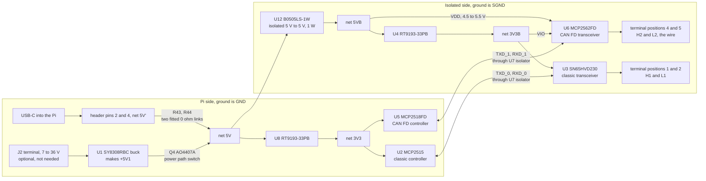

# What the boards actually are: every finding, with its source

Welcome. This page is the one you want open before you plug anything in. It
holds everything that has been established about the hardware this bus runs on,
device by device, with a marker on every line saying where the fact came from.
It is deliberately pedantic. The reason is simple and worth saying out loud at
the top: on this bench, nearly every hour lost to date was lost to a fact that
was assumed rather than read, and nearly every one of those facts was sitting in
a document that took two minutes to open.

So the invitation is this. Do not take any line below on trust. Each one names
the document it came from, and several of them tell you the exact command that
re-derives it. If a line turns out to be wrong, that is a good outcome: change
it, change its marker, and say in the commit what settled it. Nothing here is
sacred except the markers.

## How to read a line

| Marker | Means |
|---|---|
| `[schematic]` | Read out of the WS-28164 schematic's own text layer, Tuesday 7 October 2026 |
| `[wiki]` | From Waveshare's wiki page, which for this board is the only manual there is |
| `[datasheet]` | From the semiconductor manufacturer's published datasheet |
| `[kernel]` | From the mainline Linux driver or its device tree binding |
| `[measured]` | Measured on this bench, with the instrument named |
| `[inferred]` | A conclusion drawn from the above, with the reasoning given so you can disagree |
| `[unconfirmed]` | Believed, not yet checked. **No wiring decision may rest on one of these.** |
| `[chapter]` | Established elsewhere in this volume, with the chapter named |
| `[arithmetic]` | Follows from the other rows by calculation, so you can redo it |

`[unconfirmed]` is not an apology. It is the most useful marker on the page,
because it is the list of things worth half an hour each. When one of them gets
settled, it should move up a category and the commit should say what did it.

## The boards on this bus, and who talks to whom

Two ends, and it is worth being clear that they are not symmetrical.

| End | Board | What it brings | What it lacks |
|---|---|---|---|
| Controller | Raspberry Pi 4B plus Waveshare WS-28164 | Two complete CAN controllers with their own transceivers, isolated | Nothing for this chapter `[schematic]` |
| Node | NUCLEO-H7A3ZI-Q plus a loose Waveshare SN65HVD230 board | An FDCAN peripheral inside the STM32H7A3ZI | An FD rated transceiver `[datasheet]` |

The asymmetry is the whole shape of the bring-up. The Pi end is finished
hardware. The node end has a transceiver rated for 1 Mbit/s signalling, which is
why chapter 13, whose subject is two speeds on one wire, waits for a part rather
than for code.

The reason is not the obvious one, and reading the datasheets corrected it. That
transceiver is the **fastest** of the three on this bench by loop delay. What it
does not do is specify loop delay **symmetry**, which is what a CAN FD data phase
actually depends on. The comparison is in
[datasheet-notes.md](datasheet-notes.md) section 5, and it is the most useful
thing on that page.

---

# Part one: the Waveshare WS-28164

The board's own title block calls it **RS485 RS232 CAN HAT+** `[schematic]`,
Waveshare's shop calls it SKU 28164, and the wiki page is filed under
`RS232-RS485-CAN-Board`. Three names for one board, which is the first reason to
work from the schematic: it is the only one of the three that cannot be
mistaken for a different product.

There is no PDF user guide. The wiki page is the manual `[wiki]`. That is not a
complaint, it is a planning fact: if a question is not answered by the wiki, the
next stop is the schematic, and after that the component datasheets. Three
levels, in that order, and the schematic answers more than you would expect.

## 1. Power, and the question of what feeds what

This section exists because of one specific failure mode that would have been
very hard to diagnose, described at the end of it.

| Designator | Part or value | Role | Source |
|---|---|---|---|
| `P2.15` | terminal screw position | `VIN`, the external DC input | `[schematic]` |
| silkscreen | `DC7-36V` | the same input, as printed on the board | `[wiki]` |
| `D1` | SMAJ40CA | bidirectional transient suppressor across the DC input, 40 V standoff | `[schematic]` |
| `D15`, `D16` | 1N5822 | Schottky diodes in the input path, 3 A, 40 V | `[schematic]` |
| `R1` | 100K | on the input node | `[schematic]` |
| `U1` | SY8308RBC | step down switching regulator, input `VIN'`, output `+5V1` | `[schematic]` |
| `L1` | 2.2 uH, 14 A, 10 by 10 by 4 mm | the regulator's inductor | `[schematic]` |
| `C3`, `C4`, `C5` | 10 uF, 50 V each | regulator input bulk | `[schematic]` |
| `C8`, `C9`, `C10` | 22 uF, 25 V each | regulator output bulk | `[schematic]` |
| `C7` | 470 pF | regulator compensation | `[schematic]` |
| `R5` | 100K, 1 per cent | feedback divider, upper | `[schematic]` |
| `R9` | 13.7k, 1 per cent | feedback divider, lower | `[schematic]` |
| `R14` | 300K | frequency select, with the note `FS: 430K 350MHZ  NC: 500MHZ` | `[schematic]` |
| `R7` | 1M | soft start or enable network | `[schematic]` |
| `R8` | 1K | enable network | `[schematic]` |
| `R12` | 100K | enable network | `[schematic]` |
| `R13` | NC, not fitted | the alternative in that network | `[schematic]` |
| printed near the output | `5V 8A` | what the regulator stage is drawn to deliver | `[schematic]` |

So the external supply route is a 7 to 36 V input, protected, into an 8 A class
buck regulator that makes an internal 5 V rail called `+5V1`.

### The power path switch, and why it matters

| Designator | Part or value | Role | Source |
|---|---|---|---|
| `Q4` | AO4407A | P channel MOSFET, between `+5V1` and the board rail `5V` | `[schematic]` |
| `Q5`, `Q6` | MMBT3906 | PNP transistors driving `Q4`'s gate | `[schematic]` |
| `R19` | 100K | in that gate network | `[schematic]` |
| `R20` | 470K | in that gate network | `[schematic]` |
| `C22` | 100 uF | bulk on the `5V` rail | `[schematic]` |
| `C23` | 10 uF | bulk on the `5V` rail | `[schematic]` |
| `R43` | **0 ohm, fitted** | links the header's `5V'` to the board rail `5V` | `[schematic]` |
| `R44` | **0 ohm, fitted** | a second link in parallel with `R43`, same two nets | `[schematic]` |

The schematic block carrying `Q4`, `Q5`, `Q6`, `R19` and `R20` is titled
**OPTION** `[schematic]`, which is a fair name for it.

Two 0 ohm links in parallel between the Pi's 5 V header pins and the board's
5 V rail is a current capacity arrangement, and it means the connection is
deliberate and removable rather than a plain copper pour `[inferred]`.

Now the part that needs care. `R43` and `R44` are not diodes. They conduct in
both directions. So with the external DC supply connected, `U1` makes `+5V1`,
`Q4` passes it to the board rail `5V`, and `R43` with `R44` put that rail onto
header pins 2 and 4, which are the Pi's own 5 V pins. The reading that follows
is that **the external supply powers the Raspberry Pi through the header**, with
`Q4` arranged to stop the Pi's 5 V flowing backwards into the regulator's output
`[inferred]`.

That is the ordinary arrangement for a HAT with its own input, and it is almost
certainly what is drawn. But it is an inference from the topology, not a line
anybody has read, so here is the practical consequence to respect until it is
settled: **do not connect the DC terminal while the Pi is powered from USB-C.**
If the inference is right, you would have two supplies in parallel on one 5 V
rail, which is a thing to do on purpose and not by accident.

The test that settles it costs one power cycle: disconnect USB-C, feed only the
DC terminal, and see whether the Pi boots. If it does, the inference is right
and the direction is confirmed. Write the result here with a `[measured]`
marker and the date.

### The isolation barrier

| Designator | Part | Role | Source |
|---|---|---|---|
| `U12` | **B0505LS-1W** | isolated DC to DC converter, 5 V in, 5 V out, 1 W, making the isolated rail `5VB` | `[schematic]` |
| `C36` | 0.1 uF | `U12` input | `[schematic]` |
| `C37` | 10 uF | `U12` input | `[schematic]` |
| `C38` | 10 uF | `U12` output | `[schematic]` |
| `C39` | 1 uF | `U12` output | `[schematic]` |
| `C57` | 1 uF | `U12` output | `[schematic]` |
| `U4` | RT9193-33PB | 3.3 V linear regulator, `5VB` in, making the isolated `3V3B` | `[schematic]` |
| `C13`, `C11` | 100 nF | `U4` decoupling | `[schematic]` |
| `C15` | 22 nF | `U4` bypass pin | `[schematic]` |
| `U8` | RT9193-33PB | a **second** 3.3 V regulator, making the non isolated `3V3` | `[schematic]` |
| `C25`, `C26` | 100 nF, 1 uF | `U8` decoupling | `[schematic]` |
| `C27` | 22 nF | `U8` bypass pin | `[schematic]` |
| `U12` isolation rating | not read | the converter's rated isolation voltage | `[unconfirmed]` |

**`U12` is fed from the Pi's own 5 V.** This is the single most load bearing
finding on the page, so it is worth stating plainly: **the isolated side does
not need the external DC supply.** USB-C into the Pi is enough to bring the
whole board up, both CAN channels included.

There are four supply rails, and the names are worth learning because the
schematic uses them everywhere:

| Rail | Side | Where it comes from |
|---|---|---|
| `5V` | Pi side | header pins 2 and 4 through `R43`, `R44`, or `+5V1` through `Q4` |
| `3V3` | Pi side | `U8` from `5V` |
| `5VB` | isolated side | `U12` from `5V` |
| `3V3B` | isolated side | `U4` from `5VB` |

Ground is likewise two nets: `GND` on the Pi side and `SGND` on the isolated
side `[schematic]`. When you read the schematic yourself, the `B` suffix and the
`S` in `SGND` are how you tell which side of the barrier a net is on, and that
one convention makes the drawing about three times easier to follow.

### Why the quiet failure would have been quiet

Here is the whole supply path in one picture. Drawn from the schematic's POWER
and CAN Transceiver blocks `[schematic]`; there is no vendor figure that shows
this, which is exactly why it is worth drawing.



Now read it with one question in mind: what happens if the isolated side is
unpowered? That is what you would get if the external supply were genuinely
required and absent.

Follow the left box. SPI never crosses the barrier. The controllers sit on the
**Pi side**, powered from `3V3`, which comes from `U8`, which comes from the
header. So SPI would work perfectly. Every register would read back correctly.
The driver would probe, the interface would appear, `ip link` would be happy,
and internal loopback would pass, because an internal loopback never leaves the
controller. Only the right hand box would be dark, and only the wire would be
dead.

That failure presents as a firmware problem, and it is the kind of thing that
gets debugged for an evening. Two minutes with the schematic removed it from the
list of possibilities before it could cost anything. That is the whole argument
for this page.

The same picture earns its keep twice more further down. It is why `U6` needs
both a 5 V and a 3.3 V rail, and it is why the transceiver's standby pin cannot
be driven by the controller: the only thing crossing the barrier is `U7`, and
all four of its channels are already carrying transmit and receive for the two
channels.

## 2. The digital isolators

| Designator | Part | Channels carried | Source |
|---|---|---|---|
| `U7` | SI8642ED-B-IS | `TXD_0`, `RXD_0`, `TXD_1`, `RXD_1` to their `B` side twins | `[schematic]` |
| `C20`, `C21` | 100 nF | `U7` decoupling, one per side | `[schematic]` |
| `U11` | SI8642ED-B-IS | `TXB_0`, `RXB_0`, `TXB_1`, `RXB_1`, the RS485 pair | `[schematic]` |
| `C32`, `C33` | 100 nF | `U11` decoupling, one per side | `[schematic]` |
| `U16` | part number not printed | the RS232 channel, `P_TX` and `P_RX` to `TXD'_1B` and `RXD'_1B` | `[schematic]` |
| `C45`, `C47` | 100 nF | `U16` decoupling | `[schematic]` |
| Si8642 isolation rating and data rate | not read | | `[unconfirmed]` |

The Si8642 is a four channel device split two forward and two reverse, and the
schematic uses it exactly that way: `VIA` to `VOA` and `VIB` to `VOB` go one
direction, `VIC` to `VOC` and `VID` to `VOD` the other `[schematic]`. Two CAN
channels, each needing one transmit and one receive line, fit one part with
nothing left over. Neat, and worth noticing, because it tells you the two CAN
channels share an isolator and therefore share its failure.

`U7` pins 7 and 10 are `EN1` and `EN2`, the per side output enables
`[schematic]`. What they are tied to was not resolved from the text layer
`[unconfirmed]`. If both channels ever go quiet together while every register
reads correctly, this is where to look, and the way to look is to find `EN1` and
`EN2` on the schematic drawing rather than on the text layer.

## 3. The CAN FD channel, which is the one this volume uses

| Designator | Part | Role | Source |
|---|---|---|---|
| `U5` | **MCP2518FDT-H/SL** | the CAN FD controller | `[schematic]` |
| `U6` | **MCP2562FD** | the CAN FD transceiver | `[schematic]` |
| `Y2` | **40 MHz oscillator**, 5032 package, 3.3 V, **plus or minus 20 ppm** | `U5`'s clock | `[schematic]` |
| `R15` | 33 ohm | series damping between `Y2` output and `U5` `OSC1` | `[schematic]` |
| `C19` | 100 nF | `Y2` decoupling | `[schematic]` |
| `D3` | SM24CANB | transient suppressor across the CAN FD bus pair | `[schematic]` |
| `R16` | 120 ohm | the CAN FD termination resistor | `[schematic]` |
| `J1` | 3 position header, `A`, `COM`, `B` | selects whether `R16` is in circuit | `[schematic]` |
| `C24` | 100 nF | on `5VB` beside `U6` | `[schematic]` |

### A correction worth making loudly

Earlier notes on this bench, including the parts inventory, called `Y2` a
**40 MHz crystal**. It is not. The schematic shows a four pin part with `VDD`,
`OUT`, `OE` and `GND`, printed `40MHz(5032) 3.3V plus or minus 20ppm`
`[schematic]`. That is a packaged oscillator, not a passive crystal.

Three things follow, and the third is the one that matters:

1. There are no loading capacitors to get wrong, and none are fitted.
2. There is an output enable pin, so a dead clock has one more possible cause
   than a crystal would, namely `OE` held low. What `OE` is tied to was not
   resolved from the text layer `[unconfirmed]`.
3. **The tolerance is a printed number: plus or minus 20 ppm.** That feeds
   straight into the bit timing budget, and a printed number beats an assumed
   one. CAN requires the oscillators at the two ends of a bus to agree closely
   enough that a receiver can stay synchronised across a frame, and a
   20 ppm part spends very little of that allowance. Chapter 9's bit timing
   work can quote this rather than guess it.

### The MCP2518FD's pins as wired

| `U5` pin | Name | Net | Source |
|---|---|---|---|
| 1 | TXCAN | `TXD_1` | `[schematic]` |
| 2 | RXCAN | `RXD_1` | `[schematic]` |
| 3 | nCS | `CE_1`, which is `SPI0_CE1` | `[schematic]` |
| 4 | CLKO/SOF | not resolved | `[unconfirmed]` |
| 5 | OSC2 | not resolved, expected open with a packaged oscillator | `[inferred]` |
| 6 | OSC1 | `Y2` output through `R15` | `[schematic]` |
| 7 | VSS | `GND` | `[schematic]` |
| 8 | INT/GP1 | not resolved | `[unconfirmed]` |
| 9 | INT/GP0/XSTBY | not resolved | `[unconfirmed]` |
| 10 | SCK | `CAN_SCLK`, which is `SPI0_SCLK` | `[schematic]` |
| 11 | SDI | `CAN_SDI`, which is `SPI0_MOSI` | `[schematic]` |
| 12 | SDO | `CAN_SDO`, which is `SPI0_MISO` | `[schematic]` |
| 13 | INT | `CAN1_INT` | `[schematic]` |
| 14 | VDD | `3V3` | `[schematic]` |

So the controller runs from the **non isolated** 3.3 V, which is consistent with
it sitting on the Pi side of the barrier.

The MCP2518FD's own figures, now read rather than believed. The full set with
page numbers is in [datasheet-notes.md](datasheet-notes.md) section 3:

| Quantity | Value | Source |
|---|---|---|
| Message RAM | 2 KB | `[datasheet]` MCP2518FD p1, p63 |
| Maximum SPI clock | 20 MHz, in SPI mode 0,0 or 1,1 | `[datasheet]` MCP2518FD p1, p67 |
| FIFOs | 31, each configurable transmit or receive | `[datasheet]` MCP2518FD p1 |
| Filter and mask objects | 32 | `[datasheet]` MCP2518FD p1 |
| Arbitration bit rate ceiling | 1 Mbps | `[datasheet]` MCP2518FD p1 |
| Data bit rate ceiling | 8 Mbps | `[datasheet]` MCP2518FD p1 |
| `VDD` | 2.7 to 5.5 V | `[datasheet]` MCP2518FD p1, p76 |
| Clock input | specified as a 40 MHz crystal or resonator | `[datasheet]` MCP2518FD p77 |

The last row is worth a second look, because this board does not fit a crystal.
`Y2` is a packaged oscillator driving `OSC1` through `R15` `[schematic]`. Driving
a crystal input from a clock source is ordinary, but the datasheet's
characterisation assumes a crystal `[datasheet]` MCP2518FD p77, and the
oscillator's `OE` pin adds a failure mode a crystal does not have
`[unconfirmed]`.

The two ceilings are worth noticing together: 1 Mbps arbitration and 8 Mbps data
`[datasheet]` MCP2518FD p1. That is not a quirk of the part, it is what CAN FD
is. The planned 500 kbit/s and 2 Mbit/s sit well inside both.

Note what is **not** on that list. Nothing in chapter 9 depends on any of them,
because chapter 9's bit timing, message memory and frame length work is about
the **STM32's** M_CAN peripheral at the node end, not about this part. The Pi
end reaches the MCP2518FD only through the kernel driver, and the driver owns
those details. That is a pleasant division of labour and it is worth not
blurring it.

### The transceiver, and the reason this part was chosen

| `U6` pin | Name | Net | Source |
|---|---|---|---|
| 1 | TXD | `TXD_1B` | `[schematic]` |
| 2 | VSS | `SGND` | `[schematic]` |
| 3 | VDD | `5VB`. The part requires 4.5 to 5.5 V, so no other isolated rail is in range | `[datasheet]` DS20005284A p9 |
| 4 | RXD | `RXD_1B` | `[schematic]` |
| 5 | VIO | **`3V3B`** | `[schematic]` |
| 6 | CANL | `L2` | `[schematic]` |
| 7 | CANH | `H2` | `[schematic]` |
| 8 | STBY | not resolved from the text layer, almost certainly tied low, see below | `[inferred]` |

The split supply is the point. `VDD` at 5 V gives the bus driver the swing a CAN
line wants, while `VIO` at 3.3 V makes the digital pins match the 3.3 V isolator
on the other side of them. A 3.3 V only transceiver would have needed no `VIO`
pin and would have driven the bus less strongly. So this is a deliberate choice
by whoever drew the board, and it is a good one.

`STBY` on pin 8 deserves the same respect that `Rs` gets below. The datasheet is
unambiguous: `STBY` low is Normal mode and the driver works, `STBY` high is
Standby and the transmitter plus the high speed part of the receiver are disabled
`[datasheet]` DS20005284A p3. Every register in the controller still reads
perfectly in that state, which is why it is the single most common reason a CAN
channel looks dead for a non obvious reason.

The schematic's text layer carries no net on that pin, so this was listed as the
highest risk open question. **Counting isolator channels mostly settles it.**

The transceiver is on the isolated side and the controller is not, so a standby
signal would have to cross the barrier. The only crossing in the CAN section is
`U7`, a four channel isolator, and all four channels are accounted for: `TXD_0`
and `RXD_0` for the classic channel, `TXD_1` and `RXD_1` for the CAN FD channel
`[schematic]`. There is no spare channel.

That matters because the controller **could** otherwise have driven it. The
MCP2518FD's pin 9 is `INT0/GPIO0/XSTBY`, and the `XSTBYEN` register bit exists to
automatically control the standby pin of a transceiver `[datasheet]` MCP2518FD
p19, p74. On this board that path does not exist, so `STBY` must be strapped
locally, and since the board works as a CAN FD adapter it must be strapped low
`[inferred]`.

So the question drops from "this could silently break the bus" to "this is almost
certainly a tie to `SGND`, worth ten minutes with the drawing to confirm". Still
worth confirming. No longer the thing to worry about.

MCP2562FD figures not read this session, all `[unconfirmed]`: the VDD range
(believed 4.5 to 5.5 V), the VIO range, the rated data rate, and the loop delay.
The loop delay is the one that will matter, because chapter 9 step 5 is
transmitter delay compensation and that calculation wants a number in
nanoseconds from each transceiver on the bus.

## 4. The classic CAN channel

| Designator | Part | Role | Source |
|---|---|---|---|
| `U2` | **MCP2515T-I/SO** | classic CAN controller, SOIC-18 | `[schematic]` |
| `U3` | **SN65HVD230DR** | classic CAN transceiver, 3.3 V | `[schematic]` |
| `Y1` | 16 MHz **crystal** | `U2`'s clock | `[schematic]` |
| `C2`, `C12` | 22 pF each | `Y1` loading capacitors | `[schematic]` |
| `R2` | 10k | pull up on `U2` `RESET` | `[schematic]` |
| `C14` | 100 nF | `U2` decoupling | `[schematic]` |
| `C16`, `C17` | 4.7 uF, 47 nF | local decoupling in that block | `[schematic]` |
| **`R3`** | **1k on `U3` pin 8, `Rs`** | **slope control, see below** | `[schematic]` |
| `D2` | SM24CANB | transient suppressor across the classic CAN pair | `[schematic]` |
| `R6` | 120 ohm | the classic CAN termination resistor | `[schematic]` |
| `J2` | 3 position header, `A`, `COM`, `B` | selects whether `R6` is in circuit | `[schematic]` |
| `Y1` tolerance | not printed on the schematic | | `[unconfirmed]` |
| `U2` protocol | CAN 2.0B at 1 Mb/s, **classic only** | no flexible data frames at all | `[datasheet]` MCP2515 p1 |
| `U2` buffers | three transmit, two receive | | `[datasheet]` MCP2515 p1, p3 |
| `U2` filters and masks | six 29-bit filters, two masks | | `[datasheet]` MCP2515 p1 |
| `U2` maximum SPI clock | 10 MHz | half the MCP2518FD's | `[datasheet]` MCP2515 p1 |
| `U2` time quantum | TQ = 2 x (BRP + 1) / FOSC | 125 ns at 16 MHz with BRP = 0 | `[datasheet]` MCP2515 p38, p42 |

`U2`'s chip select is `CE_0`, which is `SPI0_CE0`, and its interrupt is
`CAN0_INT` `[schematic]`. Its VDD is `3V3`, the non isolated rail
`[schematic]`. `U3`'s VCC is `3V3B`, the isolated rail `[schematic]`, which is
right for a 3.3 V transceiver.

### `R3` is 1k, and reading the datasheet reversed what that means

Pin 8 of the SN65HVD230 is `Rs`, and it selects one of three modes. `R3` is
**1k** to ground `[schematic]`. The first reading of that, written earlier on
Tuesday 7 October 2026, was that the board ships **slew limited on purpose**,
with a longer loop delay as the price.

**That was wrong, and the datasheet says so plainly.** The full correction is in
[datasheet-notes.md](datasheet-notes.md) section 1. The short version:

TI's Table 6 selects the mode by the **voltage** on `Rs`, not by the presence of
a resistor:

| Condition on `Rs` | Mode | Source |
|---|---|---|
| V(`Rs`) above 0.75 VCC | Standby | `[datasheet]` SLOS346K p3 |
| 10 kohm to 100 kohm to ground | Slope control | `[datasheet]` SLOS346K p3 |
| V(`Rs`) below 1 V | **High speed, no slope control** | `[datasheet]` SLOS346K p3 |

The slope control range is given explicitly: 10 kohm for 15 V per microsecond,
100 kohm for 2 V per microsecond `[datasheet]` SLOS346K p2.

`R3` at 1 kohm is a **tenth of the fast end of that range**. Since the slope is
proportional to the pin's output current `[datasheet]` SLOS346K p2, a tenth of
the resistance develops a tenth of the voltage for the same current, which lands
in the "below 1 V" row. **The board is in high speed mode.** `R3` is a ground
connection through a small resistor, which is a tidy way to strap a mode pin
while leaving the option to change it.

```
V(Rs):  0 V ----------- 1 V -------------------- 0.75*VCC ---- VCC
             HIGH SPEED  |   (unspecified gap)        |  STANDBY
        ^                |                            |
        |                +-- slope control lives here,
     R3 = 1 k                set by 10 k to 100 k to ground
     sits here
```

Redrawn from the conditions in Table 6, `[datasheet]` SLOS346K p3. There is no
vendor figure of this; the datasheet states it as a three row table, and a line
is easier to place a value on.

So the loop delay to use for this channel is the **grounded** row, which is the
best of the three:

| `Rs` arrangement | Recessive to dominant, typ and max | Dominant to recessive, typ and max | Source |
|---|---|---|---|
| **V(`Rs`) = 0 V, this board** | **70 ns, 115 ns** | **100 ns, 135 ns** | `[datasheet]` SLOS346K p8 |
| 10 kohm to ground | 105 ns, 175 ns | 155 ns, 185 ns | `[datasheet]` SLOS346K p8 |
| 100 kohm to ground | 535 ns, 920 ns | 830 ns, 990 ns | `[datasheet]` SLOS346K p8 |

The rated signalling rate for the part is 1 Mbit/s `[datasheet]` SLOS346K p2.

**A second correction lives in that table.** The earlier note said 10 kohm
raises the delays "to about 105 and 155" and 100 kohm "to about 535 and 830".
All four of those figures are **typicals**. The maximums are 175, 185, 920 and
990 `[datasheet]` SLOS346K p8, and a timing budget is built from maximums.

What survives from the original finding, and what does not:

1. **Survives.** `Rs` is a pin worth respecting. Pulled high it is standby, and
   on the SN65HVD230 specifically that stops the driver while the receiver keeps
   working `[datasheet]` SLOS346K p2. A listener at the far end then sees a
   healthy node that never speaks.
2. **Survives.** It says nothing about the **loose** SN65HVD230 board for the
   Nucleo end, whose own `Rs` arrangement has not been read `[unconfirmed]`.
3. **Gone.** The claim that the channel is slowed or capped by `R3`. It is not,
   and its loop delay is the lowest of any transceiver on this bench.
4. **Gone.** The `[unconfirmed]` number. There is no 1k row to interpolate,
   because 1k is not a slope control value at all.

The shape of this mistake differs from the three in [rewiring.md](rewiring.md).
Those came from trusting a name over a reading. This one came from reading the
schematic correctly and then reasoning about the part from general knowledge
instead of opening its datasheet. The resistor value was right. Everything
concluded from it was wrong.

## 5. The RS485 channels

Not used by this volume, and included anyway, because the parts share the SPI
bus, the isolator family and the interrupt pins with the CAN channels, and
because the fastest way to break a working CAN bring up is to enable something
next to it.

| Designator | Part or value | Role | Source |
|---|---|---|---|
| `U10` | **SC16IS752IPW** | dual UART with an SPI or I2C host interface | `[schematic]` |
| `Y3` | 14.7456 MHz crystal | `U10`'s clock | `[schematic]` |
| `C34`, `C35` | 22 pF each | `Y3` loading capacitors | `[schematic]` |
| `R32` | **1K pull up to `3V3` on `U10` pin 5, `RESET`** | holds reset inactive | `[schematic]` |
| `R33` | **1K pull up to `3V3` on `U10` pin 15, `IRQ`** | the open drain interrupt's pull up | `[schematic]` |
| `R34` | **1K pull up to `3V3` on `U10` pin 9, `I2C/SPI`** | **straps the part into SPI mode** | `[schematic]` |
| `C31` | 100 nF | `U10` decoupling | `[schematic]` |
| `U9` | SP485EN | RS485 channel 2 transceiver | `[schematic]` |
| `U13` | SP485EN | RS485 channel 1 transceiver | `[schematic]` |
| `S1` | 3 position header | channel 2 direction control source | `[schematic]` |
| `S2` | 3 position header | channel 1 direction control source | `[schematic]` |
| `R10` | **0 ohm, fitted** | channel 2 direction link | `[schematic]` |
| `R11` | **NC, not fitted** | channel 2 direction link, the alternative | `[schematic]` |
| `R18` | **0 ohm, fitted** | channel 1 direction link | `[schematic]` |
| `R22` | **NC, not fitted** | channel 1 direction link, the alternative | `[schematic]` |
| `R25`, `R39` | 4.7K | in the direction control networks | `[schematic]` |
| `R29`, `R41` | 100R | series on the driver enable nets | `[schematic]` |
| `R24`, `R28`, `R38`, `R40` | 10K | fail safe biasing | `[schematic]` |
| `R17` | 120 ohm | RS485 channel 2 termination | `[schematic]` |
| `J4` | 3 position header | selects whether `R17` is in circuit | `[schematic]` |
| `R52` | 120 ohm | RS485 channel 1 termination | `[schematic]` |
| `J3` | 3 position header | selects whether `R52` is in circuit | `[schematic]` |
| `F1`, `F2`, `F3`, `F4` | type not printed | in series with the RS485 line pairs, presumably resettable fuses | `[inferred]` |

### A correction, and the shape of the mistake

An earlier reading on this bench said `R32`, `R33` and `R34` **route** the CAN
controllers to SPI0 and the serial expander to SPI1. That is wrong. They are
three 1K pull ups on the SC16IS752's `RESET`, `IRQ` and `I2C/SPI` pins, which is
a different kind of thing entirely `[schematic]`.

The schematic has a block titled **SPI SELECTION** `[schematic]`, and the reason
the error was easy to make is that the block's name promises selectable links.
It has none. There is not one resistor designator inside it. It is a page of net
label cross references showing which internal net reaches which header pin, and
the SPI routing on this board is **hard wired** `[schematic]`.

That is worth knowing in its own right: you cannot move a CAN controller off
SPI0 with a soldering iron. The chip selects are what they are.

The shape of the mistake is the useful part. A block titled SELECTION was read
as if it selected, and the nearest three resistors were assigned that meaning.
The guard against it is the one this page is built on: read the designator, read
its value, read the pin it lands on, and only then say what it does.

## 6. The RS232 channel, which quietly takes your console

| Designator | Part or value | Role | Source |
|---|---|---|---|
| `U15` | **SP3232EEN** | RS232 transceiver, two drivers and two receivers | `[schematic]` |
| `C43` to `C56` | 150 pF and 100 nF group | charge pump and line capacitors | `[schematic]` |
| `R50` | 51R | series on an RS232 line | `[schematic]` |
| `R51` | value not resolved | the other series resistor | `[unconfirmed]` |
| `L2`, `L3` | BLM18PG121SN1D | ferrite beads, 120 ohm at 100 MHz | `[schematic]` |
| `D13`, `D14` | SMAJ15CA | transient suppressors on the RS232 lines | `[schematic]` |
| `D12` | SMAJ15CA | the same | `[schematic]` |
| `U16` | part number not printed | the isolator for this channel | `[unconfirmed]` |
| header nets | `P_TX` on header pin 8, `P_RX` on header pin 10 | the Pi's own UART | `[schematic]` |

Header pins 8 and 10 are GPIO 14 and GPIO 15, which on a Raspberry Pi are
`UART0` and, on a default install, **the serial console**.

So the RS232 channel and the serial console are the same two pins. You can have
one or the other. On this bench that matters more than it usually would, because
the Pi's serial console has a separate recorded problem of its own, and now
there is a second, completely different reason it can be unavailable. If the
console ever goes quiet after this board is fitted and `enable_uart=1` is set,
this is the first thing to check and it is a wiring fact, not a software one.

Pleasingly, nothing in this volume needs RS232, so the console wins by default
and no decision is required. That is what a conflict looks like when it is found
before wiring instead of after.

## 7. The protection parts, as one list

Collected because when a board has survived something, this is the list you want
and it is tedious to rebuild from the drawing.

| Designator | Part | Where | Source |
|---|---|---|---|
| `D1` | SMAJ40CA | across the DC input | `[schematic]` |
| `D15`, `D16` | 1N5822 | in the DC input path | `[schematic]` |
| `D2` | SM24CANB | classic CAN pair | `[schematic]` |
| `D3` | SM24CANB | CAN FD pair | `[schematic]` |
| `D4`, `D8`, `D11` | SMAJ12CA | RS485 and terminal block lines | `[schematic]` |
| `D7` | SMAJ12CA | RS485 line | `[schematic]` |
| `D6`, `D9` | SMAJ6.5CA | RS485 lines | `[schematic]` |
| `D5`, `D10` | SM712 | RS485 protection arrays | `[schematic]` |
| `D12`, `D13`, `D14` | SMAJ15CA | RS232 lines | `[schematic]` |
| `D14` region | PESD15VL2BT | RS232 line pair | `[schematic]` |
| `F1`, `F2`, `F3`, `F4` | type not printed | in series with the RS485 pairs | `[inferred]` |

Every external line on this board has a transient suppressor on it. That is
worth saying because it is the reason the board is worth its price for a bench
where cables get moved by hand.

## 8. The HAT ID EEPROM that is not fitted

This one changes a device tree decision, so it gets its own section.

| Designator | Printed as | Meaning | Source |
|---|---|---|---|
| `U14` | **`NC/CAT24C32WI-GT3`** | the EEPROM footprint, **not fitted** | `[schematic]` |
| address | `0X50` | where it would answer if fitted | `[schematic]` |
| `R45` | `NC/1K` | not fitted | `[schematic]` |
| `R46` | `NC` | not fitted | `[schematic]` |
| `R47` | `NC/10K` | not fitted | `[schematic]` |
| `R48` | `NC` | not fitted | `[schematic]` |
| `R49` | `NC/10K` | not fitted | `[schematic]` |
| `R54` | `NC/0R` | not fitted | `[schematic]` |
| `C43` | `NC/100nF` | not fitted | `[schematic]` |
| nets | `SDA0` on header pin 27, `SCL0` on header pin 28 | GPIO 0 and GPIO 1 | `[schematic]` |

Every component in that block carries an `NC` prefix. The footprint is there,
the address is chosen, and nothing is populated.

Three consequences, in increasing order of usefulness:

1. **The board will never be auto detected.** A HAT with an ID EEPROM tells the
   firmware what it is and the firmware loads its overlay. This one cannot, so
   every `dtoverlay=` line has to be written by hand. That is not a defect, it
   is simply the deal, and it explains why the wiki gives you a config block
   rather than saying "it just works".
2. **GPIO 0 and GPIO 1 are free, electrically.** They run to an unpopulated
   footprint and some unfitted pull ups. An earlier note on this bench listed
   `i2c_vc` and `spi3-1cs` as conflicting with this board because they claim
   GPIO 0 and 1 for a HAT EEPROM. On this board there is no EEPROM, so that
   particular conflict does not exist. Correcting it is not permission to enable
   those overlays, for reasons in the conflict table below, but the reason
   given was wrong and a wrong reason is worse than no reason.
3. If you ever want a HAT EEPROM on this board, the footprint and the pull ups
   are waiting. That needs a soldering iron, which this bench does not have.

## 9. The complete 40-pin header map

Read pin by pin out of the schematic's `P1` symbol `[schematic]`. This is the
table to check an overlay against, and checking against it takes about a minute.

| Header pin | BCM | Net on this board | Used by |
|---|---|---|---|
| 1 | 3V3 | not used by this board | |
| 2 | 5V | `5V'` through `R43` and `R44` | the board's whole supply |
| 3 | GPIO 2 | **free** | |
| 4 | 5V | `5V'` through `R43` and `R44` | the board's whole supply |
| 5 | GPIO 3 | **free** | |
| 6 | GND | `GND` | |
| 7 | GPIO 4 | **free** | |
| 8 | GPIO 14 | `P_TX` | RS232 channel, and the serial console |
| 9 | GND | `GND` | |
| 10 | GPIO 15 | `P_RX` | RS232 channel, and the serial console |
| 11 | GPIO 17 | `SPI1_CE1` | SPI1, available to the serial expander |
| 12 | GPIO 18 | `SPI1_CE0` | the SC16IS752's chip select |
| 13 | GPIO 27 | **free** | |
| 14 | GND | `GND` | |
| 15 | GPIO 22 | `D22` | alternative classic CAN interrupt, **not fitted** |
| 16 | GPIO 23 | `D23` | **classic CAN interrupt, `CAN0_INT`** |
| 17 | 3V3 | not used by this board | |
| 18 | GPIO 24 | `D24` | **CAN FD interrupt, `CAN1_INT`** |
| 19 | GPIO 10 | `SPI0_MOSI` | **both CAN controllers** |
| 20 | GND | `GND` | |
| 21 | GPIO 9 | `SPI0_MISO` | **both CAN controllers** |
| 22 | GPIO 25 | `D25` | serial expander interrupt, `RS485_INT` |
| 23 | GPIO 11 | `SPI0_SCLK` | **both CAN controllers** |
| 24 | GPIO 8 | `SPI0_CE0` | **classic CAN chip select** |
| 25 | GND | `GND` | |
| 26 | GPIO 7 | `SPI0_CE1` | **CAN FD chip select** |
| 27 | GPIO 0 | `SDA0` | the unfitted EEPROM footprint only |
| 28 | GPIO 1 | `SCL0` | the unfitted EEPROM footprint only |
| 29 | GPIO 5 | **free** | |
| 30 | GND | `GND` | |
| 31 | GPIO 6 | **free** | |
| 32 | GPIO 12 | **free** | |
| 33 | GPIO 13 | `D13` | alternative CAN FD interrupt, **not fitted** |
| 34 | GND | `GND` | |
| 35 | GPIO 19 | `SPI1_MISO` | the serial expander |
| 36 | GPIO 16 | `SPI1_CE2` | SPI1 |
| 37 | GPIO 26 | `D26` | alternative serial expander interrupt, **not fitted** |
| 38 | GPIO 20 | `SPI1_MOSI` | the serial expander |
| 39 | GND | `GND` | |
| 40 | GPIO 21 | `SPI1_SCLK` | the serial expander |

Seven GPIO lines are untouched by this board: **GPIO 2, 3, 4, 5, 6, 12 and 27**
`[schematic]`. Electrically they are yours. Physically they are under a 40-pin
HAT, so reaching them means a stacking header or an extension cable, neither of
which is on this bench. Worth recording as a capability rather than a plan.

### The overlay conflict table, corrected

An earlier attempt at this bring up enabled every bus the Pi has: `i2c1`
through `i2c6`, `spi1` through `spi5`, `i2c_vc`, `i2s`. Here is what that
actually collides with, now that the header map is read rather than assumed.

| Overlay | Claims | Collides with | Severity |
|---|---|---|---|
| `i2c4` | GPIO 6, 7 | **GPIO 7 is the CAN FD chip select** | Fatal. `can1` never appears |
| `i2c6` | GPIO 22, 23 | **GPIO 23 is the classic CAN interrupt** | Fatal for the classic channel |
| `spi5-1cs` | GPIO 12 to 15 | GPIO 14, 15 are the console and the RS232 channel | Loses the console |
| `spi3-1cs` | GPIO 0 to 3 | GPIO 0, 1 reach only an unfitted footprint | **Harmless here** |
| `i2c_vc` | GPIO 0, 1 | the same unfitted footprint | **Harmless here** |

Two of those five are genuinely fatal and the earlier note had the right answer
for the wrong reason on two more. The conclusion does not change, and it is
worth stating as a rule rather than as a verdict on one config file: **enable
one interface at a time.** If fourteen things are enabled and the bus is dead,
there are fourteen candidate causes and no way to tell them apart. If one thing
is enabled and the bus is dead, there is one.

The set that leaves this board alone is short:

```
enable_uart=1
dtparam=i2c_arm=on
dtparam=spi=on
dtoverlay=mcp251xfd,spi0-1,interrupt=24
```

`dtparam=i2c_arm=on` brings up GPIO 2 and 3, which this board does not use at
all, so it is free. `enable_uart=1` keeps the console on GPIO 14 and 15, which
is a choice against the RS232 channel and the right one here.

## 10. The terminal block

Fifteen screw positions, read out of the schematic's `P2` symbol
`[schematic]`:

| Position | Net | What it is |
|---|---|---|
| 1 | `H1` | **classic CAN high** |
| 2 | `L1` | **classic CAN low** |
| 3 | `SGND` | isolated ground |
| 4 | `H2` | **CAN FD high** |
| 5 | `L2` | **CAN FD low** |
| 6 | `A1'` | RS485 channel 1 A |
| 7 | `B1'` | RS485 channel 1 B |
| 8 | `SGND` | isolated ground |
| 9 | `A2'` | RS485 channel 2 A |
| 10 | `B2'` | RS485 channel 2 B |
| 11 | `RXD` | RS232 receive |
| 12 | `TXD` | RS232 transmit |
| 13 | `SGND` | isolated ground |
| 14 and 15 | `VIN` and its return | the 7 to 36 V DC input, order not resolved | 

The last two positions are the DC input pair. Which of the two is `VIN` and
which is the return could not be resolved from the text layer `[unconfirmed]`,
and the honest answer is that it does not matter much, because the board's
silkscreen prints the names and the silkscreen is what you are looking at when
you turn the screw. Read it there.

### Three numbering schemes for two channels, and this is a real trap

Please read this section even if you skip others.

| Scheme | Classic CAN | CAN FD |
|---|---|---|
| Terminal block nets | `H1`, `L1` | `H2`, `L2` |
| Interrupt net names | `CAN0_INT` | `CAN1_INT` |
| Linux interface names | assigned by probe order | assigned by probe order |

The terminal calls the classic channel **1** and the FD channel **2**. The
interrupt nets call the classic channel **0** and the FD channel **1**. So
"channel 1" means the classic channel on the terminal and the FD channel in the
net names, and the two conventions are off by one from each other
`[schematic]`.

And then Linux adds a third. `can0` and `can1` are handed out in the order the
drivers probe, which is not promised to be stable across boots, kernel versions
or overlay order `[kernel]`. Nothing in the device tree names the interface.

So the rule is: **never assume which interface is which. Ask.**

```bash
for i in /sys/class/net/can*; do
  echo "$i -> $(basename $(readlink -f $i/device/driver))"
done
```

A `mcp251xfd` answer is the CAN FD channel, terminal positions 4 and 5. A
`mcp251x` answer is the classic channel, terminal positions 1 and 2. Running
that one command, and writing the answer down with the date, is cheaper than
any amount of reasoning about probe order.

Better still, bring up one channel at a time, which makes the question
disappear. That is the plan for this volume anyway, because the classic channel
has no part to play in it.

## 11. Every link and jumper on the board

This is the table that makes the next page possible, because these are the only
things on the board that can be changed, and knowing exactly what they are turns
a vague "could we rewire it" into a short list.

### Zero ohm links, which need a soldering iron

| Designator | Fitted? | Connects | Alternative | Source |
|---|---|---|---|---|
| `R35` | **0 ohm, fitted** | `CAN0_INT` to `D23`, GPIO 23 | `R21` | `[schematic]` |
| `R21` | NC, not fitted | `CAN0_INT` to `D22`, GPIO 22 | `R35` | `[schematic]` |
| `R36` | **0 ohm, fitted** | `CAN1_INT` to `D24`, GPIO 24 | `R37` | `[schematic]` |
| `R37` | NC, not fitted | `CAN1_INT` to `D13`, GPIO 13 | `R36` | `[schematic]` |
| `R42` | **0 ohm, fitted** | `RS485_INT` to `D25`, GPIO 25 | `R53` | `[schematic]` |
| `R53` | NC, not fitted | `RS485_INT` to `D26`, GPIO 26 | `R42` | `[schematic]` |
| `R43` | **0 ohm, fitted** | header 5 V to the board's `5V` rail | parallel with `R44` | `[schematic]` |
| `R44` | **0 ohm, fitted** | the same two nets | parallel with `R43` | `[schematic]` |
| `R10` | **0 ohm, fitted** | RS485 channel 2 direction control | `R11` | `[schematic]` |
| `R11` | NC, not fitted | the alternative | `R10` | `[schematic]` |
| `R18` | **0 ohm, fitted** | RS485 channel 1 direction control | `R22` | `[schematic]` |
| `R22` | NC, not fitted | the alternative | `R18` | `[schematic]` |

### Removable jumpers, which need fingers

| Header | Selects | Positions | Source |
|---|---|---|---|
| `J1` | the CAN FD 120 ohm termination, `R16` | `A`, `COM`, `B`, printed `120R` and `NC` on the silkscreen | `[schematic]`, `[wiki]` |
| `J2` | the classic CAN 120 ohm termination, `R6` | the same | `[schematic]`, `[wiki]` |
| `J3` | the RS485 channel 1 termination, `R52` | the same | `[schematic]` |
| `J4` | the RS485 channel 2 termination, `R17` | the same | `[schematic]` |
| `S1` | RS485 channel 2 direction control source | three positions | `[schematic]` |
| `S2` | RS485 channel 1 direction control source | three positions | `[schematic]` |

**The one thing on this list that a document cannot tell you is where the
jumper caps are right now.** A jumper position is a state, not a specification.
`J1` either has its cap on `120R` or it does not, and the only way to know is to
look at the board, which is why this is a step in the bring up sequence and not
a line in a table.

### Also read, and unexpected

`U10` pin 9 is strapped high by `R34`, a fitted 1K pull up, which selects SPI
rather than I2C for the serial expander `[schematic]`. It is a strap, not a
jumper, so it is not in either table above, but it is the kind of thing worth
knowing exists: the wiki's `sc16is752-spi1` overlay line is not a preference,
it matches a resistor.

---

# Part two: the node end

## The NUCLEO-H7A3ZI-Q

| Fact | Value | Source |
|---|---|---|
| Part | STM32H7A3ZI, Nucleo-144 form factor | `[chapter]` 4 |
| CAN peripheral | FDCAN, the Bosch M_CAN | `[chapter]` 9 |
| Message RAM | 10240 bytes, shared across the FDCAN instances | `[chapter]` 9 |
| FDCAN1 pins | believed `PD0` as RX and `PD1` as TX, alternate function 9 | `[unconfirmed]` |
| Which connector pin carries `PD0` and `PD1` | not established | `[unconfirmed]` |

Those last two rows carry a note from chapter 4's pin table that says, in as
many words, "TO CONFIRM against UM2408 before chapter 9". It has not been
confirmed, and this page is not going to pretend otherwise. Both documents that
settle it are named, and each answers exactly one half of the question:

| Document | Answers | Where |
|---|---|---|
| STM32H7A3ZI datasheet, alternate function table | whether `PD0` and `PD1` carry FDCAN1 RX and TX, and on which AF number | `https://www.st.com/resource/en/datasheet/stm32h7a3zi.pdf` |
| UM2408, the STM32H7 Nucleo-144 board manual | which connector and pin on the MB1363 board carries `PD0` and `PD1` | `https://www.st.com/resource/en/user_manual/um2408-stm32h7-nucleo144-boards-mb1363-stmicroelectronics.pdf` |

Two documents rather than one, and the split is the thing to notice: the
datasheet knows what the silicon can do, and only the board manual knows where
that pin comes out. Confirming one and assuming the other is how a transceiver
ends up on the wrong header.

ST's own site has not served a PDF to this bench before, so if those links do
not open here, the fallback that has worked is ST's published header
repositories for the register and pin definitions.

**Until those two rows are confirmed, no wire goes into the Nucleo.** This is
not caution for its own sake. Putting a CAN transceiver's TX onto the wrong
STM32 pin is a quiet failure if the pin is unused and a loud one if it is not,
and either way it costs more than reading one table.

## The loose Waveshare SN65HVD230 board

| Fact | Value | Source |
|---|---|---|
| What it is | a CAN **physical layer only**, no controller | `[wiki]` |
| Transceiver | SN65HVD230 | `[wiki]` |
| Supply | 3.3 V | `[datasheet]` SLOS346K p1 |
| Rated signalling rate | **1 Mbit/s** | `[datasheet]` SLOS346K p2 |
| Termination | the board fits a 120 ohm resistor | `[unconfirmed]` |
| Its own `Rs` arrangement | not read | `[unconfirmed]` |
| Loop delay with `Rs` grounded | 70 typ and 115 max one way, 100 typ and 135 max the other | `[datasheet]` SLOS346K p8 |

Two `[unconfirmed]` rows here, and both are cheap to close. The `Rs`
arrangement is the same question `R3` answered for the HAT, and it has the same
consequence: a slew limited transceiver has a longer loop delay, and the loop
delay is an input to chapter 9's transmitter delay compensation. This board has
its own schematic on the same wiki, and the same text layer trick will read it.

### Why chapter 13 waits

The rated 1 Mbit/s is the ceiling, and a bus runs at the rate every node can
manage. Chapter 13's subject is the bit rate switch, which means running the
arbitration phase slowly and the data phase quickly, and the quick part is the
part this transceiver cannot do.

The HAT's own CAN FD channel is not the limit. `U6` is an FD rated part. The
limit is specifically the loose board at the node end, and the fix is a part,
not a line of code. Chapter 9's variant table already records this as half a
demonstration, and that remains the honest description.

---

# Part three: the numbers this bus will be judged on

Collected in one place because they are scattered across three manufacturers
and a kernel, and because a bit timing argument that has to go and find them
again is an argument that will be had twice.

| Quantity | Value | Source |
|---|---|---|
| MCP2518FD clock | 40.000 MHz, plus or minus 20 ppm | `[schematic]` |
| MCP2515 clock | 16 MHz, tolerance not printed | `[schematic]`, `[unconfirmed]` |
| MCP2515 base time quantum at 16 MHz | 125 ns, BRP = 0 | `[datasheet]` MCP2515 p38, p42 |
| 500 kbit/s on the MCP2515 | 2000 ns, which is 16 TQ exactly | `[datasheet]` MCP2515 p42 |
| SC16IS752 clock | 14.7456 MHz | `[schematic]` |
| STM32H7A3 FDCAN kernel clock | 80 MHz as configured in chapter 9 | `[chapter]` 9 |
| SN65HVD230 loop delay, `Rs` grounded | 70 and 115 ns, 100 and 135 ns | `[datasheet]` SLOS346K p8 |
| SN65HVD230 at 1k, which mode | high speed, so the grounded row applies | `[datasheet]` SLOS346K p3 |
| MCP2562FD delay TXD to RXD | 90 ns typ and 120 max one edge, 120 typ and 180 max the other | `[datasheet]` DS20005284A p13 |
| MCP2562FD loop delay symmetry at 2 Mbps | 450, 485, 550 ns, min typ max | `[datasheet]` DS20005284A p13 |
| MCP2562FD symmetry guaranteed to | 5 Mbps | `[datasheet]` DS20005284A p3 |
| TCAN3413 total loop delay | 95 and 120 ns typ, 180 ns max both ways | `[datasheet]` TCAN3413 p8 |
| Arbitration bit rate planned | 500 kbit/s | `[chapter]` 9 |
| Data bit rate planned | 2 Mbit/s | `[chapter]` 9 |
| Bit time at 500 kbit/s | 2000 ns | `[arithmetic]` |
| Bit time at 2 Mbit/s | 500 ns | `[arithmetic]` |

The two sample points will not match between the ends, and that is expected
rather than wrong. 40 MHz and 80 MHz have different sets of achievable
divisions, so the two controllers land on different sample points for the same
nominal bit rate. Record both, from `ip -details link show` at the Pi end and
from the chapter 9 register dump at the node end, and treat the comparison as a
finding. A mismatch within the tolerance CAN allows is a working bus.

## The open questions, as one list

Ranked by what each one unblocks, so that an hour spent goes where it helps
most.

| # | Question | Why it matters | How to settle it |
|---|---|---|---|
| 1 | Confirm `U6` `STBY` is tied low | Mostly settled by counting isolator channels, worth confirming by eye | Find `STBY` on the schematic drawing |
| 2 | Is `PD0` and `PD1` right for FDCAN1, and which connector pins? | No wire goes into the Nucleo until it is answered | The STM32H7A3ZI datasheet, then UM2408 |
| 3 | Does the loose SN65HVD230 board slew limit its transceiver? | It is an input to transmitter delay compensation | Its own schematic, same text layer method |
| 4 | Does the DC terminal feed the Pi through `R43` and `R44`? | Decides whether two supplies may be connected at once | One power cycle, DC only, see if the Pi boots |
| 5 | What are `U7` `EN1` and `EN2` tied to? | Both CAN channels share this isolator | The schematic drawing |
| 6 | What is `Y2` `OE` tied to? | A disabled oscillator is a dead controller with a healthy SPI bus | The schematic drawing |
| 7 | **Closed Tuesday 7 October 2026.** MCP2562FD loop delay and supply ranges | | DS20005284A p9 and p13, in [datasheet-notes.md](datasheet-notes.md) |
| 8 | The 520 against 560 bit disagreement | Chapter 9 step 7 and chapter 11 do not agree on a 64 byte frame's data portion | RM0455, the FDCAN chapter |

Numbers 1, 5 and 6 are all the same task: three nets that the text layer did not
carry, all readable by looking at the drawing itself for ten minutes. That is
probably the single best use of the next short session.

Number 8 is the oldest open question in the volume and the one with the most
specific answer waiting. RM0455 is the reference manual for this exact part, its
FDCAN chapter gives the frame layout the peripheral implements, and the
disagreement is 40 bits in one place, so the document will settle it outright
rather than leaving a judgement:

```
https://www.st.com/resource/en/reference_manual/rm0455-stm32h7a3b3-and-stm32h7b0-value-line-advanced-armbased-32bit-mcus-stmicroelectronics.pdf
```

The same manual is the authority on the bit timing registers and the message RAM
layout that chapter 9 already built against, so when it does open here it is
worth more than one question's worth of reading.

## How to re-derive all of this in about two minutes

The schematic PDF carries a text layer, which means it can be parsed instead of
squinted at:

```bash
python -c "import fitz; print(fitz.open('RS232_RS485_CAN_Board_Sch.pdf')[0].get_text())"
```

That gets you the words but not the layout, and in a schematic the layout is
the meaning. `get_text("words")` returns a bounding box per word, and grouping
by the vertical centre reconstructs the drawing's rows:

```python
import fitz, collections
page = fitz.open("RS232_RS485_CAN_Board_Sch.pdf")[0]
rows = collections.defaultdict(list)
for x0, y0, x1, y1, word, *_ in page.get_text("words"):
    rows[round(y0 / 4)].append((x0, word))
for key in sorted(rows):
    print(key, " ".join(w for _, w in sorted(rows[key])))
```

For a specific part, the useful query is "what words are near this designator",
and for a connector it is "what label sits directly above or below each pin".
The 40-pin header map and the terminal block table in this document were both
produced that way, by sorting the `P1` and `P2` pin markers by position and
reading the nearest label to each.

Two cautions from doing it:

- Words whose text begins `PI`, `CO` or `NL` are the CAD tool's own pin, part
  and net markers. They are extremely useful for finding things and extremely
  noisy when printed, so filter them out of anything you intend to read.
- **The schematic reuses `D<number>` for two different kinds of thing.** `D13`
  is both a ferrite bead designator and the net name for GPIO 13. `D22` through
  `D26` are net names. `D1` through `D16` are diodes. There is no way to tell
  which from the name alone, only from where it sits, and this is exactly the
  sort of thing that makes a confident wrong reading.

If you set out to read a schematic as a picture, these questions take an
afternoon and you get three of them answered. Parsed, they took about two
minutes each and the answers came with coordinates you can go back and check.
That is the method this page would most like to pass on.

## The documents, with their addresses

None of these is a user guide, because the vendor does not publish one.

| Document | Where |
|---|---|
| Wiki, which is the manual | `https://www.waveshare.com/wiki/RS232-RS485-CAN-Board` |
| Schematic | `https://files.waveshare.com/wiki/RS232-RS485-CAN-Board/RS232_RS485_CAN_Board_Sch.pdf` |
| MCP2515 | `https://files.waveshare.com/upload/8/83/MCP2515.pdf` |
| MCP2518FDT | `https://files.waveshare.com/upload/c/c3/MCP2518FDT.pdf` |
| SN65HVD230 | `https://files.waveshare.com/upload/8/82/SN65HVD230.pdf` |
| SC16IS752 | `https://files.waveshare.com/upload/a/ad/SC16IS752_datasheet.pdf` |
| SP3481 and SP3485 | `https://files.waveshare.com/upload/3/36/SP3481_SP3485.pdf` |
| SP3232EEN | `https://files.waveshare.com/wiki/RS232-485-422-TO-CAN/SP3232EEN.pdf` |

Three parts on the board have no datasheet in that list: the **MCP2562FD**, the
**B0505LS-1W** and the **SI8642ED-B-IS**. All three are findable from their
manufacturers, and all three carry at least one `[unconfirmed]` row above, which
is not a coincidence.

### The host and node side documents, and what each one is for

Only the ones this chapter actually sends you to. A long list is a way of not
choosing, so each row says what question it answers.

| Document | Answers | Where |
|---|---|---|
| RM0455, STM32H7A3 reference manual | the FDCAN peripheral: bit timing registers, message RAM layout, frame format. Settles open question 8 | `https://www.st.com/resource/en/reference_manual/rm0455-stm32h7a3b3-and-stm32h7b0-value-line-advanced-armbased-32bit-mcus-stmicroelectronics.pdf` |
| STM32H7A3ZI datasheet | the alternate function table, so whether `PD0` and `PD1` are FDCAN1 | `https://www.st.com/resource/en/datasheet/stm32h7a3zi.pdf` |
| UM2408, Nucleo-144 MB1363 board manual | which connector pin carries `PD0` and `PD1` | `https://www.st.com/resource/en/user_manual/um2408-stm32h7-nucleo144-boards-mb1363-stmicroelectronics.pdf` |
| BCM2711 peripherals | the GPIO alternate function table, so which overlay can claim which pin | `https://datasheets.raspberrypi.com/bcm2711/bcm2711-peripherals.pdf` |
| Raspberry Pi 4 datasheet | the header's own supply limits, for the power path question | `https://datasheets.raspberrypi.com/rpi4/raspberry-pi-4-datasheet.pdf` |
| TCAN3413 datasheet | the candidate FD rated transceiver for the node end, see [rewiring.md](rewiring.md) | `https://www.ti.com/lit/ds/symlink/tcan3413.pdf` |

The overlay conflict table above was built from the header map in this document
and from what each overlay is known to claim. **BCM2711 peripherals is the
document that makes it a reading rather than a recollection**, because it holds
the alternate function table that says which peripheral can appear on which pin
at all. Confirming that table against it is a short job and would move those
rows up a provenance category.

Deliberately not listed: the encoder, ranging and motion sensor datasheets, and
the EtherCAT slave controllers. The encoders belong to chapter 5, the sensors to
chapters 6 and 8, and the LAN925x family to chapter 17's fieldbus decision,
which already cites them. Nothing on this page needs them, and a document list
that includes everything is one nobody opens.

The next page, [rewiring.md](rewiring.md), takes this inventory and asks the
obvious follow up: given everything that can be changed, what should be?
