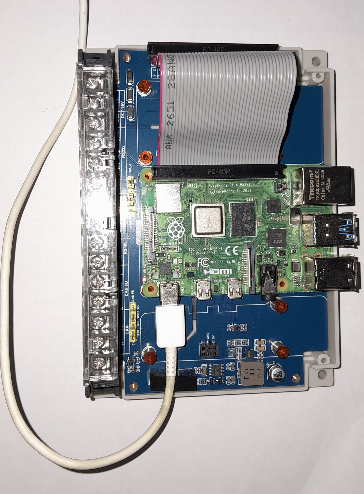
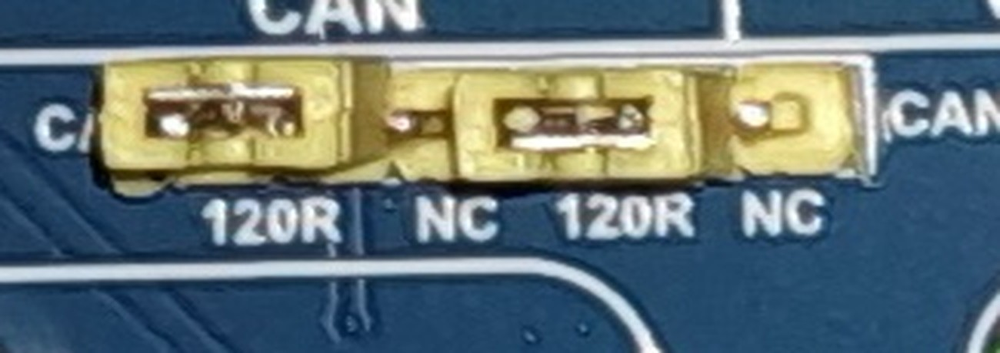

# First light: the controller answers, measured

The first three pages in this directory are about documents. This one is the
only one that contains measurements, and everything on it was taken on
**Tuesday 7 October 2026** on a Raspberry Pi 4B carrying a Waveshare WS-28164,
host name `eplepi`, user `bing`.

It is deliberately separate from [board-findings.md](board-findings.md) and
[datasheet-notes.md](datasheet-notes.md), because a measurement and a
specification are different kinds of claim and should never be able to be
mistaken for one another. Everything below is marked `[measured]` and names the
command that produced it.



*The assembly every measurement on this page was taken from. Pi 4B on the right,
WS-28164 beneath it in a DIN rail base, joined by a 40 way ribbon rather than
stacked. One USB-C cable is the entire power supply. The terminal block on the
left has nothing in it.*

## How to read a line

| Marker | Means |
|---|---|
| `[measured]` | Observed on this bench on the date given, by the command named |
| `[datasheet]` | From the manufacturer's document, with its page, for comparison |
| `[chapter]` | What this volume predicted, for comparison |
| `[inferred]` | A conclusion drawn from the above, with its reasoning |
| `[unconfirmed]` | Still not established by anything here |
| `[arithmetic]` | Follows from the measured rows by calculation, so you can redo it |

## The configuration under test

| Item | Value | Source |
|---|---|---|
| Host | Raspberry Pi 4B, `eplepi` | `[measured]` |
| Operating system | **Debian trixie** | `[measured]` |
| Adapter | Waveshare WS-28164, on a 40 way ribbon extension | `[measured]` |
| Power | **USB-C into the Pi only.** `DC7-36V` not connected | `[measured]` |
| Terminal block | **nothing wired to it** | `[measured]` |
| Overlay | `dtoverlay=mcp251xfd,spi0-1,interrupt=24` with `dtparam=spi=on` | `[measured]` |
| Tools | `can-utils` 2023.03-1+b2 | `[measured]` |

The operating system line is a correction. An earlier note in this directory
said `mcp251xfd.dtbo` was confirmed present in a **Bookworm** Lite 64-bit image.
The running system is **trixie**.

## 1. The controller answered

```bash
sudo dmesg | grep -i -e mcp251 -e spi -e can
```

```
mcp251xfd spi0.1 can0: MCP2518FD rev0.0 (-RX_INT -PLL -MAB_NO_WARN +CRC_REG
+CRC_RX +CRC_TX +ECC -HD o:40.00MHz c:40.00MHz m:20.00MHz rs:17.00MHz
es:16.66MHz rf:17.00MHz ef:16.66MHz) successfully initialized.
```

| What it says | Why it matters | Source |
|---|---|---|
| `MCP2518FD rev0.0` | The driver read the device ID over SPI, so seating, chip select and clock are all good | `[measured]` |
| `spi0.1` | SPI0 **chip select 1**, which is what the schematic says for this controller | `[measured]` |
| `o:40.00MHz` | The 40 MHz clock is seen, so no `oscillator=` parameter was needed | `[measured]` |
| `m:20.00MHz` | The part's SPI maximum, matching the datasheet's "up to 20 MHz" | `[measured]`, `[datasheet]` MCP2518FD p1 |
| `-PLL` | The internal PLL is off, correct for a direct 40 MHz clock rather than a multiplied 4 MHz one | `[measured]`, `[datasheet]` MCP2518FD p73 |
| `+CRC_REG +CRC_RX +CRC_TX` | SPI CRC protection is on in both directions | `[measured]` |
| `+ECC` | Message RAM error correction is on | `[measured]` |
| `rs:17.00MHz es:16.66MHz rf:17.00MHz ef:16.66MHz` | The driver's own derived SPI clock limits, all below the device maximum. Their exact definitions were not looked up | `[measured]`, `[unconfirmed]` |

**This is the single most useful line in the whole bring-up**, because a probe
that fails on a register or clock read means the controller is not answering,
which is seating, chip select or clock and nothing further down the stack. It
answered.

The SPI CRC flags are worth noticing given the ribbon extension. SPI runs over
40 way flat cable here, with no ground plane, at up to 17 MHz. If that ever
causes trouble it will be **reported** rather than quietly acted on
`[inferred]`.

## 2. Bit timing, and both rates came out exact

```bash
sudo ip link set can0 type can bitrate 500000 dbitrate 2000000 fd on loopback on
sudo ip link set up can0
ip -details -statistics link show can0
```

The kernel's own choice, with no sample point requested:

| Phase | tq | sync | prop | phase1 | phase2 | sjw | brp | total | bit time | sample point | Source |
|---|---|---|---|---|---|---|---|---|---|---|---|
| Nominal | 25 ns | 1 | 34 | 35 | 10 | 5 | 1 | 80 tq | 2000 ns | **0.875** | `[measured]` |
| Data | 25 ns | 1 | 7 | 7 | 5 | 2 | 1 | 20 tq | 500 ns | **0.750** | `[measured]` |

`brp 1` at 40 MHz gives a time quantum of 25 ns. 2000 and 500 both divide by 25
with nothing left over, so **both bit rates are exact** `[arithmetic]`. That is
the condition chapter 9's `bittiming` module refuses to start without, met here
independently by the kernel.

### A prediction in this chapter was wrong, and this measurement corrects it

The earlier pages predicted that the two ends of the bus would land on different
sample points, and gave the reason as 40 MHz and 80 MHz having different
achievable sets.

**That reason is wrong.** At 80 time quanta, 80 per cent is 64/80, a whole number
of quanta, perfectly achievable on this part. The real cause is kernel policy:
Linux picks a default sample point by bit rate, 75 per cent above 800 kbit/s,
80 per cent above 500 kbit/s, and 87.5 per cent at 500 kbit/s or below, which is
the CiA recommendation for lower rates. 500000 is not above 500000, so it fell
into the last bucket.

Asking for 80 per cent produced it exactly:

```bash
sudo ip link set can0 down
sudo ip link set can0 type can bitrate 500000 sample-point 0.8 \
     dbitrate 2000000 dsample-point 0.75 fd on loopback on
sudo ip link set up can0
```

| Phase | tq | sync | prop | phase1 | phase2 | sjw | brp | total | sample point | Source |
|---|---|---|---|---|---|---|---|---|---|---|
| Nominal | 25 ns | 1 | 31 | 32 | 16 | 8 | 1 | 80 tq | **0.800** | `[measured]` |
| Data | 25 ns | 1 | 7 | 7 | 5 | 2 | 1 | 20 tq | **0.750** | `[measured]` |

Chapter 9 computes 80.0 and 75.0 per cent for the Nucleo end `[chapter]` 9. With
the line above, **both ends of the eventual bus target the same two sample
points**, which removes a variable from the real bus test rather than leaving a
difference to be explained away.

So this is a configuration choice, not a hardware limit, and the `ip` line that
makes it is the deliverable.

### Transmitter delay compensation came up by itself

| Quantity | Value | Source |
|---|---|---|
| Mode flags | `<LOOPBACK,FD,TDC-AUTO>` | `[measured]` |
| `tdco` | **15** | `[measured]` |
| `tdco` range this part allows | 0 to 63 | `[measured]` |

`tdco 15` is exactly `1 + dprop-seg 7 + dphase-seg1 7`, so the kernel placed the
secondary sample point precisely on the data sample point, 375 ns into a 500 ns
bit `[arithmetic]`. That is the number chapter 9 step 5 exists to derive,
arrived at here by a working implementation.

### The register ranges this part reports

Worth recording because the STM32's M_CAN at the other end has different ones,
and chapter 9's generator has to satisfy both.

| Register | Range | Source |
|---|---|---|
| `tseg1` | 2 to 256 | `[measured]` |
| `tseg2` | 1 to 128 | `[measured]` |
| `sjw` | 1 to 128 | `[measured]` |
| `brp` | 1 to 256, increment 1 | `[measured]` |
| `dtseg1` | **1 to 32** | `[measured]` |
| `dtseg2` | **1 to 16** | `[measured]` |
| `dsjw` | 1 to 16 | `[measured]` |
| `dbrp` | 1 to 256, increment 1 | `[measured]` |
| `tdco` | 0 to 63 | `[measured]` |

The data phase ranges are much tighter than the nominal ones, which is the
reason a data phase bit has 20 quanta here and a nominal bit has 80.

## 3. Frames, and the length code confirmed on silicon

Three frames were sent in internal loopback and the byte counters read after
each. `mtu 72` throughout, which is the flexible-data size rather than the
classic 16.

| Payload asked for | Legal CAN FD length? | `TX: bytes` increment | Source |
|---|---|---|---|
| 39 bytes | **no** | **48** | `[measured]` |
| 64 bytes | yes | **64** | `[measured]` |
| 9 bytes | **no** | **12** | `[measured]` |
| 9 bytes again | **no** | **12**, identical | `[measured]` |

The nine byte case was sent twice and padded identically both times, so this is
reproducible behaviour and not a one-off `[measured]`.

The nine byte case is the one worth having. `candump -L` printed:

```
can0 123##5112233445566778899000000
```

Nine bytes of payload followed by **three explicit zero bytes**. The valid
length set is 0 to 8, then 12, 16, 20, 24, 32, 48 and 64, so nine is padded to
twelve, which is length code 9.

**Chapter 9's frame length code table is therefore confirmed against hardware**,
not merely against its own generator `[measured]`, `[chapter]` 9. And the pad
bytes are zeros, which is what chapter 10's `test_frame` asserts when it dirties
the wire buffer with `0xA5` and then checks the unused tail.

### The bit rate switch really was used

`cansend` was given flags `1` and `candump` printed `5`. That is `CANFD_FDF`
(0x04) plus `CANFD_BRS` (0x01) `[measured]`: the kernel adds the FDF bit to mark
the frame flexible-data, and the BRS bit survived. So the data phase genuinely
ran at 2 Mbit/s rather than the frame quietly falling back to the arbitration
rate.

Inside the controller only. The transceiver was not involved.

## 4. Every frame arrives twice, and this needs acting on

| Frame sent | `TX: packets` | `RX: packets` | Source |
|---|---|---|---|
| after frame 1 | 1 | **2** | `[measured]` |
| after frame 2 | 2 | **4** | `[measured]` |
| after frame 3 | 3 | **6** | `[measured]` |
| after frame 4 | 4 | **8** | `[measured]` |

Exactly two receives per transmit, four times out of four `[measured]`.

`candump -L can0` shows the reason directly. Two identical lines per frame:

```
(1791368635.314503) can0 123##5000102...3E3F
(1791368635.314529) can0 123##5000102...3E3F
```

26 microseconds apart, and the same again for the nine byte frame at 24 and then
15 microseconds. Three sends, three identical pairs. That is one frame delivered
twice: once looped back by the controller in hardware, once echoed by SocketCAN
to local sockets `[inferred]`.

The gap varies between 15 and 26 microseconds across the three, which is
consistent with two independent delivery paths rather than one duplicated
buffer, though nothing here establishes that `[unconfirmed]`.

**The consequence for this chapter's own code:** `jn-listen` will count every
frame twice on a loopback-enabled interface, and any rate it reports there would
be exactly double. `jn-setpoint` already refuses to claim a rate it did not
achieve; this is the mirror hazard on the receive side and it is not yet
handled.

It does not arise on a real two node bus with `loopback off`, which is the
arrangement [rewiring.md](rewiring.md) recommends. It arises precisely in the
configuration a person reaches for first when there is no second node.

## 5. Health throughout

| Quantity | Value after all four frames | Source |
|---|---|---|
| state | `ERROR-ACTIVE`, after all four frames | `[measured]` |
| `berr-counter` tx and rx | 0 and 0 | `[measured]` |
| `bus-errors` | 0 | `[measured]` |
| `arbit-lost` | 0 | `[measured]` |
| `error-warn`, `error-pass`, `bus-off` | 0, 0, 0 | `[measured]` |
| `re-started` | 0 | `[measured]` |
| RX and TX `errors`, `dropped`, `missed` | all 0 | `[measured]` |

This group matters more than the packet counts, and it is why the counters were
read rather than `candump` alone. **A frame appearing in `candump` proves
nothing**, because SocketCAN echoes every transmitted frame to local sockets
regardless of what the hardware did. If the controller had not genuinely looped
back, nothing on the bus would have acknowledged the frame, `bus-errors` would
have climbed immediately and the state would have walked to `ERROR-PASSIVE` and
then `BUS-OFF`.

They stayed at zero. The hardware did the work.

## What this run did not prove

The honest list, and it is longer than the list of what it did prove.

| Not proved | Why | Source |
|---|---|---|
| **That the isolated side is powered at all** | The controller sits on the Pi side of the barrier, so a healthy probe says nothing about `5VB` or `3V3B` | `[inferred]` |
| Anything about the transceiver | In internal loopback the frame never reaches `U6` | `[inferred]` |
| Anything about termination | No wire, so nothing to terminate | `[measured]` |
| Anything about a cable, reflections or noise | Same | `[measured]` |
| Anything about a second node | There is not one | `[measured]` |
| Which position the `120R` and `NC` jumper caps are on | **Closed.** Both are on `120R`, see below | `[measured]` |

The first row is the one to hold on to. It is exactly the quiet failure the
findings page is built around, and **this run cannot distinguish a working
isolated side from a dead one**. Only a frame that reaches the wire can.

## The termination jumpers, read off the board

This is the one thing no document can supply, because a jumper position is a
state rather than a specification. Enlarged from the photograph above:



| Channel | Jumper | Cap position | Terminated? | Source |
|---|---|---|---|---|
| Classic CAN | `J2`, selecting `R6` | **`120R`** | **yes** | `[measured]` |
| CAN FD | `J1`, selecting `R16` | **`120R`** | **yes** | `[measured]` |

Both caps sit squarely over their `120R` silkscreen, and the `NC` position on
each header shows a bare pin with nothing over it. The two read identically,
which is what makes it safe to call rather than a judgement on a blurred edge.

**So the board ships, or was left, with both CAN channels terminated.** That is
the right state for the two node self bus in [rewiring.md](rewiring.md), where
the two channels are the two ends of one short wire and both ends want 120 ohms.
It is also the right state for a two node bus to the Nucleo, provided the Nucleo
end carries the other termination and nothing is added in the middle.

It is the **wrong** state the moment this board becomes a third node in the
middle of somebody else's bus, which is worth knowing now rather than
rediscovering as a bus that half works at speed.

## What else the photograph settled

A photograph of the assembled board on Tuesday 7 October 2026 reads the terminal
block silkscreen top to bottom as `DC7-36V`, `RS232`, `RS485_2`, `RS485_1`,
`CAN FD`, `CAN`. That is the reverse of the order derived from the schematic's
`P2` symbol, which places **position 1 at the `CAN` end** and confirms the
grouping one for one `[measured]`:

| Silkscreen group | Schematic positions | Source |
|---|---|---|
| `DC7-36V` | 14, 15 | `[measured]` |
| `RS232` | 11, 12, 13 | `[measured]` |
| `RS485_2` | 9, 10 | `[measured]` |
| `RS485_1` | 6, 7, 8 | `[measured]` |
| **`CAN FD`** | **4, 5**, which are `H2` and `L2` | `[measured]` |
| **`CAN`** | **1, 2**, which are `H1` and `L1` | `[measured]` |

The `2R2` marking visible on the inductor is `L1`, the 2.2 uH part the schematic
names `[measured]`.

## Corrections this run forced

| # | Before | After |
|---|---|---|
| 1 | The image is Bookworm | It is Debian **trixie** |
| 2 | The two ends will land on different sample points because 40 MHz and 80 MHz divide differently | 80.0 per cent is exactly achievable here. The 87.5 was kernel **policy** for rates at or below 500 kbit/s |
| 3 | Chapter 9's length code is checked against its own generator | It is now checked against silicon: nine bytes padded to twelve with three zero bytes |
| 4 | `jn-listen` counts frames | It counts them **twice** on a loopback interface, and that is not yet handled |

Item 2 is the second time in one day that a plausible mechanism was named for a
real observation and turned out to be the wrong mechanism. The first was
believing the SN65HVD230 is too slow for CAN FD when the real limit is loop
delay symmetry. Both were settled by going and looking rather than by thinking
harder, which is the whole argument of
[rewiring.md](rewiring.md)'s reflections section.

## The next thing that would teach something

In order, cheapest first.

1. ~~Photograph the two jumpers and record which position each cap is in.~~
   **Done.** Both on `120R`, recorded above.
2. **Join terminal position 1 to 4 and 2 to 5**, both caps already on `120R`, turn
   `loopback off`, and run the two node self bus from
   [rewiring.md](rewiring.md). That is the first test that puts a frame on a
   wire, and therefore the first that can prove the isolated side is alive.
3. Settle `PD0` and `PD1` against the STM32H7A3ZI datasheet and UM2408 before
   any wire enters the Nucleo. That gate is still shut.
