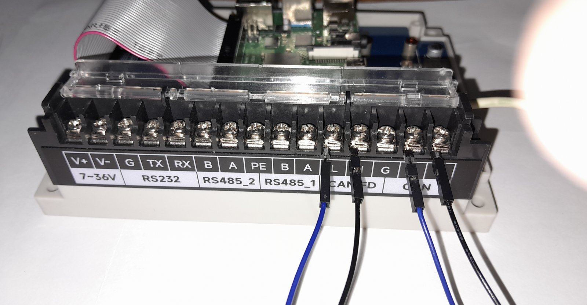

# First light: the controller answers, measured

The other pages in this directory are about documents. This one is the
only one that contains measurements, and everything on it was taken on
**Tuesday 7 October 2026** on a Raspberry Pi 4B carrying a Waveshare WS-28164,
host name `eplepi`, user `bing`.

It covers three runs. **Part one** is internal loopback with nothing wired, which
proves the controller and the bit timing and cannot touch a wire. **Part two** is
the board wired to itself as a two node bus, which is the run that finally shows
the isolated side is alive. **Part three** puts this chapter's own tools on that
bus and finds its ceiling, which yields the first measured frame length this
volume has.

It is deliberately separate from [board-findings.md](board-findings.md) and
[datasheet-notes.md](datasheet-notes.md), because a measurement and a
specification are different kinds of claim and should never be able to be
mistaken for one another. Everything below is marked `[measured]` and names the
command that produced it.


*The assembly every measurement on this page was taken from. Pi 4B on the right,
WS-28164 beneath it in a DIN rail base, joined by a 40 way ribbon rather than
stacked. One USB-C cable is the entire power supply. The terminal block on the
left has nothing in it.*

## How to read a line

| Marker | Means |
|---|---|
| `[measured]` | Observed on this bench on the date given, by the command named |
| `[datasheet]` | From the manufacturer's document, with its page, for comparison |
| `[chapter]` | What this volume predicted, for comparison |
| `[inferred]` | A conclusion drawn from the above, with its reasoning |
| `[unconfirmed]` | Still not established by anything here |
| `[arithmetic]` | Follows from the measured rows by calculation, so you can redo it |

## The configuration under test

| Item | Value | Source |
|---|---|---|
| Host | Raspberry Pi 4B, `eplepi` | `[measured]` |
| Operating system | **Debian trixie** | `[measured]` |
| Adapter | Waveshare WS-28164, on a 40 way ribbon extension | `[measured]` |
| Power | **USB-C into the Pi only.** `DC7-36V` not connected | `[measured]` |
| Terminal block | **nothing wired to it** | `[measured]` |
| Overlay | `dtoverlay=mcp251xfd,spi0-1,interrupt=24` with `dtparam=spi=on` | `[measured]` |
| Tools | `can-utils` 2023.03-1+b2 | `[measured]` |

The operating system line is a correction. An earlier note in this directory
said `mcp251xfd.dtbo` was confirmed present in a **Bookworm** Lite 64-bit image.
The running system is **trixie**.

---

# Part one: internal loopback, no wire

## 1. The controller answered

```bash
sudo dmesg | grep -i -e mcp251 -e spi -e can
```

```
mcp251xfd spi0.1 can0: MCP2518FD rev0.0 (-RX_INT -PLL -MAB_NO_WARN +CRC_REG
+CRC_RX +CRC_TX +ECC -HD o:40.00MHz c:40.00MHz m:20.00MHz rs:17.00MHz
es:16.66MHz rf:17.00MHz ef:16.66MHz) successfully initialized.
```

| What it says | Why it matters | Source |
|---|---|---|
| `MCP2518FD rev0.0` | The driver read the device ID over SPI, so seating, chip select and clock are all good | `[measured]` |
| `spi0.1` | SPI0 **chip select 1**, which is what the schematic says for this controller | `[measured]` |
| `o:40.00MHz` | The 40 MHz clock is seen, so no `oscillator=` parameter was needed | `[measured]` |
| `m:20.00MHz` | The part's SPI maximum, matching the datasheet's "up to 20 MHz" | `[measured]`, `[datasheet]` MCP2518FD p1 |
| `-PLL` | The internal PLL is off, correct for a direct 40 MHz clock rather than a multiplied 4 MHz one | `[measured]`, `[datasheet]` MCP2518FD p73 |
| `+CRC_REG +CRC_RX +CRC_TX` | SPI CRC protection is on in both directions | `[measured]` |
| `+ECC` | Message RAM error correction is on | `[measured]` |
| `rs:17.00MHz es:16.66MHz rf:17.00MHz ef:16.66MHz` | The driver's own derived SPI clock limits, all below the device maximum. Their exact definitions were not looked up | `[measured]`, `[unconfirmed]` |

**This is the single most useful line in the whole bring-up**, because a probe
that fails on a register or clock read means the controller is not answering,
which is seating, chip select or clock and nothing further down the stack. It
answered.

The SPI CRC flags are worth noticing given the ribbon extension. SPI runs over
40 way flat cable here, with no ground plane, at up to 17 MHz. If that ever
causes trouble it will be **reported** rather than quietly acted on
`[inferred]`.

## 2. Bit timing, and both rates came out exact

```bash
sudo ip link set can0 type can bitrate 500000 dbitrate 2000000 fd on loopback on
sudo ip link set up can0
ip -details -statistics link show can0
```

The kernel's own choice, with no sample point requested:

| Phase | tq | sync | prop | phase1 | phase2 | sjw | brp | total | bit time | sample point | Source |
|---|---|---|---|---|---|---|---|---|---|---|---|
| Nominal | 25 ns | 1 | 34 | 35 | 10 | 5 | 1 | 80 tq | 2000 ns | **0.875** | `[measured]` |
| Data | 25 ns | 1 | 7 | 7 | 5 | 2 | 1 | 20 tq | 500 ns | **0.750** | `[measured]` |

`brp 1` at 40 MHz gives a time quantum of 25 ns. 2000 and 500 both divide by 25
with nothing left over, so **both bit rates are exact** `[arithmetic]`. That is
the condition chapter 9's `bittiming` module refuses to start without, met here
independently by the kernel.

### A prediction in this chapter was wrong, and this measurement corrects it

The earlier pages predicted that the two ends of the bus would land on different
sample points, and gave the reason as 40 MHz and 80 MHz having different
achievable sets.

**That reason is wrong.** At 80 time quanta, 80 per cent is 64/80, a whole number
of quanta, perfectly achievable on this part. The real cause is kernel policy:
Linux picks a default sample point by bit rate, 75 per cent above 800 kbit/s,
80 per cent above 500 kbit/s, and 87.5 per cent at 500 kbit/s or below, which is
the CiA recommendation for lower rates. 500000 is not above 500000, so it fell
into the last bucket.

Asking for 80 per cent produced it exactly:

```bash
sudo ip link set can0 down
sudo ip link set can0 type can bitrate 500000 sample-point 0.8 \
     dbitrate 2000000 dsample-point 0.75 fd on loopback on
sudo ip link set up can0
```

| Phase | tq | sync | prop | phase1 | phase2 | sjw | brp | total | sample point | Source |
|---|---|---|---|---|---|---|---|---|---|---|
| Nominal | 25 ns | 1 | 31 | 32 | 16 | 8 | 1 | 80 tq | **0.800** | `[measured]` |
| Data | 25 ns | 1 | 7 | 7 | 5 | 2 | 1 | 20 tq | **0.750** | `[measured]` |

Chapter 9 computes 80.0 and 75.0 per cent for the Nucleo end `[chapter]` 9. With
the line above, **both ends of the eventual bus target the same two sample
points**, which removes a variable from the real bus test rather than leaving a
difference to be explained away.

So this is a configuration choice, not a hardware limit, and the `ip` line that
makes it is the deliverable.

### Transmitter delay compensation came up by itself

| Quantity | Value | Source |
|---|---|---|
| Mode flags | `<LOOPBACK,FD,TDC-AUTO>` | `[measured]` |
| `tdco` | **15** | `[measured]` |
| `tdco` range this part allows | 0 to 63 | `[measured]` |

`tdco 15` is exactly `1 + dprop-seg 7 + dphase-seg1 7`, so the kernel placed the
secondary sample point precisely on the data sample point, 375 ns into a 500 ns
bit `[arithmetic]`. That is the number chapter 9 step 5 exists to derive,
arrived at here by a working implementation.

### The register ranges this part reports

Worth recording because the STM32's M_CAN at the other end has different ones,
and chapter 9's generator has to satisfy both.

| Register | Range | Source |
|---|---|---|
| `tseg1` | 2 to 256 | `[measured]` |
| `tseg2` | 1 to 128 | `[measured]` |
| `sjw` | 1 to 128 | `[measured]` |
| `brp` | 1 to 256, increment 1 | `[measured]` |
| `dtseg1` | **1 to 32** | `[measured]` |
| `dtseg2` | **1 to 16** | `[measured]` |
| `dsjw` | 1 to 16 | `[measured]` |
| `dbrp` | 1 to 256, increment 1 | `[measured]` |
| `tdco` | 0 to 63 | `[measured]` |

The data phase ranges are much tighter than the nominal ones, which is the
reason a data phase bit has 20 quanta here and a nominal bit has 80.

## 3. Frames, and the length code confirmed on silicon

Three frames were sent in internal loopback and the byte counters read after
each. `mtu 72` throughout, which is the flexible-data size rather than the
classic 16.

| Payload asked for | Legal CAN FD length? | `TX: bytes` increment | Source |
|---|---|---|---|
| 39 bytes | **no** | **48** | `[measured]` |
| 64 bytes | yes | **64** | `[measured]` |
| 9 bytes | **no** | **12** | `[measured]` |
| 9 bytes again | **no** | **12**, identical | `[measured]` |

The nine byte case was sent twice and padded identically both times, so this is
reproducible behaviour and not a one-off `[measured]`.

The nine byte case is the one worth having. `candump -L` printed:

```
can0 123##5112233445566778899000000
```

Nine bytes of payload followed by **three explicit zero bytes**. The valid
length set is 0 to 8, then 12, 16, 20, 24, 32, 48 and 64, so nine is padded to
twelve, which is length code 9.

**Chapter 9's frame length code table is therefore confirmed against hardware**,
not merely against its own generator `[measured]`, `[chapter]` 9. And the pad
bytes are zeros, which is what chapter 10's `test_frame` asserts when it dirties
the wire buffer with `0xA5` and then checks the unused tail.

### The bit rate switch really was used

`cansend` was given flags `1` and `candump` printed `5`. That is `CANFD_FDF`
(0x04) plus `CANFD_BRS` (0x01) `[measured]`: the kernel adds the FDF bit to mark
the frame flexible-data, and the BRS bit survived. So the data phase genuinely
ran at 2 Mbit/s rather than the frame quietly falling back to the arbitration
rate.

Inside the controller only. The transceiver was not involved.

## 4. Every frame arrives twice, and this needs acting on

| Frame sent | `TX: packets` | `RX: packets` | Source |
|---|---|---|---|
| after frame 1 | 1 | **2** | `[measured]` |
| after frame 2 | 2 | **4** | `[measured]` |
| after frame 3 | 3 | **6** | `[measured]` |
| after frame 4 | 4 | **8** | `[measured]` |

Exactly two receives per transmit, four times out of four `[measured]`.

`candump -L can0` shows the reason directly. Two identical lines per frame:

```
(1791368635.314503) can0 123##5000102...3E3F
(1791368635.314529) can0 123##5000102...3E3F
```

26 microseconds apart, and the same again for the nine byte frame at 24 and then
15 microseconds. Three sends, three identical pairs. That is one frame delivered
twice: once looped back by the controller in hardware, once echoed by SocketCAN
to local sockets `[inferred]`.

The gap varies between 15 and 26 microseconds across the three, which is
consistent with two independent delivery paths rather than one duplicated
buffer, though nothing here establishes that `[unconfirmed]`.

**The consequence for this chapter's own code:** `jn-listen` will count every
frame twice on a loopback-enabled interface, and any rate it reports there would
be exactly double. `jn-setpoint` already refuses to claim a rate it did not
achieve; this is the mirror hazard on the receive side and it is not yet
handled.

It does not arise on a real two node bus with `loopback off`, which is the
arrangement [rewiring.md](rewiring.md) recommends. It arises precisely in the
configuration a person reaches for first when there is no second node.

## 5. Health throughout

| Quantity | Value after all four frames | Source |
|---|---|---|
| state | `ERROR-ACTIVE`, after all four frames | `[measured]` |
| `berr-counter` tx and rx | 0 and 0 | `[measured]` |
| `bus-errors` | 0 | `[measured]` |
| `arbit-lost` | 0 | `[measured]` |
| `error-warn`, `error-pass`, `bus-off` | 0, 0, 0 | `[measured]` |
| `re-started` | 0 | `[measured]` |
| RX and TX `errors`, `dropped`, `missed` | all 0 | `[measured]` |

This group matters more than the packet counts, and it is why the counters were
read rather than `candump` alone. **A frame appearing in `candump` proves
nothing**, because SocketCAN echoes every transmitted frame to local sockets
regardless of what the hardware did. If the controller had not genuinely looped
back, nothing on the bus would have acknowledged the frame, `bus-errors` would
have climbed immediately and the state would have walked to `ERROR-PASSIVE` and
then `BUS-OFF`.

They stayed at zero. The hardware did the work.

## What this run did not prove

The honest list, and it is longer than the list of what it did prove.

| Not proved | Why | Source |
|---|---|---|
| **That the isolated side is powered at all** | The controller sits on the Pi side of the barrier, so a healthy probe says nothing about `5VB` or `3V3B` | `[inferred]` |
| Anything about the transceiver | In internal loopback the frame never reaches `U6` | `[inferred]` |
| Anything about termination | No wire, so nothing to terminate | `[measured]` |
| Anything about a cable, reflections or noise | Same | `[measured]` |
| Anything about a second node | There is not one | `[measured]` |
| Which position the `120R` and `NC` jumper caps are on | **Closed.** Both are on `120R`, see below | `[measured]` |

The first row is the one to hold on to. It is exactly the quiet failure the
findings page is built around, and **this run cannot distinguish a working
isolated side from a dead one**. Only a frame that reaches the wire can.

## The termination jumpers, read off the board

This is the one thing no document can supply, because a jumper position is a
state rather than a specification. Enlarged from the photograph above:


| Channel | Jumper | Cap position | Terminated? | Source |
|---|---|---|---|---|
| Classic CAN | `J2`, selecting `R6` | **`120R`** | **yes** | `[measured]` |
| CAN FD | `J1`, selecting `R16` | **`120R`** | **yes** | `[measured]` |

Both caps sit squarely over their `120R` silkscreen, and the `NC` position on
each header shows a bare pin with nothing over it. The two read identically,
which is what makes it safe to call rather than a judgement on a blurred edge.

**So the board ships, or was left, with both CAN channels terminated.** That is
the right state for the two node self bus in [rewiring.md](rewiring.md), where
the two channels are the two ends of one short wire and both ends want 120 ohms.
It is also the right state for a two node bus to the Nucleo, provided the Nucleo
end carries the other termination and nothing is added in the middle.

It is the **wrong** state the moment this board becomes a third node in the
middle of somebody else's bus, which is worth knowing now rather than
rediscovering as a bus that half works at speed.

## What else the photograph settled

A photograph of the assembled board on Tuesday 7 October 2026 reads the terminal
block silkscreen top to bottom as `DC7-36V`, `RS232`, `RS485_2`, `RS485_1`,
`CAN FD`, `CAN`. That is the reverse of the order derived from the schematic's
`P2` symbol, which places **position 1 at the `CAN` end** and confirms the
grouping one for one `[measured]`:

| Silkscreen group | Schematic positions | Source |
|---|---|---|
| `DC7-36V` | 14, 15 | `[measured]` |
| `RS232` | 11, 12, 13 | `[measured]` |
| `RS485_2` | 9, 10 | `[measured]` |
| `RS485_1` | 6, 7, 8 | `[measured]` |
| **`CAN FD`** | **4, 5**, which are `H2` and `L2` | `[measured]` |
| **`CAN`** | **1, 2**, which are `H1` and `L1` | `[measured]` |

The `2R2` marking visible on the inductor is `L1`, the 2.2 uH part the schematic
names `[measured]`.

## Corrections this run forced

| # | Before | After |
|---|---|---|
| 1 | The image is Bookworm | It is Debian **trixie** |
| 2 | The two ends will land on different sample points because 40 MHz and 80 MHz divide differently | 80.0 per cent is exactly achievable here. The 87.5 was kernel **policy** for rates at or below 500 kbit/s |
| 3 | Chapter 9's length code is checked against its own generator | It is now checked against silicon: nine bytes padded to twelve with three zero bytes |
| 4 | `jn-listen` counts frames | It counts them **twice** on a loopback interface, and that is not yet handled |

Item 2 is the second time in one day that a plausible mechanism was named for a
real observation and turned out to be the wrong mechanism. The first was
believing the SN65HVD230 is too slow for CAN FD when the real limit is loop
delay symmetry. Both were settled by going and looking rather than by thinking
harder, which is the whole argument of
[rewiring.md](rewiring.md)'s reflections section.

---

# Part two: a real two node bus, Tuesday 7 October 2026

Everything above was internal loopback, where the frame never leaves the
controller. This part is the same board wired to itself, so that frames cross
both transceivers, the isolation barrier twice, and an actual wire.

It is the test that settles the question the whole of
[board-findings.md](board-findings.md) was built around, and it needed no parts:
two jumper wires and five minutes.

## The wiring, and the terminal legend



| Wire | From | To | Source |
|---|---|---|---|
| black | `CAN FD` **H** | `CAN` **H** | `[measured]` |
| blue | `CAN FD` **L** | `CAN` **L** | `[measured]` |
| none | `G` between them | left empty, both channels already share `SGND` | `[measured]` |

Both termination caps stayed on `120R`, which is correct: the two channels are
now the two ends of one very short bus.

**The printed legend is better documentation than anything derived from the
schematic, and it confirms the fifteen position order screw for screw**
`[measured]`:

| Printed | Group | Schematic position | Source |
|---|---|---|---|
| `V+` `V-` | `7~36V` | 15, 14 | `[measured]` |
| `G` `TX` `RX` | `RS232` | 13, 12, 11 | `[measured]` |
| `B` `A` | `RS485_2` | 10, 9 | `[measured]` |
| **`PE`** | between the two RS485 groups | 8 | `[measured]` |
| `B` `A` | `RS485_1` | 7, 6 | `[measured]` |
| **`L` `H`** | **`CAN FD`** | 5, 4 | `[measured]` |
| `G` | shared | 3 | `[measured]` |
| **`L` `H`** | **`CAN`** | 2, 1 | `[measured]` |

One correction falls out of it: position 8's isolated ground is printed **`PE`**,
protective earth, not `G` `[measured]`. The schematic calls it `SGND` like the
others.

## Both controllers, and the interface names moved

Adding the classic channel needs one more line in `config.txt`:

```
dtoverlay=mcp2515,spi0-0,oscillator=16000000,interrupt=23
```

It needs its `oscillator=` because 16 MHz is not the driver's default, and
`interrupt=23` matches `R35`, the fitted zero ohm link.

```
mcp251x    spi0.0 can0: MCP2515 successfully initialized.
mcp251xfd  spi0.1 can1: MCP2518FD rev0.0 (...) successfully initialized.
```

**The CAN FD channel was `can0` when it was the only one. It is `can1` now.**
`[measured]` The classic controller probes first and takes the lower number. That
is the probe order trap from [board-findings.md](board-findings.md) happening for
real, within one afternoon, on one machine, with no change but an added overlay.

So the identity check is not pedantry:

```bash
for i in /sys/class/net/can*; do
  echo "$i -> $(basename $(readlink -f $i/device/driver))"
done
```

| Interface | Driver | Channel | Terminal group | Source |
|---|---|---|---|---|
| `can0` | `mcp251x` | classic CAN | `CAN` | `[measured]` |
| `can1` | `mcp251xfd` | CAN FD | `CAN FD` | `[measured]` |

## Bit timing: the same sample point by different arithmetic

Both channels at 500 kbit/s, classic, no sample point requested:

| | reported clock | tq | sync, prop, phase1, phase2 | total | sample point | Source |
|---|---|---|---|---|---|---|
| `can0` MCP2515 | **8 MHz** | 125 ns | 1, 6, 7, 2 | **16 tq** | 14/16 = **0.875** | `[measured]` |
| `can1` MCP2518FD | 40 MHz | 25 ns | 1, 34, 35, 10 | **80 tq** | 70/80 = **0.875** | `[measured]` |

Two things worth noticing.

**The MCP2515 reports its clock as 8 MHz, not 16.** Its time quantum is
`2 x (BRP+1) / Fosc` `[datasheet]` MCP2515 p42, so the driver presents the CAN
clock as half the crystal. The datasheet formula showing up in `ip` output.

**0.800 is not achievable on that controller at this bit rate**, and this was
predicted before the run rather than discovered after. With a 125 ns minimum
quantum a 2000 ns bit is at most 16 quanta, and 80 per cent of 16 is 12.8, not a
whole number. 87.5 per cent is 14/16 exactly `[arithmetic]`. So the kernel's
default was the only sensible choice here, and the two controllers reached the
same sample point from 16 quanta and from 80.

Its register ranges are correspondingly tight `[measured]`:

| Register | `mcp251x` | `mcp251xfd` | Source |
|---|---|---|---|
| `tseg1` | **3 to 16** | 2 to 256 | `[measured]` |
| `tseg2` | **2 to 8** | 1 to 128 | `[measured]` |
| `sjw` | **1 to 4** | 1 to 128 | `[measured]` |
| `brp` | 1 to 64 | 1 to 256 | `[measured]` |

A bit can be at most 25 quanta on the classic part against 385 on the flexible
data one. That is the whole reason one has 16 and the other 80.

## The failure first, because it is the more useful half

The wires were not fitted on the first attempt, and the result is worth keeping
as a worked example of reading CAN error counters.

| Interface | State | Counters | Source |
|---|---|---|---|
| `can1`, transmitting | **`ERROR-PASSIVE`** | **`berr-counter tx 128`**, `error-warn 1`, `error-pass 1` | `[measured]` |
| `can0`, listening | `ERROR-ACTIVE` | **everything zero**, RX 0 | `[measured]` |

**TEC rises by 8 per failed attempt, so 128 is exactly 16 failed transmissions**
`[arithmetic]`. It then stopped climbing, which is correct: an error passive
transmitter that receives no acknowledgement does not keep incrementing. It was
still retrying, which is why `TX: packets` stayed at 0 rather than counting a
failure.

**The asymmetry is the diagnosis.** A transmitter in trouble and a listener with
pristine counters means nothing reached the listener's receiver at all, not even
a corrupted frame. Four things produce that signature and the data cannot
separate them:

| Candidate | Why it fits |
|---|---|
| no wire at all | nothing to carry the frame. **This was the actual cause** |
| wires on the wrong terminals | same |
| `H` and `L` swapped | a dominant arrives as a negative differential, reads as permanently recessive, so the listener sees silence and reports no error |
| the isolated side unpowered | both transceivers dead |

The test that would have separated the last one from the first three is
`berr-reporting on`, which makes the controller name the error: **`ack-error`**
means the transceiver drives the bus and reads itself back, so the fault is
between the nodes; **`bit-error`** means the transceiver cannot read back its own
dominant bit, which points at the isolated supply. It was not needed in the end.

**A thing worth noticing about `TX: packets`.** It counts successful
transmissions, not attempts. A CAN controller with nothing to talk to retries
forever and that counter never moves, so a reading of zero is not evidence of a
software problem. The error counters are where the information is.

## The bus working

The moment the second wire made contact, the frames `can1` had been retrying
flushed out at once:

```
(1791370881.125692) can0 123#DEADBEEF
(1791370881.126466) can0 123#DEADBEEF
(1791370881.126639) can0 123#DEADBEEF
```

173 microseconds between the last two, which is about one 4-byte classic frame
at 500 kbit/s `[arithmetic]`. Then deliberately, in both directions:

| Direction | Sent | `candump` lines | Source |
|---|---|---|---|
| `can1` to `can0` | `123#DEADBEEF` | **1** | `[measured]` |
| `can0` to `can1` | `456#CAFEBABE` | **1** | `[measured]` |

Counters after both, with every error counter still at zero and both interfaces
`ERROR-ACTIVE` `[measured]`:

| | TX packets | RX packets | Source |
|---|---|---|---|
| `can0`, `mcp251x` | 1 | 4 | `[measured]` |
| `can1`, `mcp251xfd` | 4 | 5 | `[measured]` |

`can1`'s `berr-counter tx` went back to **0** from 128. The `error-warn 1` and
`error-pass 1` entries are cumulative history of the unwired attempts, not the
current state, and that distinction is easy to misread.

## What this finally proves

Every row here was open before this run and could not be closed by any amount of
loopback.

| Question | Answer | Why this run settles it | Source |
|---|---|---|---|
| **Is the isolated side powered at all?** | **Yes** | A frame crossed the barrier twice and came back acknowledged | `[measured]` |
| Does the MCP2562FD work? | **Yes** | It drove the bus | `[measured]` |
| Is `U6` `STBY` tied low? | **Yes** | In standby its transmitter is disabled, so nothing would have left | `[measured]` |
| Does the SN65HVD230 work? | **Yes** | It received, and it acknowledged | `[measured]` |
| Are the terminations right? | **Yes** | Both `120R`, and the bus works at 500 kbit/s | `[measured]` |
| Is the wiring correct? | **Yes** | Both directions, zero errors | `[measured]` |

The `STBY` row is the satisfying one. It was inferred by counting isolator
channels, finding all four already carrying transmit and receive for the two CAN
sections, and concluding there was no path across the barrier for a standby
signal so it must be strapped low. A frame leaving the transceiver confirms the
inference without anybody reading that net.

## The double delivery, resolved

Under internal loopback every frame arrived twice. With `loopback off` and a real
second node it arrives once:

| Configuration | `candump` lines per frame | Sender's RX per TX | Source |
|---|---|---|---|
| `loopback on`, one node | **2** | 2 | `[measured]` |
| `loopback off`, two nodes | **1** | 1 | `[measured]` |

So the duplicate really was the controller's hardware loopback plus SocketCAN's
local echo, as inferred earlier, and only the echo remains when the hardware is
not looping back.

**`jn-listen` is therefore safe on this two node bus and unsafe on a loopback
interface**, where it would report double the true frame count and double the
true rate.

## A counter difference between the two drivers

| Interface | Driver | Sent | Own RX changed by | Source |
|---|---|---|---|---|
| `can1` | `mcp251xfd` | 4 frames | **+4** | `[measured]` |
| `can0` | `mcp251x` | 1 frame | **+0** | `[measured]` |

`mcp251xfd` counts its own local echo in the interface's RX statistics.
`mcp251x` does not. The reason is somewhere in the two drivers and has not been
looked up `[unconfirmed]`.

**The practical consequence is immediate: RX packet counts cannot be compared
between these two interfaces.** Anything in this chapter that counts frames has
to know which driver it is looking at, or count at the socket rather than at the
interface.

## What a two node bus on one board still cannot show

| Not proved | Why |
|---|---|
| Anything about CAN FD | The MCP2515 is classic only, so the bus runs classic. No rate switch, no 64 byte payload, no length code |
| Anything about isolation as isolation | Both nodes sit on the same isolated rail and the same `SGND`. There is no ground offset between them because it is the same ground |
| Anything about cable length, reflections or noise | The wire is two jumper leads |
| Arbitration under contention | Both nodes can transmit, but nothing here made them transmit at the same instant |
| Anything about the node end | The Nucleo is exactly as far away as it was |

So this replaces `vcan0`, not the real bus. It is a strictly better substitute:
real bit timing, real transceivers, real termination, real acknowledgement, real
error counters that mean something. Chapters 10, 11, 12 and 19 can use it today.

**One mechanical caution before trusting any number from it.** The jumper leads
are pushed into the terminal block rather than clamped under the screws, which is
a friction contact. The first three frames arrived while the second wire was
being moved rather than when a command was run, which is exactly how a friction
contact announces itself. Strip the ends and clamp the bare copper before taking
any measurement that matters.

---

# Part three: the chapter's own tools, and a measured bus ceiling

Parts one and two used `cansend` and `candump`. This part runs **this chapter's
own code** against the two node bus, which it had never met: `jn-listen` and
`jn_bus.c` had only ever seen `vcan0` in a CI job.

It produced the first measured number this volume has about a real bus, and the
number turned out to be worth having.

## Building on the board

```bash
sudo apt install -y build-essential git
git clone https://github.com/ambrosiobing/robot-joint-node.git ~/src/robot-joint-node
sudo modprobe vcan && sudo ip link add dev vcan0 type vcan && sudo ip link set up vcan0
cd ~/src/robot-joint-node/joint-node/ch10-the-motion-master && make
```

| Test | Result | Source |
|---|---|---|
| `test_frame` | `ok  frame layout, identifier flags, length rules, printed form, and a fully written wire` | `[measured]` |
| `test_log` | `ok  log format, file round trip, repeatable reads, and a deliberate gap` | `[measured]` |
| `test_bus` | **`ok  two sockets on vcan0, classic and flexible-data, and a kernel filter`** | `[measured]` |

**The third line is the one that had never happened outside CI.** `test_bus`
exercises the socket, the flexible-data socket option, the 72 byte layout and a
kernel filter, and it had reported a clean skip on every machine this volume is
written on. `build-essential` was already installed on the image; only `git` had
to be fetched.

## The tools, end to end on the real bus

```bash
./build/jn-listen can0 --classic --out run.log --seconds 8 > /dev/null &
sleep 1
./build/jn-setpoint can1 --rate 200 --seconds 5
```

| Quantity | Value | Source |
|---|---|---|
| Frames sent | **1000** | `[measured]` |
| Rate achieved against asked | **200.2 Hz against 200.0** | `[measured]` |
| Frames seen by `jn-listen` | **1000** | `[measured]` |
| Lines in `run.log` | **1000** | `[measured]` |
| Inter-frame interval observed | about 4.98 ms, jitter around 20 us | `[measured]` |

The payload is a 32 bit little-endian counter in bytes 0 to 3, and it arrived
contiguous and uncorrupted:

```
can0  101#0000000000000000     counter 0
can0  101#0100000000000000     counter 1
...
can0  101#FF00000000000000     counter 255
can0  101#0001000000000000     counter 256
```

**A note on how not to run this.** The first attempts gave 150 and then 298
frames against 1000 sent, which looked like catastrophic loss and was not: the
listener's window and the generator's barely overlapped. Backgrounding the
listener and sleeping one second before starting the generator fixed it. Two
programs started by hand in two terminals do not overlap the way you think they
do.

## One ramp that was contaminated, and what it taught

The first rate ramp was run while a separate 200 Hz test was still going in
another terminal. Two generators on one bus. The job numbers gave it away.

| Asked | What happened | Source |
|---|---|---|
| 500 Hz | 2500 sent, 2500 seen | `[measured]` |
| 1000 Hz | 5000 sent, **6000 seen** | `[measured]` |
| 2000 Hz | 10000 sent, 10000 seen | `[measured]` |
| 3000 Hz | **`ENOBUFS` after 1126 frames** | `[measured]` |
| 4000 Hz | 20000 sent, 20000 seen | `[measured]` |

The 6000 is 5000 of its own plus the other run's 1000. And the 3000 Hz failure
was **contention**, not a rate limit, which the clean ramp below confirms by
passing 3000 Hz comfortably. A ceiling that bites at 3000 and not at 4000 is not
a ceiling, and that inconsistency is what said the measurement was contaminated
rather than surprising.

## The clean ramp at 500 kbit/s

```bash
for r in 1000 2000 3000 3500 4000 4200 4400; do
  ./build/jn-listen can0 --classic --seconds 7 > /dev/null &
  sleep 1
  ./build/jn-setpoint can1 --rate $r --seconds 5
  wait
done
```

| Asked | Sent | Achieved | Seen | Result | Source |
|---|---|---|---|---|---|
| 1000 Hz | 5000 | 1000.2 | 5000 | pass | `[measured]` |
| 2000 Hz | 10000 | 2000.2 | 10000 | pass | `[measured]` |
| 3000 Hz | 15000 | 3000.1 | 15000 | pass | `[measured]` |
| 3500 Hz | 17500 | 3500.1 | 17500 | pass | `[measured]` |
| **4000 Hz** | 20000 | 4000.1 | **20000** | **pass** | `[measured]` |
| **4200 Hz** | 151 | | 151 | **`ENOBUFS`** | `[measured]` |
| 4400 Hz | 134 | | 134 | `ENOBUFS` | `[measured]` |

A sharp cliff between 4000 and 4200 frames per second.

## The test that proved it was the bus

A cliff at 4100 frames per second could be the bus at 500 kbit/s, or it could be
the SPI link, or the Pi's own throughput. The arithmetic fitted the bus suspiciously
well, which is a reason to check rather than to believe.

**Double the bit rate. If the cliff doubles it is the bus; if it stays put it is
the adapter or the host.**

Both parts can do 1 Mbit/s classic: the MCP2515 is rated for it `[datasheet]`
MCP2515 p1, and at a 125 ns quantum a 1000 ns bit is 8 quanta, inside its
`tseg1 3..16` and `tseg2 2..8` ranges `[measured]`. The kernel picked
`sample-point 0.750` at both ends, its default above 800 kbit/s, so the two
matched again by policy rather than by luck `[measured]`.

| Asked | Sent | Achieved | Seen | Result | Source |
|---|---|---|---|---|---|
| 4000 Hz | 20000 | 4000.1 | 20000 | pass | `[measured]` |
| 6000 Hz | 30000 | 6000.1 | 30000 | pass | `[measured]` |
| 7000 Hz | 35000 | 7000.1 | 35000 | pass | `[measured]` |
| 8000 Hz | 40000 | 8000.1 | 40000 | pass | `[measured]` |
| **8100 Hz** | 40500 | 8100.2 | **40500** | **pass** | `[measured]` |
| **8200 Hz** | 842 | | 842 | **`ENOBUFS`** | `[measured]` |
| 8300 Hz | 413 | | 413 | `ENOBUFS` | `[measured]` |
| 8400 Hz | 278 | | 278 | `ENOBUFS` | `[measured]` |
| 9000 Hz | 65 | | 65 | `ENOBUFS` | `[measured]` |

**The cliff doubled.** Not approximately: 4000 to 4200 became 8000 to 8400, and
narrowing put it between 8100 and 8200.

So **the bus is the limit**. The SPI link at up to 17 MHz and the Pi 4 itself
both have room to spare, and neither was ever the constraint `[inferred]`.

## The measured frame length

The ceiling is a frame rate. Divide the bit rate by it and the frame length in
bits falls out.

| From | Frame must be at most | Frame must be more than | Source |
|---|---|---|---|
| 500 kbit/s, 4000 passes | 500000/4000 = **125.0 bits** | | `[arithmetic]` |
| 500 kbit/s, 4200 fails | | 500000/4200 = **119.0 bits** | `[arithmetic]` |
| 1 Mbit/s, 8100 passes | 1000000/8100 = **123.5 bits** | | `[arithmetic]` |
| 1 Mbit/s, 8200 fails | | 1000000/8200 = **122.0 bits** | `[arithmetic]` |

**The on-wire frame is between 122.0 and 123.5 bits**, and the two bit rates give
consistent, overlapping bounds. That consistency is what makes it a measurement
rather than a coincidence: the constraint is a count of bits, so it scales with
the bit rate while the count itself stays put.

Against theory, an 8 byte classic standard frame is:

| Field | Bits |
|---|---|
| Start of frame | 1 |
| Identifier | 11 |
| RTR, IDE, r0 | 3 |
| Data length code | 4 |
| Data | 64 |
| CRC and delimiter | 16 |
| Acknowledgement slot and delimiter | 2 |
| End of frame | 7 |
| Interframe space | 3 |
| **Nominal total** | **111** |

So the measurement says **11 to 12.5 bit stuffing bits**. The stuffed region runs
from the start of frame to the end of the CRC, 98 bits, so that is about one
stuffed bit in eight `[arithmetic]`.

**The measured length does not depend on that table being right.** It came from
dividing a bit rate by a measured frame rate, and it stands whether the nominal
is 111 or something else. The breakdown is used only to attribute the excess to
stuffing, and if the field widths were wrong the attribution would change while
the 122 to 123.5 bits would not.

| Case | Bits per frame | Frames per second at 1 Mbit/s |
|---|---|---|
| No stuffing at all | 111 | 9009 |
| **Measured, this traffic** | **122 to 123.5** | **8100 to 8200** |
| Worst case stuffing | 135 | 7407 |

### The qualification that matters more than the number

**This figure is payload dependent and must be quoted that way.**

`jn-setpoint` sends a 32 bit little-endian counter in a 64 bit payload, so bytes
4 to 7 are always zero and bytes 1 to 3 are usually zero. That is a long run of
identical bits, and the stuffing rule inserts a bit after every five. The traffic
is unusually stuff-heavy by construction.

A high entropy payload would stuff less, the frame would shorten toward 111 bits,
and the ceiling would rise toward 9000 frames per second. So **122 to 123.5 bits
is a measurement of this traffic on this bus, not a property of 8 byte frames**,
and anything that reuses it has to say so.

### The follow-up, with its predictions written down first

`jn-setpoint` gained a `--payload` option so that the other end of the range can
be measured rather than assumed. Four modes, differing only in run structure,
which is the thing bit stuffing charges for:

| Mode | Payload | Stuffing it should cause |
|---|---|---|
| `counter` | 32 bit sequence then four zero bytes | heavy. The default, and what every figure above was measured with |
| `zeros` | all eight bytes `0x00` | the most a payload can cause |
| `alternating` | `0x55` throughout | **none at all in the data field**, because no run of five ever occurs |
| `random` | deterministic pseudo random, fixed seed | the average case |

**The predictions, recorded before the run**, because a prediction written
afterwards is not one:

| Mode | Predicted frame | Predicted ceiling at 1 Mbit/s | Source |
|---|---|---|---|
| `alternating` | 112 to 115 bits | **8700 to 8900** | `[unconfirmed]` |
| `random` | 114 to 118 bits | 8450 to 8750 | `[unconfirmed]` |
| `counter` | 122 to 123.5 measured | 8100 to 8200 measured | `[measured]` |
| `zeros` | 123 to 126 bits | 7900 to 8100 | `[unconfirmed]` |

The robust part of the prediction is **the ordering**, not the figures:
`alternating` highest, then `random`, then `counter` and `zeros` close together
and lowest. `counter` and `zeros` should barely differ, because a counter below
65536 already has its top six bytes at zero, so the two payloads share most of
their run structure.

**What each outcome would mean.** If `alternating` lands near 111 bits, then
essentially all the excess in the counter case is data field stuffing and the
nominal is exact for a frame that does not stuff. If it lands several bits above
111, the remainder is stuffing in the identifier, control field and CRC, which no
payload can avoid, and that residue is the honest floor for any traffic on this
bus.

Either way the pair of measurements turns "122 to 123.5 bits for this traffic"
into a range with both ends measured, which is what a bus load calculation
actually needs.

Only `counter` carries a sequence number. With the other three a receiver can
count frames but cannot see which went missing, so loss is measured by comparing
counts rather than by looking for a gap. That is a real cost and it is why
`counter` remains the default.

### What the payload measurement returned

Run the same evening, on the same bus at 1 Mbit/s, so it is directly comparable
with the `counter` figures above.

**The method changed, and it had to.** Single trials located the `counter` cliff
at 8100 passing and 8200 failing. Repeating each rate showed that near capacity
the outcome is **probabilistic rather than deterministic**, so a single trial
cannot locate a boundary. Every row below is three trials and a count of passes.

```bash
for m in zeros counter alternating; do
  for r in 7600 8000 8400 8800; do
    p=0
    for t in 1 2 3; do
      ./build/jn-setpoint can1 --rate $r --seconds 5 --payload $m 2>&1 \
        | grep -q achieved && p=$((p+1))
    done
    echo "$m $r Hz: $p of 3 passed"
  done
done
```

| Rate | `zeros` | `counter` | `alternating` | Source |
|---|---|---|---|---|
| 7600 Hz | 3 of 3 | 2 of 3 | 2 of 3 | `[measured]` |
| 8000 Hz | **0 of 3** | 3 of 3 | 3 of 3 | `[measured]` |
| 8400 Hz | 0 of 3 | **0 of 3** | 3 of 3 | `[measured]` |
| 8800 Hz | 0 of 3 | 0 of 3 | 3 of 3, then 2 of 3 on a repeat | `[measured]` |
| 9000 Hz | | | **0 of 3** | `[measured]` |
| 9200 Hz | | | 0 of 3 | `[measured]` |

### One artefact, which was mine

`counter` and `alternating` both show **2 of 3 at 7600 while passing 3 of 3 at
8000**. A lower rate failing more often than a higher one is impossible for a
capacity limit, and that impossibility is the tell.

7600 is the **first rate in each mode's block**. `counter`'s block follows three
failed `zeros` runs, and `alternating`'s follows three failed `counter` runs.
`zeros` at 7600 is the only 7600 that passed cleanly, and it is the only one not
preceded by failures.

**A run that ends in `ENOBUFS` exits with frames still queued, and the next run
starts into a queue that is not empty** `[inferred]`. Inserting `sleep 2` between
trials removes it. The measurement was wrong, the bus was not.

### The derived frame lengths

| Mode | Capacity at 1 Mbit/s | Frame on the wire | Stuff bits over the 111 nominal | Source |
|---|---|---|---|---|
| `alternating` | about **8800**, marginal there | about **113.6 bits** | about **2.6** | `[arithmetic]` |
| `random` | 8400 to 8600 | 116 to 119 bits | 5 to 8 | `[arithmetic]` |
| `counter` | about 8100 | 122.0 to 123.5 bits | 11 to 12.5 | `[arithmetic]` |
| `zeros` | 7600 to 8000 | 125 to 131.6 bits | 14 to 20.6 | `[arithmetic]` |

**`alternating` establishes the floor, and the floor is not zero.** A payload of
`0x55` contains no run of five, so it contributes no stuffing at all. What remains
is about 2.6 bits, and that comes from the identifier, the control field and the
CRC, which **no payload can avoid**.

The consequence is a hard ceiling that is lower than the textbook one. An
unstuffed 111 bit frame would allow 9009 frames per second at 1 Mbit/s. That rate
failed 0 of 3, and so did 9200. **9009 is not reachable by any traffic**, because
the parts of the frame that stuff are not the parts you control `[measured]`.

### The headline

| Payload | Capacity | Relative | Source |
|---|---|---|---|
| `zeros` | 7600 frames per second | baseline | `[measured]` |
| `alternating` | 8800 frames per second | **plus 15.8 per cent** | `[measured]` |

**Changing nothing but the eight payload bytes moves the bus capacity by about
sixteen per cent.** Same bit rate, same frame type, same length field, same two
controllers, same wire. The bytes this chapter declares opaque are not free, and
a bus load calculation that ignores what is being sent can be wrong by that much
in either direction.

### Scoring the predictions

The predictions were written into this document before the run, which is the only
reason this table means anything.

| Prediction | Outcome | Source |
|---|---|---|
| Ordering `alternating` > `random` > `counter` > `zeros` | **Right**, all four in that order | `[measured]` |
| `alternating` 8700 to 8900 frames per second | **Right**, marginal at 8800 | `[measured]` |
| `alternating` 112 to 115 bits | **Right**, about 113.6 | `[arithmetic]` |
| `counter` and `zeros` barely differ | **Wrong.** `zeros` is clearly worse | `[measured]` |
| `zeros` 7900 to 8100 | **Wrong**, its ceiling is below 8000 | `[measured]` |

The two failures have one cause, and it is traceable. A counter running to 40000
reaches `0x9C40`, so its **low two bytes vary** across a run while `zeros` never
varies at all. Sixteen bits of changing data break up runs that would otherwise
stuff. The prediction reasoned from a counter below 65536 having six zero bytes
and treated the two varying bytes as negligible; a quarter of the payload is not
negligible.

### A correction to part three's own framing

Part three above presents the `counter` ceiling as a **sharp cliff** at 8100
passing and 8200 failing, and derives 122.0 to 123.5 bits from it. That was one
trial at each rate.

With three trials per rate the boundary is **marginal rather than sharp**: a band
in which a run mostly succeeds and sometimes does not, because `qlen 10` holds
only about 1.2 ms of traffic and a single scheduling delay near capacity overflows
it. The derived number is probably right and the evidence for it was weaker than
it was presented as being.

**The honest form of a ceiling on this bus is a pass rate at a rate, not a
verdict.** Anything quoted from here should carry the trial count.

### What this does to a bus load figure

| Basis | Load at 4000 frames per second, 500 kbit/s |
|---|---|
| Nominal 111 bits | 88.8 per cent |
| **Measured 123 bits** | **98.4 per cent** |

**Using the nominal frame length understates bus load by about ten points here**,
and the direction is the dangerous one. A design believed to fit at 89 per cent
while really running at 98 has no margin left and does not know it.

**What this does and does not say about chapter 11.** That chapter's `busload.py`
computes a CAN FD figure from `ARB_BITS_DEFAULT = 67` and
`DATA_OVERHEAD_DEFAULT = 48`, and its own docstring already says the arithmetic
is approximate and claims to be wrong in the direction of pessimism. So this is
not a correction to it. CAN FD stuffs differently from classic CAN, with fixed
stuff bits and an explicit stuff count field, so the 122 to 123.5 bits measured
here **does not transfer**.

What does transfer is one caution: on classic CAN, with a stuff-heavy payload, a
nominal frame length was **optimistic by ten to twelve per cent**, not
pessimistic. Whether chapter 11's flexible-data constants are pessimistic as
claimed is **not established by anything here** `[unconfirmed]`, and settling it
needs the same measurement on an FD capable bus, which needs an FD capable second
node. That is the same part chapter 13 is waiting for.

## Backpressure, which behaved correctly all the way up

The failure at every over-rate step was `ENOBUFS` at the **sender**, never an
error on the wire.

| Stage | What happens when the bus is full | Source |
|---|---|---|
| The wire | carries what it can, and nothing is corrupted | `[measured]` |
| The driver | stops accepting from the queue | `[inferred]` |
| The queue | `qlen 10`, the SocketCAN default, fills | `[measured]` |
| `write()` | returns `ENOBUFS` rather than blocking | `[measured]` |
| `jn-setpoint` | stops, reports the count and names the errno | `[measured]` |

```
jn-setpoint: sending stopped after 842 frames: the system call failed (No buffer space available)
```

**Nothing was lost silently anywhere in that chain.** The generator did not drop
frames quietly, and it did not report a rate it had not achieved. That is the
property this chapter is built around, observed doing its job under a condition
the chapter had never actually reached.

`qlen 10` is worth knowing on its own. Ten frames is a very shallow queue, so an
application that outruns the bus finds out within milliseconds rather than
buffering for a second and then collapsing.

## The totals

After every run above `[measured]`:

| | packets | bytes | Source |
|---|---|---|---|
| `can1` transmitted | **278,513** | 2,228,088 | `[measured]` |
| `can0` received | **278,513** | 2,228,088 | `[measured]` |
| `can0` transmitted | 1 | 4 | `[measured]` |
| `can1` received | 278,514 | 2,228,092 | `[measured]` |

Every error counter on both interfaces: `re-started` 0, `bus-errors` 0,
`arbit-lost` 0, `bus-off` 0, and `errors`, `dropped` and `missed` all 0
`[measured]`. `can1`'s `berr-counter` is back to `tx 0 rx 0`, and its
`error-warn 1` and `error-pass 1` are the historical pair from the unwired
attempt in part two, unchanged by any of this.

**278,513 frames, zero lost, zero errors, including sustained five second runs at
about 99 per cent bus load.** The SN65HVD230 spent those runs at its rated
maximum of 1 Mbit/s `[datasheet]` SLOS346K p2 and did not produce a single error.

## What part three changes for the chapter

| # | Before | After |
|---|---|---|
| 1 | `jn_bus.c` had run only in CI | It has run on real hardware, and `test_bus` passes on the board |
| 2 | No measured frame length anywhere in the volume | 122 to 123.5 bits for this traffic, from two bit rates that agree |
| 3 | Bus load computed from a nominal 111 bits | That understates it by about eleven points at this payload |
| 4 | No measured bus ceiling | 4000 to 4200 frames per second at 500 kbit/s, 8100 to 8200 at 1 Mbit/s |
| 5 | The ceiling might have been the adapter or the host | It is the bus, proved by doubling the bit rate and watching the cliff double |

## What part three still does not show

| Not proved | Why |
|---|---|
| Anything about CAN FD | Still classic throughout, because the MCP2515 cannot do otherwise |
| Arbitration under contention | One sender at a time. The one accidental two sender run was discarded as contaminated rather than analysed |
| A frame length for any other payload | The figure is specific to a counter with four trailing zero bytes |
| Anything about the node end | The Nucleo is exactly as far away as it was this morning |
