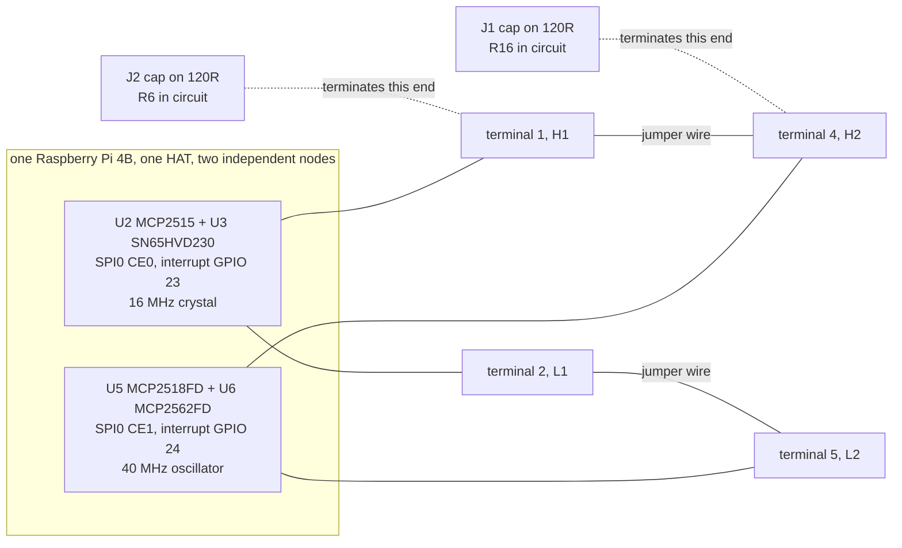

# Rewiring: what could be changed, and what should be

The previous page, [board-findings.md](board-findings.md), is an inventory. This
one is the argument. Having found every link, strap, jumper and spare pin, the
honest next question is whether any of them should move, and the honest answer
for most of them is no. The interesting part is the reasons, because a reason
survives into the next project and a verdict does not.

One principle runs through all of it, and it is worth putting first so that the
rest reads as an application of it rather than as a series of moods.

> **On a bench with no soldering iron, a change in copper is not a change, it
> is a commitment.** Configuration can be undone in a text editor at no cost.
> A zero ohm link that has been lifted stays lifted. So the bar for touching
> copper is not "would this be slightly better", it is "is this the only way to
> get something I actually need".

There is a second, quieter principle that took a while to earn:

> **The board's defaults are somebody's tested path.** Every fitted link on
> this board matches the configuration block on the vendor's wiki. When the
> defaults and the documented configuration agree, departing from either means
> leaving the only combination anybody has confirmed works. That is sometimes
> right. It is never free.

Each proposal below carries a verdict. The vocabulary is small on purpose:

| Verdict | Means |
|---|---|
| **Do** | Worth doing, and the reason it is worth it is stated |
| **Do not** | Worth not doing, and the reason is stated so it can be reconsidered |
| **Later** | Right in principle, blocked on something named |
| **Open** | Genuinely undecided, with the thing that would decide it named |

---

## The one that changes the plan

### Wire the board to itself and get a real two node bus today

**Verdict: Do.**

This is the proposal that came out of reading the inventory, and it was not
obvious beforehand, so it is worth setting out carefully.

The WS-28164 carries **two complete CAN controllers**, each with its own
oscillator, its own transceiver and its own pair of terminal positions. The CAN
FD channel is an MCP2518FD with an MCP2562FD on terminal positions 4 and 5. The
classic channel is an MCP2515 with an SN65HVD230 on terminal positions 1 and 2.
They share nothing except the SPI bus, the supply and the ground.

A CAN FD controller can be configured to send classic frames. So if you join
the two channels with two short wires, you have a **genuine two node CAN bus**:

```
terminal position 1  (H1, classic high)  to  terminal position 4  (H2, FD high)
terminal position 2  (L1, classic low)   to  terminal position 5  (L2, FD low)
```

Both jumper caps to `120R`, on `J1` and `J2`, because the two channels are now
the two ends of a very short bus.

Drawn from the terminal order and the two termination jumpers in
[board-findings.md](board-findings.md):



Two separate controllers, two separate oscillators, two separate transceivers,
one wire. That is a bus by every definition that matters for chapters 10, 11, 12
and 19.

What that buys, and this is the part worth dwelling on, is everything the
virtual interface cannot do:

| Thing | On `vcan0` | On this two node bus |
|---|---|---|
| Frames arrive | yes | yes |
| Bit timing is real | no | **yes** |
| Arbitration between two transmitters | no | **yes** |
| Error frames when something disagrees | no | **yes** |
| A transceiver, a termination and a wire | no | **yes** |
| Transmit acknowledgement from another node | **no** | **yes** |

That last row is the one that matters most and is easiest to overlook. On a
one node bus, nothing acknowledges a frame, so every transmission fails and the
controller retries forever. It is the classic first hour of a CAN bring up, and
on a single node bus it is not a fault, it is physics. A second node removes the
whole category.

What it costs: two jumper wires, two jumper caps, and about five minutes.

What it does **not** prove, and this list is as important as the one above:

- **Nothing about CAN FD.** The MCP2515 is a classic CAN 2.0B controller. It
  cannot do flexible data frames at all, so the bus has to run classic. The
  rate switch, the 64 byte payload and the four bit length code are all
  untouched by this.
- **Nothing about isolation.** Both nodes sit on the same isolated rail and the
  same `SGND`. There is no ground offset between them because they are the same
  ground.
- **Nothing about cable length, reflections or real world noise**, because the
  wire is 40 millimetres of jumper.
- **Nothing about the node end.** The Nucleo and its firmware are still exactly
  as far away as they were.

So this is not a substitute for the real bus. It is a strictly better substitute
for `vcan0`, available immediately, with no soldering and no parts. Chapters 10,
11, 12 and 19 can leave the virtual interface for it, and chapter 9's step 5 and
chapter 13 cannot.

The device tree for it is both wiki lines rather than one:

```
dtparam=spi=on
dtoverlay=mcp2515,spi0-0,oscillator=16000000,interrupt=23
dtoverlay=mcp251xfd,spi0-1,interrupt=24
```

And this is the configuration where the three numbering schemes bite, so the
interface identity check from the findings page stops being pedantry and becomes
a required step:

```bash
for i in /sys/class/net/can*; do
  echo "$i -> $(basename $(readlink -f $i/device/driver))"
done
```

**One honest caveat about the order of work.** Bringing up two interfaces at
once is exactly what the findings page argues against, because a failure then
has two places to be. The resolution is sequence, not principle: bring up the
CAN FD channel alone first and confirm internal loopback, then add the classic
channel, then join the wires. Three steps, each with one new thing in it.

---

## The zero ohm links

All six movable links need a soldering iron. There is no soldering iron on this
bench, and acquiring one is already ranked behind a multimeter in the bench's
own list of what to buy next. So every verdict in this section would be the same
even if the engineering were different, and it is worth separating the two
reasons rather than letting the missing tool do all the work.

### Move the CAN FD interrupt from GPIO 24 to GPIO 13

Lift `R36`, fit `R37`.

**Verdict: Do not.**

The engineering reason, which stands on its own: GPIO 24 is wanted by nothing
else. Nothing in this volume, nothing in the twenty projects, and nothing on
the bench competes for it. A move would free a pin that is not in demand and
would cost the agreement between this board and every configuration example
published for it. Changing a working assignment to no benefit is how a board
becomes undocumented.

The tooling reason: no iron.

### Move the classic CAN interrupt from GPIO 23 to GPIO 22

Lift `R35`, fit `R21`.

**Verdict: Do not.**

There is a real argument for this one, which is why it gets more than a line.
GPIO 23 collides with the `i2c6` overlay, and freeing it would let `i2c6` be
enabled alongside the classic CAN channel.

The argument fails on demand. Nothing on this bench wants `i2c6`. The Pi has
`i2c1` on GPIO 2 and 3, which this board does not touch at all, and that bus is
enough for every I2C part in the inventory. Moving a working interrupt to
unblock an overlay nobody needs is effort spent against an imagined
requirement.

And it would move the interrupt onto GPIO 22, which is wanted by `i2c6` as
well. The conflict would be relocated rather than removed.

### Move the serial expander interrupt from GPIO 25 to GPIO 26

Lift `R42`, fit `R53`.

**Verdict: Do not.** The RS485 channels are not used by this volume at all, so
this is a change to a path that is switched off.

### Lift `R43` and `R44` to isolate the board from the Pi's 5 V

**Verdict: Do not, and understand why before agreeing.**

These two fitted zero ohm links are the board's entire supply path from the Pi.
Lifting them has a real use: it separates the two 5 V rails, so the board can be
powered from its DC terminal without that supply reaching the Pi, and the Pi can
be powered from USB-C without the board drawing from it.

But lifting them means the board has **no supply at all** unless the DC terminal
is connected. The convenience that makes this bench work is that one USB-C cable
brings up the Pi, both CAN controllers, both transceivers and the isolated side.
Trading that for a separation nobody has asked for is the wrong direction.

The case where it would be right is a permanent installation fed from an
industrial supply, where back feeding a Pi's 5 V rail through two zero ohm links
is a thing a reviewer would object to. That is not this bench, and when it is,
the board will be in an enclosure and somebody will have an iron.

### Change the RS485 direction control links

`R10` against `R11`, and `R18` against `R22`.

**Verdict: Do not.** Same reason as the RS485 interrupt: an unused path.

---

## The one that looked tempting until the datasheet was opened

### Replace `R3`, the 1k on the SN65HVD230's `Rs` pin, with a link to ground

**Verdict: Do not. There is nothing to gain, and the reason is a correction.**

This section used to argue something different, and it is worth leaving the
history visible rather than quietly rewriting it.

The original argument was: `R3` makes the board's classic transceiver slew
limited on purpose, so grounding `Rs` would give it full speed edges and shorten
its loop delay by perhaps thirty nanoseconds. The verdict was still "do not", for
four reasons, the strongest of which was that it is a better measurement than a
modification.

**Then the datasheet was opened, and the premise was wrong.** TI selects the mode
by the **voltage** on `Rs`, and gives three rows: above 0.75 VCC is standby,
**10 kohm to 100 kohm to ground is slope control**, and below 1 V is high speed
with no slope control at all `[datasheet]` SLOS346K p3. A 1 kohm resistor is a
tenth of the fast end of that range, so it lands in the high speed row.

```
V(Rs):  0 V ----------- 1 V -------------------- 0.75*VCC ---- VCC
             HIGH SPEED  |   (unspecified gap)        |  STANDBY
        ^                |                            |
        |                +-- slope control lives here,
     R3 = 1 k                set by 10 k to 100 k to ground
     sits here
```

Redrawn from Table 6, `[datasheet]` SLOS346K p3.

**The board is already in high speed mode.** Grounding `Rs` would change the
voltage on that pin from a small number to zero and the mode from high speed to
high speed. There is no gain of any size to be had, which is a much stronger
verdict than the four reasons it replaces.

Two further things the datasheet settled while it was open:

1. **The loop delay was already the best available.** With `Rs` effectively at
   ground, 70 ns typical and **115 ns maximum** one way, 100 and **135 ns** the
   other `[datasheet]` SLOS346K p8. The slope control rows are 175 and 185 ns at
   10 kohm and 920 and 990 ns at 100 kohm. This board sits on the fast row.
2. **Two numbers in the earlier note were typicals quoted as maximums.** It gave
   the 10 kohm case as "about 105 and 155" and the 100 kohm case as "about 535
   and 830". Those are all four typicals `[datasheet]` SLOS346K p8. A timing
   budget is built from maximums.

What does survive is a caution, and it is the one worth carrying: `Rs` pulled
**high** is standby, and on the SN65HVD230 specifically the driver stops while
the receiver keeps working `[datasheet]` SLOS346K p2. So a far end node sees a
healthy listener that never speaks. The pin deserves respect. It just does not
need changing.

And the `[unconfirmed]` number this section used to carry is simply gone. There
is no 1k row to interpolate, because 1k is not a slope control value.

---

## Configuration, where the bar is much lower

### Enable both CAN channels at once

**Verdict: Later, after each works alone.**

Covered under the two node proposal above. The sequence is CAN FD alone, then
classic alone or added, then both with the interface identity check run and its
output written down.

### Enable the RS485 channels

**Verdict: Do not, for now.**

The wiki's configuration block has six lines. Four of them bring up RS485 and
RS232. Leaving those four out of a first bring up is not timidity, it is the
whole method: when the bus does not come up, the number of candidate causes
should be one.

There is no reason in principle not to add them later. `sc16is7xx` is in
mainline, the board straps the part into SPI mode with a fitted 1K pull up, and
the channels have their own terminal positions, terminations and protection.
They are simply not what this volume is about, and the two SPI buses do not
interfere with each other.

### Enable the RS232 channel

**Verdict: Do not. This one has a cost that is easy to miss.**

The RS232 channel uses header pins 8 and 10, which are GPIO 14 and GPIO 15,
which are the Pi's serial console. There is no way to have both. Enabling the
RS232 channel means giving up the console, and on this bench the console is
already the subject of a separate recorded problem, so losing it for a second
and unrelated reason would be genuinely confusing six months from now.

Nothing in this volume needs RS232. The console wins, and the decision costs
nothing because there was no competition.

### Enable every interface, as a first attempt did

**Verdict: Do not, and the findings page has the table.**

Two of the five overlays in that attempt are fatal to this board: `i2c4` takes
GPIO 7, which is the CAN FD chip select, and `i2c6` takes GPIO 23, which is the
classic CAN interrupt. With `i2c4` enabled, the CAN FD interface never appears
no matter how correct everything else is.

Worth noting what the correction was worth. The original conclusion was right,
the reasoning behind two of its five rows was wrong, and finding that out
required reading the header map rather than reasoning about it. A right answer
with a wrong reason will be applied wrongly to the next board.

### Power the board from the DC terminal instead of the Pi's USB-C

**Verdict: Do not, and there is one thing to establish first.**

The board does not need it. `U12` is fed from the Pi's 5 V, so the isolated side
comes up on USB-C alone, and that is the finding that removed a whole class of
imagined problem from this bring up.

Before anyone ever does connect it, the open question from the findings page has
to be closed: whether the DC supply feeds the Pi back through `R43` and `R44`.
If it does, and the topology says it probably does, then connecting the DC
terminal while USB-C is plugged in puts two supplies in parallel on one 5 V
rail. That is a thing to do deliberately or not at all.

The test is one power cycle with USB-C out and DC in. It takes a minute, and it
would turn an `[inferred]` row into a `[measured]` one.

### Switch the serial expander to I2C mode

`R34` straps `U10` pin 9 high, selecting SPI.

**Verdict: Do not.** It is a fitted strap, so it needs an iron, and SPI is what
the mainline overlay line expects. There is no benefit on offer.

### Fit a HAT ID EEPROM so the board is auto detected

`U14`, `R45` through `R49`, `R54` and `C43` are all present as footprints and
all unfitted.

**Verdict: Do not, and it is less attractive than it sounds.**

Auto detection would replace a hand written `dtoverlay=` line with a blob
programmed into an EEPROM. For a product that is a clear improvement. For a book
whose subject is what the device tree does, the hand written line **is** the
documentation, and hiding it inside an EEPROM would make the chapter worse.

---

## Termination, which is wiring rather than rewiring

Not a modification, because the caps move by hand, and the most frequent source
of confusion on a new CAN bus, so it earns a section.

The rule: **120 ohms at the two ends of the bus, and nowhere else.**

| Arrangement | `J1`, CAN FD | `J2`, classic | A third node |
|---|---|---|---|
| Pi plus Nucleo, two nodes | `120R` | not in use | |
| The two node self bus above | `120R` | `120R` | |
| Pi, Nucleo, plus a listener in the middle | `120R` | not in use | **`NC`** |
| Pi and Nucleo, listener at one end | `NC` if the listener terminates | | `120R` |

Three terminations on a two node bus is the usual mistake, and it does not
produce a clean failure. It produces a bus that works at 125 kbit/s, works
mostly at 500 kbit/s, and falls apart in the data phase at 2 Mbit/s, which is
the hardest possible symptom to attribute.

Why 120 ohms and why only at the ends, in one picture. The transceiver's own
differential input resistance is 40 to 100 kohm `[datasheet]` SLOS346K p8, so a
receiver is effectively invisible to the line; the terminations are the only
thing the driver sees:

```
RIGHT, two nodes, two terminations:
                 120R                              120R
   node A ------[====]======== the wire ========[====]------ node B
   driver sees 120 + 120 in parallel = 60 ohms.  Correct by ISO 11898.

WRONG, a third termination in the middle:
                 120R          120R               120R
   node A ------[====]=====[====]============[====]------ node B
                            node C
   driver sees 40 ohms. The dominant level is dragged toward recessive,
   margin shrinks, and the fast data phase is where it shows first.

RIGHT, a listener in the middle with NO termination:
                 120R                              120R
   node A ------[====]=====+============+======[====]------ node B
                       node C, cap on NC
   still 60 ohms, and node C hears everything.
```

Values from the standard and the transceiver's own input resistance; drawn here
because what matters is the arithmetic of the parallel combination, which no
vendor figure sets out.

**And the thing a document cannot tell you**: where the caps are right now. A
jumper position is a state, not a specification. `J1` either has its cap on
`120R` or it does not, and the only instrument that can read it is a pair of
eyes. That is why "look at `J1` and write down what you see" is a step in the
bring up and not a line in a table.

---

## The node end, where the decision is a purchase

### Use the loose SN65HVD230 at the Nucleo end

**Verdict: Do, with its ceiling stated.**

It is the transceiver that is on the bench, it is a 3.3 V part which matches the
STM32's pins, and it makes the bus real for chapters 9, 10, 11, 12 and 19. Its
rated 1 Mbit/s is comfortably above the planned 500 kbit/s arbitration rate.

### Buy an FD rated transceiver for the Nucleo end

**Verdict: Later, and it is the only thing chapter 13 is waiting for.**

Chapter 13's subject is two speeds on one wire. The loose SN65HVD230 is the part
that cannot do it, and **the reason is not the one written here before.**

The earlier version said the part is too slow. Put the three transceivers side
by side, maximums where a maximum is specified, and look at what that claim
actually implies:

| Part | Supply | Loop delay r to d | d to r | Rated | Symmetry specified | Source |
|---|---|---|---|---|---|---|
| SN65HVD230, as fitted | 3.3 V | **115 ns** | **135 ns** | 1 Mbps | **no** | `[datasheet]` SLOS346K p8, p2 |
| MCP2562FD, on the HAT | VDD 5 V, VIO 1.8 to 5.5 V | 120 ns | 180 ns | 8 Mbps | yes, to 5 Mbps | `[datasheet]` DS20005284A p13, p3 |
| TCAN3413, the candidate | 3.3 V | 180 ns | 180 ns | 8 Mbps | yes | `[datasheet]` TCAN3413 p8, p1 |

**The SN65HVD230 is the fastest of the three.** So "too slow" was wrong, and
wrong in a way that would have produced a confident bad experiment: a reader who
believes the part is merely slow will try 2 Mbit/s, find it half works on a short
bench wire, and have no idea what that result means.

The real constraint is the last column. A CAN FD data phase depends on the
transceiver's delay being **symmetrical**, because a bit that comes back longer
than it went out eats into the next bit, and at 2 Mbit/s there are only 500 ns to
spend:

```
one data bit at 2 Mbit/s = 500 ns
                |<------------------- 500 ns ------------------->|
TXD   ----------+                                               +--------
                |                                               |
bus             +~~~~~~~~~~~~~~~~~~~~~~~~~~~~~~~~~~~~~~~~~~~~~~~+
RXD   -------------+                                         +-----------
                   |<-- t(LOOP1) -->|           |<-- t(LOOP2) -->|
                   recessive to dominant        dominant to recessive

symmetrical:   t(LOOP1) == t(LOOP2), the bit arrives the width it was sent
asymmetrical:  the difference is stolen from the sample point of the NEXT bit,
               and the controller has no way to know it happened
```

Drawn from the loop delay definitions, `[datasheet]` SLOS346K p8 and
DS20005284A p13. TI's and Microchip's own figures of this, SLOS346K Figure 9 and
the MCP2562FD's timing diagrams, show the measurement setup rather than the
consequence.

Microchip states the case directly: the MCP2562FD guarantees loop delay symmetry
in order to support the higher data rates CAN FD requires `[datasheet]`
DS20005284A p1, and gives the symmetry window as a specified number at 2, 5 and
8 Mbps `[datasheet]` DS20005284A p13. TI sells the TCAN3413 on short and
symmetrical propagation delays `[datasheet]` TCAN3413 p1.

The SN65HVD230 specifies **pulse skew**, 35 ns typical with `Rs` grounded
`[datasheet]` SLOS346K p7, but no loop delay symmetry figure, and it is rated for
a signalling rate rather than for a data phase at all `[datasheet]` SLOS346K p2.

So the constraint is one component at one end, and no amount of configuration
moves it. On the bench's own list of what to buy, this sits behind a multimeter,
which unblocks more acceptance tests across more projects.

### The candidate, with its three questions answered

**The TCAN3413**, a 3.3 V CAN FD transceiver, the part the feaser CAN FD shield
design uses:

```
https://www.ti.com/lit/ds/symlink/tcan3413.pdf
```

The three things this section previously said to check are now checked. Full
detail in [datasheet-notes.md](datasheet-notes.md) section 5.

| Question | Answer | Source |
|---|---|---|
| Does it need a second rail? | No. 3.3 V single supply | `[datasheet]` TCAN3413 p1 |
| What is the loop delay? | 95 and 120 ns typical, 180 ns maximum both ways | `[datasheet]` TCAN3413 p8 |
| Does it have a slope control pin? | **No.** Pin 8 is `STB`, standby | `[datasheet]` TCAN3413 p3 |

And one thing nobody thought to ask, which turns out to matter:

| Finding | Consequence | Source |
|---|---|---|
| Pin 5 is `VIO` on the **TCAN3413** and `SHDN` on the **TCAN3414** | The variant is a real choice, not a detail. Both are 3.3 V parts | `[datasheet]` TCAN3413 p3 |
| `STB` has an **integrated pull up** | Left floating, the part is in standby: reads perfectly, transmits nothing | `[datasheet]` TCAN3413 p3 |
| `TXD` also has an integrated pull up | A floating `TXD` is recessive, which is the safe direction | `[datasheet]` TCAN3413 p3 |

The second row is worth dwelling on, because it shows that **the trap does not go
away, it changes shape.** On the SN65HVD230 a floating pin 8 is standby. On the
TCAN3413 a floating `STB` is standby. Removing the slope control pin removes one
class of confusion and leaves the other exactly where it was. Whichever part ends
up at the node end, its mode pin needs tying on purpose.

One practical constraint that no datasheet will tell you: it is a loose chip
rather than a board. There is no soldering iron on this bench, so an unmounted
device in a small surface mount package is not usable however correct it is. A
module or a breakout is part of the requirement.

### Run the whole bus classic, at 500 kbit/s, and drop CAN FD

**Verdict: Do not.**

It would work, it would be simpler, and it is the wrong book. The volume's
subject is CAN FD from the controller out, and chapter 9's bit timing, message
memory and frame length code all exist because flexible data frames have a
second bit rate, a 64 byte payload and a four bit length code that is not a
length. Classic CAN has none of those.

The two node self bus above is classic, and that is an acknowledged limitation
of a stop gap rather than a change of subject.

---

## What the spare pins could become

Seven GPIO lines are untouched by this board: GPIO 2, 3, 4, 5, 6, 12 and 27.
GPIO 2 and 3 are the Pi's main I2C bus, so an accelerometer or a ranging sensor
would fit there electrically with no conflict at all.

**Verdict: Later, blocked on a 2 by 20 stacking header.**

The board is a 40-pin HAT. It covers the header. Electrical freedom is not
physical access, and the stacking header that would provide it is not on this
bench. It is already on the list of things to buy, where another project also
wants it.

Worth recording as a capability rather than a plan, because knowing that seven
pins and a whole I2C bus survive this HAT is the sort of thing that makes a
later design possible instead of impossible.

---

## Reflections on how the wrong readings happened

Six statements on this bench turned out to be wrong in a single day. Every one of
them was corrected by opening a document. The patterns are more useful than the
corrections, and there turn out to be two of them, not one.

| What was believed | What is true | How it went wrong |
|---|---|---|
| `R32`, `R33`, `R34` route the controllers to SPI0 and the expander to SPI1 | They are 1K pull ups on the SC16IS752's `RESET`, `IRQ` and `I2C/SPI` pins. The SPI routing is hard wired | A schematic block titled **SPI SELECTION** was read as if it selected. It has no resistors in it at all |
| `Y2` is a 40 MHz crystal | It is a packaged 40 MHz oscillator, 3.3 V, plus or minus 20 ppm, with an output enable pin | A two pin crystal was the expected thing in that position, so the four pin symbol was not looked at |
| `i2c_vc` and `spi3-1cs` conflict with the HAT's ID EEPROM | There is no ID EEPROM. Every part in that block is marked `NC` | The footprint was seen and fitment was not checked |
| `R36` straps `CAN1_INT` to either `D23` or `D24` | `R36` links `CAN1_INT` to `D24`. The alternative is `R37` to `D13`. `D23` belongs to `R35` and the **other** channel | Two link pairs in one block were read as one pair, which merged two channels into one sentence |
| `R3` at 1k makes the classic transceiver slew limited | 1k is below TI's 10 kohm slope control floor, so the part is in high speed mode | The schematic was read correctly and then the **part** was reasoned about from general knowledge instead of from its datasheet |
| The SN65HVD230 is too slow for CAN FD | It is the fastest of the three transceivers here. It does not specify loop delay **symmetry** | A plausible mechanism was substituted for the documented one |

**The first four share a shape: a name was trusted over a reading.**
"SELECTION" promised a choice, the crystal position promised a crystal, a
footprint promised a part, and a block containing `D23` and `D24` promised they
were alternatives for the same signal. All four were fixed by the same method,
reading the schematic's text layer, and each cost about two minutes.

**The last two share a different and more interesting shape: the schematic was
read correctly, and then the part was reasoned about from general knowledge.**
`R3` really is 1k. A resistor on a slope control pin really does usually mean
slope control. The SN65HVD230 really is a 1 Mbit part and CAN FD really does run
faster than 1 Mbit. Every step felt sound, and the conclusions were wrong,
because the datasheet draws its lines in different places than intuition does:
the slope control range starts at 10 kohm, and the thing CAN FD needs from a
transceiver is symmetry rather than speed.

That second pattern is the harder one to guard against, because nothing feels
missing while it is happening. The first pattern has a tell, which is that you
are describing something you have not looked at. The second has no tell at all.
The only defence found so far is a procedural one: **a number that a design
depends on gets a page citation, or it does not go in.** That is now rule 5 in
`tools/check_findings.py`, and it exists because of these two rows.

So the practice this leaves behind, which is the thing most worth carrying to
the next board:

1. **Read the designator, its value, and the pin it lands on.** Three facts, in
   that order. Any one of them alone invites a story.
2. **Check fitment, not just presence.** `NC` is a value.
3. **Count the link pairs before describing any of them.** A selection block
   with four resistors is probably two choices, not one.
4. **Prefer a reading to an expectation, even when the expectation is
   reasonable.** A two pin crystal in that spot was a good guess. It was still
   a guess, and the drawing was right there.
5. **A schematic tells you the value; only the datasheet tells you what the
   value does.** This is the one the second pattern teaches. `R3` was read
   correctly and understood wrongly, and the gap between those two was a table
   on page 3 of a document that took ninety seconds to fetch.
6. **Cite the page.** Not for ceremony. Two figures in this chapter were typical
   values presented as maximums, and a page number is what makes that
   checkable by somebody who was not there.

And the encouraging half, because this is not a cautionary tale. Reading a
schematic through its text layer turned out to be fast, repeatable and
checkable, and it answered more questions than anybody expected to be
answerable without touching the board: the supply topology, every termination
designator, every interrupt option, the whole header map, the terminal order,
and a slope control resistor nobody had thought to ask about. The method is in
the findings page under "How to re-derive all of this in about two minutes", and
it is genuinely worth trying on the next unfamiliar board before any other step.

## The order of work this leaves

1. Look at `J1`, `J2`, and the ribbon stripe. Write down what you see.
2. Boot with the HAT off, to separate the card from the adapter.
3. Fit the HAT alone, enable the CAN FD channel alone, read `dmesg`.
4. Internal loopback on the CAN FD channel, and record the sample points.
5. Add the classic channel, run the interface identity check, record the answer.
6. Join positions 1 to 4 and 2 to 5, both caps on `120R`, and run chapter 10's
   tools against a real two node bus.
7. Settle the three unread nets, `U6` `STBY`, `U7` `EN1` and `EN2`, and `Y2`
   `OE`, from the schematic drawing.
8. Confirm `PD0` and `PD1` against UM2408 before any wire enters the Nucleo.

Steps 1 through 6 need nothing that is not already here. Step 7 needs ten
minutes. Step 8 is the gate on the real bus, and it is a reading, not a
purchase.
